# Product Requirements Document (PRD)
## SIGM4 — Sistem Informasi Management 4set · Sarana dan Prasarana Sekolah

| Item | Keterangan |
|---|---|
| **Nama Produk** | SIGM4 — **S**istem **I**nformasi Mana**g**e**m**ent **4**set (Aset) |
| **Kode Proyek** | SIGM4 |
| **Ruang Lingkup** | Sarana dan prasarana sekolah |
| **Versi Dokumen** | 1.1 — direvisi berdasarkan audit tim reviewer lintas peran (lihat Lampiran F) |
| **Tanggal** | 5 Agustus 2026 |
| **Status** | Approved for Development |
| **Penyusun** | Product Manager / Business Analyst |
| **Sumber Kebutuhan** | `Deskripsi.txt` + hasil klarifikasi stakeholder (4 batch) |
| **Ditujukan Untuk** | UI/UX Designer, Software Architect, Backend/Frontend/Mobile Developer, QA |

### Ringkasan Keputusan Kunci (Hasil Klarifikasi)

Seluruh keputusan berikut telah dikonfirmasi oleh stakeholder dan menjadi dasar mengikat bagi PRD ini.

| # | Aspek | Keputusan |
|---|---|---|
| 1 | Tenancy | **Single sekolah** — satu instansi sistem melayani satu sekolah. Tidak ada konsep multi-tenant. |
| 2 | Platform | **Web responsive + Mobile App native** (Android & iOS) |
| 3 | Tech Stack | **Web:** Express (Node.js) + React. **Mobile:** React Native |
| 4 | Approval Workflow | **Configurable** per jenis pengajuan dan nilai/kondisi (rule engine) |
| 5 | Chatbot AI | **LLM + akses data via tools/RAG** (read-only terhadap data, tidak melakukan aksi tulis) |
| 6 | Kanal Notifikasi | **In-app notification** + **Push notification mobile (FCM)**. Tidak ada email/WhatsApp. |
| 7 | Autentikasi | **Email + password lokal**, dikelola Administrator, dengan reset password, password policy, dan 2FA untuk role sensitif |
| 8 | Pemohon Reservasi/Peminjaman | **Guru, Staf/Tata Usaha, dan Siswa/OSIS** (siswa memiliki akun terbatas) |
| 9 | Granularitas Aset | **Per unit (serialized)** — 1 unit fisik = 1 record = 1 QR Code unik |
| 10 | Kodefikasi & Penyusutan | **Kode internal sekolah** yang dapat dikonfigurasi. **Tanpa** perhitungan penyusutan otomatis. |
| 11 | Pengadaan | Alur sederhana **Usulan → Approval → Penerimaan**. Tanpa modul vendor/Purchase Order. |
| 12 | Keterlambatan Pengembalian | **Denda nominal per hari** dengan pencatatan status pembayaran |
| 13 | Strategi Rilis | **Big bang** — seluruh modul dirilis sekaligus. PRD tidak memuat prioritas rilis/fase. |
| 14 | Skala Target | **± 5.000 unit aset**, hingga **1.000 pengguna**, **100–150 concurrent user** pada jam sibuk |
| 15 | Mode Offline Mobile | **Online only** — seluruh fitur mobile membutuhkan koneksi internet |
| 16 | Pelaksana Maintenance | **Teknisi internal sekolah saja**. Tidak ada master data vendor/pihak ketiga. |

---

# 1. Executive Summary

## 1.1 Ringkasan Produk

SIGM4 adalah sistem informasi terintegrasi berbasis web dan aplikasi mobile yang mendigitalkan seluruh siklus hidup sarana dan prasarana sekolah — mulai dari perencanaan pengadaan, pencatatan inventaris per unit, penempatan lokasi, pemanfaatan melalui reservasi dan peminjaman, pelaporan kerusakan, pemeliharaan terjadwal, audit/stock opname, hingga pelaporan analitik untuk pengambilan keputusan.

Setiap unit aset memiliki identitas digital unik yang diwakili oleh QR Code fisik. Dengan satu kali pemindaian, petugas maupun pengguna dapat langsung mengakses profil aset, status penggunaan terkini, lokasi, serta riwayat pemeliharaannya. Seluruh proses persetujuan berjalan di atas *approval engine* yang dapat dikonfigurasi sesuai kebijakan sekolah, dan seluruh perubahan data terekam dalam *activity log* yang tidak dapat dimanipulasi.

Sistem dilengkapi Chatbot AI berbasis LLM yang mampu menjawab pertanyaan pengguna mengenai aset, jadwal ruangan, dan status peminjaman secara percakapan, dengan akses data yang tetap tunduk pada hak akses pengguna dan bersifat *read-only*.

## 1.2 Business Problem

| # | Masalah | Dampak |
|---|---|---|
| BP-01 | Pencatatan inventaris masih manual (buku induk/spreadsheet) dan tersebar | Data tidak sinkron, sulit dipertanggungjawabkan saat audit |
| BP-02 | Identifikasi fisik aset lambat; kode barang ditulis manual dan sering pudar/hilang | Pencarian dan verifikasi aset memakan waktu lama |
| BP-03 | Reservasi ruangan dan barang dilakukan lisan/WhatsApp tanpa jadwal terpusat | Benturan jadwal, ruangan menganggur, konflik antar guru |
| BP-04 | Peminjaman tidak tercatat rapi, pengembalian tidak terpantau | Barang hilang/terlambat kembali tanpa jejak pertanggungjawaban |
| BP-05 | Persetujuan berjenjang berjalan lewat kertas disposisi | Proses lambat, tidak ada jejak siapa menyetujui apa dan kapan |
| BP-06 | Laporan kerusakan disampaikan lisan tanpa dokumentasi | Perbaikan tertunda, tidak ada prioritas, kerusakan berulang tidak terdeteksi |
| BP-07 | Pemeliharaan bersifat reaktif, bukan terjadwal | Umur aset memendek, biaya perbaikan membengkak |
| BP-08 | Stock opname manual memakan waktu berhari-hari | Selisih data ditemukan terlambat, kehilangan aset tidak terdeteksi dini |
| BP-09 | Pimpinan tidak memiliki visibilitas real-time atas kondisi dan pemanfaatan aset | Keputusan pengadaan tidak berbasis data |
| BP-10 | Dokumen aset (faktur, garansi, manual) tersimpan fisik dan mudah hilang | Klaim garansi gagal, informasi teknis tidak tersedia saat dibutuhkan |

## 1.3 Solution Overview

SIGM4 menyelesaikan permasalahan di atas melalui 20 modul terintegrasi di atas satu basis data tunggal:


```mermaid
flowchart LR
    subgraph INTI["Fondasi Data"]
        A1["Inventaris Aset<br/>per unit + QR"]
        A2["Manajemen Lokasi"]
        A3["Dokumen Aset"]
        A4["User & Role"]
    end
    subgraph OPS["Operasional Harian"]
        B1["Reservasi Ruangan"]
        B2["Reservasi Barang"]
        B3["Peminjaman &<br/>Pengembalian"]
        B4["Laporan Kerusakan"]
    end
    subgraph KONTROL["Kontrol & Perawatan"]
        C1["Approval Engine"]
        C2["Maintenance"]
        C3["Audit &<br/>Stock Opname"]
        C4["Pengadaan"]
    end
    subgraph INSIGHT["Insight & Layanan"]
        D1["Dashboard"]
        D2["Statistik & Analitik"]
        D3["Chatbot AI"]
        D4["Notifikasi"]
        D5["Activity Log"]
    end

    INTI --> OPS
    INTI --> KONTROL
    OPS --> KONTROL
    OPS --> INSIGHT
    KONTROL --> INSIGHT
```

**Prinsip solusi:**
1. **Satu aset = satu record = satu QR** — sumber kebenaran tunggal untuk identitas fisik dan digital.
2. **Semua transaksi mengubah status aset** — status aset selalu mencerminkan kondisi nyata.
3. **Semua pengajuan melewati approval engine yang sama** — konsistensi kontrol lintas modul.
4. **Semua perubahan tercatat di activity log** — akuntabilitas penuh.
5. **AI hanya membaca, manusia yang memutuskan** — chatbot mempercepat akses informasi tanpa mengambil alih otoritas.

## 1.4 Goals

| Kode | Goal | Deskripsi |
|---|---|---|
| G-01 | Sentralisasi data aset | 100% aset sekolah tercatat digital per unit dengan QR Code terpasang |
| G-02 | Transparansi pemanfaatan | Seluruh reservasi dan peminjaman tercatat dan dapat ditelusuri |
| G-03 | Percepatan proses persetujuan | Persetujuan digital berjenjang menggantikan disposisi kertas |
| G-04 | Pemeliharaan proaktif | Perawatan aset berjalan terjadwal, bukan menunggu rusak |
| G-05 | Akurasi inventaris | Selisih data hasil stock opname dapat diketahui dan direkonsiliasi |
| G-06 | Pengambilan keputusan berbasis data | Pimpinan memiliki dashboard dan analitik real-time |
| G-07 | Kemudahan akses informasi | Informasi aset dapat diperoleh via QR scan dan chatbot dalam hitungan detik |
| G-08 | Akuntabilitas | Setiap perubahan data memiliki jejak pelaku, waktu, dan nilai sebelum/sesudah |

## 1.5 Success Criteria

| Kode | Kriteria Sukses | Target | Cara Ukur |
|---|---|---|---|
| SC-01 | Cakupan digitalisasi aset | ≥ 95% aset fisik terdaftar dalam sistem | Hasil stock opname pertama vs data sistem |
| SC-02 | Cakupan pelabelan QR | ≥ 95% aset aktif memiliki QR tercetak & terpasang | Laporan status pelabelan aset |
| SC-03 | Waktu proses persetujuan | Rata-rata ≤ 1 hari kerja per pengajuan | Selisih `submitted_at` → `final_decided_at` |
| SC-04 | Adopsi pengguna | ≥ 80% guru & staf aktif melakukan ≥ 1 transaksi/bulan | Activity log per user per bulan |
| SC-05 | Pengurangan benturan jadwal | 0 double-booking ruangan tervalidasi sistem | Jumlah konflik jadwal yang lolos |
| SC-06 | Ketepatan pengembalian | ≥ 90% peminjaman dikembalikan tepat waktu | Rasio loan status `Dikembalikan` tepat waktu |
| SC-07 | Waktu tindak lanjut kerusakan | ≥ 85% laporan kerusakan ditindaklanjuti ≤ 3 hari kerja | Selisih `reported_at` → `first_action_at` |
| SC-08 | Efisiensi stock opname | Durasi opname turun ≥ 50% dibanding manual | Perbandingan durasi siklus opname |
| SC-09 | Kepuasan pengguna | Skor kepuasan ≥ 4 dari 5 | Survei pengguna pasca-implementasi |
| SC-10 | Akurasi chatbot | ≥ 85% pertanyaan dalam cakupan dijawab benar | Sampling evaluasi berkala + feedback thumbs up/down |
| SC-11 | Kelengkapan audit trail | 100% operasi tulis tercatat di activity log | Uji sampling QA & audit internal |

---

# 2. Background

## 2.1 Kondisi Saat Ini

Pengelolaan sarana dan prasarana sekolah saat ini berjalan secara manual dan terfragmentasi:

- **Inventaris** dicatat dalam buku induk barang dan/atau spreadsheet yang dipegang oleh petugas sarana prasarana. Pembaruan bergantung pada ingatan dan disiplin pencatatan individu.
- **Identifikasi aset** mengandalkan kode barang yang ditulis atau ditempel manual, sering pudar, terlepas, atau tidak konsisten formatnya.
- **Penempatan aset** hanya diketahui berdasarkan pengetahuan petugas, tanpa peta lokasi digital yang dapat ditelusuri.
- **Reservasi ruangan dan barang** dilakukan melalui percakapan lisan, pesan WhatsApp, atau buku agenda di ruang tata usaha.
- **Peminjaman** dicatat pada buku peminjaman; pengembalian sering tidak diverifikasi ulang.
- **Persetujuan** menggunakan lembar disposisi fisik yang harus diantar antar-ruangan.
- **Laporan kerusakan** disampaikan lisan kepada petugas atau teknisi tanpa dokumentasi foto dan tanpa nomor tiket.
- **Pemeliharaan** dilakukan reaktif ketika barang sudah tidak berfungsi.
- **Stock opname** dilakukan tahunan secara manual dengan mencocokkan daftar cetak.
- **Pelaporan ke pimpinan** disusun manual menjelang rapat atau audit.

## 2.2 Permasalahan

| Kategori | Permasalahan Spesifik |
|---|---|
| **Akurasi Data** | Data inventaris tidak mencerminkan kondisi nyata; jumlah, kondisi, dan lokasi sering tidak sesuai |
| **Ketertelusuran** | Tidak diketahui siapa terakhir memegang, memindahkan, atau mengubah data aset |
| **Efisiensi** | Waktu terbuang untuk mencari barang, menyusun laporan, dan mengantar disposisi |
| **Kontrol** | Peminjaman tanpa otorisasi formal; aset keluar tanpa jejak |
| **Pemanfaatan** | Ruangan dan alat menganggur karena ketersediaannya tidak terpublikasi |
| **Perawatan** | Tidak ada jadwal preventif; biaya perbaikan tidak terekap |
| **Akuntabilitas** | Sulit membuktikan pertanggungjawaban aset saat audit internal maupun eksternal |
| **Pengambilan Keputusan** | Usulan pengadaan disusun berdasarkan perkiraan, bukan data pemanfaatan dan kondisi aset |

## 2.3 Opportunity

1. **Identitas digital per unit aset.** Dengan pencatatan serialized dan QR Code unik, sekolah memperoleh ketertelusuran tingkat unit — sesuatu yang mustahil dicapai dengan pencatatan batch manual.
2. **Aplikasi mobile untuk petugas lapangan.** Pekerjaan yang selama ini dilakukan dengan clipboard dan kertas (opname, verifikasi serah terima, pelaporan kerusakan) dapat dikerjakan langsung di lokasi.
3. **Approval engine yang dapat dikonfigurasi.** Kebijakan persetujuan sekolah dapat berubah tanpa perlu mengubah kode program.
4. **Data historis sebagai aset strategis.** Riwayat kerusakan, biaya pemeliharaan, dan tingkat pemanfaatan menjadi dasar objektif untuk perencanaan pengadaan tahunan.
5. **AI sebagai lapisan akses informasi.** Chatbot menurunkan hambatan penggunaan sistem bagi pengguna non-teknis, terutama guru dan siswa.
6. **Kepatuhan audit.** Activity log lengkap menyiapkan sekolah menghadapi audit internal maupun pemeriksaan eksternal.

---

# 3. Objectives

## 3.1 Business Objectives

| Kode | Objective | Indikator |
|---|---|---|
| BO-01 | Meningkatkan akuntabilitas pengelolaan aset sekolah | 100% transaksi aset memiliki jejak audit |
| BO-02 | Menurunkan tingkat kehilangan dan kerusakan aset yang tidak terlaporkan | Selisih stock opname menurun antar-siklus |
| BO-03 | Meningkatkan tingkat pemanfaatan fasilitas sekolah | Utilisasi ruangan meningkat dibanding baseline manual |
| BO-04 | Mempercepat siklus layanan sarana prasarana | Waktu persetujuan dan tindak lanjut kerusakan menurun |
| BO-05 | Mengoptimalkan anggaran pemeliharaan dan pengadaan | Usulan pengadaan didukung data kondisi & pemanfaatan aset |
| BO-06 | Menyiapkan sekolah menghadapi audit sarana prasarana | Laporan aset dapat dihasilkan sistem kapan saja tanpa rekap manual |

## 3.2 Product Objectives

| Kode | Objective | Indikator |
|---|---|---|
| PO-01 | Menyediakan katalog aset per unit yang lengkap, akurat, dan dapat dicari | Pencarian aset menghasilkan hasil ≤ 2 detik |
| PO-02 | Menyediakan identifikasi aset instan melalui QR Code | Scan → tampil detail aset ≤ 3 detik |
| PO-03 | Menyediakan kalender ketersediaan ruangan dan barang yang bebas konflik | Sistem menolak 100% overlapping booking |
| PO-04 | Menyediakan approval engine yang dapat dikonfigurasi Administrator tanpa deployment | Perubahan aturan berlaku efektif tanpa restart layanan |
| PO-05 | Menyediakan siklus lengkap kerusakan → work order → selesai | Setiap laporan kerusakan dapat ditelusuri hingga penyelesaian |
| PO-06 | Menyediakan stock opname berbasis scan QR di aplikasi mobile | Rekonsiliasi selisih otomatis di akhir sesi opname |
| PO-07 | Menyediakan dashboard peran-spesifik dan analitik multi-dimensi | Setiap role memiliki dashboard sesuai kebutuhannya |
| PO-08 | Menyediakan chatbot AI read-only yang menghormati hak akses pengguna | 0 kebocoran data lintas hak akses pada pengujian |
| PO-09 | Menyediakan notifikasi in-app dan push yang tepat waktu | Notifikasi terkirim ≤ 60 detik setelah event |
| PO-10 | Menyediakan activity log yang immutable dan dapat difilter | Log tidak dapat diubah/dihapus oleh role mana pun |

## 3.3 Non Objectives

Hal-hal berikut **secara eksplisit berada di luar cakupan** rilis ini:

| Kode | Non Objective | Alasan |
|---|---|---|
| NO-01 | Multi-tenant / multi-sekolah | Dikonfirmasi single sekolah |
| NO-02 | Perhitungan penyusutan (depresiasi) dan nilai buku aset | Dikonfirmasi tanpa penyusutan; kode barang internal |
| NO-03 | Kodefikasi standar BMN/BMD dan pelaporan SIMAK-BMN | Dikonfirmasi memakai kode internal sekolah |
| NO-04 | Modul vendor, perbandingan penawaran, dan Purchase Order | Alur pengadaan dikonfirmasi sederhana |
| NO-05 | Integrasi RKAS/BOS dan validasi pagu anggaran | Di luar alur pengadaan yang disepakati |
| NO-06 | Akun dan portal untuk vendor/pihak ketiga | Maintenance dikerjakan teknisi internal saja |
| NO-07 | Mode offline dan sinkronisasi data pada aplikasi mobile | Dikonfirmasi online only. **Klarifikasi audit:** yang dikecualikan adalah replikasi data dan sinkronisasi dua arah. Antrean unggah berkas dengan percobaan ulang **termasuk dalam lingkup** karena transaksi bisnisnya sendiri sudah tercatat di server (lihat Bab 32.1) |
| NO-08 | Notifikasi email dan WhatsApp | Kanal dibatasi in-app dan push notification |
| NO-09 | Single Sign-On (Google Workspace / Dapodik) | Autentikasi dikonfirmasi email + password lokal |
| NO-10 | Integrasi dengan sistem akademik, keuangan, atau perpustakaan | Tidak disebut dalam kebutuhan |
| NO-11 | Aksi tulis oleh Chatbot AI (membuat reservasi, menyetujui, mengubah data) | Chatbot dibatasi read-only |
| NO-12 | Pembayaran denda secara online (payment gateway) | Sistem hanya mencatat status pembayaran |
| NO-13 | Manajemen persediaan habis pakai (ATK/consumable) dengan stok masuk-keluar | Fokus pada aset tetap serialized |
| NO-14 | Pelacakan lokasi real-time (RFID/GPS/IoT) | QR Code bersifat pemindaian manual |

---

# 4. Stakeholders

| Kode | Stakeholder | Peran dalam Proyek | Tanggung Jawab |
|---|---|---|---|
| ST-01 | **Kepala Sekolah** | Project Sponsor / Decision Maker | Menyetujui kebijakan pengelolaan sarpras, menetapkan aturan approval, menyetujui pengajuan bernilai tinggi, memantau dashboard eksekutif |
| ST-02 | **Wakil Kepala Sekolah Bidang Sarpras** | Business Owner | Menetapkan proses bisnis sarpras, menjadi approver level menengah, memvalidasi hasil audit dan usulan pengadaan |
| ST-03 | **Petugas Sarana Prasarana** | Primary User / Data Owner | Mengelola data inventaris, lokasi, QR, verifikasi serah terima peminjaman & pengembalian, menjalankan stock opname, memproses pengajuan |
| ST-04 | **Teknisi Sekolah** | Operational User | Mengeksekusi work order perbaikan & pemeliharaan, memperbarui progres dan biaya pekerjaan, memperbarui kondisi aset pasca-perbaikan |
| ST-05 | **Guru** | End User | Mengajukan reservasi ruangan/barang untuk KBM, meminjam dan mengembalikan aset, melaporkan kerusakan, mengajukan usulan kebutuhan barang |
| ST-06 | **Staf / Tata Usaha** | End User | Mengajukan reservasi & peminjaman untuk kegiatan kedinasan, membantu pencatatan administratif, melaporkan kerusakan |
| ST-07 | **Siswa / Pengurus OSIS** | End User (akses terbatas) | Mengajukan reservasi ruangan/barang untuk kegiatan kesiswaan, melaporkan kerusakan fasilitas |
| ST-08 | **Administrator Sistem** | System Owner | Mengelola akun & role, mengonfigurasi approval rules, format kode barang, tarif denda, parameter sistem, memantau kesehatan sistem |
| ST-09 | **Bendahara / Bagian Keuangan** | Supporting Stakeholder | Menerima informasi biaya pemeliharaan dan denda; memvalidasi estimasi biaya usulan pengadaan *(konsumen laporan, bukan pengguna transaksional)* |
| ST-10 | **Tim Pengembang (Dev, QA, UI/UX)** | Delivery Team | Merancang, membangun, menguji, dan memelihara sistem sesuai PRD ini |
| ST-11 | **Auditor Internal / Pengawas Sekolah** | External Reviewer | Memeriksa kelengkapan data aset, jejak audit, dan hasil stock opname *(akses baca melalui laporan)* |

---

# 5. User Roles

Sistem menggunakan **Role-Based Access Control (RBAC)**. Terdapat 7 role bawaan. Administrator dapat menyesuaikan permission tiap role melalui halaman Manajemen Role.

| Kode | Role | Deskripsi Singkat | Hak Akses Utama |
|---|---|---|---|
| R-01 | **Administrator** | Pemilik sistem, akses penuh ke seluruh modul dan konfigurasi | CRUD user & role, konfigurasi approval rules, parameter sistem, format kode barang, tarif denda, akses penuh seluruh data, baca activity log |
| R-02 | **Petugas Sarana Prasarana** | Pengelola operasional aset sehari-hari | CRUD aset, lokasi, kategori, dokumen aset, cetak QR, verifikasi serah terima & pengembalian, kelola denda, buat & jalankan stock opname, kelola work order, proses pengajuan sesuai approval rules, akses seluruh laporan |
| R-03 | **Pimpinan Sekolah** | Kepala Sekolah & Wakasek Sarpras | Melihat seluruh data (read-only), menyetujui/menolak pengajuan sesuai approval rules, akses penuh dashboard & analitik, menyetujui hasil stock opname dan usulan pengadaan |
| R-04 | **Teknisi** | Pelaksana perbaikan & pemeliharaan internal | Melihat work order yang ditugaskan, memperbarui status & progres, mencatat biaya dan catatan pekerjaan, memperbarui kondisi aset pasca-perbaikan, melihat detail aset & riwayat servis |
| R-05 | **Guru** | Tenaga pendidik | Mengajukan reservasi ruangan/barang, peminjaman, melihat katalog aset & jadwal, melaporkan kerusakan, mengajukan usulan pengadaan, melihat riwayat & denda pribadi, menggunakan chatbot |
| R-06 | **Staf / Tata Usaha** | Tenaga kependidikan | Sama dengan Guru, ditambah kemampuan mengajukan reservasi atas nama unit kerja |
| R-07 | **Siswa / OSIS** | Peserta didik dengan akun terbatas | Mengajukan reservasi ruangan/barang untuk kegiatan kesiswaan, melihat katalog aset publik & jadwal ruangan, melaporkan kerusakan, melihat riwayat & denda pribadi, menggunakan chatbot dengan cakupan data terbatas |

**Aturan role tambahan:**
- Satu pengguna memiliki **tepat satu role utama**. Pengguna yang berperan sebagai approver ditentukan melalui **approval rules**, bukan melalui role tambahan.
- Role **Administrator** tidak dapat dihapus dan minimal harus ada 1 akun aktif.
- Role **Siswa/OSIS** tidak dapat melihat data pengguna lain, nilai aset, biaya pemeliharaan, maupun data pengadaan.
- Role **Teknisi** tidak dapat menghapus aset, mengubah data inventaris, ataupun menyetujui pengajuan.

---

# 6. User Persona

## Persona 1 — Bu Sari, Petugas Sarana Prasarana (Power User)

| Aspek | Uraian |
|---|---|
| **Profil** | Perempuan, 38 tahun, 10 tahun mengelola sarpras sekolah, terbiasa dengan spreadsheet, literasi digital menengah |
| **Perangkat** | Desktop di ruang sarpras, ponsel Android untuk pekerjaan lapangan |
| **Goals** | Semua aset tercatat dan mudah dilacak; serah terima peminjaman cepat diverifikasi; stock opname selesai tanpa lembur; laporan siap kapan pun diminta pimpinan |
| **Pain Points** | Data spreadsheet berantakan dan sering bentrok versi; barang dipinjam tanpa lapor; mencari satu unit proyektor bisa memakan setengah jam; menjelang audit harus rekap manual berhari-hari |
| **Needs** | Input aset massal dan cepat; pencetakan label QR secara batch; verifikasi serah terima lewat scan; daftar barang terlambat kembali; laporan selisih opname otomatis |
| **Motivations** | Terbebas dari pekerjaan rekap manual; tidak lagi disalahkan atas aset yang hilang tanpa jejak; pekerjaan terlihat rapi dan profesional di mata pimpinan |

## Persona 2 — Pak Budi, Guru IPA (Frequent Requester)

| Aspek | Uraian |
|---|---|
| **Profil** | Laki-laki, 34 tahun, guru IPA, sering menggunakan laboratorium dan alat peraga, literasi digital baik |
| **Perangkat** | Ponsel Android (utama), laptop di ruang guru |
| **Goals** | Memastikan lab dan alat tersedia saat jadwal mengajar; meminjam alat tanpa proses berbelit; tidak terkena masalah karena alat rusak yang bukan kesalahannya |
| **Pain Points** | Datang ke lab ternyata sudah dipakai kelas lain; harus mencari petugas untuk meminjam barang; tidak tahu status pengajuannya sudah disetujui atau belum; alat rusak dilaporkan lisan lalu terlupakan |
| **Needs** | Kalender ketersediaan ruangan; pengajuan cepat dari ponsel; notifikasi status persetujuan; pelaporan kerusakan berfoto agar jelas kondisinya bukan karena dirinya |
| **Motivations** | Pembelajaran berjalan lancar sesuai rencana; tidak membuang waktu mengejar administrasi; bukti digital melindunginya dari kesalahpahaman |

## Persona 3 — Pak Hendra, Kepala Sekolah (Decision Maker)

| Aspek | Uraian |
|---|---|
| **Profil** | Laki-laki, 51 tahun, kepala sekolah, jadwal padat dan sering di luar sekolah, literasi digital dasar–menengah |
| **Perangkat** | Ponsel (utama, saat mobile), laptop saat di kantor |
| **Goals** | Memastikan aset sekolah terkelola dan terlindungi; menyetujui pengajuan penting dengan cepat; menyusun rencana pengadaan berbasis data; siap saat pemeriksaan |
| **Pain Points** | Disposisi kertas menumpuk di meja; tidak tahu kondisi aset tanpa bertanya ke petugas; usulan pengadaan datang tanpa dasar data; laporan untuk pengawas selalu dadakan |
| **Needs** | Dashboard ringkas satu layar; approval dari ponsel; ringkasan kondisi aset, biaya pemeliharaan, dan tren kerusakan; laporan yang dapat diekspor |
| **Motivations** | Keputusan yang dapat dipertanggungjawabkan; tata kelola sekolah yang tertib dan transparan; tidak ada temuan saat audit |

## Persona 4 — Pak Andi, Teknisi Sekolah (Field Executor)

| Aspek | Uraian |
|---|---|
| **Profil** | Laki-laki, 29 tahun, teknisi serbaguna (listrik, komputer, meubelair), bekerja berpindah ruangan, literasi digital menengah |
| **Perangkat** | Ponsel Android (utama, hampir selalu di lapangan) |
| **Goals** | Mengetahui pekerjaan hari ini secara jelas dan berprioritas; menyelesaikan perbaikan tanpa bolak-balik mencari informasi; pekerjaannya tercatat dan diakui |
| **Pain Points** | Perintah kerja disampaikan lisan dan mudah terlupa; sampai di lokasi baru tahu kerusakannya berbeda dari yang diceritakan; riwayat servis unit tidak diketahui sehingga mengulang diagnosis; biaya pembelian sparepart sulit dipertanggungjawabkan |
| **Needs** | Daftar work order berprioritas di ponsel; foto & deskripsi kerusakan dari pelapor; riwayat servis unit lewat scan QR; input biaya dan foto hasil perbaikan langsung dari lokasi |
| **Motivations** | Pekerjaan terdokumentasi dan terukur; tidak dituduh lalai; tidak membuang tenaga untuk pekerjaan berulang |

## Persona 5 — Ibu Rina, Staf Tata Usaha (Administrative User)

| Aspek | Uraian |
|---|---|
| **Profil** | Perempuan, 41 tahun, staf tata usaha, menangani administrasi kegiatan sekolah, literasi digital menengah |
| **Perangkat** | Desktop di ruang TU, ponsel |
| **Goals** | Menyiapkan ruangan dan perlengkapan untuk rapat/kegiatan dinas tepat waktu; administrasi rapi dan dapat dipertanggungjawabkan |
| **Pain Points** | Reservasi ruang rapat sering bentrok dengan kegiatan lain; harus menelepon beberapa pihak untuk memastikan ketersediaan kursi/sound system; arsip peminjaman tersebar |
| **Needs** | Melihat jadwal seluruh ruangan sekaligus; mengajukan reservasi ruangan beserta barang pendukung dalam satu pengajuan; rekap kegiatan yang menggunakan fasilitas |
| **Motivations** | Kegiatan sekolah berjalan tanpa insiden; pekerjaannya dinilai rapi; tidak menjadi pihak yang disalahkan saat fasilitas tidak siap |

## Persona 6 — Dika, Ketua OSIS (Limited User)

| Aspek | Uraian |
|---|---|
| **Profil** | Laki-laki, 16 tahun, siswa kelas XI, ketua OSIS, sangat melek digital, aktif menggunakan ponsel |
| **Perangkat** | Ponsel Android (satu-satunya perangkat) |
| **Goals** | Mendapatkan izin penggunaan aula dan perlengkapan untuk kegiatan OSIS; kegiatan berjalan sesuai rencana |
| **Pain Points** | Harus menemui banyak pihak untuk minta izin; sering ditolak di menit terakhir karena ruangan sudah dipakai; tidak tahu perlengkapan apa saja yang boleh dipinjam siswa |
| **Needs** | Katalog barang yang boleh dipinjam siswa; pengajuan langsung dari ponsel; kejelasan status pengajuan dan alasan penolakan; pengingat jadwal pengembalian |
| **Motivations** | Kegiatan OSIS sukses; belajar berorganisasi secara profesional; tidak merepotkan guru pembina |

## Persona 7 — Pak Yoga, Administrator Sistem (Technical Owner)

| Aspek | Uraian |
|---|---|
| **Profil** | Laki-laki, 31 tahun, guru TIK merangkap admin sistem sekolah, literasi digital tinggi |
| **Perangkat** | Laptop/desktop |
| **Goals** | Sistem berjalan stabil; akun pengguna tertata sesuai jabatan; aturan persetujuan mengikuti kebijakan sekolah tanpa perlu memanggil vendor |
| **Pain Points** | Setiap perubahan kebijakan biasanya berarti permintaan perubahan ke pengembang; pergantian pegawai membuat akun menumpuk; sulit menelusuri siapa mengubah data |
| **Needs** | Manajemen user & role mandiri; konfigurasi approval rules tanpa coding; activity log yang dapat difilter; reset password & penonaktifan akun |
| **Motivations** | Sistem mandiri tanpa ketergantungan vendor; keamanan data terjaga; dapat menjawab pertanyaan "siapa yang mengubah ini" dalam hitungan menit |

---

# 7. User Journey

## 7.1 Journey Map Ringkas per Persona

| Tahap | Petugas Sarpras | Guru / Staf / Siswa | Teknisi | Pimpinan |
|---|---|---|---|---|
| **Awareness** | Diberi akun oleh Admin, mengikuti pelatihan | Menerima akun & sosialisasi | Menerima akun & pelatihan mobile | Menerima akun & demo dashboard |
| **Onboarding** | Login, ganti password, atur profil | Login via mobile, ganti password | Login mobile, aktifkan notifikasi | Login, kenali dashboard |
| **First Value** | Input aset & cetak QR pertama | Mengajukan reservasi pertama & disetujui | Menyelesaikan work order pertama | Menyetujui pengajuan dari ponsel |
| **Habitual Use** | Verifikasi serah terima harian, kelola kerusakan | Reservasi & peminjaman rutin, lapor kerusakan | Menyelesaikan work order harian | Memantau dashboard mingguan |
| **Advanced Use** | Stock opname periodik, analitik pemanfaatan | Menggunakan chatbot untuk cek jadwal & status | Menggunakan riwayat servis untuk diagnosis | Menyusun rencana pengadaan dari analitik |
| **Retention** | Laporan audit dihasilkan otomatis | Proses cepat & transparan | Pekerjaan terdokumentasi | Keputusan berbasis data |

## 7.2 End-to-End Journey: Siklus Hidup Aset

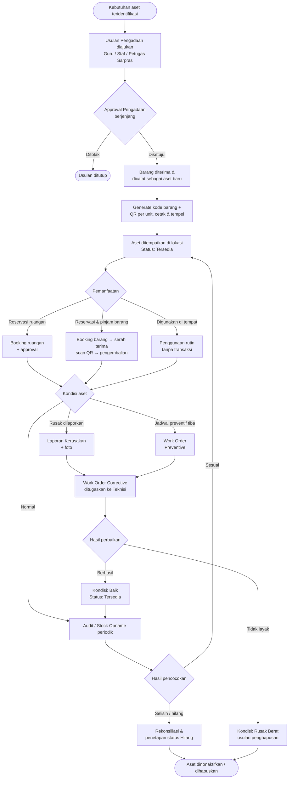
```mermaid
flowchart TD
    START([Kebutuhan aset teridentifikasi]) --> P1["Usulan Pengadaan diajukan<br/>Guru / Staf / Petugas Sarpras"]
    P1 --> P2{Approval Pengadaan<br/>berjenjang}
    P2 -->|Ditolak| PEND([Usulan ditutup])
    P2 -->|Disetujui| P3["Barang diterima &<br/>dicatat sebagai aset baru"]
    P3 --> P4["Generate kode barang +<br/>QR per unit, cetak & tempel"]
    P4 --> P5["Aset ditempatkan di lokasi<br/>Status: Tersedia"]

    P5 --> USE{Pemanfaatan}
    USE -->|Reservasi ruangan| U1["Booking ruangan<br/>+ approval"]
    USE -->|Reservasi & pinjam barang| U2["Booking barang → serah terima<br/>scan QR → pengembalian"]
    USE -->|Digunakan di tempat| U3["Penggunaan rutin<br/>tanpa transaksi"]

    U1 --> COND
    U2 --> COND
    U3 --> COND

    COND{Kondisi aset}
    COND -->|Rusak dilaporkan| M1["Laporan Kerusakan<br/>+ foto"]
    COND -->|Jadwal preventif tiba| M2["Work Order<br/>Preventive"]
    COND -->|Normal| AUD

    M1 --> M3["Work Order Corrective<br/>ditugaskan ke Teknisi"]
    M2 --> M3
    M3 --> M4{Hasil perbaikan}
    M4 -->|Berhasil| M5["Kondisi: Baik<br/>Status: Tersedia"]
    M4 -->|Tidak layak| M6["Kondisi: Rusak Berat<br/>usulan penghapusan"]
    M5 --> AUD

    AUD["Audit / Stock Opname periodik"] --> AUD2{Hasil pencocokan}
    AUD2 -->|Sesuai| P5
    AUD2 -->|Selisih / hilang| AUD3["Rekonsiliasi &<br/>penetapan status Hilang"]
    AUD3 --> END
    M6 --> END([Aset dinonaktifkan / dihapuskan])
```

## 7.3 Journey Detail: Guru Mengajukan Reservasi hingga Pengembalian

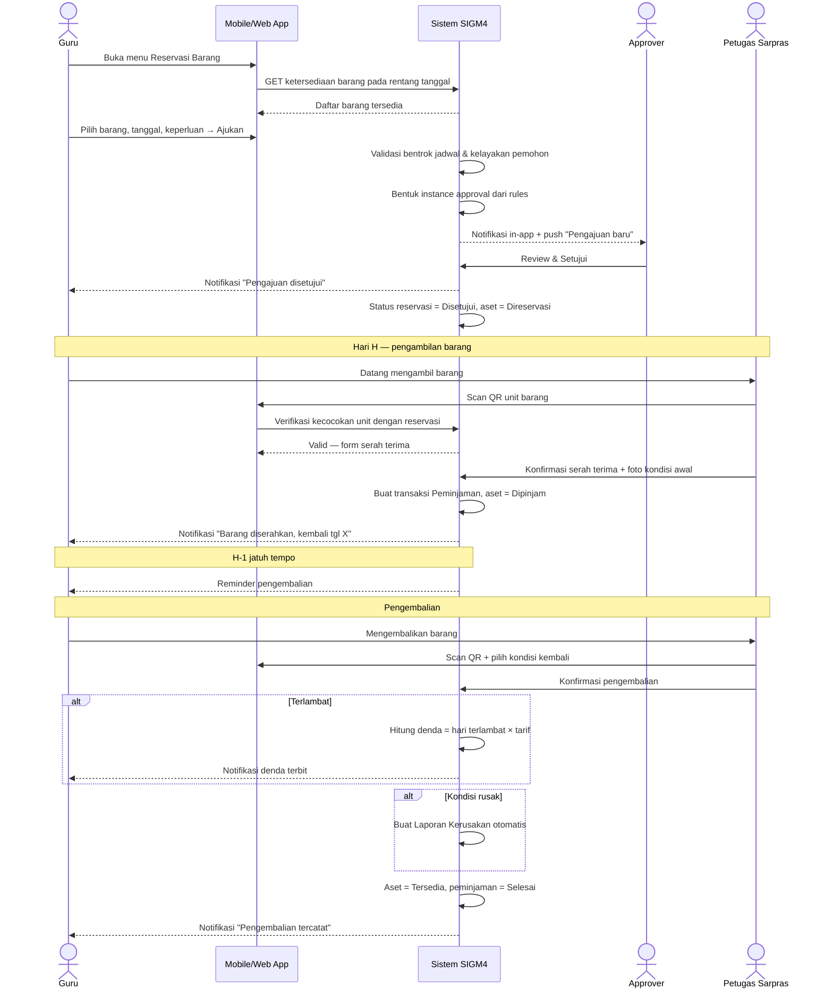
```mermaid
sequenceDiagram
    actor G as Guru
    participant M as Mobile/Web App
    participant S as Sistem SIGM4
    actor A as Approver
    actor P as Petugas Sarpras

    G->>M: Buka menu Reservasi Barang
    M->>S: GET ketersediaan barang pada rentang tanggal
    S-->>M: Daftar barang tersedia
    G->>M: Pilih barang, tanggal, keperluan → Ajukan
    S->>S: Validasi bentrok jadwal & kelayakan pemohon
    S->>S: Bentuk instance approval dari rules
    S-->>A: Notifikasi in-app + push "Pengajuan baru"
    A->>S: Review & Setujui
    S-->>G: Notifikasi "Pengajuan disetujui"
    S->>S: Status reservasi = Disetujui, aset = Direservasi

    Note over G,P: Hari H — pengambilan barang
    G->>P: Datang mengambil barang
    P->>M: Scan QR unit barang
    M->>S: Verifikasi kecocokan unit dengan reservasi
    S-->>M: Valid — form serah terima
    P->>S: Konfirmasi serah terima + foto kondisi awal
    S->>S: Buat transaksi Peminjaman, aset = Dipinjam
    S-->>G: Notifikasi "Barang diserahkan, kembali tgl X"

    Note over S,G: H-1 jatuh tempo
    S-->>G: Reminder pengembalian

    Note over G,P: Pengembalian
    G->>P: Mengembalikan barang
    P->>M: Scan QR + pilih kondisi kembali
    P->>S: Konfirmasi pengembalian
    alt Terlambat
        S->>S: Hitung denda = hari terlambat × tarif
        S-->>G: Notifikasi denda terbit
    end
    alt Kondisi rusak
        S->>S: Buat Laporan Kerusakan otomatis
    end
    S->>S: Aset = Tersedia, peminjaman = Selesai
    S-->>G: Notifikasi "Pengembalian tercatat"
```

## 7.4 Journey Detail: Pelaporan Kerusakan hingga Selesai Diperbaiki

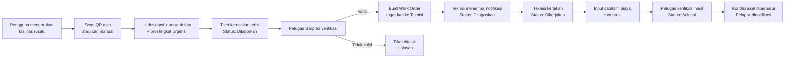
```mermaid
flowchart LR
    A["Pengguna menemukan<br/>fasilitas rusak"] --> B["Scan QR aset<br/>atau cari manual"]
    B --> C["Isi deskripsi + unggah foto<br/>+ pilih tingkat urgensi"]
    C --> D["Tiket kerusakan terbit<br/>Status: Dilaporkan"]
    D --> E["Petugas Sarpras verifikasi"]
    E -->|Valid| F["Buat Work Order<br/>tugaskan ke Teknisi"]
    E -->|Tidak valid| G["Tiket ditolak<br/>+ alasan"]
    F --> H["Teknisi menerima notifikasi<br/>Status: Ditugaskan"]
    H --> I["Teknisi kerjakan<br/>Status: Dikerjakan"]
    I --> J["Input catatan, biaya,<br/>foto hasil"]
    J --> K["Petugas verifikasi hasil<br/>Status: Selesai"]
    K --> L["Kondisi aset diperbarui<br/>Pelapor dinotifikasi"]
```

---

# 8. Functional Requirements

## Daftar Modul

| Kode | Modul | Ringkasan |
|---|---|---|
| M-01 | Autentikasi & Manajemen Akun | Login, logout, reset password, 2FA, profil |
| M-02 | Manajemen User & Role | CRUD pengguna, role, permission |
| M-03 | Manajemen Lokasi | Gedung, ruangan, area, penempatan aset |
| M-04 | Inventaris Aset | CRUD aset per unit, kategori, kondisi, mutasi lokasi |
| M-05 | QR Code Barang | Generate, cetak batch, scan, halaman publik aset |
| M-06 | Dokumen Aset | Unggah & kelola dokumen pendukung aset |
| M-07 | Reservasi Ruangan | Booking ruangan berbasis kalender |
| M-08 | Reservasi Barang | Booking unit barang berbasis ketersediaan |
| M-09 | Peminjaman & Pengembalian | Serah terima, pengembalian, denda keterlambatan |
| M-10 | Approval Workflow Engine | Konfigurasi & eksekusi persetujuan berjenjang |
| M-11 | Laporan Kerusakan | Tiket kerusakan berfoto & verifikasi |
| M-12 | Maintenance Management | Work order preventif & korektif, biaya, riwayat servis |
| M-13 | Audit & Stock Opname | Sesi opname berbasis scan, rekonsiliasi selisih |
| M-14 | Pengadaan Barang | Usulan → approval → penerimaan menjadi aset |
| M-15 | Dashboard Monitoring | Dashboard per role |
| M-16 | Statistik & Analitik | Laporan analitik & ekspor |
| M-17 | Notifikasi | In-app & push notification |
| M-18 | Activity Log | Pencatatan seluruh aktivitas |
| M-19 | Chatbot AI | Asisten percakapan read-only |
| M-20 | Konfigurasi Sistem | Parameter global sistem |
| M-21 | Penghapusan Aset | Usulan → approval → eksekusi → berita acara penghapusan |

---

## M-01 — Autentikasi & Manajemen Akun

### FR-01.1 Login

| Aspek | Uraian |
|---|---|
| **Description** | Pengguna masuk ke sistem menggunakan email dan password yang terdaftar. Berlaku pada aplikasi web maupun mobile. |
| **Actor** | Seluruh role (R-01 s/d R-07) |
| **Preconditions** | Akun sudah dibuat oleh Administrator dan berstatus `Aktif`; perangkat terhubung internet |

**Main Flow**
1. Pengguna membuka halaman login.
2. Pengguna memasukkan email dan password.
3. Sistem memvalidasi kredensial terhadap hash password.
4. Sistem memeriksa status akun (`Aktif`).
5. Jika role pengguna mewajibkan 2FA, sistem meminta kode OTP (lihat FR-01.5).
6. Sistem menerbitkan *access token* (JWT, masa berlaku 60 menit) dan *refresh token* (30 hari untuk mobile, 12 jam untuk web).
7. Sistem mengarahkan pengguna ke dashboard sesuai role.
8. Sistem mencatat aktivitas `LOGIN_SUCCESS` pada activity log.

**Alternative Flow**
- **A1 — Kredensial salah:** Sistem menampilkan pesan generik "Email atau password salah", menambah penghitung percobaan gagal, dan mencatat `LOGIN_FAILED`.
- **A2 — Percobaan gagal ≥ 5 kali dalam 15 menit:** Akun dikunci sementara 15 menit; sistem menampilkan sisa waktu penguncian.
- **A3 — Akun nonaktif:** Sistem menampilkan "Akun Anda dinonaktifkan. Hubungi Administrator."
- **A4 — Login pertama kali / password hasil reset Admin:** Sistem memaksa penggantian password sebelum menu lain dapat diakses.
- **A5 — Token kedaluwarsa saat sesi berjalan:** Klien menukar *refresh token*; bila gagal, pengguna diarahkan ke halaman login.

**Post Conditions**
- Sesi aktif terbentuk; token tersimpan aman (web: `httpOnly cookie`; mobile: Keychain/Keystore).
- Waktu `last_login_at` diperbarui.

**Acceptance Criteria**
- [ ] Login berhasil dengan kredensial valid pada web dan mobile.
- [ ] Pesan kesalahan tidak membocorkan apakah email terdaftar.
- [ ] Akun terkunci otomatis setelah 5 kegagalan dalam 15 menit dan terbuka otomatis setelahnya.
- [ ] Pengguna dengan password hasil reset wajib mengganti password sebelum melanjutkan.
- [ ] Setiap login sukses maupun gagal tercatat di activity log beserta alamat IP dan perangkat.

### FR-01.2 Logout

| Aspek | Uraian |
|---|---|
| **Description** | Mengakhiri sesi pengguna dan mencabut token. |
| **Actor** | Seluruh role |
| **Preconditions** | Pengguna sedang login |

**Main Flow**
1. Pengguna menekan menu Logout.
2. Sistem mencabut *refresh token* pada sisi server (blacklist).
3. Sistem menghapus token pada klien dan mengarahkan ke halaman login.
4. Sistem mencatat `LOGOUT`.

**Alternative Flow**
- **A1 — Keluar dari semua perangkat:** Seluruh refresh token milik pengguna dicabut.
- **A2 — Sesi idle 30 menit (web):** Sistem melakukan auto-logout dan menampilkan pesan sesi berakhir.

**Post Conditions** — Sesi berakhir; token tidak dapat digunakan kembali.

**Acceptance Criteria**
- [ ] Token yang sudah dicabut ditolak API dengan HTTP 401.
- [ ] Auto-logout web berjalan setelah 30 menit tanpa aktivitas.
- [ ] Token push notification perangkat dinonaktifkan saat logout mobile.

### FR-01.3 Lupa Password & Reset

| Aspek | Uraian |
|---|---|
| **Description** | Pengguna yang lupa password mengajukan permintaan reset kepada Administrator; Administrator menerbitkan password sementara. Karena sistem tidak menggunakan kanal email, reset dilakukan melalui mekanisme administratif. |
| **Actor** | Seluruh role (pemohon), Administrator (pelaksana) |
| **Preconditions** | Akun terdaftar |

**Main Flow**
1. Pengguna menekan "Lupa Password" dan memasukkan email terdaftar.
2. Sistem membuat permintaan reset berstatus `Menunggu` dan menotifikasi Administrator (in-app + push).
3. Administrator membuka daftar permintaan dan **memverifikasi identitas pemohon melalui salah satu kanal terverifikasi** yang ditetapkan sekolah: tatap muka dengan menunjukkan kartu identitas pegawai/siswa, atau konfirmasi oleh atasan langsung/wali kelas. Administrator mencatat metode verifikasi yang dipakai.
4. Administrator menekan "Terbitkan Password Sementara". Sistem menghasilkan password sementara acak dan menampilkannya **satu kali** kepada Administrator, serta menandai akun `must_change_password = true`.
5. Administrator menyerahkan password sementara secara **langsung kepada pemohon** (tatap muka atau kanal yang telah diverifikasi pada langkah 3). Dilarang menyerahkan melalui pesan instan atau pihak ketiga.
6. Pengguna login dengan password sementara dan wajib menggantinya sebelum dapat mengakses menu apa pun.

**Alternative Flow**
- **A1 — Email tidak terdaftar:** Sistem tetap menampilkan pesan netral "Permintaan diterima" untuk mencegah enumerasi akun dan tidak membuat permintaan.
- **A2 — Administrator menolak permintaan:** Permintaan ditandai `Ditolak` beserta alasan; pemohon dinotifikasi **setelah** ia berhasil login kembali, atau diberitahu secara luring.
- **A3 — Password sementara tidak digunakan dalam 72 jam:** Password kedaluwarsa dan permintaan ditutup otomatis.
- **A4 — Pemohon mengajukan reset berulang kali:** Maksimum 3 permintaan aktif per akun per 24 jam; kelebihannya ditolak dan dicatat sebagai anomali keamanan.

**Post Conditions** — Pengguna dapat mengakses kembali akunnya dengan password baru pilihannya; metode verifikasi identitas tercatat.

**Acceptance Criteria**
- [ ] Password sementara hanya ditampilkan satu kali dan tidak dapat dilihat ulang, termasuk oleh Administrator yang menerbitkannya.
- [ ] Password sementara tidak pernah dikirim melalui kanal notifikasi apa pun (in-app maupun push), karena pengguna yang bersangkutan sedang tidak dapat login.
- [ ] Pengguna tidak dapat mengakses menu apa pun sebelum mengganti password sementara.
- [ ] Metode verifikasi identitas wajib dipilih sebelum penerbitan dan tersimpan pada permintaan.
- [ ] Seluruh permintaan dan tindakan reset tercatat di activity log tanpa merekam nilai password.

### FR-01.4 Ganti Password & Kelola Profil

| Aspek | Uraian |
|---|---|
| **Description** | Pengguna memperbarui password dan data profil pribadi (nama, telepon, foto). |
| **Actor** | Seluruh role |
| **Preconditions** | Pengguna sedang login |

**Main Flow**
1. Pengguna membuka halaman Profil.
2. Untuk ganti password: memasukkan password lama, password baru, dan konfirmasi.
3. Sistem memvalidasi password lama dan kekuatan password baru: **minimal 12 karakter**, mengandung huruf besar, huruf kecil, dan angka, **tidak terdapat pada daftar password yang diketahui bocor**, serta tidak memuat nama atau email pengguna. Sistem menampilkan indikator kekuatan password secara langsung.
4. Sistem menyimpan hash password baru dan mencabut seluruh sesi lain milik pengguna.
5. Untuk data profil: pengguna menyunting nama, telepon, atau foto lalu menyimpan.

**Alternative Flow**
- **A1 — Password lama salah:** Sistem menolak.
- **A2 — Password baru sama dengan 3 password terakhir:** Sistem menolak.
- **A3 — Foto profil > 2 MB atau bukan JPG/PNG:** Sistem menolak dengan pesan spesifik.

**Post Conditions** — Kredensial/profil diperbarui; sesi lain dicabut saat penggantian password.

**Acceptance Criteria**
- [ ] Password policy divalidasi di sisi server, bukan hanya klien.
- [ ] Email dan role tidak dapat diubah oleh pengguna sendiri.
- [ ] Perubahan tercatat di activity log tanpa merekam nilai password.

### FR-01.5 Two-Factor Authentication (2FA) untuk Role Sensitif

| Aspek | Uraian |
|---|---|
| **Description** | Verifikasi dua langkah berbasis TOTP, wajib bagi Administrator dan Pimpinan Sekolah, opsional bagi role lain. |
| **Actor** | Administrator, Pimpinan Sekolah (wajib); role lain (opsional) |
| **Preconditions** | Pengguna memiliki aplikasi authenticator TOTP |

**Main Flow**
1. Saat login pertama, pengguna role sensitif diarahkan ke halaman aktivasi 2FA.
2. Sistem menampilkan QR Code *secret* TOTP dan 10 kode cadangan sekali pakai.
3. Pengguna memindai dengan aplikasi authenticator dan memasukkan 6 digit kode verifikasi.
4. Sistem memvalidasi dan mengaktifkan 2FA.
5. Pada login berikutnya, setelah password valid, sistem meminta kode TOTP.

**Alternative Flow**
- **A1 — Kode TOTP salah:** Ditolak; setelah 5 kegagalan akun dikunci 15 menit.
- **A2 — Perangkat authenticator hilang:** Pengguna memakai kode cadangan; bila habis, Administrator melakukan reset 2FA.
- **A3 — Administrator me-reset 2FA pengguna:** Pengguna wajib mendaftar ulang saat login berikutnya.
- **A4 — Administrator sendiri kehilangan perangkat 2FA dan kode cadangan:** Berlaku prosedur *break-glass* (FR-01.6). Tanpa prosedur ini sistem dapat terkunci permanen.

**Post Conditions** — Sesi terbentuk hanya setelah dua faktor terverifikasi.

**Acceptance Criteria**
- [ ] Administrator dan Pimpinan Sekolah tidak dapat menonaktifkan 2FA sendiri.
- [ ] Kode cadangan hanya dapat digunakan satu kali.
- [ ] Kode cadangan disimpan dalam bentuk hash, bukan teks terbaca, dan hanya ditampilkan satu kali saat pembuatan.
- [ ] Reset 2FA oleh Administrator tercatat di activity log.
- [ ] Sistem memperingatkan pengguna bila kode cadangan tersisa ≤ 2 dan menawarkan pembuatan ulang.

### FR-01.6 Prosedur Break-Glass Administrator

| Aspek | Uraian |
|---|---|
| **Description** | Jalur pemulihan darurat ketika seluruh akun Administrator kehilangan akses (perangkat 2FA hilang **dan** kode cadangan habis). Tanpa prosedur ini, kewajiban 2FA pada BR-070 dapat mengunci sistem secara permanen. |
| **Actor** | Kepala Sekolah (pemberi otorisasi), Administrator cadangan atau operator infrastruktur (pelaksana) |
| **Preconditions** | Tidak ada akun Administrator yang dapat login |

**Main Flow**
1. Kepala Sekolah menerbitkan otorisasi tertulis pemulihan darurat (formulir baku, ditandatangani, disimpan sebagai arsip sekolah).
2. Operator infrastruktur menjalankan **perintah CLI pemulihan** yang disediakan sistem (`sigm4 admin:recover --email=<email>`), dijalankan langsung di server dan hanya dapat dijalankan oleh pemilik akses server.
3. Perintah tersebut: menonaktifkan 2FA pada akun yang ditunjuk, menerbitkan password sementara, memaksa `must_change_password = true`, dan **mencabut seluruh sesi aktif di sistem**.
4. Sistem mencatat aksi `ADMIN_BREAK_GLASS_RECOVERY` dengan pelaku `SYSTEM:CLI` beserta email target dan waktu.
5. Administrator masuk kembali, mengganti password, mendaftarkan ulang 2FA, dan **wajib** memverifikasi bahwa terdapat minimal dua akun Administrator aktif (RS-19).
6. Sistem mengirim notifikasi kepada seluruh Pimpinan Sekolah bahwa pemulihan darurat telah dijalankan.

**Alternative Flow**
- **A1 — Terdapat Administrator lain yang masih dapat login:** Prosedur break-glass **tidak boleh** digunakan; pemulihan dilakukan melalui reset 2FA biasa (FR-01.5 A3).
- **A2 — Otorisasi tertulis tidak tersedia:** Pelaksana wajib menolak menjalankan perintah.

**Post Conditions** — Akses Administrator pulih; seluruh tindakan terekam permanen dan dapat diaudit.

**Acceptance Criteria**
- [ ] Perintah pemulihan hanya dapat dijalankan dari server (akses shell), tidak pernah melalui antarmuka web maupun API.
- [ ] Perintah menolak berjalan bila masih ada akun Administrator aktif yang login dalam 24 jam terakhir, kecuali dipaksa dengan flag eksplisit yang juga tercatat.
- [ ] Setiap penggunaan break-glass menghasilkan alarm ke pemantauan sistem (OBS-05) dan notifikasi ke seluruh Pimpinan Sekolah.
- [ ] Sistem menolak kondisi "hanya satu akun Administrator" pada saat instalasi awal; minimal dua akun wajib dibuat (RS-19).
- [ ] Entri activity log break-glass tidak dapat dihapus atau disunting oleh siapa pun (AL-03).

---

## M-02 — Manajemen User & Role

### FR-02.1 CRUD Pengguna

| Aspek | Uraian |
|---|---|
| **Description** | Administrator mengelola akun pengguna: membuat, menyunting, menonaktifkan, dan mengaktifkan kembali. |
| **Actor** | Administrator |
| **Preconditions** | Administrator login; role tujuan tersedia |

**Main Flow**
1. Administrator membuka menu Manajemen User dan menekan "Tambah Pengguna".
2. Administrator mengisi nama lengkap, email, NIP/NIS, role, unit kerja/kelas, nomor telepon.
3. Sistem memvalidasi keunikan email dan NIP/NIS.
4. Sistem membuat akun berstatus `Aktif` dengan password sementara dan `must_change_password = true`.
5. Administrator menyerahkan kredensial awal kepada pengguna.
6. Penyuntingan: Administrator mengubah data lalu menyimpan.
7. Penonaktifan: Administrator menekan "Nonaktifkan" dan mengisi alasan.

**Alternative Flow**
- **A1 — Email sudah digunakan:** Sistem menolak dengan pesan spesifik.
- **A2 — Penonaktifan pengguna yang masih memiliki peminjaman aktif atau denda belum lunas:** Sistem menampilkan peringatan dan meminta konfirmasi; data transaksi tetap tersimpan.
- **A3 — Penonaktifan pengguna yang menjadi approver aktif:** Sistem memblokir aksi hingga Administrator menetapkan approver pengganti pada approval rules terkait.
- **A4 — Impor massal:** Administrator mengunggah CSV/XLSX; sistem memvalidasi baris per baris dan menampilkan laporan sukses/gagal.

**Post Conditions** — Data pengguna tersimpan; pengguna nonaktif tidak dapat login namun riwayat transaksinya tetap utuh.

**Acceptance Criteria**
- [ ] Akun tidak dapat dihapus permanen, hanya dinonaktifkan (*soft delete*).
- [ ] Sistem menolak penonaktifan akun Administrator aktif terakhir.
- [ ] Impor massal menampilkan laporan galat per baris tanpa menggagalkan seluruh berkas.
- [ ] Seluruh operasi tercatat di activity log dengan nilai sebelum dan sesudah.

### FR-02.2 Manajemen Role & Permission

| Aspek | Uraian |
|---|---|
| **Description** | Administrator menyesuaikan permission yang melekat pada tiap role melalui matriks permission. |
| **Actor** | Administrator |
| **Preconditions** | Administrator login |

**Main Flow**
1. Administrator membuka menu Manajemen Role.
2. Sistem menampilkan daftar role beserta jumlah pengguna dan permission aktif.
3. Administrator memilih role dan membuka matriks permission (modul × aksi: view, create, update, delete, approve, export).
4. Administrator mencentang/mengosongkan permission lalu menyimpan.
5. Sistem menerapkan perubahan pada permintaan berikutnya dari pengguna terdampak.

**Alternative Flow**
- **A1 — Menghapus permission inti role Administrator:** Sistem menolak.
- **A2 — Membuat role kustom:** Administrator menyalin role yang ada sebagai template lalu menyesuaikan.
- **A3 — Menghapus role yang masih memiliki pengguna:** Sistem menolak dan meminta pemindahan pengguna terlebih dahulu.

**Post Conditions** — Matriks permission terbarui dan berlaku pada seluruh titik pemeriksaan otorisasi (API dan UI).

**Acceptance Criteria**
- [ ] Otorisasi diperiksa di sisi server pada setiap endpoint, tidak hanya menyembunyikan menu di UI.
- [ ] Perubahan permission berlaku tanpa restart layanan.
- [ ] Perubahan matriks tercatat di activity log.

---

## M-03 — Manajemen Lokasi

### FR-03.1 CRUD Hierarki Lokasi

| Aspek | Uraian |
|---|---|
| **Description** | Pengelolaan struktur lokasi tiga tingkat: Gedung → Lantai/Area → Ruangan. Setiap aset ditempatkan pada satu ruangan/area. |
| **Actor** | Administrator, Petugas Sarana Prasarana |
| **Preconditions** | Pengguna memiliki permission `location.manage` |

**Main Flow**
1. Pengguna membuka menu Manajemen Lokasi dan melihat pohon lokasi.
2. Pengguna menambah Gedung (nama, kode, keterangan).
3. Pengguna menambah Lantai/Area di bawah Gedung.
4. Pengguna menambah Ruangan dengan atribut: nama, kode, jenis ruangan (Kelas, Laboratorium, Aula, Kantor, Gudang, Lainnya), kapasitas orang, penanggung jawab, status, dan penanda `dapat_direservasi`.
5. Sistem menyimpan dan memperbarui pohon lokasi.

**Alternative Flow**
- **A1 — Kode lokasi duplikat:** Sistem menolak.
- **A2 — Menonaktifkan ruangan yang masih memiliki reservasi mendatang:** Sistem menampilkan daftar reservasi terdampak dan meminta konfirmasi; reservasi yang sudah disetujui tetap berlaku, reservasi baru diblokir.
- **A3 — Menghapus lokasi yang masih memuat aset:** Sistem menolak dan meminta pemindahan aset terlebih dahulu.

**Post Conditions** — Struktur lokasi terbarui dan tersedia sebagai referensi pada modul aset, reservasi, dan opname.

**Acceptance Criteria**
- [ ] Struktur lokasi ditampilkan sebagai pohon yang dapat diperluas/diciutkan.
- [ ] Ruangan dengan `dapat_direservasi = false` tidak muncul di modul Reservasi Ruangan.
- [ ] Setiap lokasi menampilkan jumlah aset di dalamnya.
- [ ] Lokasi yang pernah memiliki transaksi hanya dapat dinonaktifkan, tidak dihapus permanen.

### FR-03.2 Pencarian Aset Berdasarkan Lokasi

| Aspek | Uraian |
|---|---|
| **Description** | Menampilkan seluruh aset pada suatu lokasi beserta ringkasan kondisinya untuk keperluan audit dan pencarian barang. |
| **Actor** | Petugas Sarpras, Administrator, Pimpinan Sekolah, Teknisi, Guru/Staf (read-only) |
| **Preconditions** | Data lokasi dan aset tersedia |

**Main Flow**
1. Pengguna memilih lokasi pada pohon lokasi atau memindai QR ruangan.
2. Sistem menampilkan daftar aset di lokasi tersebut (kode barang, nama, kondisi, status).
3. Sistem menampilkan ringkasan: total unit, jumlah per kondisi, jumlah dipinjam, jumlah dalam perbaikan.
4. Pengguna dapat memfilter berdasarkan kategori, kondisi, dan status.

**Alternative Flow**
- **A1 — Lokasi kosong:** Sistem menampilkan status kosong beserta tombol "Tambah Aset ke Lokasi Ini".
- **A2 — Ekspor daftar:** Pengguna dengan permission `report.export` mengekspor ke XLSX/PDF sebagai berita acara lokasi.

**Post Conditions** — Tidak ada perubahan data (operasi baca).

**Acceptance Criteria**
- [ ] Daftar aset per lokasi tampil ≤ 2 detik untuk lokasi dengan hingga 500 unit.
- [ ] Filter dan pencarian dapat dikombinasikan.
- [ ] Hasil ekspor memuat identitas lokasi, tanggal cetak, dan pencetak.

---

## M-04 — Inventaris Aset

### FR-04.1 Pendaftaran Aset Baru (Per Unit)

| Aspek | Uraian |
|---|---|
| **Description** | Mencatat aset baru. Setiap unit fisik menghasilkan satu record dengan kode barang unik dan QR Code sendiri. |
| **Actor** | Petugas Sarana Prasarana, Administrator |
| **Preconditions** | Kategori aset dan lokasi tersedia; format kode barang sudah dikonfigurasi (FR-20.1) |

**Main Flow**
1. Pengguna membuka menu Inventaris dan menekan "Tambah Aset".
2. Pengguna mengisi: nama barang, kategori, merek, model/tipe, nomor seri, tahun perolehan, sumber perolehan (Pembelian/Hibah/Bantuan), nilai perolehan, lokasi penempatan, kondisi awal, penanggung jawab, penanda `dapat_dipinjam` dan `boleh_dipinjam_siswa`.
3. Pengguna menentukan jumlah unit yang akan dibuat (mis. 20 unit kursi identik).
4. Sistem membuat N record aset terpisah, masing-masing dengan kode barang unik berurutan dan QR Code unik.
5. Sistem menetapkan status awal `Tersedia` dan kondisi sesuai input.
6. Sistem menampilkan daftar aset yang dibuat beserta tombol "Cetak QR".

**Alternative Flow**
- **A1 — Nomor seri duplikat:** Sistem menolak; nomor seri wajib unik bila diisi.
- **A2 — Impor massal:** Pengguna mengunggah CSV/XLSX sesuai template; sistem memvalidasi tiap baris dan menampilkan laporan hasil.
- **A3 — Aset dari penerimaan pengadaan:** Data terisi otomatis dari dokumen penerimaan (FR-14.3); pengguna melengkapi nomor seri dan lokasi.
- **A4 — Kategori belum ada:** Pengguna berwenang dapat membuat kategori baru langsung dari form.

**Post Conditions** — N record aset tersimpan berstatus `Tersedia`; kode barang dan QR terbentuk; activity log tercatat.

**Acceptance Criteria**
- [ ] Membuat 20 unit sekaligus menghasilkan 20 record dengan 20 kode barang dan 20 QR berbeda.
- [ ] Kode barang mengikuti format yang dikonfigurasi Administrator dan unik sistem-wide.
- [ ] Impor 500 baris selesai ≤ 60 detik dengan laporan galat per baris.
- [ ] Aset dengan `dapat_dipinjam = false` tidak muncul pada modul Reservasi Barang.
- [ ] Aset dengan `boleh_dipinjam_siswa = false` tidak terlihat pada katalog role Siswa/OSIS.

### FR-04.2 Melihat & Mencari Aset

| Aspek | Uraian |
|---|---|
| **Description** | Katalog aset dengan pencarian, filter, dan halaman detail lengkap. |
| **Actor** | Seluruh role (cakupan data menyesuaikan permission) |
| **Preconditions** | Terdapat data aset |

**Main Flow**
1. Pengguna membuka menu Inventaris.
2. Sistem menampilkan tabel aset terpaginasi (kode barang, nama, kategori, lokasi, kondisi, status).
3. Pengguna mencari berdasarkan kode barang, nama, merek, atau nomor seri.
4. Pengguna memfilter berdasarkan kategori, lokasi, kondisi, status, tahun perolehan, dan kelayakan pinjam.
5. Pengguna membuka detail aset: identitas lengkap, foto, QR Code, riwayat peminjaman, riwayat pemeliharaan, riwayat mutasi lokasi, laporan kerusakan terkait, dan dokumen aset.

**Alternative Flow**
- **A1 — Role Siswa/OSIS:** Sistem menyembunyikan nilai perolehan, sumber perolehan, biaya pemeliharaan, dan dokumen aset; hanya menampilkan aset dengan `boleh_dipinjam_siswa = true` atau aset publik.
- **A2 — Tidak ada hasil:** Sistem menampilkan status kosong dan saran penyesuaian filter.
- **A3 — Ekspor:** Pengguna dengan permission `asset.export` mengekspor hasil filter ke XLSX/PDF.

**Post Conditions** — Tidak ada perubahan data.

**Acceptance Criteria**
- [ ] Pencarian pada 5.000 aset mengembalikan hasil ≤ 2 detik.
- [ ] Filter dapat dikombinasikan dan tercermin pada URL agar dapat dibagikan (web).
- [ ] Data finansial tidak pernah dikirim ke klien role Siswa/OSIS (diperiksa di sisi server).

### FR-04.3 Perubahan Data & Kondisi Aset

| Aspek | Uraian |
|---|---|
| **Description** | Memperbarui atribut aset termasuk kondisi fisik, dengan pencatatan riwayat perubahan. |
| **Actor** | Petugas Sarana Prasarana, Administrator; Teknisi (khusus kondisi pasca-perbaikan) |
| **Preconditions** | Aset terdaftar; pengguna memiliki permission `asset.update` |

**Main Flow**
1. Pengguna membuka detail aset dan menekan "Ubah".
2. Pengguna memperbarui atribut yang diperlukan.
3. Bila kondisi diubah, sistem mewajibkan pengisian alasan perubahan.
4. Sistem menyimpan perubahan dan mencatat riwayat kondisi (nilai lama → baru, pelaku, waktu, alasan).

**Alternative Flow**
- **A1 — Kondisi menjadi `Rusak Berat`:** Sistem mengubah status aset menjadi `Tidak Tersedia`, membatalkan reservasi mendatang atas aset tersebut, dan menotifikasi pemohon terkait.
- **A2 — Kondisi menjadi `Hilang`:** Sistem mewajibkan referensi ke sesi stock opname atau berita acara, mengubah status menjadi `Tidak Tersedia`, dan menotifikasi Pimpinan Sekolah.
- **A3 — Aset sedang dipinjam:** Perubahan lokasi diblokir hingga aset dikembalikan.

**Post Conditions** — Data aset dan riwayat kondisi terbarui; status turunan tersesuaikan.

**Acceptance Criteria**
- [ ] Perubahan kondisi selalu menyimpan alasan dan tidak dapat dikosongkan.
- [ ] Aset berkondisi `Rusak Berat` atau `Hilang` otomatis tidak dapat direservasi/dipinjam.
- [ ] Riwayat perubahan kondisi ditampilkan kronologis pada halaman detail aset.

### FR-04.4 Mutasi Lokasi Aset

| Aspek | Uraian |
|---|---|
| **Description** | Memindahkan aset antar lokasi secara permanen, disertai berita acara digital. |
| **Actor** | Petugas Sarana Prasarana, Administrator |
| **Preconditions** | Aset berstatus `Tersedia` atau `Dalam Perbaikan`; lokasi tujuan aktif |

**Main Flow**
1. Pengguna memilih satu atau beberapa aset lalu menekan "Mutasi Lokasi".
2. Pengguna memilih lokasi tujuan, tanggal mutasi, alasan, dan penanggung jawab baru.
3. Sistem memvalidasi status aset dan kapasitas lokasi tujuan bila diatur.
4. Sistem memperbarui lokasi aset dan membuat record riwayat mutasi.
5. Sistem menyediakan berita acara mutasi yang dapat dicetak.

**Alternative Flow**
- **A1 — Aset sedang dipinjam/direservasi pada tanggal mutasi:** Sistem menolak dan menampilkan transaksi yang menghalangi.
- **A2 — Mutasi massal via scan QR:** Petugas memindai beberapa QR berurutan di aplikasi mobile lalu menetapkan satu lokasi tujuan.

**Post Conditions** — Lokasi aset terbarui; riwayat mutasi tersimpan permanen.

**Acceptance Criteria**
- [ ] Riwayat mutasi menampilkan lokasi asal, tujuan, tanggal, pelaku, dan alasan.
- [ ] Mutasi massal hingga 50 aset dalam satu operasi berhasil secara atomik.
- [ ] Berita acara mutasi dapat diunduh sebagai PDF.

### FR-04.5 Manajemen Kategori Aset

| Aspek | Uraian |
|---|---|
| **Description** | Mengelola kategori dan subkategori aset sebagai dasar pengelompokan, penomoran kode, dan pelaporan. |
| **Actor** | Administrator, Petugas Sarana Prasarana |
| **Preconditions** | Pengguna memiliki permission `category.manage` |

**Main Flow**
1. Pengguna membuka menu Kategori Aset.
2. Pengguna menambah kategori (nama, kode, kategori induk, umur teknis dalam tahun, interval pemeliharaan preventif dalam hari).
3. Sistem menyimpan dan menjadikannya pilihan pada form aset.

**Alternative Flow**
- **A1 — Kode kategori duplikat:** Sistem menolak.
- **A2 — Menghapus kategori yang masih dipakai aset:** Sistem menolak dan menampilkan jumlah aset terkait.

**Post Conditions** — Daftar kategori terbarui; interval preventif menjadi dasar penjadwalan maintenance (FR-12.2).

**Acceptance Criteria**
- [ ] Mendukung minimal dua tingkat kategori (induk dan anak).
- [ ] Interval preventif kategori otomatis diusulkan saat membuat jadwal pemeliharaan.

---

## M-05 — QR Code Barang

### FR-05.1 Generate & Cetak QR Code

| Aspek | Uraian |
|---|---|
| **Description** | Sistem menghasilkan QR Code unik per unit aset dan menyediakan pencetakan label satuan maupun massal. |
| **Actor** | Petugas Sarana Prasarana, Administrator |
| **Preconditions** | Aset sudah terdaftar |

**Main Flow**
1. QR Code dihasilkan otomatis saat aset dibuat, memuat URL **permanen** menuju halaman publik aset: `https://{domain}/a/{asset_uuid}`. **Klarifikasi audit:** URL ini **tidak** bertanda tangan berbatas waktu — label QR dicetak permanen sehingga tanda tangan kedaluwarsa akan membuat label mati. Keamanannya bertumpu pada dua hal: UUIDv4 yang tidak dapat ditebak, dan halaman publik yang hanya memuat atribut non-sensitif (FR-05.2 A3). URL bertanda tangan berbatas waktu tetap dipakai untuk **unduhan dokumen dan foto** (FR-06.1), bukan untuk QR.
2. Pengguna memilih satu atau banyak aset lalu menekan "Cetak Label QR".
3. Pengguna memilih ukuran label, tata letak lembar (mis. 3×8 per A4), dan elemen yang ditampilkan (kode barang, nama, nama sekolah).
4. Sistem menghasilkan berkas PDF siap cetak.
5. Petugas mencetak, menempel label, lalu menandai aset `qr_terpasang = true`.

**Alternative Flow**
- **A1 — QR rusak/hilang:** Pengguna menekan "Cetak Ulang"; UUID aset tidak berubah sehingga QR lama tetap valid bila ditemukan kembali.
- **A2 — Regenerasi UUID:** Hanya Administrator yang dapat meregenerasi UUID; QR lama otomatis tidak berlaku dan tindakan dicatat di activity log.

**Post Conditions** — Label QR tercetak; status pelabelan aset terbarui.

**Acceptance Criteria**
- [ ] Setiap unit aset memiliki QR unik yang tidak pernah dipakai ulang oleh aset lain.
- [ ] Cetak massal hingga 200 label menghasilkan PDF ≤ 30 detik.
- [ ] QR tetap terbaca pada ukuran cetak minimum 2×2 cm dengan tingkat koreksi galat M.
- [ ] Laporan "Aset belum berlabel QR" tersedia bagi Petugas Sarpras.

### FR-05.2 Pemindaian QR Code

| Aspek | Uraian |
|---|---|
| **Description** | Pemindaian QR untuk membuka profil aset secara instan sekaligus menjadi titik masuk aksi kontekstual (serah terima, pengembalian, opname, lapor kerusakan). |
| **Actor** | Seluruh role (aksi lanjutan menyesuaikan permission) |
| **Preconditions** | Aset memiliki label QR; perangkat memiliki kamera dan koneksi internet |

**Main Flow**
1. Pengguna membuka fitur Scan pada aplikasi mobile atau web (kamera peramban).
2. Pengguna mengarahkan kamera ke QR Code aset.
3. Sistem membaca UUID, memanggil API detail aset, dan menampilkan profil aset.
4. Sistem menampilkan tombol aksi kontekstual sesuai role dan status aset:
   - Petugas Sarpras + aset `Direservasi` → "Proses Serah Terima"
   - Petugas Sarpras + aset `Dipinjam` → "Proses Pengembalian"
   - Petugas Sarpras dalam sesi opname aktif → "Catat Hasil Opname"
   - Guru/Staf/Siswa → "Lapor Kerusakan"
   - Teknisi dengan work order aktif → "Perbarui Work Order"

**Alternative Flow**
- **A1 — QR tidak dikenali/rusak:** Sistem menampilkan galat dan menyediakan input kode barang manual.
- **A2 — Aset sudah dinonaktifkan:** Sistem menampilkan profil dengan penanda "Aset tidak aktif" dan menyembunyikan aksi transaksional.
- **A3 — QR dipindai dengan aplikasi kamera bawaan:** Pengguna diarahkan ke halaman web publik aset yang hanya menampilkan informasi dasar (kode, nama, kategori, lokasi, kondisi, status) tanpa data finansial, disertai ajakan login untuk aksi lanjutan.
- **A4 — Izin kamera ditolak:** Sistem menampilkan panduan mengaktifkan izin dan menyediakan input manual.

**Post Conditions** — Profil aset ditampilkan; aksi lanjutan tersedia sesuai konteks.

**Acceptance Criteria**
- [ ] Waktu dari pemindaian hingga profil tampil ≤ 3 detik pada jaringan sekolah.
- [ ] Halaman publik hasil scan tidak pernah menampilkan nilai aset, biaya, maupun data pribadi peminjam.
- [ ] Input kode barang manual tersedia sebagai jalur cadangan di setiap alur pemindaian.
- [ ] Aksi kontekstual yang ditampilkan selalu sesuai permission pengguna dan status aset.

---

## M-06 — Dokumen Aset

### FR-06.1 Unggah & Kelola Dokumen Aset

| Aspek | Uraian |
|---|---|
| **Description** | Penyimpanan terpusat dokumen pendukung aset: faktur pembelian, kartu garansi, sertifikat, manual penggunaan, foto, dan berita acara. |
| **Actor** | Petugas Sarana Prasarana, Administrator |
| **Preconditions** | Aset terdaftar; pengguna memiliki permission `asset_document.manage` |

**Main Flow**
1. Pengguna membuka detail aset dan memilih tab Dokumen.
2. Pengguna menekan "Unggah Dokumen", memilih jenis (Faktur, Garansi, Sertifikat, Manual, Berita Acara, Lainnya), mengunggah berkas, dan mengisi keterangan.
3. Untuk dokumen garansi, pengguna mengisi tanggal mulai dan berakhir garansi.
4. Sistem memvalidasi jenis berkas (PDF, JPG, PNG, DOCX, XLSX) dan ukuran (maks. 10 MB per berkas).
5. Sistem menyimpan berkas pada penyimpanan objek dan mencatat metadatanya.

**Alternative Flow**
- **A1 — Berkas melebihi batas atau jenis tidak didukung:** Sistem menolak dengan pesan spesifik.
- **A2 — Dokumen dihapus:** Hanya Administrator dan Petugas Sarpras yang dapat menghapus; sistem meminta konfirmasi dan mencatat penghapusan di activity log.
- **A3 — Satu dokumen berlaku untuk banyak unit** (mis. satu faktur untuk 20 kursi): Pengguna mengunggah sekali lalu menautkannya ke beberapa aset.

**Post Conditions** — Dokumen tersimpan dan dapat diunduh pengguna berwenang; masa garansi terpantau sistem.

**Acceptance Criteria**
- [ ] Berkas tidak dapat diakses melalui URL tebakan; unduhan memakai URL bertanda tangan berbatas waktu 15 menit.
- [ ] Role Siswa/OSIS tidak dapat mengakses dokumen aset.
- [ ] Sistem mengirim notifikasi kepada Petugas Sarpras 30 hari sebelum garansi berakhir.
- [ ] Setiap unduhan dokumen tercatat di activity log.

---

## M-07 — Reservasi Ruangan

### FR-07.1 Melihat Ketersediaan Ruangan

| Aspek | Uraian |
|---|---|
| **Description** | Kalender ketersediaan seluruh ruangan yang dapat direservasi, menampilkan slot terpakai dan kosong. |
| **Actor** | Guru, Staf/TU, Siswa/OSIS, Petugas Sarpras, Pimpinan Sekolah, Administrator |
| **Preconditions** | Terdapat ruangan dengan `dapat_direservasi = true` |

**Main Flow**
1. Pengguna membuka menu Reservasi Ruangan.
2. Sistem menampilkan kalender (tampilan harian/mingguan/bulanan) dengan ruangan sebagai baris dan waktu sebagai kolom.
3. Pengguna memfilter berdasarkan gedung, jenis ruangan, dan kapasitas minimum.
4. Sistem menampilkan slot terisi lengkap dengan nama kegiatan dan pemohon, serta slot kosong yang dapat dipilih.
5. Pengguna memilih slot kosong untuk melanjutkan ke pengajuan.

**Alternative Flow**
- **A1 — Role Siswa/OSIS:** Sistem hanya menampilkan ruangan yang ditandai `boleh_direservasi_siswa`, dan pada slot terisi hanya menampilkan status "Terpakai" tanpa detail pemohon.
- **A2 — Ruangan sedang dalam pemeliharaan:** Slot ditandai "Dalam Pemeliharaan" dan tidak dapat dipilih.
- **A3 — Di luar jam operasional sekolah:** Slot ditandai tidak tersedia sesuai konfigurasi jam operasional (FR-20.1).
- **A4 — Slot terpakai jadwal tetap (KBM/ekstrakurikuler):** Slot ditandai dengan label kegiatannya dan tidak dapat dipilih (FR-07.5).
- **A5 — Hari libur sekolah:** Seluruh slot pada tanggal tersebut ditandai libur beserta keterangannya (Lampiran E).

**Post Conditions** — Tidak ada perubahan data.

**Acceptance Criteria**
- [ ] Kalender memuat data hingga 30 ruangan × 1 bulan dalam ≤ 2 detik.
- [ ] Slot yang sedang menunggu persetujuan ditampilkan dengan warna berbeda dari slot yang sudah disetujui.
- [ ] Detail pemohon tidak terlihat oleh role Siswa/OSIS.

### FR-07.2 Pengajuan Reservasi Ruangan

| Aspek | Uraian |
|---|---|
| **Description** | Pengguna mengajukan pemesanan ruangan pada rentang tanggal dan waktu tertentu; pengajuan diteruskan ke approval engine. |
| **Actor** | Guru, Staf/TU, Siswa/OSIS |
| **Preconditions** | Pengguna login; ruangan aktif dan dapat direservasi; pengguna tidak sedang diblokir (BR-030) |

**Main Flow**
1. Pengguna memilih ruangan dan slot waktu dari kalender.
2. Pengguna mengisi: nama kegiatan, jenis kegiatan, tanggal & jam mulai–selesai, perkiraan jumlah peserta, kebutuhan tambahan, dan keterangan.
3. Pengguna dapat menambahkan barang pendukung dalam pengajuan yang sama (opsional; memicu validasi ketersediaan barang — FR-08.2).
4. Sistem memvalidasi: tidak bentrok dengan reservasi berstatus `Disetujui`, dalam jam operasional, jumlah peserta ≤ kapasitas ruangan, dan pengajuan minimal H-1 (dapat dikonfigurasi).
5. Sistem membuat reservasi berstatus `Menunggu Persetujuan` dan membentuk instance approval dari rules (FR-10.2).
6. Sistem menotifikasi approver level pertama.
7. Sistem menampilkan nomor pengajuan kepada pemohon.

**Alternative Flow**
- **A1 — Slot sudah dipesan pihak lain (race condition):** Sistem menolak dengan pesan "Slot baru saja dipesan pengguna lain" dan menyarankan slot alternatif terdekat.
- **A2 — Peserta melebihi kapasitas ruangan:** Sistem menolak dan menyarankan ruangan berkapasitas cukup.
- **A3 — Pengajuan mendadak (< H-1):** Sistem menolak, kecuali pengguna memiliki permission `reservation.urgent` (Petugas Sarpras/Administrator).
- **A4 — Reservasi berulang (mis. setiap Senin selama 8 minggu):** Pengguna memilih pola pengulangan; sistem memvalidasi seluruh tanggal sekaligus dan menampilkan tanggal yang bentrok untuk disesuaikan atau dilewati.
- **A5 — Pemohon memiliki denda belum lunas atau sedang diblokir:** Sistem menolak pengajuan disertai alasan.

**Post Conditions** — Reservasi tercatat berstatus `Menunggu Persetujuan`; slot ditandai *tentative* pada kalender; approval instance aktif.

**Acceptance Criteria**
- [ ] Sistem menolak 100% pengajuan yang beririsan waktu dengan reservasi berstatus `Disetujui` pada ruangan yang sama.
- [ ] Validasi bentrok dilakukan di sisi server dengan penguncian transaksional (bukan hanya pemeriksaan di klien).
- [ ] Reservasi berulang menghasilkan **satu** pengajuan induk dengan **satu** instance approval dan N slot turunan per tanggal (BR-024a); keputusan approval berlaku untuk seluruh tanggal.
- [ ] Pembatalan satu tanggal turunan tidak membatalkan induk maupun tanggal lainnya.
- [ ] Reservasi gabungan ruangan + barang pendukung diperlakukan *all-or-nothing* dalam satu instance approval (BR-024b).
- [ ] Reservasi berulang tidak dapat melampaui horizon pemesanan yang dikonfigurasi (BR-023c).
- [ ] Nomor pengajuan unik dan mengikuti format `RSV-RG-{TAHUN}-{URUT}` sesuai regex SEQ-04; tanggal turunan memakai sufiks `.{n}` (mis. `RSV-RG-2026-0001.03`).

### FR-07.3 Pembatalan & Perubahan Reservasi Ruangan

| Aspek | Uraian |
|---|---|
| **Description** | Pemohon membatalkan reservasi atau Petugas/Approver membatalkan secara sepihak dengan alasan. |
| **Actor** | Pemohon (miliknya sendiri), Petugas Sarpras, Administrator |
| **Preconditions** | Reservasi berstatus `Menunggu Persetujuan` atau `Disetujui` dan belum dimulai |

**Main Flow**
1. Pengguna membuka detail reservasi dan menekan "Batalkan".
2. Pengguna mengisi alasan pembatalan.
3. Sistem mengubah status menjadi `Dibatalkan`, membebaskan slot kalender, dan menotifikasi pihak terkait.

**Alternative Flow**
- **A1 — Pembatalan setelah kegiatan dimulai:** Sistem menolak; petugas dapat menandai reservasi `Selesai` atau `Tidak Digunakan`.
- **A2 — Pembatalan sepihak oleh Petugas/Administrator** (mis. ruangan dipakai kegiatan mendesak sekolah): Alasan wajib diisi dan pemohon dinotifikasi segera.
- **A3 — Perubahan jadwal:** Diperlakukan sebagai pembatalan + pengajuan baru agar jejak approval tetap jelas.

**Post Conditions** — Slot kembali tersedia; riwayat pembatalan tersimpan lengkap dengan pelaku dan alasan.

**Acceptance Criteria**
- [ ] Slot yang dibatalkan langsung dapat dipesan pengguna lain.
- [ ] Alasan pembatalan wajib diisi dan tampil pada riwayat.
- [ ] Pemohon menerima notifikasi in-app dan push saat reservasinya dibatalkan pihak lain.

### FR-07.4 Penggunaan & Penyelesaian Reservasi Ruangan

| Aspek | Uraian |
|---|---|
| **Description** | Menandai realisasi penggunaan ruangan dan menutup reservasi. |
| **Actor** | Petugas Sarpras, Pemohon |
| **Preconditions** | Reservasi berstatus `Disetujui` dan waktu kegiatan telah berlangsung |

**Main Flow**
1. Pada waktu mulai, status reservasi otomatis berubah menjadi `Berlangsung`.
2. Setelah waktu selesai, sistem mengubah status menjadi `Selesai` secara otomatis.
3. Petugas Sarpras dapat menandai kondisi ruangan pasca-kegiatan (Baik / Perlu Perhatian) dan menambahkan catatan.

**Alternative Flow**
- **A1 — Ruangan tidak digunakan:** Petugas menandai `Tidak Digunakan`; sistem mencatatnya pada rekam jejak pemohon untuk keperluan analitik utilisasi.
- **A2 — Ditemukan kerusakan pasca-kegiatan:** Petugas membuat Laporan Kerusakan yang tertaut ke reservasi tersebut.

**Post Conditions** — Reservasi tertutup; data utilisasi ruangan terbarui untuk analitik.

**Acceptance Criteria**
- [ ] Perubahan status otomatis berjalan tanpa intervensi manual.
- [ ] Reservasi berstatus `Tidak Digunakan` tercatat dan terhitung pada statistik pemanfaatan.

### FR-07.5 Blokade Jadwal Tetap & Blokade Manual Ruangan

| Aspek | Uraian |
|---|---|
| **Description** | Menandai ruangan sebagai terpakai pada pola waktu berulang (jadwal KBM, ekstrakurikuler, ibadah) atau pada rentang tertentu (renovasi, libur), tanpa memerlukan integrasi dengan sistem akademik. |
| **Actor** | Petugas Sarana Prasarana, Administrator |
| **Preconditions** | Pengguna memiliki permission `reservation.fixed_schedule` |

> **Latar belakang revisi:** tanpa fitur ini, kalender ruangan kelas akan tampak kosong sepanjang hari padahal ruangan tersebut terpakai untuk KBM. Pengguna akan memesan ruangan yang sebenarnya terpakai, dan SC-05 (nol benturan jadwal) tidak akan tercapai. Integrasi penuh dengan sistem akademik tetap berada di luar lingkup (NO-10, FE-13); fitur ini adalah pengganti minimum yang memadai.

**Main Flow**
1. Pengguna membuka Manajemen Lokasi → tab Jadwal Tetap pada suatu ruangan.
2. Pengguna menambahkan blokade dengan pola: hari dalam seminggu, jam mulai–selesai, tanggal berlaku mulai–sampai, dan label kegiatan (mis. "KBM Kelas XI-A").
3. Alternatifnya, pengguna menambahkan blokade rentang tunggal (mis. "Renovasi 10–20 Agustus").
4. Sistem membuat slot `Confirmed` dengan `origin = fixed_schedule` atau `manual_block` (Bab 26.2) untuk seluruh kemunculan dalam horizon pemesanan.
5. Kalender menampilkan slot tersebut dengan gaya visual berbeda dari reservasi pengguna, beserta labelnya.

**Alternative Flow**
- **A1 — Blokade bentrok dengan reservasi yang sudah disetujui:** Sistem menampilkan daftar reservasi terdampak dan meminta keputusan eksplisit: batalkan reservasi tersebut (dengan notifikasi ke pemohon) atau sesuaikan blokade.
- **A2 — Impor massal jadwal:** Pengguna mengunggah CSV berisi ruangan, hari, jam, dan label (Lampiran E) — jalur cepat pada tahap implementasi awal.
- **A3 — Blokade dinonaktifkan:** Slot mendatang dilepas; slot yang telah lewat tetap tersimpan sebagai arsip utilisasi.
- **A4 — Hari libur sekolah:** Blokade berulang otomatis dilewati pada tanggal yang terdaftar sebagai hari libur (Lampiran E).

**Post Conditions** — Slot blokade aktif; ruangan tidak dapat dipesan pada waktu tersebut oleh siapa pun kecuali pengguna dengan permission `reservation.urgent`.

**Acceptance Criteria**
- [ ] Slot blokade menghalangi pengajuan reservasi dengan mekanisme yang sama seperti reservasi biasa (*exclusion constraint*, CI-01).
- [ ] Kalender membedakan secara visual: blokade jadwal tetap, blokade manual, reservasi menunggu persetujuan, dan reservasi disetujui — dan pembedaan itu tidak hanya melalui warna (NFR-AC-06).
- [ ] Blokade berulang tidak dibuat pada tanggal yang terdaftar sebagai hari libur.
- [ ] Blokade tidak dihitung sebagai reservasi pengguna pada analitik utilisasi, namun dihitung sebagai waktu terpakai.
- [ ] Regenerasi blokade untuk horizon 90 hari pada 30 ruangan selesai ≤ 10 detik dan dijalankan sebagai pekerjaan asinkron.

---

## M-08 — Reservasi Barang

### FR-08.1 Melihat Ketersediaan Barang

| Aspek | Uraian |
|---|---|
| **Description** | Menampilkan katalog barang yang dapat dipinjam beserta ketersediaannya pada rentang tanggal tertentu. |
| **Actor** | Guru, Staf/TU, Siswa/OSIS, Petugas Sarpras |
| **Preconditions** | Terdapat aset dengan `dapat_dipinjam = true`, kondisi `Baik`/`Rusak Ringan`, dan tidak berstatus `Dalam Perbaikan`/`Tidak Tersedia` |

**Main Flow**
1. Pengguna membuka menu Reservasi Barang dan menentukan rentang tanggal peminjaman.
2. Sistem menampilkan katalog barang dikelompokkan per kategori beserta jumlah unit yang tersedia pada rentang tersebut.
3. Pengguna dapat menelusuri hingga tingkat unit untuk melihat kode barang dan kondisinya.
4. Pengguna memilih barang dan jumlah unit yang dibutuhkan.

**Alternative Flow**
- **A1 — Role Siswa/OSIS:** Katalog dibatasi pada aset dengan `boleh_dipinjam_siswa = true`.
- **A2 — Seluruh unit terpesan pada rentang tanggal tersebut:** Sistem menampilkan tanggal terdekat saat unit kembali tersedia.
- **A3 — Barang berkondisi `Rusak Berat`, `Hilang`, atau berstatus `Dalam Perbaikan`:** Tidak ditampilkan sebagai tersedia.

**Post Conditions** — Tidak ada perubahan data.

**Acceptance Criteria**
- [ ] Ketersediaan dihitung dari tabel `booking_slots` (Bab 26), **bukan** dari kolom `assets.status`.
- [ ] Perhitungan ketersediaan memperhitungkan slot berstatus `Tentative` (pengajuan menunggu persetujuan), `Confirmed` (disetujui), dan `Active` (sedang dipinjam), serta blokade pemeliharaan dan blokade jadwal tetap (FR-07.5).
- [ ] Aset yang sedang `Dipinjam` hari ini **tetap** ditampilkan tersedia untuk rentang tanggal mendatang yang tidak beririsan dengan slot manapun.
- [ ] Katalog menampilkan foto barang bila tersedia.
- [ ] Ketersediaan dihitung ulang ketika pengguna mengubah rentang tanggal, dengan respons ≤ 2 detik pada volume 5.000 aset (NFR-P-05).

### FR-08.2 Pengajuan Reservasi Barang

| Aspek | Uraian |
|---|---|
| **Description** | Pengguna mengajukan pemesanan unit barang untuk rentang waktu tertentu; pengajuan masuk ke approval engine. |
| **Actor** | Guru, Staf/TU, Siswa/OSIS |
| **Preconditions** | Pengguna login dan tidak diblokir; barang tersedia pada rentang tanggal yang diminta |

**Main Flow**
1. Pengguna memilih barang dan jumlah unit dari katalog.
2. Pengguna mengisi: tanggal & jam mulai, tanggal & jam rencana pengembalian, keperluan, dan lokasi penggunaan.
3. Sistem mengalokasikan unit spesifik (`asset_id`) secara otomatis berdasarkan ketersediaan, dengan opsi bagi Petugas Sarpras untuk memilih unit tertentu secara manual.
4. Sistem memvalidasi durasi peminjaman maksimum sesuai kebijakan role (BR-021) dan kuota pengajuan tertunda pemohon (BR-023a).
5. Sistem membuat reservasi berstatus `Menunggu Persetujuan` dan **slot pemesanan berstatus `Tentative`** untuk setiap unit yang dialokasikan (Bab 26), lalu membentuk instance approval.
6. Sistem menotifikasi approver level pertama dan menampilkan nomor pengajuan.

**Alternative Flow**
- **A1 — Unit terpesan pihak lain saat pengajuan diproses:** Sistem mengalokasikan unit pengganti yang setara; bila tidak ada, pengajuan ditolak dengan penjelasan.
- **A2 — Durasi melebihi batas maksimum role:** Sistem menolak dan menampilkan batas yang berlaku.
- **A3 — Pemohon memiliki peminjaman terlambat atau denda belum lunas:** Sistem menolak pengajuan (BR-030).
- **A4 — Barang bernilai tinggi:** Approval rules dapat menambahkan level persetujuan Pimpinan Sekolah secara otomatis (FR-10.1).
- **A5 — Kuota pengajuan tertunda terlampaui:** Sistem menolak dengan pesan "Anda memiliki {n} pengajuan yang masih menunggu persetujuan. Batas maksimum {maks}." (BR-023a).
- **A6 — Pengajuan tidak diputuskan sampai batas TTL:** Slot `Tentative` otomatis kedaluwarsa dan dibebaskan (BR-023b); pemohon dan approver dinotifikasi.

**Post Conditions** — Reservasi tercatat; slot `Tentative` terbentuk untuk setiap unit pada rentang waktu yang diminta. Kolom `assets.status` **tidak** diubah pada tahap ini.

**Acceptance Criteria**
- [ ] Satu unit fisik tidak pernah memiliki dua slot beririsan waktu berstatus `Tentative`/`Confirmed`/`Active` (dijamin *exclusion constraint* basis data, bukan hanya validasi aplikasi).
- [ ] Alokasi unit dilakukan atomik dengan penguncian baris terurut menaik berdasarkan `asset_id` untuk mencegah *deadlock* pada pemesanan multi-unit.
- [ ] 50 permintaan simultan atas unit terakhir yang sama menghasilkan **tepat 1** sukses dan 49 respons `409 ASSET_NOT_AVAILABLE`.
- [ ] Pemohon melihat kode barang unit yang dialokasikan setelah pengajuan disetujui.
- [ ] `assets.status` berubah menjadi `Direservasi` hanya ketika slot `Confirmed` mulai berlaku pada waktu saat ini, bukan saat pengajuan dibuat (BR-005b).

### FR-08.3 Pembatalan Reservasi Barang

| Aspek | Uraian |
|---|---|
| **Description** | Membatalkan reservasi barang sebelum serah terima dilakukan. |
| **Actor** | Pemohon, Petugas Sarpras, Administrator |
| **Preconditions** | Reservasi berstatus `Menunggu Persetujuan` atau `Disetujui`, dan belum terjadi serah terima |

**Main Flow**
1. Pengguna membuka detail reservasi dan menekan "Batalkan" serta mengisi alasan.
2. Sistem mengubah status menjadi `Dibatalkan` dan membebaskan alokasi unit.
3. Sistem menotifikasi pihak terkait.

**Alternative Flow**
- **A1 — Reservasi tidak diambil hingga 1×24 jam setelah waktu mulai:** Sistem otomatis membatalkan (`Kedaluwarsa`), membebaskan unit, dan mencatatnya pada rekam jejak pemohon.
- **A2 — Serah terima sudah terjadi:** Pembatalan tidak diizinkan; alur beralih ke proses pengembalian.

**Post Conditions** — Unit kembali tersedia untuk pengguna lain.

**Acceptance Criteria**
- [ ] Pembebasan unit berlaku seketika setelah pembatalan.
- [ ] Pembatalan otomatis akibat tidak diambil tercatat terpisah dari pembatalan manual.

---

## M-09 — Peminjaman & Pengembalian

### FR-09.1 Serah Terima Peminjaman (Check-out)

| Aspek | Uraian |
|---|---|
| **Description** | Petugas menyerahkan unit barang kepada peminjam berdasarkan reservasi yang telah disetujui, diverifikasi melalui pemindaian QR. |
| **Actor** | Petugas Sarana Prasarana (pelaksana), Peminjam (penerima) |
| **Preconditions** | Terdapat reservasi barang berstatus `Disetujui`; unit fisik tersedia di tempat |

**Main Flow**
1. Peminjam datang; Petugas membuka daftar reservasi yang siap diserahkan hari ini.
2. Petugas memindai QR unit barang (atau memasukkan kode barang manual).
3. Sistem memverifikasi bahwa unit yang dipindai sesuai dengan unit yang dialokasikan pada reservasi.
4. Petugas mencatat kondisi awal barang dan mengunggah foto kondisi serah terima.
5. Petugas menekan "Serahkan"; peminjam melakukan konfirmasi digital (tanda tangan pada layar atau konfirmasi dari akun peminjam).
6. Sistem membuat transaksi Peminjaman berstatus `Dipinjam`, mengubah status unit menjadi `Dipinjam`, dan menetapkan tanggal jatuh tempo.
7. Sistem menotifikasi peminjam berisi rincian dan tanggal pengembalian.

**Alternative Flow**
- **A1 — Unit yang dipindai berbeda dari alokasi:** Sistem menampilkan peringatan; Petugas dapat menyetujui penggantian unit setara (dicatat sebagai `substitusi unit` beserta alasan).
- **A2 — Peminjam tidak dapat hadir dan diwakilkan:** Petugas mencatat nama penerima kuasa; tanggung jawab tetap melekat pada pemohon.
- **A3 — Kondisi barang menurun sejak reservasi disetujui:** Petugas menampilkan kondisi terkini; peminjam dapat menerima atau membatalkan.
- **A4 — Peminjaman langsung tanpa reservasi:** Hanya dapat dilakukan oleh Petugas Sarpras dengan permission `loan.direct`; sistem membuat reservasi retroaktif berstatus `Disetujui` demi konsistensi jejak audit.

**Post Conditions** — Transaksi peminjaman aktif; unit berstatus `Dipinjam`; jatuh tempo terjadwal; reminder tersiapkan.

**Acceptance Criteria**
- [ ] Serah terima tidak dapat dilakukan tanpa reservasi yang disetujui, kecuali oleh pengguna dengan permission `loan.direct`.
- [ ] Foto kondisi awal wajib ada minimal 1 berkas.
- [ ] Status unit berubah menjadi `Dipinjam` seketika dan tercermin pada katalog.
- [ ] Nomor transaksi peminjaman unik (mis. `PJM-2026-0001`).

### FR-09.2 Pengembalian Barang (Check-in)

| Aspek | Uraian |
|---|---|
| **Description** | Peminjam mengembalikan unit; Petugas memverifikasi kondisi, menghitung denda bila terlambat, dan menutup transaksi. |
| **Actor** | Petugas Sarana Prasarana (pelaksana), Peminjam |
| **Preconditions** | Terdapat transaksi peminjaman berstatus `Dipinjam` |

**Main Flow**
1. Peminjam menyerahkan barang; Petugas memindai QR unit.
2. Sistem menampilkan detail peminjaman: peminjam, tanggal pinjam, jatuh tempo, kondisi awal, dan foto serah terima.
3. Petugas memeriksa fisik barang, memilih kondisi kembali (Baik / Rusak Ringan / Rusak Berat / Tidak Lengkap), dan mengunggah foto kondisi akhir.
4. Sistem menghitung keterlambatan: `hari_terlambat = tanggal_kembali - tanggal_jatuh_tempo` (dibulatkan ke atas per hari kalender).
5. Bila terlambat, sistem menerbitkan denda: `denda = hari_terlambat × tarif_denda_per_hari` (tarif dikonfigurasi Administrator — FR-20.1).
6. Petugas menekan "Konfirmasi Pengembalian".
7. Sistem menutup transaksi (`Dikembalikan`), mengubah status unit menjadi `Tersedia`, dan menotifikasi peminjam.

**Alternative Flow**
- **A1 — Barang kembali dalam kondisi rusak:** Sistem otomatis membuat Laporan Kerusakan tertaut ke transaksi peminjaman dan peminjam; status unit ditetapkan sesuai tabel klarifikasi transisi pada Bab 12.2 (`Tidak Tersedia` bila work order belum terbit, `Dalam Perbaikan` bila work order langsung dibuat). Seluruh slot pemesanan mendatang atas unit tersebut dibatalkan otomatis.
- **A2 — Barang hilang / tidak dikembalikan:** Petugas menandai `Hilang`; sistem mengubah kondisi aset menjadi `Hilang`, membuat catatan tanggung jawab peminjam, menerbitkan **kewajiban ganti rugi** sebesar nilai perolehan atau nilai penggantian yang ditetapkan (BR-028d), dan menotifikasi Pimpinan Sekolah. Denda keterlambatan berhenti bertambah sejak barang dinyatakan hilang.
- **A3 — Pengembalian sebagian** (reservasi lebih dari satu unit): Sistem mencatat pengembalian per unit; transaksi tetap berstatus `Sebagian Dikembalikan` hingga seluruh unit kembali.
- **A4 — Terlambat namun ada alasan sah:** Petugas Sarpras atau Administrator dapat membebaskan denda (`Dibebaskan`) dengan alasan wajib.
- **A5 — Perpanjangan sebelum jatuh tempo:** Peminjam mengajukan perpanjangan; bila unit tidak dipesan pihak lain dan disetujui approver, jatuh tempo diperbarui tanpa denda.

**Post Conditions** — Unit kembali tersedia atau masuk alur perbaikan; denda tercatat bila ada; riwayat peminjaman lengkap.

**Acceptance Criteria**
- [ ] Perhitungan denda tepat sesuai jumlah hari keterlambatan dan tarif yang berlaku saat jatuh tempo.
- [ ] Pembebasan denda hanya dapat dilakukan role berwenang dan wajib menyertakan alasan.
- [ ] Foto kondisi akhir wajib ada minimal 1 berkas.
- [ ] Pengembalian sebagian tidak menutup transaksi induk.

### FR-09.3 Pemantauan Peminjaman & Keterlambatan

| Aspek | Uraian |
|---|---|
| **Description** | Daftar pantau seluruh peminjaman aktif, jatuh tempo, dan keterlambatan, disertai pengingat otomatis. |
| **Actor** | Petugas Sarpras, Administrator, Pimpinan Sekolah; Peminjam (miliknya sendiri) |
| **Preconditions** | Terdapat transaksi peminjaman |

**Main Flow**
1. Pengguna membuka menu Peminjaman.
2. Sistem menampilkan tab: Aktif, Akan Jatuh Tempo (≤ 3 hari), Terlambat, dan Selesai.
3. Pengguna memfilter berdasarkan peminjam, kategori barang, dan rentang tanggal.
4. Sistem menjalankan tugas terjadwal harian untuk mengirim pengingat H-1 jatuh tempo dan notifikasi harian keterlambatan.

**Alternative Flow**
- **A1 — Peminjam melihat halaman ini:** Hanya menampilkan transaksi miliknya sendiri beserta status dendanya.
- **A2 — Ekspor daftar keterlambatan:** Pengguna berwenang mengekspor ke XLSX/PDF untuk tindak lanjut administratif.

**Post Conditions** — Tidak ada perubahan data selain status `Terlambat` yang diperbarui otomatis oleh sistem.

**Acceptance Criteria**
- [ ] Status `Terlambat` diperbarui otomatis setiap hari pukul 00:05 waktu lokal.
- [ ] Pengingat H-1 terkirim ke seluruh peminjam yang jatuh tempo esok hari.
- [ ] Notifikasi keterlambatan dikirim maksimal satu kali per hari per transaksi.

### FR-09.4 Pengelolaan Denda

| Aspek | Uraian |
|---|---|
| **Description** | Pencatatan, penagihan, pelunasan, dan pembebasan denda keterlambatan. Sistem tidak memproses pembayaran daring, hanya mencatat statusnya. |
| **Actor** | Petugas Sarana Prasarana, Administrator; Peminjam (melihat) |
| **Preconditions** | Terdapat denda terbit akibat keterlambatan |

**Main Flow**
1. Denda terbit otomatis saat pengembalian terlambat, berstatus `Belum Dibayar`.
2. Peminjam melihat rincian denda pada menu "Denda Saya" beserta nomor transaksi dan jumlah hari terlambat.
3. Peminjam membayar secara luring kepada Petugas Sarpras.
4. Petugas membuka data denda, menekan "Tandai Lunas", mengisi tanggal pembayaran dan nomor bukti, lalu menyimpan.
5. Sistem mengubah status denda menjadi `Lunas` dan menotifikasi peminjam.

**Alternative Flow**
- **A1 — Pembebasan denda:** Administrator atau Petugas Sarpras menandai `Dibebaskan` dengan alasan wajib; tercatat di activity log.
- **A2 — Denda menumpuk melewati ambang batas:** Sistem otomatis memblokir pengajuan baru dari peminjam sampai denda diselesaikan (BR-030).
- **A3 — Rekap denda:** Petugas mengekspor rekap denda per periode untuk pelaporan ke bendahara.

**Post Conditions** — Status denda terbarui; blokir pemohon terbuka ketika seluruh denda lunas atau dibebaskan.

**Acceptance Criteria**
- [ ] Denda dicatat **per unit yang dipinjam (`loan_item`)**, bukan per transaksi peminjaman — agar pengembalian sebagian dengan keterlambatan berbeda per unit dapat dihitung benar (BR-028a).
- [ ] Perubahan status denda hanya dapat dilakukan role berwenang.
- [ ] Denda yang sudah `Lunas` tidak dapat diubah kembali kecuali oleh Administrator, dengan pencatatan alasan.
- [ ] Rekap denda per periode dapat diekspor ke XLSX/PDF.
- [ ] Total kewajiban pemohon adalah penjumlahan seluruh denda keterlambatan dan ganti rugi yang berstatus `Belum Dibayar`.

### FR-09.5 Perpanjangan Peminjaman

| Aspek | Uraian |
|---|---|
| **Description** | Peminjam mengajukan perpanjangan tanggal jatuh tempo sebelum peminjaman berakhir. Sebelumnya hanya disinggung pada FR-09.2 A5 dan BR-034 tanpa spesifikasi sendiri, padahal merupakan jenis pengajuan tersendiri di approval engine dan memiliki endpoint API. |
| **Actor** | Peminjam (pemohon), Approver sesuai approval rules |
| **Preconditions** | Terdapat peminjaman berstatus `Dipinjam` yang **belum** melewati jatuh tempo; pengguna memiliki permission `loan.extend` |

**Main Flow**
1. Peminjam membuka detail peminjamannya dan menekan "Ajukan Perpanjangan".
2. Peminjam mengisi tanggal jatuh tempo baru dan alasan perpanjangan.
3. Sistem memvalidasi: peminjaman belum jatuh tempo, durasi total (asli + perpanjangan) tidak melebihi batas maksimum role (BR-021), jumlah perpanjangan belum melebihi batas yang dikonfigurasi (bawaan: 1 kali), dan **tidak ada slot pemesanan pihak lain** yang beririsan dengan perpanjangan yang diminta.
4. Sistem memperpanjang slot `Active` unit terkait secara *tentative* dan membentuk instance approval jenis "Perpanjangan Peminjaman".
5. Setelah disetujui, sistem memperbarui `tanggal_jatuh_tempo`, memperpanjang slot, dan menjadwalkan ulang pengingat H-1.

**Alternative Flow**
- **A1 — Unit sudah dipesan pihak lain pada periode perpanjangan:** Sistem menolak dan menampilkan tanggal jatuh tempo maksimum yang masih memungkinkan.
- **A2 — Peminjaman sudah terlambat:** Sistem menolak; perpanjangan tidak dapat menghapus keterlambatan yang telah terjadi (BR-034).
- **A3 — Batas jumlah perpanjangan tercapai:** Sistem menolak dan mengarahkan peminjam untuk mengembalikan barang lalu mengajukan reservasi baru.
- **A4 — Pengajuan ditolak approver:** Jatuh tempo asli tetap berlaku; slot tentative perpanjangan dilepas; peminjam dinotifikasi.
- **A5 — Perpanjangan disetujui setelah jatuh tempo lewat:** Denda yang telah terbit untuk hari-hari sebelum keputusan **tetap berlaku**; perpanjangan hanya berlaku prospektif.

**Post Conditions** — Jatuh tempo diperbarui bila disetujui; jejak approval tersimpan; tidak ada denda yang timbul selama periode perpanjangan yang disetujui.

**Acceptance Criteria**
- [ ] Perpanjangan hanya dapat diajukan sebelum jatuh tempo (BR-034).
- [ ] Sistem tidak pernah menyetujui perpanjangan yang bertabrakan dengan slot pemesanan pihak lain.
- [ ] Jumlah perpanjangan per peminjaman dibatasi parameter sistem dan tercatat pada riwayat.
- [ ] Riwayat jatuh tempo (asli dan hasil perpanjangan) tersimpan dan tampil pada detail peminjaman.
- [ ] Perpanjangan dapat diajukan dan disetujui dari perangkat mobile.

---

## M-10 — Approval Workflow Engine

### FR-10.1 Konfigurasi Approval Rules

| Aspek | Uraian |
|---|---|
| **Description** | Administrator mendefinisikan aturan persetujuan berjenjang per jenis pengajuan, lengkap dengan kondisi pemicu dan urutan approver. |
| **Actor** | Administrator |
| **Preconditions** | Data role dan pengguna tersedia |

**Main Flow**
1. Administrator membuka menu Approval Rules.
2. Administrator membuat aturan baru dan memilih **jenis pengajuan**: Reservasi Ruangan, Reservasi Barang, Perpanjangan Peminjaman, Pengadaan Barang, atau Penghapusan Aset.
3. Administrator menetapkan **kondisi pemicu** (dapat dikombinasikan dengan AND/OR):
   - Role pemohon (mis. Siswa/OSIS)
   - Nilai/estimasi biaya (mis. > Rp10.000.000)
   - Kategori aset atau jenis ruangan
   - Durasi peminjaman (mis. > 7 hari)
   - Jumlah unit yang diminta
4. Administrator menetapkan **langkah persetujuan berurutan**: nomor urutan, approver (berdasarkan role atau pengguna spesifik), SLA dalam jam, dan perilaku eskalasi bila SLA terlampaui.
5. Administrator menetapkan prioritas aturan (bila beberapa aturan cocok, aturan berprioritas tertinggi yang dipakai).
6. Administrator menyimpan dan mengaktifkan aturan.

**Alternative Flow**
- **A1 — Tidak ada aturan yang cocok dengan pengajuan:** Sistem menggunakan aturan *default* (persetujuan satu level oleh Petugas Sarana Prasarana).
- **A2 — Beberapa aturan cocok:** Sistem memilih aturan dengan prioritas tertinggi dan mencatat aturan mana yang dipakai pada instance approval.
- **A3 — Approver ditetapkan berdasarkan role dan terdapat lebih dari satu pengguna dengan role tersebut:** Sistem menotifikasi seluruhnya; keputusan pertama yang masuk mengikat (*first responder wins*).
- **A4 — Menonaktifkan aturan yang sedang dipakai instance berjalan:** Instance berjalan tetap memakai snapshot aturan lama hingga selesai.

**Post Conditions** — Aturan aktif dan dipakai untuk membentuk instance approval pada pengajuan berikutnya.

**Acceptance Criteria**
- [ ] Administrator dapat membuat aturan multi-level tanpa bantuan pengembang dan tanpa deployment.
- [ ] Perubahan aturan tidak mengubah jalur persetujuan pengajuan yang sedang berjalan.
- [ ] Sistem menyediakan pratinjau "aturan mana yang akan berlaku" untuk skenario contoh sebelum aturan disimpan.
- [ ] Setiap instance approval menyimpan referensi ke versi aturan yang digunakan.

### FR-10.2 Eksekusi Persetujuan

| Aspek | Uraian |
|---|---|
| **Description** | Approver meninjau, menyetujui, menolak, atau meminta revisi atas pengajuan yang masuk. |
| **Actor** | Approver (Petugas Sarpras / Pimpinan Sekolah / pengguna yang ditetapkan aturan) |
| **Preconditions** | Terdapat instance approval berstatus `Menunggu` pada langkah yang menjadi tanggung jawab approver |

**Main Flow**
1. Approver menerima notifikasi in-app dan push.
2. Approver membuka menu "Persetujuan Saya" dan melihat daftar pengajuan menunggu, terurut berdasarkan waktu pengajuan dan urgensi.
3. Approver membuka detail pengajuan: pemohon, objek yang diminta, jadwal, keperluan, riwayat pemohon (keterlambatan sebelumnya, denda tertunggak), dan ketersediaan objek.
4. Approver memilih **Setujui** atau **Tolak**, mengisi catatan (wajib bila menolak).
5. Bila disetujui dan masih ada langkah berikutnya, sistem meneruskan ke approver berikutnya dan menotifikasinya.
6. Bila disetujui pada langkah terakhir, sistem menetapkan pengajuan berstatus `Disetujui` dan menotifikasi pemohon.
7. Bila ditolak pada langkah mana pun, sistem menghentikan alur, menetapkan status `Ditolak`, dan menotifikasi pemohon beserta alasannya.

**Alternative Flow**
- **A1 — Approver meminta revisi:** Status berubah menjadi `Perlu Revisi`; pemohon dapat menyunting dan mengirim ulang, dan alur persetujuan dimulai kembali dari langkah pertama.
- **A2 — SLA terlampaui:** Sistem mengirim pengingat kepada approver; bila aturan mengaktifkan eskalasi, pengajuan diteruskan ke approver eskalasi setelah tenggat. SLA dihitung dalam **jam kerja**, bukan jam kalender (CAL-01).
- **A2a — Seluruh jalur eskalasi habis tanpa keputusan:** Berlaku `terminal_on_exhausted_escalation` pada definisi aturan (Lampiran D.5). Nilai bawaan `hold_and_alert`: pengajuan tetap menunggu, namun Administrator dan Petugas Sarpras dialarmi (NT-47) untuk tindakan manual. Pengajuan **tidak pernah** disetujui otomatis karena kelalaian approver.
- **A3 — Approver mendelegasikan:** Approver menetapkan pengganti untuk rentang tanggal tertentu (mis. cuti); pengajuan diarahkan ke pengganti dan tercatat sebagai delegasi. Linimasa tetap mencatat approver asli (RE-12).
- **A4 — Approver adalah pemohon itu sendiri:** Sistem otomatis melewati langkah tersebut dan mencatat `dilewati — konflik kepentingan` (BR-039). Bila **seluruh** langkah terlewati karena hal ini, pengajuan diarahkan ke *fallback approver* yang wajib ditetapkan pada aturan; bila tidak ditetapkan, berlaku role Administrator (RE-11).
- **A6 — Dua approver memutuskan bersamaan:** Keputusan pertama yang tersimpan mengikat; approver yang kalah menerima `409 APPROVAL_ALREADY_DECIDED` beserta identitas pemutus dan waktunya (RE-09, BR-041).
- **A5 — Objek tidak lagi tersedia saat persetujuan diberikan:** Sistem menolak persetujuan dan menampilkan penyebabnya kepada approver.

**Post Conditions** — Status pengajuan final atau berpindah ke langkah berikutnya; seluruh keputusan tercatat lengkap.

**Acceptance Criteria**
- [ ] Setiap keputusan menyimpan approver, waktu, keputusan, dan catatan.
- [ ] Approver hanya melihat pengajuan pada langkah yang menjadi kewenangannya.
- [ ] Penolakan pada langkah mana pun langsung mengakhiri alur.
- [ ] Approver dapat menyetujui langsung dari perangkat mobile.
- [ ] Sistem mencegah persetujuan ganda atas langkah yang sama (idempoten).

### FR-10.3 Riwayat & Pelacakan Persetujuan

| Aspek | Uraian |
|---|---|
| **Description** | Menampilkan jejak persetujuan lengkap suatu pengajuan sebagai linimasa. |
| **Actor** | Pemohon, Approver, Petugas Sarpras, Administrator, Pimpinan Sekolah |
| **Preconditions** | Terdapat instance approval |

**Main Flow**
1. Pengguna membuka detail pengajuan dan memilih tab Riwayat Persetujuan.
2. Sistem menampilkan linimasa: pengajuan dibuat → langkah 1 (approver, keputusan, waktu, catatan) → langkah berikutnya → keputusan final.
3. Sistem menampilkan indikator langkah yang sedang berjalan dan sisa waktu SLA.

**Alternative Flow**
- **A1 — Pemohon:** Hanya dapat melihat riwayat pengajuan miliknya sendiri.
- **A2 — Pengajuan yang mengalami eskalasi atau delegasi:** Linimasa menampilkan penanda khusus beserta alasannya.

**Post Conditions** — Tidak ada perubahan data.

**Acceptance Criteria**
- [ ] Linimasa menampilkan seluruh langkah termasuk yang dilewati beserta alasannya.
- [ ] Waktu ditampilkan dalam format lokal beserta durasi antar-langkah.

---

## M-11 — Laporan Kerusakan

### FR-11.1 Melaporkan Kerusakan

| Aspek | Uraian |
|---|---|
| **Description** | Pengguna melaporkan kerusakan aset atau fasilitas, disertai deskripsi, foto, dan tingkat urgensi. |
| **Actor** | Guru, Staf/TU, Siswa/OSIS, Petugas Sarpras, Teknisi |
| **Preconditions** | Pengguna login; aset/ruangan yang dilaporkan terdaftar |

**Main Flow**
1. Pengguna menekan "Lapor Kerusakan" (dari menu, dari detail aset, atau setelah memindai QR).
2. Sistem mengisi otomatis identitas aset bila laporan berasal dari pemindaian QR.
3. Pengguna mengisi: objek yang rusak (aset atau ruangan), deskripsi kerusakan, tingkat urgensi (Rendah / Sedang / Tinggi / Kritis), dan mengunggah 1–5 foto.
4. Sistem membuat tiket berstatus `Dilaporkan` dengan nomor tiket unik.
5. Sistem menotifikasi Petugas Sarana Prasarana; untuk urgensi `Kritis`, Pimpinan Sekolah juga dinotifikasi.

**Alternative Flow**
- **A1 — Sudah ada tiket terbuka untuk aset yang sama:** Sistem menampilkan tiket tersebut dan menawarkan opsi "Tambahkan informasi ke tiket yang ada" alih-alih membuat duplikat.
- **A2 — Foto tidak dapat diunggah karena koneksi lemah:** Sistem menyimpan tiket dan menandai unggahan foto tertunda; pengguna dapat melengkapi kemudian.
- **A3 — Kerusakan terdeteksi saat pengembalian barang:** Tiket dibuat otomatis oleh sistem dan tertaut ke transaksi peminjaman serta peminjamnya.
- **A4 — Objek adalah ruangan, bukan aset:** Pengguna memilih ruangan dari daftar lokasi; tiket tertaut ke lokasi.

**Post Conditions** — Tiket kerusakan tercatat; Petugas Sarpras dinotifikasi; kondisi aset belum berubah hingga diverifikasi.

**Acceptance Criteria**
- [ ] Minimal satu foto wajib diunggah, kecuali laporan dibuat otomatis oleh sistem.
- [ ] Nomor tiket unik dan mudah dibaca (mis. `KRS-2026-0001`).
- [ ] Pelapor dapat memantau status tiketnya kapan saja.
- [ ] Laporan berurgensi `Kritis` menghasilkan notifikasi ke Pimpinan Sekolah ≤ 60 detik.

### FR-11.2 Verifikasi & Tindak Lanjut Laporan

| Aspek | Uraian |
|---|---|
| **Description** | Petugas Sarpras memverifikasi kebenaran laporan dan menentukan tindak lanjutnya. |
| **Actor** | Petugas Sarana Prasarana, Administrator |
| **Preconditions** | Terdapat tiket berstatus `Dilaporkan` |

**Main Flow**
1. Petugas membuka daftar laporan kerusakan dan memilih tiket.
2. Petugas memeriksa deskripsi dan foto, serta dapat memeriksa fisik di lokasi.
3. Petugas memutuskan tindak lanjut:
   - **Buat Work Order** → tiket berstatus `Diverifikasi`, dilanjutkan ke FR-12.1
   - **Perbaikan ringan langsung** → tiket langsung ditutup `Selesai` dengan catatan
   - **Tolak** → tiket berstatus `Ditolak` beserta alasan
4. Petugas memperbarui kondisi aset bila diperlukan.
5. Sistem menotifikasi pelapor mengenai hasil verifikasi.

**Alternative Flow**
- **A1 — Kerusakan berat dan aset tidak dapat dipakai:** Petugas mengubah status aset menjadi `Tidak Tersedia` dan sistem membatalkan reservasi mendatang atas aset tersebut.
- **A2 — Kerusakan akibat kelalaian peminjam:** Petugas menautkan tiket ke transaksi peminjaman dan mencatat pihak yang bertanggung jawab.
- **A3 — Aset masih dalam masa garansi:** Sistem menampilkan peringatan garansi aktif beserta dokumen garansinya agar perbaikan diajukan ke penjamin.

**Post Conditions** — Tiket berpindah status; work order terbentuk bila diperlukan; kondisi aset tersesuaikan.

**Acceptance Criteria**
- [ ] Penolakan tiket wajib menyertakan alasan yang terlihat oleh pelapor.
- [ ] Sistem menampilkan peringatan otomatis bila aset masih bergaransi.
- [ ] Waktu verifikasi tercatat untuk pengukuran SLA (SC-07).

### FR-11.3 Pemantauan Status Kerusakan

| Aspek | Uraian |
|---|---|
| **Description** | Daftar pantau seluruh tiket kerusakan beserta statusnya, dengan filter dan indikator SLA. |
| **Actor** | Petugas Sarpras, Administrator, Pimpinan Sekolah, Teknisi; Pelapor (miliknya sendiri) |
| **Preconditions** | Terdapat tiket kerusakan |

**Main Flow**
1. Pengguna membuka menu Laporan Kerusakan.
2. Sistem menampilkan tiket dikelompokkan per status: Dilaporkan, Diverifikasi, Dalam Perbaikan, Selesai, Ditolak.
3. Pengguna memfilter berdasarkan urgensi, lokasi, kategori aset, rentang tanggal, dan pelapor.
4. Sistem menampilkan indikator tiket yang melampaui SLA tindak lanjut.

**Alternative Flow**
- **A1 — Pelapor:** Hanya melihat tiket yang dibuatnya.
- **A2 — Teknisi:** Hanya melihat tiket yang tertaut work order miliknya.

**Post Conditions** — Tidak ada perubahan data.

**Acceptance Criteria**
- [ ] Tiket melebihi SLA ditandai visual yang jelas.
- [ ] Daftar dapat diekspor oleh pengguna dengan permission `report.export`.

---

## M-12 — Maintenance Management

### FR-12.1 Pembuatan Work Order Korektif

| Aspek | Uraian |
|---|---|
| **Description** | Membuat perintah kerja perbaikan yang ditugaskan kepada teknisi internal, umumnya berasal dari tiket kerusakan yang telah diverifikasi. |
| **Actor** | Petugas Sarana Prasarana, Administrator |
| **Preconditions** | Terdapat tiket kerusakan `Diverifikasi` atau kebutuhan perbaikan teridentifikasi; terdapat pengguna berrole Teknisi |

**Main Flow**
1. Petugas menekan "Buat Work Order" dari tiket kerusakan atau dari menu Maintenance.
2. Petugas mengisi: aset terkait, jenis pekerjaan (Korektif), deskripsi pekerjaan, prioritas, teknisi yang ditugaskan, target tanggal selesai, dan estimasi biaya.
3. Sistem membuat work order berstatus `Ditugaskan` dengan nomor unik.
4. Sistem mengubah status aset menjadi `Dalam Perbaikan` dan membatalkan reservasi mendatang atas aset tersebut bila ada.
5. Sistem menotifikasi teknisi (in-app + push).

**Alternative Flow**
- **A1 — Teknisi sedang memiliki beban kerja penuh:** Sistem menampilkan jumlah work order aktif tiap teknisi sebagai bahan pertimbangan penugasan.
- **A2 — Perbaikan tidak memerlukan aset dinonaktifkan** (mis. perawatan ringan): Petugas dapat memilih agar status aset tetap `Tersedia`.
- **A3 — Perbaikan atas ruangan, bukan aset:** Work order ditautkan ke lokasi.

**Post Conditions** — Work order aktif dan tertugaskan; status aset tersesuaikan; teknisi dinotifikasi.

**Acceptance Criteria**
- [ ] Nomor work order unik (mis. `WO-2026-0001`).
- [ ] Work order selalu memiliki satu teknisi penanggung jawab.
- [ ] Reservasi mendatang atas aset yang masuk perbaikan dibatalkan otomatis dan pemohonnya dinotifikasi.

### FR-12.2 Penjadwalan Pemeliharaan Preventif

| Aspek | Uraian |
|---|---|
| **Description** | Menjadwalkan pemeliharaan berkala berdasarkan interval kategori aset, sehingga work order preventif terbit otomatis. |
| **Actor** | Petugas Sarana Prasarana, Administrator |
| **Preconditions** | Kategori aset memiliki interval pemeliharaan preventif (FR-04.5) |

**Main Flow**
1. Petugas membuka menu Jadwal Pemeliharaan dan menekan "Buat Jadwal".
2. Petugas memilih aset atau kategori aset, menetapkan interval (harian/mingguan/bulanan/triwulanan/tahunan atau jumlah hari), tanggal mulai, checklist pekerjaan, dan teknisi default.
3. Sistem menyimpan jadwal dan menghitung tanggal jatuh tempo berikutnya.
4. Pada H-7 sebelum jatuh tempo, sistem menerbitkan work order preventif berstatus `Ditugaskan` dan menotifikasi teknisi serta Petugas Sarpras.
5. Setelah work order preventif selesai, sistem menghitung ulang jatuh tempo berikutnya dari tanggal penyelesaian.

**Alternative Flow**
- **A1 — Aset sedang dipinjam saat jadwal jatuh tempo:** Work order tetap terbit namun ditandai `Menunggu Ketersediaan Aset`; teknisi dinotifikasi setelah aset kembali.
- **A2 — Jadwal dinonaktifkan:** Work order preventif berikutnya tidak lagi diterbitkan; work order yang sudah terbit tetap berjalan.
- **A3 — Pemeliharaan preventif dilewati:** Petugas dapat menandai `Dilewati` dengan alasan wajib; tercatat pada riwayat aset.

**Post Conditions** — Jadwal aktif; work order preventif terbit otomatis sesuai interval.

**Acceptance Criteria**
- [ ] Satu jadwal dapat mencakup banyak aset dalam satu kategori.
- [ ] Work order preventif terbit otomatis tanpa intervensi manual.
- [ ] Checklist pekerjaan tampil pada work order dan wajib diisi teknisi sebelum penyelesaian.

### FR-12.3 Eksekusi Work Order oleh Teknisi

| Aspek | Uraian |
|---|---|
| **Description** | Teknisi mengeksekusi pekerjaan, memperbarui progres, mencatat biaya dan sparepart, serta melaporkan hasil melalui aplikasi mobile. |
| **Actor** | Teknisi |
| **Preconditions** | Terdapat work order berstatus `Ditugaskan` kepada teknisi tersebut |

**Main Flow**
1. Teknisi membuka menu Work Order Saya dan melihat daftar berprioritas.
2. Teknisi membuka detail: deskripsi kerusakan, foto pelapor, riwayat servis aset, dan checklist pekerjaan.
3. Teknisi menekan "Mulai Kerjakan"; status berubah menjadi `Dikerjakan` dan waktu mulai tercatat.
4. Teknisi melakukan pekerjaan, mengisi checklist, mencatat tindakan yang dilakukan, sparepart yang dipakai, dan biaya yang dikeluarkan.
5. Teknisi mengunggah foto hasil pekerjaan (minimal 1).
6. Teknisi menekan "Selesai"; status berubah menjadi `Menunggu Verifikasi`.
7. Sistem menotifikasi Petugas Sarana Prasarana untuk verifikasi.

**Alternative Flow**
- **A1 — Pekerjaan tertunda** (mis. menunggu sparepart): Teknisi menandai `Tertunda` beserta alasan dan perkiraan tanggal lanjut; sistem menotifikasi Petugas Sarpras.
- **A2 — Aset tidak dapat diperbaiki:** Teknisi menandai `Tidak Dapat Diperbaiki` dengan rekomendasi; Petugas menindaklanjuti dengan mengubah kondisi aset menjadi `Rusak Berat` dan/atau mengusulkan penghapusan.
- **A3 — Kerusakan berbeda dari laporan awal:** Teknisi memperbarui deskripsi temuan dan estimasi biaya; jika biaya melebihi ambang tertentu, sistem meminta persetujuan ulang.
- **A4 — Teknisi memindai QR aset di lokasi:** Sistem langsung membuka work order aktif untuk aset tersebut.

**Post Conditions** — Progres, biaya, dan dokumentasi pekerjaan tercatat; work order menunggu verifikasi.

**Acceptance Criteria**
- [ ] Teknisi hanya dapat mengakses work order yang ditugaskan kepadanya.
- [ ] Waktu mulai dan selesai tercatat otomatis untuk pengukuran durasi perbaikan.
- [ ] Foto hasil pekerjaan wajib ada minimal 1 berkas.
- [ ] Seluruh alur ini dapat diselesaikan sepenuhnya dari aplikasi mobile.

### FR-12.4 Verifikasi & Penutupan Work Order

| Aspek | Uraian |
|---|---|
| **Description** | Petugas memverifikasi hasil pekerjaan, memperbarui kondisi aset, dan menutup work order beserta tiket kerusakan terkait. |
| **Actor** | Petugas Sarana Prasarana, Administrator |
| **Preconditions** | Work order berstatus `Menunggu Verifikasi` |

**Main Flow**
1. Petugas membuka work order dan meninjau catatan, biaya, serta foto hasil.
2. Petugas memeriksa fisik aset bila diperlukan.
3. Petugas menetapkan kondisi aset pasca-perbaikan dan menekan "Verifikasi & Tutup".
4. Sistem mengubah status work order menjadi `Selesai`, mengembalikan status aset menjadi `Tersedia` (bila kondisinya memungkinkan), menutup tiket kerusakan terkait, dan menotifikasi pelapor serta teknisi.

**Alternative Flow**
- **A1 — Hasil pekerjaan tidak memuaskan:** Petugas menekan "Kembalikan ke Teknisi" dengan catatan; status kembali menjadi `Dikerjakan`.
- **A2 — Aset tetap tidak layak pakai:** Kondisi ditetapkan `Rusak Berat`; status aset tetap `Tidak Tersedia` dan dapat diusulkan untuk penghapusan.

**Post Conditions** — Work order tertutup; riwayat servis aset bertambah; biaya pemeliharaan masuk ke analitik.

**Acceptance Criteria**
- [ ] Work order tidak dapat ditutup tanpa penetapan kondisi aset pasca-perbaikan.
- [ ] Penutupan work order otomatis menutup tiket kerusakan yang menjadi asalnya.
- [ ] Total biaya pemeliharaan per aset terakumulasi dan tampil pada halaman detail aset.

### FR-12.5 Riwayat Servis Aset

| Aspek | Uraian |
|---|---|
| **Description** | Menampilkan seluruh riwayat pemeliharaan suatu aset beserta akumulasi biaya, sebagai dasar keputusan perbaikan atau penggantian. |
| **Actor** | Petugas Sarpras, Administrator, Pimpinan Sekolah, Teknisi |
| **Preconditions** | Aset pernah memiliki work order |

**Main Flow**
1. Pengguna membuka detail aset dan memilih tab Riwayat Pemeliharaan.
2. Sistem menampilkan daftar kronologis work order: tanggal, jenis, deskripsi, teknisi, durasi, biaya, dan hasil.
3. Sistem menampilkan ringkasan: total biaya pemeliharaan, jumlah perbaikan, dan rata-rata interval antar-kerusakan.

**Alternative Flow**
- **A1 — Biaya pemeliharaan kumulatif melebihi ambang persentase dari nilai perolehan** (dikonfigurasi Administrator): Sistem menampilkan rekomendasi "Pertimbangkan penggantian aset".
- **A2 — Teknisi mengakses melalui pemindaian QR di lokasi:** Riwayat servis tampil langsung untuk membantu diagnosis.

**Post Conditions** — Tidak ada perubahan data.

**Acceptance Criteria**
- [ ] Riwayat menampilkan seluruh work order termasuk yang dibatalkan atau tidak dapat diperbaiki.
- [ ] Peringatan penggantian aset muncul sesuai ambang yang dikonfigurasi.

---

## M-13 — Audit & Stock Opname

### FR-13.1 Membuat Sesi Stock Opname

| Aspek | Uraian |
|---|---|
| **Description** | Membuat sesi pemeriksaan fisik aset dengan cakupan tertentu (seluruh sekolah, per gedung, per ruangan, atau per kategori). |
| **Actor** | Petugas Sarana Prasarana, Administrator |
| **Preconditions** | Terdapat data aset; pengguna memiliki permission `audit.manage` |

**Main Flow**
1. Pengguna membuka menu Audit & Stock Opname dan menekan "Buat Sesi".
2. Pengguna mengisi: nama sesi, periode (tanggal mulai–selesai), cakupan (lokasi dan/atau kategori), serta petugas pelaksana.
3. Sistem membekukan *snapshot* daftar aset yang termasuk cakupan beserta lokasi dan kondisinya saat sesi dibuat.
4. Sistem membuat sesi berstatus `Berjalan` dan menotifikasi petugas pelaksana.

**Alternative Flow**
- **A1 — Sudah ada sesi berjalan pada cakupan yang sama:** Sistem menolak untuk mencegah tumpang tindih.
- **A2 — Cakupan menghasilkan 0 aset:** Sistem menampilkan peringatan dan tidak membuat sesi.

**Post Conditions** — Sesi opname aktif dengan daftar aset target yang telah dibekukan.

**Acceptance Criteria**
- [ ] Snapshot tidak berubah meskipun data aset berubah selama sesi berjalan.
- [ ] Satu aset hanya boleh berada dalam satu sesi opname aktif.
- [ ] Sesi menampilkan progres: jumlah aset diperiksa dari total target.

### FR-13.2 Pelaksanaan Opname via Scan QR

| Aspek | Uraian |
|---|---|
| **Description** | Petugas memeriksa fisik aset di lokasi dengan memindai QR dan mencatat temuan langsung dari aplikasi mobile. |
| **Actor** | Petugas Sarana Prasarana |
| **Preconditions** | Terdapat sesi opname berstatus `Berjalan`; petugas terdaftar sebagai pelaksana |

**Main Flow**
1. Petugas membuka sesi opname aktif pada aplikasi mobile dan memilih lokasi yang akan diperiksa.
2. Sistem menampilkan daftar aset yang seharusnya ada di lokasi tersebut beserta status pemeriksaannya.
3. Petugas memindai QR setiap aset yang ditemukan.
4. Sistem mencocokkan hasil pemindaian dengan daftar target dan menandai aset `Ditemukan`.
5. Petugas menetapkan kondisi fisik aktual dan dapat menambahkan catatan serta foto.
6. Setelah selesai pada satu lokasi, petugas menekan "Selesaikan Lokasi Ini".

**Alternative Flow**
- **A1 — Aset ditemukan di lokasi berbeda dari data sistem:** Sistem menandai `Salah Lokasi` dan menawarkan pembaruan lokasi setelah sesi disetujui.
- **A2 — Aset dalam daftar tidak ditemukan sampai sesi berakhir:** Otomatis ditandai `Tidak Ditemukan` dan masuk daftar selisih.
- **A3 — Ditemukan aset fisik tanpa data di sistem:** Petugas mencatatnya sebagai `Temuan Baru` (deskripsi, kategori perkiraan, kondisi, lokasi, foto) untuk didaftarkan setelah sesi disetujui. **Catatan model data:** temuan baru disimpan pada tabel terpisah `audit_new_findings` yang **tidak** memiliki FK ke `assets`, karena asetnya memang belum ada. `audit_items` tetap ber-FK ke `assets` dan hanya memuat aset yang termasuk snapshot target.
- **A4 — QR rusak/tidak terbaca:** Petugas memasukkan kode barang manual atau memilih dari daftar target.
- **A5 — Kondisi aktual berbeda dari data sistem:** Sistem menandai `Perbedaan Kondisi` dan mencatat kedua nilainya.

**Post Conditions** — Hasil pemeriksaan per aset tercatat pada sesi; progres opname terbarui real-time.

**Acceptance Criteria**
- [ ] Satu aset hanya dapat dicatat satu kali dalam satu sesi; pemindaian ulang menampilkan status yang sudah tercatat.
- [ ] Progres per lokasi dan keseluruhan terlihat real-time.
- [ ] Aset berstatus `Dipinjam` ditandai khusus dan tidak dihitung sebagai selisih bila memang sedang dipinjam.
- [ ] Seluruh alur dapat diselesaikan dari aplikasi mobile.

### FR-13.3 Rekonsiliasi & Penyelesaian Sesi Opname

| Aspek | Uraian |
|---|---|
| **Description** | Membandingkan hasil pemeriksaan fisik dengan data sistem, menghasilkan laporan selisih, dan menerapkan penyesuaian setelah disetujui. |
| **Actor** | Petugas Sarpras (menyusun), Pimpinan Sekolah (menyetujui) |
| **Preconditions** | Seluruh lokasi dalam cakupan sesi telah diperiksa atau periode sesi berakhir |

**Main Flow**
1. Petugas menekan "Selesaikan Sesi".
2. Sistem menghasilkan laporan rekonsiliasi berisi: total aset target, ditemukan sesuai, salah lokasi, perbedaan kondisi, tidak ditemukan, dan temuan baru.
3. Petugas memberi keterangan pada setiap selisih dan mengusulkan tindakan (perbarui lokasi, perbarui kondisi, tetapkan `Hilang`, daftarkan aset baru).
4. Petugas mengirim laporan kepada Pimpinan Sekolah untuk persetujuan.
5. Pimpinan Sekolah meninjau dan menyetujui.
6. Sistem menerapkan seluruh penyesuaian ke data aset dan menutup sesi (`Selesai`).
7. Sistem menghasilkan berita acara stock opname dalam format PDF.

**Alternative Flow**
- **A1 — Pimpinan menolak laporan:** Sesi kembali berstatus `Berjalan` dengan catatan perbaikan.
- **A2 — Terdapat aset `Tidak Ditemukan`:** Sistem mewajibkan keterangan pada setiap aset sebelum laporan dapat dikirim.
- **A3 — Sesi dibatalkan:** Administrator dapat membatalkan sesi; seluruh hasil pemeriksaan tetap tersimpan sebagai arsip tanpa diterapkan ke data aset.

**Post Conditions** — Data aset tersesuaikan dengan kondisi fisik; berita acara tersimpan; sesi tertutup permanen dan hasilnya tidak dapat diubah.

**Acceptance Criteria**
- [ ] Penyesuaian data aset hanya diterapkan setelah persetujuan Pimpinan Sekolah.
- [ ] Setiap penyesuaian tercatat di activity log dengan referensi ke sesi opname.
- [ ] Berita acara memuat identitas sesi, pelaksana, penyetuju, ringkasan selisih, dan tanggal.
- [ ] Sesi yang sudah `Selesai` bersifat *read-only* bagi seluruh role.

---

## M-14 — Pengadaan Barang

> Cakupan alur: **Usulan → Approval → Penerimaan**. Tidak mencakup manajemen vendor, perbandingan penawaran, Purchase Order, maupun validasi pagu anggaran (lihat NO-04 dan NO-05).

### FR-14.1 Pengajuan Usulan Pengadaan

| Aspek | Uraian |
|---|---|
| **Description** | Unit kerja atau pengguna mengajukan kebutuhan barang baru beserta justifikasi dan estimasi biaya. |
| **Actor** | Guru, Staf/TU, Petugas Sarana Prasarana |
| **Preconditions** | Pengguna login dan memiliki permission `procurement.create` |

**Main Flow**
1. Pengguna membuka menu Pengadaan dan menekan "Buat Usulan".
2. Pengguna mengisi kepala usulan: judul usulan, unit kerja pengusul, tahun anggaran, prioritas (Rendah/Sedang/Tinggi/Mendesak), dan justifikasi kebutuhan.
3. Pengguna menambahkan baris item: nama barang, kategori, spesifikasi, jumlah, satuan, estimasi harga satuan, dan keterangan.
4. Sistem menghitung total estimasi biaya secara otomatis.
5. Pengguna dapat melampirkan dokumen pendukung (brosur, foto kondisi barang lama, referensi harga).
6. Pengguna menekan "Ajukan".
7. Sistem membuat usulan berstatus `Menunggu Persetujuan`, membentuk instance approval sesuai rules (nilai total menentukan jumlah level), dan menotifikasi approver pertama.

**Alternative Flow**
- **A1 — Usulan disimpan sebagai draf:** Pengguna dapat menyimpan tanpa mengajukan; draf hanya terlihat oleh pembuatnya.
- **A2 — Usulan berasal dari rekomendasi sistem:** Sistem dapat mengisi otomatis dari daftar aset berkondisi `Rusak Berat` atau yang biaya pemeliharaannya melewati ambang penggantian (FR-12.5).
- **A3 — Tidak ada item ditambahkan:** Sistem menolak pengajuan.
- **A4 — Total estimasi melewati ambang tertentu:** Approval rules otomatis menambahkan level persetujuan Pimpinan Sekolah.

**Post Conditions** — Usulan tercatat dan masuk alur persetujuan; pengusul dapat memantau statusnya.

**Acceptance Criteria**
- [ ] Nomor usulan unik (mis. `PGD-2026-0001`).
- [ ] Total estimasi biaya dihitung sistem, bukan diisi manual.
- [ ] Usulan tidak dapat disunting setelah diajukan, kecuali berstatus `Perlu Revisi`.
- [ ] Pengusul menerima notifikasi setiap perubahan status.

### FR-14.2 Persetujuan Usulan Pengadaan

| Aspek | Uraian |
|---|---|
| **Description** | Approver meninjau usulan pengadaan dan memberikan keputusan, termasuk kemungkinan menyetujui sebagian item. |
| **Actor** | Petugas Sarpras, Pimpinan Sekolah (sesuai approval rules) |
| **Preconditions** | Terdapat usulan berstatus `Menunggu Persetujuan` |

**Main Flow**
1. Approver menerima notifikasi dan membuka detail usulan.
2. Approver meninjau justifikasi, daftar item, estimasi biaya, dan lampiran.
3. Approver dapat melihat data pendukung dari sistem: jumlah aset sejenis yang dimiliki, kondisinya, dan tingkat pemanfaatannya.
4. Approver memilih Setujui / Setujui Sebagian / Tolak / Perlu Revisi, disertai catatan.
5. Pada "Setujui Sebagian", approver menyesuaikan jumlah per item atau menandai item yang tidak disetujui.
6. Sistem meneruskan ke level berikutnya atau memfinalkan status.

**Alternative Flow**
- **A1 — Ditolak:** Usulan ditutup dengan status `Ditolak` beserta alasan; pengusul dinotifikasi.
- **A2 — Perlu Revisi:** Pengusul dapat menyunting dan mengajukan ulang; alur persetujuan dimulai dari awal.
- **A3 — Approver meminta data pemanfaatan tambahan:** Approver dapat membuka analitik pemanfaatan kategori terkait langsung dari halaman usulan.

**Post Conditions** — Usulan berstatus `Disetujui`, `Disetujui Sebagian`, `Ditolak`, atau `Perlu Revisi`; usulan yang disetujui siap masuk tahap penerimaan.

**Acceptance Criteria**
- [ ] Persetujuan sebagian menyimpan jumlah disetujui per item secara terpisah dari jumlah diusulkan.
- [ ] Seluruh keputusan tercatat pada riwayat persetujuan (FR-10.3).
- [ ] Approver dapat menyetujui dari perangkat mobile.

### FR-14.3 Penerimaan Barang & Pencatatan sebagai Aset

| Aspek | Uraian |
|---|---|
| **Description** | Mencatat barang yang telah diterima dari usulan yang disetujui, dan mengonversinya menjadi record aset per unit lengkap dengan kode barang dan QR. |
| **Actor** | Petugas Sarana Prasarana |
| **Preconditions** | Terdapat usulan berstatus `Disetujui` atau `Disetujui Sebagian`; barang telah tiba secara fisik |

**Main Flow**
1. Petugas membuka usulan yang disetujui dan menekan "Catat Penerimaan".
2. Petugas mengisi: tanggal penerimaan, nomor dokumen penerimaan/faktur, dan jumlah diterima per item.
3. Petugas melengkapi data aset: merek, model, nilai perolehan aktual, lokasi penempatan, kondisi awal, dan nomor seri per unit bila ada.
4. Petugas mengunggah dokumen penerimaan (faktur, berita acara, foto barang).
5. Petugas menekan "Terima & Daftarkan sebagai Aset".
6. Sistem membuat record aset sebanyak jumlah unit diterima, masing-masing dengan kode barang dan QR Code unik, berstatus `Tersedia`.
7. Sistem menautkan seluruh aset yang terbentuk ke usulan pengadaan asalnya, dan menautkan dokumen penerimaan ke setiap aset.
8. Sistem mengubah status usulan menjadi `Diterima Sebagian` atau `Selesai`.
9. Sistem menotifikasi pengusul dan menyediakan tombol cetak QR massal.

**Alternative Flow**
- **A1 — Barang diterima bertahap:** Petugas mencatat penerimaan sebagian; usulan berstatus `Diterima Sebagian` hingga seluruh item lengkap.
- **A2 — Barang diterima tidak sesuai spesifikasi:** Petugas menandai item `Ditolak Saat Penerimaan` dengan alasan dan foto; item tersebut tidak menjadi aset.
- **A3 — Jumlah diterima melebihi jumlah disetujui:** Sistem menolak; kelebihan harus melalui usulan baru.
- **A4 — Usulan tidak pernah direalisasikan hingga akhir tahun anggaran:** Petugas atau Administrator dapat menutup usulan dengan status `Tidak Direalisasikan` beserta alasan.

**Post Conditions** — Aset baru terdaftar dan siap dilabeli QR; usulan pengadaan tertutup atau berstatus diterima sebagian; jejak dari usulan hingga aset dapat ditelusuri.

**Acceptance Criteria**
- [ ] Menerima 10 unit menghasilkan 10 record aset dengan 10 kode barang unik.
- [ ] Setiap aset hasil pengadaan menyimpan referensi ke nomor usulan asalnya dan dapat ditelusuri dua arah.
- [ ] Dokumen penerimaan otomatis tertaut sebagai dokumen aset pada seluruh unit terkait.
- [ ] Jumlah diterima tidak pernah melebihi jumlah yang disetujui.

---

## M-15 — Dashboard Monitoring

### FR-15.1 Dashboard Per Role

| Aspek | Uraian |
|---|---|
| **Description** | Halaman utama setiap pengguna menampilkan ringkasan visual yang relevan dengan perannya. Rincian isi tiap dashboard dijabarkan pada Bab 19. |
| **Actor** | Seluruh role |
| **Preconditions** | Pengguna login |

**Main Flow**
1. Setelah login, pengguna diarahkan ke dashboard sesuai rolenya.
2. Sistem memuat kartu ringkasan (KPI), grafik, dan daftar tindakan yang menunggu.
3. Pengguna dapat menyesuaikan rentang waktu (7 hari / 30 hari / semester / tahun ajaran).
4. Pengguna dapat menelusuri (*drill-down*) dari kartu ringkasan menuju daftar detail terkait.

**Alternative Flow**
- **A1 — Data belum tersedia (sistem baru):** Sistem menampilkan status kosong beserta panduan langkah awal.
- **A2 — Pemuatan data berat:** Sistem menampilkan *skeleton loading* per kartu agar dashboard tetap responsif.

**Post Conditions** — Tidak ada perubahan data.

**Acceptance Criteria**
- [ ] Dashboard termuat sepenuhnya ≤ 3 detik pada volume data target (5.000 aset).
- [ ] Setiap kartu KPI dapat ditelusuri ke daftar detail yang menjadi sumbernya.
- [ ] Dashboard responsif pada layar desktop, tablet, dan ponsel.
- [ ] Kartu yang datanya tidak boleh diakses role tertentu tidak dirender sama sekali.

---

## M-16 — Statistik & Analitik

### FR-16.1 Laporan Analitik

| Aspek | Uraian |
|---|---|
| **Description** | Sekumpulan laporan analitik untuk mendukung perencanaan dan evaluasi pengelolaan sarana prasarana. |
| **Actor** | Pimpinan Sekolah, Petugas Sarpras, Administrator |
| **Preconditions** | Terdapat data transaksional yang memadai |

**Main Flow**
1. Pengguna membuka menu Statistik & Analitik dan memilih jenis laporan:
   - **Kondisi Aset** — komposisi kondisi per kategori dan lokasi, tren kondisi antar-periode
   - **Pemanfaatan Fasilitas** — tingkat utilisasi ruangan dan barang, jam pemakaian, ruangan paling/paling jarang dipakai
   - **Biaya Pemeliharaan** — biaya per periode, per kategori, per aset; aset dengan biaya tertinggi
   - **Tren Kerusakan** — jumlah laporan per periode, kategori paling sering rusak, waktu rata-rata penyelesaian
   - **Aktivitas Peminjaman** — jumlah transaksi, tingkat keterlambatan, peminjam teraktif, barang terpopuler
   - **Kebutuhan Pengadaan** — rekomendasi berbasis aset rusak berat, aset melewati umur teknis, dan barang yang permintaannya sering tidak terpenuhi
   - **Rekapitulasi Aset** — daftar aset per kategori, lokasi, tahun perolehan, dan nilai perolehan
2. Pengguna menetapkan filter: rentang tanggal, lokasi, kategori, dan role pemohon.
3. Sistem menampilkan grafik dan tabel hasil.
4. Pengguna dapat mengekspor ke XLSX atau PDF.

**Alternative Flow**
- **A1 — Data pada rentang terpilih kosong:** Sistem menampilkan status kosong dan menyarankan rentang lain.
- **A2 — Laporan berat (rentang panjang):** Sistem memproses secara asinkron dan menotifikasi pengguna saat berkas siap diunduh.
- **A3 — Perbandingan antar-periode:** Pengguna mengaktifkan mode perbandingan untuk melihat selisih terhadap periode sebelumnya.

**Post Conditions** — Tidak ada perubahan data; berkas ekspor tercatat di activity log.

**Acceptance Criteria**
- [ ] Seluruh laporan dapat difilter minimal berdasarkan rentang tanggal, lokasi, dan kategori.
- [ ] Ekspor XLSX mempertahankan struktur tabel dan dapat diolah lebih lanjut.
- [ ] Ekspor PDF memuat kop laporan, filter yang dipakai, tanggal cetak, dan nama pencetak.
- [ ] Laporan pada volume data target dihasilkan ≤ 5 detik untuk rentang 1 tahun.
- [ ] Role Siswa/OSIS tidak memiliki akses ke modul ini.

---

## M-17 — Notifikasi

### FR-17.1 Notifikasi In-App

| Aspek | Uraian |
|---|---|
| **Description** | Pusat notifikasi di dalam aplikasi web dan mobile, memuat seluruh pemberitahuan yang relevan bagi pengguna. |
| **Actor** | Seluruh role |
| **Preconditions** | Pengguna login |

**Main Flow**
1. Sistem menghasilkan notifikasi ketika suatu event terjadi (daftar lengkap pada Bab 20).
2. Ikon lonceng menampilkan jumlah notifikasi belum dibaca.
3. Pengguna membuka pusat notifikasi dan melihat daftar terurut dari terbaru.
4. Pengguna menekan notifikasi; sistem menandainya terbaca dan mengarahkan ke objek terkait (*deep link*).
5. Pengguna dapat menandai seluruh notifikasi sebagai terbaca.

**Alternative Flow**
- **A1 — Objek terkait sudah dihapus/dibatalkan:** Sistem menampilkan pesan "Data tidak lagi tersedia" alih-alih halaman galat.
- **A2 — Notifikasi lebih dari 90 hari:** Diarsipkan otomatis dan hanya tampil melalui filter arsip.
- **A3 — Filter:** Pengguna dapat memfilter berdasarkan jenis notifikasi dan status baca.

**Post Conditions** — Status baca notifikasi terbarui.

**Mekanisme Pengiriman (ditetapkan pada audit — sebelumnya tidak dispesifikasi)**

| Kanal | Transport | Ketentuan |
|---|---|---|
| Web | **Server-Sent Events (SSE)** pada `GET /notifications/stream` | Dipilih karena arahnya satu (server→klien), ringan, dan otomatis melakukan *reconnect*. WebSocket tidak diperlukan karena tidak ada kebutuhan komunikasi dua arah |
| Web (fallback) | *Polling* setiap 60 detik | Aktif otomatis bila SSE gagal tersambung tiga kali berturut-turut atau diblokir proxy sekolah |
| Mobile | FCM push (FR-17.2) + pengambilan saat aplikasi dibuka | In-app dimuat ulang saat aplikasi kembali ke *foreground* |

| Kode | Requirement |
|---|---|
| NTF-01 | Koneksi SSE terikat pada `user_id` hasil autentikasi, bukan parameter yang dikirim klien |
| NTF-02 | Fanout antar-instance API dilakukan melalui Redis Pub/Sub agar notifikasi sampai meskipun pengguna terhubung ke instance berbeda dari yang menghasilkan event |
| NTF-03 | Batas 2 koneksi SSE aktif per pengguna; koneksi terlama diputus bila melebihi |
| NTF-04 | Penulisan notifikasi ke basis data dilakukan **di dalam** transaksi bisnis; pengiriman (SSE/FCM) dilakukan **di luar** transaksi melalui antrean, sehingga kegagalan pengiriman tidak pernah menggagalkan transaksi bisnis (NFR-A-06) |
| NTF-05 | Penghitung belum dibaca dihitung di server dan disiarkan ulang setiap perubahan, bukan dihitung ulang oleh klien |

**Acceptance Criteria**
- [ ] Notifikasi muncul ≤ 60 detik setelah event terjadi pada web maupun mobile.
- [ ] Notifikasi tetap sampai ketika pengguna terhubung ke instance API yang berbeda dari penghasil event (NTF-02).
- [ ] Penghitung belum dibaca akurat dan tersinkron antara web dan mobile.
- [ ] Kegagalan koneksi SSE beralih ke polling tanpa kehilangan notifikasi.
- [ ] Setiap notifikasi memiliki *deep link* yang membuka objek terkait.

### FR-17.2 Push Notification Mobile

| Aspek | Uraian |
|---|---|
| **Description** | Pengiriman notifikasi ke aplikasi mobile melalui Firebase Cloud Messaging agar informasi penting diterima tanpa membuka aplikasi. |
| **Actor** | Seluruh role pengguna aplikasi mobile |
| **Preconditions** | Pengguna login pada aplikasi mobile dan mengizinkan notifikasi |

**Main Flow**
1. Saat login mobile, aplikasi mendaftarkan token perangkat ke server.
2. Ketika event terjadi, sistem mengirim push notification ke seluruh perangkat aktif milik pengguna sasaran.
3. Pengguna menekan notifikasi; aplikasi terbuka langsung pada halaman objek terkait.

**Alternative Flow**
- **A1 — Izin notifikasi ditolak:** Sistem tetap mengirim notifikasi in-app; aplikasi menampilkan ajakan mengaktifkan izin.
- **A2 — Token perangkat tidak valid/kedaluwarsa:** Sistem menghapus token dari basis data.
- **A3 — Pengiriman gagal:** Sistem mencoba ulang maksimal 3 kali dengan jeda bertingkat, lalu mencatat kegagalan.
- **A4 — Pengguna login di beberapa perangkat:** Notifikasi dikirim ke seluruh perangkat aktif.

**Post Conditions** — Push terkirim; status pengiriman tercatat.

**Acceptance Criteria**
- [ ] Push terkirim ≤ 60 detik setelah event.
- [ ] Notifikasi kritis (urgensi `Kritis`, keterlambatan, persetujuan menunggu) selalu dikirim sebagai push.
- [ ] Token dihapus otomatis saat logout.
- [ ] Kegagalan pengiriman tidak menggagalkan transaksi bisnis yang menjadi pemicunya.

### FR-17.3 Preferensi Notifikasi

| Aspek | Uraian |
|---|---|
| **Description** | Pengguna mengatur jenis notifikasi yang ingin diterima per kanal. |
| **Actor** | Seluruh role |
| **Preconditions** | Pengguna login |

**Main Flow**
1. Pengguna membuka Pengaturan → Notifikasi.
2. Sistem menampilkan daftar jenis notifikasi yang relevan dengan rolenya beserta pengalih untuk kanal in-app dan push.
3. Pengguna menyesuaikan dan menyimpan.

**Alternative Flow**
- **A1 — Notifikasi wajib** (persetujuan menunggu, keterlambatan, kerusakan kritis): Tidak dapat dinonaktifkan dan ditandai sebagai wajib.

**Post Conditions** — Preferensi tersimpan dan diterapkan pada pengiriman berikutnya.

**Acceptance Criteria**
- [ ] Preferensi berlaku seketika setelah disimpan.
- [ ] Notifikasi wajib tetap terkirim terlepas dari preferensi pengguna.

---

## M-18 — Activity Log

### FR-18.1 Pencatatan Aktivitas

| Aspek | Uraian |
|---|---|
| **Description** | Sistem mencatat seluruh aktivitas pengguna yang mengubah data maupun aktivitas keamanan penting, secara otomatis dan tidak dapat dimatikan. |
| **Actor** | Sistem (otomatis) |
| **Preconditions** | Terdapat aktivitas pengguna |

**Main Flow**
1. Setiap operasi tulis (create/update/delete) dan setiap event keamanan memicu pencatatan log.
2. Sistem menyimpan: waktu, pelaku, role pelaku, alamat IP, agen pengguna/perangkat, modul, jenis aksi, entitas & ID terdampak, nilai sebelum, nilai sesudah, dan hasil (sukses/gagal).
3. Log disimpan dalam tabel khusus yang hanya dapat ditambah (*append-only*).

**Alternative Flow**
- **A1 — Aksi gagal:** Tetap dicatat dengan hasil `gagal` beserta pesan kesalahan.
- **A2 — Aksi dilakukan oleh proses terjadwal sistem:** Pelaku dicatat sebagai `SYSTEM` beserta nama pekerjaannya.
- **A3 — Nilai sensitif** (password, secret 2FA): Tidak pernah disimpan, digantikan penanda `[REDACTED]`.

**Post Conditions** — Log tersimpan permanen dan tidak dapat diubah.

**Acceptance Criteria**
- [ ] 100% operasi tulis pada seluruh modul menghasilkan entri log.
- [ ] Tidak ada role, termasuk Administrator, yang dapat menyunting atau menghapus entri log melalui aplikasi.
- [ ] Log tidak pernah memuat password, token, maupun secret 2FA.
- [ ] Kegagalan pencatatan log tidak menggagalkan transaksi bisnis, namun memicu peringatan ke pemantauan sistem.

### FR-18.2 Penelusuran Activity Log

| Aspek | Uraian |
|---|---|
| **Description** | Administrator dan Pimpinan Sekolah menelusuri log aktivitas untuk keperluan audit dan investigasi. |
| **Actor** | Administrator, Pimpinan Sekolah (read-only) |
| **Preconditions** | Pengguna memiliki permission `activity_log.view` |

**Main Flow**
1. Pengguna membuka menu Activity Log.
2. Sistem menampilkan log terurut dari terbaru, terpaginasi.
3. Pengguna memfilter berdasarkan rentang tanggal, pengguna, role, modul, jenis aksi, dan entitas.
4. Pengguna membuka detail entri untuk melihat perbandingan nilai sebelum dan sesudah.
5. Pengguna dapat mengekspor hasil filter ke XLSX/PDF.

**Alternative Flow**
- **A1 — Hasil filter sangat besar:** Sistem membatasi tampilan dan menyarankan penyempitan rentang; ekspor diproses asinkron.
- **A2 — Melihat riwayat satu entitas:** Pengguna dapat membuka "Riwayat Perubahan" langsung dari halaman detail aset, peminjaman, atau pengajuan.

**Post Conditions** — Tidak ada perubahan data; aksi ekspor log itu sendiri juga tercatat.

**Acceptance Criteria**
- [ ] Filter kombinasi mengembalikan hasil ≤ 3 detik untuk rentang 1 bulan.
- [ ] Perbandingan nilai sebelum/sesudah ditampilkan sebagai tabel dua kolom berlabel Bahasa Indonesia dengan penyorotan pada field yang berubah — bukan JSON mentah.
- [ ] Ekspor log tercatat sebagai aktivitas tersendiri.

---

## M-19 — Chatbot AI

### FR-19.1 Percakapan Asisten AI

| Aspek | Uraian |
|---|---|
| **Description** | Asisten percakapan berbasis LLM yang menjawab pertanyaan pengguna mengenai aset, lokasi, jadwal ruangan, status peminjaman, dan status pengajuan, dengan akses data **read-only** yang dibatasi oleh hak akses pengguna. Rincian teknis pada Bab 22. |
| **Actor** | Seluruh role |
| **Preconditions** | Pengguna login; layanan LLM tersedia |

**Main Flow**
1. Pengguna membuka panel Chatbot (tersedia di web dan mobile).
2. Pengguna mengetik pertanyaan dalam Bahasa Indonesia, misalnya "Di mana proyektor yang bisa dipinjam besok?".
3. Sistem menyusun konteks: identitas pengguna, role, dan permission-nya.
4. LLM menentukan *tool* yang perlu dipanggil (mis. `search_assets`, `get_room_schedule`).
5. Sistem menjalankan tool tersebut terhadap basis data dengan **filter permission pengguna diterapkan di lapisan data**, bukan diserahkan kepada model.
6. LLM menyusun jawaban berbahasa Indonesia berdasarkan hasil tool.
7. Sistem menampilkan jawaban beserta rujukan data (kode barang, nama ruangan, nomor transaksi) dan tautan menuju halaman terkait.
8. Pengguna dapat memberi umpan balik (👍/👎) atas jawaban.

**Alternative Flow**
- **A1 — Pertanyaan di luar cakupan:** Chatbot menyatakan keterbatasannya dan mengarahkan ke menu yang relevan atau ke Petugas Sarpras.
- **A2 — Data tidak ditemukan:** Chatbot menyatakan data tidak ditemukan dan menyarankan penyempurnaan pertanyaan; tidak boleh mengarang jawaban.
- **A3 — Pengguna meminta aksi tulis** (mis. "tolong buatkan reservasi"): Chatbot menolak dengan sopan, menjelaskan bahwa ia hanya dapat memberikan informasi, dan menyediakan tautan menuju form pengajuan.
- **A4 — Layanan LLM tidak tersedia:** Sistem menampilkan pesan gangguan sementara dan mengarahkan pengguna ke pencarian manual; kegagalan dicatat pada pemantauan.
- **A5 — Batas penggunaan tercapai:** Sistem menampilkan pesan batas harian dan waktu ketersediaan berikutnya.
- **A6 — Pertanyaan menyangkut data di luar hak akses pengguna:** Tool mengembalikan data kosong dan chatbot menyatakan informasi tersebut tidak dapat diakses oleh pengguna.

**Post Conditions** — Riwayat percakapan tersimpan; tidak ada perubahan pada data operasional.

**Acceptance Criteria**
- [ ] Chatbot tidak pernah dapat melakukan operasi tulis pada basis data.
- [ ] Pembatasan hak akses diterapkan pada lapisan tool/query, bukan pada instruksi prompt semata.
- [ ] Role Siswa/OSIS tidak pernah menerima informasi nilai aset, biaya, maupun data pribadi pengguna lain melalui chatbot.
- [ ] Jawaban menyertakan rujukan data konkret bila berasal dari basis data.
- [ ] Waktu respons ≤ 8 detik untuk pertanyaan umum, dengan **streaming** sehingga token pertama tampil ≤ 2 detik (AI-CTL-07).
- [ ] Jumlah panggilan tool per pesan tidak pernah melebihi 5 (AI-CTL-03).
- [ ] Nama dan pengenal pribadi pengguna tidak pernah dikirim ke penyedia LLM (DP-AI-01).
- [ ] Sistem lolos golden set dengan akurasi ≥ 85% dan **nol** kebocoran hak akses pada ketujuh role (AI-EV-05).
- [ ] Seluruh percakapan tercatat untuk keperluan evaluasi kualitas.

### FR-19.2 Riwayat & Evaluasi Percakapan

| Aspek | Uraian |
|---|---|
| **Description** | Pengguna melihat riwayat percakapannya; Administrator memantau kualitas jawaban dan volume penggunaan. |
| **Actor** | Seluruh role (riwayat pribadi), Administrator (agregat) |
| **Preconditions** | Terdapat riwayat percakapan |

**Main Flow**
1. Pengguna membuka panel chatbot dan melihat daftar sesi percakapan sebelumnya.
2. Pengguna dapat melanjutkan sesi lama atau memulai sesi baru.
3. Administrator membuka menu Monitoring Chatbot dan melihat: jumlah percakapan, pertanyaan tersering, rasio umpan balik positif/negatif, dan daftar pertanyaan yang gagal dijawab.

**Alternative Flow**
- **A1 — Pengguna menghapus riwayat:** Sesi dihapus dari tampilan pengguna, namun data agregat anonim tetap tersimpan untuk evaluasi kualitas.
- **A2 — Percakapan lebih dari 90 hari:** Diarsipkan otomatis.

**Post Conditions** — Riwayat terkelola; data evaluasi tersedia bagi Administrator.

**Acceptance Criteria**
- [ ] Pengguna hanya dapat melihat riwayat percakapannya sendiri.
- [ ] Administrator melihat metrik agregat tanpa membuka isi percakapan pribadi, kecuali percakapan yang ditandai bermasalah oleh pengguna.

---

## M-20 — Konfigurasi Sistem

### FR-20.1 Pengaturan Parameter Sistem

| Aspek | Uraian |
|---|---|
| **Description** | Administrator mengelola parameter global yang memengaruhi perilaku sistem tanpa perlu perubahan kode. |
| **Actor** | Administrator |
| **Preconditions** | Administrator login |

**Main Flow**
1. Administrator membuka menu Pengaturan Sistem.
2. Administrator mengelola kelompok parameter berikut:

| Kelompok | Parameter |
|---|---|
| **Identitas Sekolah** | Nama sekolah, NPSN, alamat, logo, kepala sekolah, tahun ajaran aktif |
| **Kode Barang** | Pola format kode (mis. `{KATEGORI}-{LOKASI}-{URUT}`), panjang nomor urut, penanda pemisah |
| **Peminjaman** | Durasi maksimum per role, batas jumlah unit per pengajuan, tenggat minimum pengajuan (H-n), batas jumlah perpanjangan per peminjaman (bawaan 1) |
| **Denda** | Tarif denda per hari keterlambatan, **batas maksimum (cap) denda sebagai persentase nilai perolehan** (bawaan 30%), ambang nominal pemblokiran pemohon, kebijakan pembulatan hari, pengalih "kecualikan hari libur dari perhitungan denda", kebijakan penetapan nilai ganti rugi |
| **Reservasi** | Jam operasional sekolah, hari kerja, jarak minimum pengajuan, durasi maksimum per reservasi, **horizon pemesanan** (bawaan 90 hari), **TTL slot tentative** (bawaan 48 jam), **kuota pengajuan tertunda per role** (bawaan Guru/Staf 5, Siswa 2) |
| **Kalender Akademik** | Tahun ajaran aktif, tanggal mulai & selesai semester, daftar hari libur, hari kerja sekolah (Lampiran E) |
| **Maintenance** | Ambang biaya pemeliharaan kumulatif untuk rekomendasi penggantian, SLA tindak lanjut per tingkat urgensi |
| **Notifikasi** | Waktu pengingat jatuh tempo (H-n), jam pengiriman ringkasan harian |
| **Keamanan** | Kebijakan password, durasi sesi, ambang penguncian akun, role yang wajib 2FA |
| **Chatbot AI** | Model yang dipakai, batas percakapan harian per pengguna, pengalih aktif/nonaktif |

3. Administrator menyimpan; sistem memvalidasi rentang nilai yang wajar.
4. Perubahan berlaku pada transaksi berikutnya.

**Alternative Flow**
- **A1 — Nilai di luar rentang wajar:** Sistem menolak dengan penjelasan batas yang diizinkan.
- **A2 — Perubahan format kode barang:** Hanya berlaku untuk aset baru; kode aset yang sudah ada tidak berubah, dan sistem menampilkan peringatan atas hal ini.
- **A3 — Perubahan tarif denda:** Hanya berlaku untuk denda yang terbit setelah perubahan; denda yang sudah terbit tidak dihitung ulang.

**Post Conditions** — Parameter tersimpan dan diterapkan; seluruh perubahan tercatat di activity log.

**Acceptance Criteria**
- [ ] Perubahan parameter berlaku tanpa perlu deployment maupun restart layanan.
- [ ] Setiap parameter menampilkan penjelasan singkat dan nilai bawaan.
- [ ] Perubahan parameter tercatat lengkap dengan nilai lama dan baru.
- [ ] Hanya role Administrator yang dapat mengakses menu ini.

---

## M-21 — Penghapusan Aset (Write-Off)

> **Catatan revisi:** modul ini sebelumnya tidak ada, padahal FR-10.1 mencantumkan "Penghapusan Aset" sebagai jenis pengajuan, BR-035 mewajibkannya melalui approval engine, dan Bab 12.2 memuat transisi "Dihapuskan dari inventaris". Modul ini menutup siklus hidup aset dan **berada dalam lingkup rilis ini**.

### FR-21.1 Pengajuan Penghapusan Aset

| Aspek | Uraian |
|---|---|
| **Description** | Mengajukan penghapusan (penonaktifan permanen) satu atau beberapa unit aset dari inventaris aktif karena rusak berat tidak dapat diperbaiki, hilang, atau habis umur teknisnya. |
| **Actor** | Petugas Sarana Prasarana, Administrator |
| **Preconditions** | Aset berkondisi `Rusak Berat` atau `Hilang`, atau memiliki rekomendasi penggantian (FR-12.5 A1); pengguna memiliki permission `disposal.create` |

**Main Flow**
1. Pengguna membuka menu Penghapusan Aset dan menekan "Buat Usulan Penghapusan".
2. Pengguna memilih satu atau beberapa aset (dapat dari hasil filter kondisi `Rusak Berat`/`Hilang`).
3. Sistem menampilkan data pendukung otomatis per aset: nilai perolehan, tahun perolehan, umur teknis, total biaya pemeliharaan kumulatif, jumlah work order, dan referensi sesi opname bila kondisinya `Hilang`.
4. Pengguna mengisi: alasan penghapusan (Rusak Berat Tidak Dapat Diperbaiki / Hilang / Habis Umur Teknis / Lainnya), justifikasi, dan usulan tindak lanjut fisik (Dimusnahkan / Dijual / Dihibahkan / Disimpan sebagai Suku Cadang).
5. Pengguna melampirkan dokumen pendukung (foto kondisi, berita acara kehilangan, rekomendasi teknisi).
6. Sistem membuat usulan berstatus `Menunggu Persetujuan` dengan nomor unik `HPS-2026-0001` dan membentuk instance approval jenis "Penghapusan Aset" (FR-10.1).

**Alternative Flow**
- **A1 — Aset masih memiliki slot pemesanan aktif atau sedang dipinjam:** Sistem menolak dan menampilkan transaksi yang menghalangi.
- **A2 — Aset masih dalam masa garansi:** Sistem menampilkan peringatan dan meminta konfirmasi eksplisit disertai alasan.
- **A3 — Aset berkondisi `Hilang` tanpa referensi sesi opname atau berita acara:** Sistem menolak (BR-012).
- **A4 — Usulan berasal dari work order `Tidak Dapat Diperbaiki`:** Data terisi otomatis dari work order tersebut (FR-12.3 A2).

**Post Conditions** — Usulan tercatat; aset **belum** dihapuskan; slot pemesanan mendatang atas aset tersebut diblokir selama usulan berjalan.

**Acceptance Criteria**
- [ ] Nomor usulan unik dengan format `HPS-{TAHUN}-{URUT}` (SEQ-04).
- [ ] Satu usulan dapat memuat banyak aset; keputusan approval berlaku untuk seluruh aset dalam usulan.
- [ ] Data pendukung finansial dan riwayat pemeliharaan diisi sistem, bukan diketik manual.
- [ ] Aset yang sedang diusulkan untuk dihapus tidak dapat direservasi maupun dipinjam.

### FR-21.2 Persetujuan & Eksekusi Penghapusan

| Aspek | Uraian |
|---|---|
| **Description** | Pimpinan Sekolah menyetujui usulan penghapusan; sistem menonaktifkan aset secara permanen dan menerbitkan berita acara. |
| **Actor** | Pimpinan Sekolah (menyetujui), Petugas Sarana Prasarana (mengeksekusi) |
| **Preconditions** | Terdapat usulan berstatus `Menunggu Persetujuan` |

**Main Flow**
1. Approver meninjau usulan beserta data pendukung dan lampiran.
2. Approver memilih Setujui / Setujui Sebagian / Tolak / Perlu Revisi disertai catatan.
3. Setelah disetujui pada level terakhir, Petugas Sarpras mencatat pelaksanaan fisik: tanggal, tindak lanjut yang benar-benar dilakukan, saksi, dan foto bukti.
4. Sistem mengubah kondisi aset menjadi terminal, menetapkan `status = Tidak Tersedia`, menandai `dihapuskan = true` beserta `tanggal_penghapusan`, dan mengeluarkannya dari seluruh katalog dan perhitungan ketersediaan.
5. Sistem menerbitkan **Berita Acara Penghapusan Aset** dalam format PDF.
6. Sistem menotifikasi pengusul dan Pimpinan Sekolah.

**Alternative Flow**
- **A1 — Ditolak:** Usulan ditutup; aset kembali dapat dioperasikan sesuai kondisinya; slot pemesanan tidak lagi diblokir.
- **A2 — Setujui Sebagian:** Hanya aset yang disetujui yang dihapuskan; sisanya kembali ke status semula.
- **A3 — Aset ditemukan kembali setelah dihapuskan karena hilang:** Administrator dapat melakukan **pemulihan (*reinstatement*)** dengan alasan wajib; aset kembali aktif dengan kode barang dan UUID **yang sama**, dan seluruh riwayatnya tetap utuh.

**Post Conditions** — Aset tidak lagi muncul di inventaris aktif namun **tetap dapat ditelusuri** (BR-008); berita acara tersimpan permanen.

**Acceptance Criteria**
- [ ] Aset yang dihapuskan tidak pernah hilang dari basis data; hanya ditandai dan dikecualikan dari katalog aktif.
- [ ] Kode barang aset yang dihapuskan **tidak** dapat digunakan ulang oleh aset baru.
- [ ] Berita acara memuat: identitas aset, alasan, nilai perolehan, penyetuju, pelaksana, saksi, dan tanggal.
- [ ] Seluruh langkah tercatat di activity log dengan aksi `ASSET_DISPOSAL_*`.
- [ ] Aset yang dihapuskan tetap muncul pada laporan historis dan riwayat transaksi terkait.

### FR-21.3 Arsip & Pelaporan Penghapusan

| Aspek | Uraian |
|---|---|
| **Description** | Daftar aset yang telah dihapuskan beserta rekapitulasi nilainya untuk keperluan audit dan pelaporan. |
| **Actor** | Petugas Sarpras, Administrator, Pimpinan Sekolah, Auditor (melalui laporan) |
| **Preconditions** | Terdapat aset yang telah dihapuskan |

**Main Flow**
1. Pengguna membuka menu Penghapusan Aset → tab Arsip.
2. Sistem menampilkan daftar aset terhapus: kode barang, nama, alasan, tanggal, nilai perolehan, penyetuju, dan tautan berita acara.
3. Pengguna memfilter berdasarkan periode, alasan, kategori, dan lokasi terakhir.
4. Pengguna mengekspor rekapitulasi ke XLSX/PDF.

**Post Conditions** — Tidak ada perubahan data.

**Acceptance Criteria**
- [ ] Rekapitulasi menampilkan total unit dan total nilai perolehan aset terhapus per periode.
- [ ] Laporan dapat difilter per tahun anggaran untuk kebutuhan audit.

---

# 9. Non Functional Requirements

Seluruh target di bawah ini ditetapkan berdasarkan skala terkonfirmasi: **± 5.000 unit aset, hingga 1.000 pengguna terdaftar, 100–150 concurrent user pada jam sibuk**.

## 9.1 Performance

| Kode | Requirement | Target | Cara Verifikasi |
|---|---|---|---|
| NFR-P-01 | Waktu respons API baca | p95 ≤ 500 ms; p99 ≤ 1 detik | Load test dengan k6/JMeter |
| NFR-P-02 | Waktu respons API tulis | p95 ≤ 800 ms | Load test |
| NFR-P-03 | Pemuatan halaman web (LCP) | ≤ 2,5 detik pada jaringan 4G | Lighthouse / Web Vitals |
| NFR-P-04 | Pemuatan dashboard | ≤ 3 detik termasuk seluruh kartu | Pengujian manual + APM |
| NFR-P-05 | Pencarian aset (5.000 record) | ≤ 2 detik | Pengujian fungsional |
| NFR-P-06 | Scan QR → detail aset tampil | ≤ 3 detik | Pengujian perangkat nyata |
| NFR-P-07 | Generate PDF label QR (200 label) | ≤ 30 detik | Pengujian fungsional |
| NFR-P-08 | Laporan analitik rentang 1 tahun | ≤ 5 detik; > 5 detik diproses asinkron | Pengujian fungsional |
| NFR-P-09 | Concurrent user | 150 pengguna aktif bersamaan tanpa degradasi > 20% | Load test |
| NFR-P-10 | Cold start aplikasi mobile | ≤ 3 detik pada perangkat kelas menengah sebagaimana didefinisikan pada Bab 30.6 (Android 12+, RAM 4 GB, terbit ≤ 3 tahun terakhir) | Pengujian perangkat nyata |
| NFR-P-11 | Impor massal 500 baris aset | ≤ 60 detik | Pengujian fungsional |
| NFR-P-12 | Pengiriman notifikasi | ≤ 60 detik setelah event | Pengujian end-to-end |

**Strategi pendukung:** indeks basis data pada kolom pencarian utama (kode barang, nomor seri, lokasi, status), paginasi wajib pada seluruh endpoint daftar (maksimum 100 item per halaman), caching hasil agregasi dashboard (TTL 5 menit), *lazy loading* gambar, dan kompresi respons (gzip/brotli).

## 9.2 Security

| Kode | Requirement |
|---|---|
| NFR-S-01 | Seluruh komunikasi memakai HTTPS/TLS 1.2 atau lebih tinggi; HTTP dialihkan ke HTTPS |
| NFR-S-02 | Password disimpan dengan hash bcrypt (cost ≥ 12) atau Argon2id; tidak pernah disimpan dalam bentuk terbaca |
| NFR-S-03 | Autentikasi memakai JWT: *access token* 60 menit, *refresh token* dengan rotasi dan pencabutan. **Deteksi penggunaan ulang** (*reuse detection*) wajib: bila refresh token yang sudah dirotasi dipakai kembali, seluruh sesi pengguna tersebut dicabut dan insiden dicatat sebagai anomali keamanan |
| NFR-S-03a | Password: minimal 12 karakter, diperiksa terhadap daftar password bocor, tidak boleh sama dengan 3 password terakhir, dan tidak memuat identitas pengguna |
| NFR-S-03b | Akun yang tidak pernah login selama 180 hari dinonaktifkan otomatis; Administrator dinotifikasi dan dapat mengaktifkannya kembali |
| NFR-S-03c | Enkripsi *at-rest* wajib pada basis data, cadangan, dan object storage (DP-06) |
| NFR-S-03d | Activity log memakai **rantai hash** (*hash chain*): setiap entri menyimpan hash entri sebelumnya, sehingga penyuntingan langsung di basis data dapat terdeteksi. Verifikasi integritas dijalankan sebagai pekerjaan harian dan menghasilkan alarm bila rantai terputus |
| NFR-S-04 | 2FA berbasis TOTP wajib bagi role Administrator dan Pimpinan Sekolah |
| NFR-S-05 | Otorisasi diperiksa di sisi server pada **setiap** endpoint; UI tidak dijadikan satu-satunya penjaga akses |
| NFR-S-06 | Perlindungan terhadap OWASP Top 10: SQL Injection (query terparameterisasi/ORM), XSS (sanitasi input & escaping output), CSRF (token pada web), SSRF, dan *insecure direct object reference* |
| NFR-S-07 | Rate limiting **berjenjang per kelas endpoint**, bukan satu batas global: umum 100 permintaan/menit per pengguna · login 5 percobaan/15 menit per akun dan per IP · halaman publik aset 20/menit per IP · ekspor & laporan 10/jam per pengguna · cetak QR massal 5/jam per pengguna · chatbot 10 pesan/menit per pengguna (AI-CTL-06) · unggah berkas 60/jam per pengguna. Header `X-RateLimit-*` disertakan pada seluruh respons |
| NFR-S-08 | Berkas unggahan divalidasi jenis MIME dan ekstensi, dipindai anti-malware, disimpan di luar *web root*, dan diakses melalui URL bertanda tangan berbatas waktu |
| NFR-S-09 | Token mobile disimpan pada Keychain (iOS) / Keystore (Android), bukan pada penyimpanan biasa |
| NFR-S-10 | Data sensitif tidak pernah muncul di log aplikasi maupun activity log |
| NFR-S-11 | Header keamanan diaktifkan: HSTS, X-Content-Type-Options, X-Frame-Options, Content-Security-Policy |
| NFR-S-12 | Prinsip *least privilege* diterapkan pada akun basis data dan layanan penyimpanan berkas |
| NFR-S-13 | Kredensial dan API key disimpan sebagai variabel lingkungan/secret manager, tidak di dalam repositori |
| NFR-S-14 | Chatbot AI hanya memiliki akses baca dan tunduk pada filter permission di lapisan data |
| NFR-S-15 | Data pribadi siswa dan pegawai hanya dapat diakses sesuai matriks permission (Bab 18) |
| NFR-S-16 | Aktivitas keamanan (login gagal, penguncian akun, perubahan role, reset 2FA, break-glass) tercatat dan dapat dipantau |
| NFR-S-17 | Pengujian keamanan otomatis (SAST, SCA, DAST) terpasang di pipeline, dan penetration test independen menjadi gerbang rilis (Bab 28.5) |
| NFR-S-18 | Berkas unggahan tidak dapat diunduh sebelum pemindaian anti-malware selesai berstatus `clean` (17.5 poin 6) |

## 9.3 Availability

| Kode | Requirement | Target |
|---|---|---|
| NFR-A-01 | Ketersediaan pada jam operasional sekolah (Senin–Sabtu, 06.00–18.00 WIB) | ≥ 99,5% |
| NFR-A-02 | Ketersediaan di luar jam operasional | ≥ 99,0% |
| NFR-A-03 | Jendela pemeliharaan terencana | Di luar jam operasional, diumumkan minimal H-2 |
| NFR-A-04 | Maksimum downtime terencana per bulan | 4 jam |
| NFR-A-05 | Ketergantungan layanan LLM | Gangguan chatbot **tidak boleh** memengaruhi ketersediaan modul lain (*graceful degradation*) |
| NFR-A-06 | Ketergantungan FCM | Kegagalan push notification tidak boleh menggagalkan transaksi bisnis |
| NFR-A-07 | Health check endpoint | Tersedia untuk pemantauan otomatis |

## 9.4 Reliability

| Kode | Requirement |
|---|---|
| NFR-R-01 | RPO (Recovery Point Objective) ≤ 24 jam; pencadangan basis data otomatis harian |
| NFR-R-02 | RTO (Recovery Time Objective) ≤ 4 jam |
| NFR-R-03 | Pencadangan disimpan minimal 30 hari, dengan salinan di lokasi terpisah |
| NFR-R-04 | Uji pemulihan pencadangan dilakukan minimal setiap 6 bulan |
| NFR-R-05 | Seluruh operasi multi-tabel dijalankan dalam transaksi basis data yang atomik |
| NFR-R-06 | Operasi kritis (alokasi unit, serah terima, persetujuan) bersifat idempoten terhadap permintaan ganda |
| NFR-R-07 | Alokasi unit dan validasi bentrok jadwal memakai penguncian tingkat baris untuk mencegah *race condition* |
| NFR-R-08 | Pekerjaan terjadwal (reminder, status terlambat, work order preventif) memiliki mekanisme percobaan ulang dan pencatatan kegagalan |
| NFR-R-09 | Tingkat kesalahan API (5xx) ≤ 0,1% dari total permintaan |
| NFR-R-10 | Pesan galat kepada pengguna bersifat informatif dan tidak membocorkan detail teknis internal |

## 9.5 Scalability

| Kode | Requirement |
|---|---|
| NFR-SC-01 | Arsitektur mendukung penskalaan horizontal pada lapisan aplikasi (API *stateless*) |
| NFR-SC-02 | Sistem tetap memenuhi target performa hingga 15.000 unit aset dan 3.000 pengguna tanpa perubahan arsitektur |
| NFR-SC-03 | Basis data dirancang dengan indeks dan partisi yang memadai untuk tabel bervolume tinggi (activity log, notifikasi, chat) |
| NFR-SC-04 | Berkas disimpan pada penyimpanan objek terpisah dari server aplikasi |
| NFR-SC-05 | Pekerjaan berat (ekspor besar, pembuatan PDF massal, laporan panjang) dijalankan melalui antrean asinkron |
| NFR-SC-06 | Activity log dan notifikasi memiliki kebijakan arsip/purge agar tabel utama tetap ramping |

## 9.6 Accessibility

| Kode | Requirement |
|---|---|
| NFR-AC-01 | Antarmuka web memenuhi WCAG 2.1 level AA |
| NFR-AC-02 | Rasio kontras teks minimal 4,5:1 untuk teks normal dan 3:1 untuk teks besar |
| NFR-AC-03 | Seluruh fungsi utama dapat dioperasikan melalui papan ketik, dengan indikator fokus yang jelas |
| NFR-AC-04 | Seluruh gambar, ikon fungsional, dan tombol memiliki teks alternatif/label yang bermakna |
| NFR-AC-05 | Formulir memiliki label eksplisit dan pesan galat yang dapat dibaca pembaca layar |
| NFR-AC-06 | Informasi tidak disampaikan hanya melalui warna (status selalu disertai teks atau ikon) |
| NFR-AC-07 | Target sentuh pada aplikasi mobile minimal 44×44 dp |
| NFR-AC-08 | Antarmuka mendukung perbesaran teks hingga 200% tanpa kehilangan fungsi |
| NFR-AC-09 | Seluruh label, pesan, dan konten menggunakan Bahasa Indonesia yang baku dan mudah dipahami |

## 9.7 Maintainability

| Kode | Requirement |
|---|---|
| NFR-M-01 | Kode mengikuti panduan gaya yang disepakati dengan linter dan formatter otomatis |
| NFR-M-02 | Pemisahan lapisan yang jelas: route → controller → service → repository |
| NFR-M-03 | Cakupan unit test ≥ 70% untuk logika bisnis inti (approval engine, perhitungan denda, alokasi unit, validasi bentrok) |
| NFR-M-04 | Seluruh perubahan skema basis data dikelola melalui *migration* berversi |
| NFR-M-05 | Dokumentasi API tersedia dalam format OpenAPI 3.0 dan selalu tersinkron dengan implementasi |
| NFR-M-06 | Log aplikasi terstruktur (JSON) dengan tingkat keparahan dan *correlation id* per permintaan |
| NFR-M-07 | Konfigurasi lingkungan dipisahkan dari kode dan tidak pernah di-*hardcode* |
| NFR-M-08 | Aturan bisnis yang dapat berubah (denda, durasi, SLA, approval) dikelola sebagai konfigurasi, bukan kode |
| NFR-M-09 | Terdapat lingkungan terpisah: development, staging, dan production |
| NFR-M-10 | Dokumentasi teknis (arsitektur, ERD, panduan deployment) dipelihara bersama kode |

## 9.8 Compatibility

| Kode | Requirement |
|---|---|
| NFR-C-01 | Peramban web: Chrome, Edge, Firefox, dan Safari — dua versi mayor terakhir |
| NFR-C-02 | Web responsif pada lebar layar 320 px hingga 1920 px |
| NFR-C-03 | Aplikasi mobile: Android 8.0 (API 26) ke atas; iOS 14 ke atas |
| NFR-C-04 | Aplikasi mobile mendukung mode potret; mode lanskap didukung pada tampilan tabel dan kalender |
| NFR-C-05 | Scan QR berfungsi pada kamera perangkat Android dan iOS yang didukung, serta pada peramban web yang mendukung `getUserMedia` |
| NFR-C-06 | Ekspor XLSX kompatibel dengan Microsoft Excel 2016+, LibreOffice Calc, dan Google Sheets |
| NFR-C-07 | Ekspor PDF sesuai standar PDF 1.7 dan dapat dicetak pada kertas A4 |
| NFR-C-08 | Label QR dapat dicetak pada printer laser/inkjet umum tanpa perangkat khusus |
| NFR-C-09 | API bersifat *versioned* (`/api/v1`) sehingga aplikasi mobile versi lama tetap berfungsi selama masa dukungan |
| NFR-C-10 | Zona waktu sistem ditetapkan WIB (UTC+7); seluruh timestamp disimpan dalam UTC dan ditampilkan dalam waktu lokal |

---

# 10. Business Rules

## 10.1 Aset & Inventaris

| Kode | Business Rule |
|---|---|
| BR-001 | Setiap unit fisik aset dicatat sebagai satu record tersendiri dengan kode barang dan QR Code unik (pencatatan *serialized*). |
| BR-002 | Kode barang bersifat unik sistem-wide, dihasilkan otomatis mengikuti format yang dikonfigurasi Administrator, dan tidak dapat diubah manual setelah terbentuk. |
| BR-003 | Nomor seri, bila diisi, wajib unik di seluruh sistem. |
| BR-004 | Kondisi aset hanya bernilai: `Baik`, `Rusak Ringan`, `Rusak Berat`, `Hilang`. |
| BR-005 | Status aset (`assets.status`) menyatakan **kondisi operasional aset pada saat ini (*now*)** dan hanya bernilai: `Tersedia`, `Direservasi`, `Dipinjam`, `Dalam Perbaikan`, `Tidak Tersedia`. Status ini **bukan** sumber kebenaran ketersediaan masa depan. |
| BR-005a | Ketersediaan aset dan ruangan pada rentang waktu tertentu **wajib** dihitung dari tabel interval pemesanan (`booking_slots`), bukan dari `assets.status`. Lihat Bab 26. |
| BR-005b | `assets.status = Direservasi` hanya ditetapkan bila terdapat slot pemesanan aktif yang **mencakup waktu saat ini**; penetapannya dilakukan oleh proses terjadwal dan oleh transisi transaksional, bukan pada saat pengajuan dibuat. |
| BR-006 | Aset berkondisi `Rusak Berat` atau `Hilang` tidak dapat direservasi maupun dipinjam. |
| BR-007 | Setiap perubahan kondisi aset wajib menyertakan alasan dan tersimpan pada riwayat kondisi. |
| BR-008 | Aset tidak dapat dihapus permanen; hanya dapat dinonaktifkan/dihapuskan dengan pencatatan alasan dan tetap dapat ditelusuri. |
| BR-009 | Setiap aset wajib memiliki tepat satu lokasi penempatan aktif. |
| BR-010 | Aset yang sedang berstatus `Dipinjam` tidak dapat dimutasi lokasinya. |
| BR-011 | Aset yang berasal dari pengadaan wajib menyimpan referensi ke nomor usulan pengadaan asalnya. |
| BR-012 | Penetapan kondisi `Hilang` hanya sah bila merujuk pada sesi stock opname yang disetujui atau berita acara kehilangan. |

## 10.2 Lokasi

| Kode | Business Rule |
|---|---|
| BR-013 | Struktur lokasi bersifat hierarkis: Gedung → Lantai/Area → Ruangan. |
| BR-014 | Kode lokasi bersifat unik pada setiap tingkat hierarki. |
| BR-015 | Lokasi yang masih memuat aset tidak dapat dihapus maupun dinonaktifkan sebelum seluruh asetnya dipindahkan. |
| BR-016 | Hanya ruangan dengan penanda `dapat_direservasi = true` yang muncul pada modul Reservasi Ruangan. |

## 10.3 Reservasi

| Kode | Business Rule |
|---|---|
| BR-017 | Dua slot pemesanan berstatus `Tentative`, `Confirmed`, atau `Active` tidak boleh beririsan waktu pada ruangan atau unit barang yang sama. Aturan ini ditegakkan sebagai *constraint* basis data, bukan hanya validasi aplikasi (Bab 26). |
| BR-018 | Reservasi hanya dapat diajukan pada hari dan jam operasional sekolah yang dikonfigurasi. |
| BR-019 | Jumlah peserta pada reservasi ruangan tidak boleh melebihi kapasitas ruangan. |
| BR-020 | Pengajuan reservasi wajib dilakukan minimal H-1 sebelum waktu penggunaan, kecuali oleh pengguna dengan permission `reservation.urgent`. |
| BR-021 | Durasi maksimum peminjaman barang ditetapkan per role melalui konfigurasi sistem; nilai bawaan: Guru & Staf 7 hari, Siswa/OSIS 3 hari. |
| BR-022 | Role Siswa/OSIS hanya dapat mereservasi aset dengan penanda `boleh_dipinjam_siswa = true` dan ruangan dengan penanda `boleh_direservasi_siswa = true`. |
| BR-023 | Reservasi yang telah disetujui namun tidak diambil dalam 1×24 jam sejak waktu mulai otomatis berstatus `Kedaluwarsa` dan unitnya dibebaskan. |
| BR-023a | Setiap pemohon dibatasi jumlah pengajuan berstatus `Menunggu Persetujuan` yang boleh berjalan bersamaan (nilai bawaan: Guru & Staf 5, Siswa/OSIS 2; dikonfigurasi Administrator). Pengajuan melebihi kuota ditolak. |
| BR-023b | Slot `Tentative` memiliki masa berlaku (TTL) yang dikonfigurasi Administrator (bawaan 48 jam, atau hingga H-1 waktu mulai — mana yang lebih dulu). Bila pengajuan belum diputuskan sampai TTL habis, slot dibebaskan otomatis dan pengajuan berstatus `Kedaluwarsa`. Aturan ini mencegah penguncian ketersediaan oleh pengajuan menggantung. |
| BR-023c | Reservasi berulang (BR-024a) tidak boleh menahan slot lebih dari horizon pemesanan yang dikonfigurasi (bawaan 90 hari ke depan). |
| BR-024 | Perubahan jadwal reservasi diperlakukan sebagai pembatalan disertai pengajuan baru. |
| BR-024a | Reservasi berulang menghasilkan **satu** pengajuan induk dengan **satu** instance approval, dan N slot turunan per tanggal. Keputusan approval berlaku untuk seluruh tanggal. Pembatalan dapat dilakukan per tanggal turunan tanpa membatalkan induk. |
| BR-024b | Reservasi gabungan (ruangan + barang pendukung dalam satu pengajuan) diperlakukan sebagai **satu** pengajuan dengan **satu** instance approval dan bersifat *all-or-nothing*: bila salah satu objek tidak tersedia atau ditolak, seluruh pengajuan ditolak. Pemohon dapat mengajukan ulang secara terpisah. |
| BR-025 | Pembatalan reservasi wajib menyertakan alasan. |

## 10.4 Peminjaman, Pengembalian & Denda

| Kode | Business Rule |
|---|---|
| BR-026 | Serah terima peminjaman hanya dapat dilakukan atas reservasi berstatus `Disetujui`, kecuali oleh pengguna dengan permission `loan.direct`. |
| BR-026a | Peminjaman langsung dengan permission `loan.direct` merupakan **satu-satunya pengecualian sah** terhadap BR-035. Sistem membentuk reservasi retroaktif berstatus `Disetujui` dengan penanda `bypass_approval = true` beserta alasan wajib, dan mencatatnya sebagai anomali pada activity log serta laporan kepatuhan bulanan. |
| BR-027 | Serah terima dan pengembalian wajib disertai verifikasi unit (pemindaian QR atau input kode barang) dan minimal satu foto kondisi. |
| BR-028 | Denda keterlambatan dihitung `jumlah_hari_terlambat × tarif_denda_per_hari`, dengan pembulatan ke atas pada satuan **hari kalender** (bukan hari kerja). Definisi hari mengikuti Lampiran E. |
| BR-028a | Denda diterbitkan **per unit yang dipinjam (`loan_item`)**, bukan per transaksi peminjaman. Pada pengembalian sebagian, setiap unit dihitung keterlambatannya sendiri. |
| BR-028b | Denda keterlambatan per unit dibatasi maksimum (*cap*) sebesar persentase nilai perolehan unit tersebut yang dikonfigurasi Administrator (bawaan 30%), atau nominal maksimum bila nilai perolehan tidak diketahui. Cap mencegah denda melampaui nilai barangnya sendiri. |
| BR-028c | Hari libur sekolah **tetap dihitung** sebagai hari keterlambatan, kecuali Administrator mengaktifkan parameter "kecualikan hari libur". Kebijakan yang dipilih wajib disosialisasikan kepada pengguna sebelum go-live (RS-16). |
| BR-028d | Barang yang dinyatakan `Hilang` atau rusak berat akibat kelalaian peminjam menimbulkan **kewajiban ganti rugi** terpisah dari denda keterlambatan, sebesar nilai perolehan aset atau nilai penggantian yang ditetapkan Petugas Sarpras dengan persetujuan Pimpinan Sekolah. Kewajiban ini dicatat dengan jenis `Ganti Rugi` dan mengikuti alur status yang sama dengan denda. |
| BR-028e | Kewajiban ganti rugi dapat dibebaskan sepenuhnya atau sebagian oleh Pimpinan Sekolah dengan alasan wajib; Petugas Sarpras tidak berwenang membebaskannya. |
| BR-029 | Tarif denda yang berlaku adalah tarif pada saat tanggal jatuh tempo, bukan tarif saat pengembalian. |
| BR-030 | Pengguna yang memiliki peminjaman terlambat yang belum dikembalikan, atau denda `Belum Dibayar` melebihi ambang yang dikonfigurasi, diblokir dari mengajukan reservasi/peminjaman baru sampai kewajibannya diselesaikan. |
| BR-031 | Pembebasan denda hanya dapat dilakukan oleh Administrator atau Petugas Sarana Prasarana, wajib menyertakan alasan, dan tercatat pada activity log. |
| BR-032 | Barang yang kembali dalam kondisi rusak otomatis menghasilkan tiket Laporan Kerusakan yang tertaut ke transaksi peminjaman dan peminjamnya. |
| BR-033 | Tanggung jawab peminjaman tetap melekat pada pemohon meskipun pengambilan barang diwakilkan pihak lain. |
| BR-034 | Perpanjangan peminjaman hanya dapat diajukan sebelum jatuh tempo, hanya bila unit tidak dipesan pihak lain, dan wajib melalui persetujuan. |

## 10.5 Approval

| Kode | Business Rule |
|---|---|
| BR-035 | Setiap pengajuan (reservasi, perpanjangan, pengadaan, penghapusan) wajib melalui approval engine. |
| BR-036 | Bila tidak ada aturan yang cocok, berlaku aturan bawaan berupa persetujuan satu level oleh Petugas Sarana Prasarana. |
| BR-037 | Bila beberapa aturan cocok, aturan dengan prioritas tertinggi yang digunakan. |
| BR-038 | Penolakan pada langkah mana pun langsung mengakhiri alur persetujuan. |
| BR-039 | Approver tidak boleh menyetujui pengajuannya sendiri; langkah tersebut dilewati otomatis dan dicatat sebagai konflik kepentingan. |
| BR-039a | Pengajuan tidak pernah disetujui otomatis akibat kekosongan approver maupun kelalaian approver. Bila seluruh langkah terlewati, berlaku *fallback approver* (RE-11); bila seluruh eskalasi habis, pengajuan ditahan dan dialarmi (Lampiran D.5). |
| BR-040 | Instance approval yang sedang berjalan tetap memakai *snapshot* aturan pada saat pengajuan dibuat, meskipun aturan diubah kemudian. |
| BR-041 | Bila approver ditetapkan berdasarkan role dan terdapat beberapa pengguna dengan role tersebut, keputusan pertama yang masuk bersifat mengikat. |
| BR-042 | Setiap keputusan persetujuan wajib menyimpan pelaku, waktu, keputusan, dan catatan; penolakan wajib disertai alasan. |
| BR-043 | Persetujuan tidak berlaku bila objek yang diminta sudah tidak tersedia pada saat keputusan dibuat. |

## 10.6 Kerusakan & Pemeliharaan

| Kode | Business Rule |
|---|---|
| BR-044 | Laporan kerusakan yang dibuat pengguna wajib menyertakan minimal satu foto, kecuali laporan yang dihasilkan otomatis oleh sistem. |
| BR-045 | Tiket kerusakan wajib diverifikasi Petugas Sarana Prasarana sebelum menjadi work order. |
| BR-046 | Work order hanya dapat ditugaskan kepada pengguna berrole Teknisi. |
| BR-047 | Aset yang sedang berstatus `Dalam Perbaikan` tidak dapat direservasi maupun dipinjam. |
| BR-048 | Reservasi mendatang atas aset yang masuk perbaikan dibatalkan otomatis dan pemohonnya dinotifikasi. |
| BR-049 | Work order tidak dapat ditutup tanpa penetapan kondisi aset pasca-perbaikan dan minimal satu foto hasil pekerjaan. |
| BR-050 | Penutupan work order otomatis menutup tiket kerusakan yang menjadi asalnya. |
| BR-051 | Work order preventif terbit otomatis H-7 sebelum tanggal jatuh tempo jadwal pemeliharaan. |
| BR-052 | Sistem menampilkan peringatan bila perbaikan dilakukan atas aset yang masih dalam masa garansi aktif. |
| BR-053 | Biaya pemeliharaan terakumulasi per aset; bila melewati ambang persentase nilai perolehan yang dikonfigurasi, sistem menampilkan rekomendasi penggantian. |

## 10.7 Audit & Stock Opname

| Kode | Business Rule |
|---|---|
| BR-054 | Satu aset hanya boleh tercakup dalam satu sesi stock opname yang berstatus `Berjalan`. |
| BR-055 | Daftar aset target dibekukan sebagai *snapshot* saat sesi dibuat dan tidak berubah selama sesi berjalan. |
| BR-056 | Aset berstatus `Dipinjam` pada saat opname tidak dihitung sebagai selisih. |
| BR-057 | Hasil opname baru diterapkan ke data aset setelah laporan rekonsiliasi disetujui Pimpinan Sekolah. |
| BR-058 | Setiap aset berstatus `Tidak Ditemukan` wajib diberi keterangan sebelum laporan dapat diajukan. |
| BR-059 | Sesi opname yang telah `Selesai` bersifat *read-only* dan tidak dapat diubah oleh role mana pun. |

## 10.8 Pengadaan

| Kode | Business Rule |
|---|---|
| BR-060 | Usulan pengadaan wajib memuat minimal satu item beserta justifikasi kebutuhan. |
| BR-061 | Total estimasi biaya dihitung sistem dari jumlah × estimasi harga satuan, tidak diisi manual. |
| BR-062 | Usulan yang telah diajukan tidak dapat disunting kecuali berstatus `Perlu Revisi`. |
| BR-063 | Jumlah barang yang dicatat diterima tidak boleh melebihi jumlah yang disetujui. |
| BR-064 | Penerimaan barang wajib menghasilkan record aset per unit lengkap dengan kode barang dan QR. |
| BR-065 | Dokumen penerimaan otomatis tertaut sebagai dokumen aset pada seluruh unit yang terbentuk. |

## 10.8a Penghapusan Aset

| Kode | Business Rule |
|---|---|
| BR-065a | Penghapusan aset hanya sah setelah disetujui Pimpinan Sekolah melalui approval engine jenis "Penghapusan Aset". |
| BR-065b | Aset yang sedang dipinjam, direservasi, atau memiliki slot pemesanan aktif tidak dapat diusulkan untuk dihapus. |
| BR-065c | Aset yang diusulkan penghapusannya diblokir dari pemesanan baru selama usulan berjalan. |
| BR-065d | Penghapusan bersifat penonaktifan permanen, bukan penghapusan fisik record; seluruh riwayat transaksi tetap dapat ditelusuri (BR-008). |
| BR-065e | Kode barang dan UUID aset yang telah dihapuskan tidak pernah digunakan ulang oleh aset lain. |
| BR-065f | Setiap penghapusan yang dieksekusi wajib menghasilkan berita acara PDF yang tersimpan permanen. |
| BR-065g | Aset yang dihapuskan karena `Hilang` dan kemudian ditemukan kembali dapat dipulihkan oleh Administrator dengan alasan wajib, memakai kode barang dan UUID yang sama. |

## 10.9 Pengguna, Akses & Log

| Kode | Business Rule |
|---|---|
| BR-066 | Satu pengguna memiliki tepat satu role utama. |
| BR-067 | Akun pengguna tidak dapat dihapus permanen; hanya dapat dinonaktifkan. |
| BR-068 | Sistem wajib memiliki minimal satu akun Administrator berstatus aktif. |
| BR-069 | Pengguna tidak dapat mengubah email dan rolenya sendiri. |
| BR-070 | Role Administrator dan Pimpinan Sekolah wajib mengaktifkan 2FA. |
| BR-070a | Sistem wajib memiliki **minimal dua** akun Administrator aktif; instalasi awal tidak dianggap selesai sebelum syarat ini terpenuhi (RS-19). |
| BR-070b | Kehilangan total akses Administrator dipulihkan melalui prosedur *break-glass* berbasis CLI di sisi server dengan otorisasi tertulis Kepala Sekolah (FR-01.6). Prosedur ini tidak pernah tersedia melalui antarmuka web atau API. |
| BR-070c | Kode cadangan 2FA disimpan dalam bentuk hash dan hanya ditampilkan satu kali pada saat pembuatan. |
| BR-071 | Seluruh operasi tulis wajib tercatat pada activity log. |
| BR-072 | Activity log bersifat *append-only* dan tidak dapat disunting maupun dihapus oleh role mana pun melalui aplikasi. |
| BR-073 | Role Siswa/OSIS tidak boleh mengakses data finansial aset, biaya pemeliharaan, data pengadaan, dokumen aset, maupun data pribadi pengguna lain. |
| BR-074 | Setiap pengguna hanya dapat melihat riwayat transaksi, denda, dan percakapan chatbot miliknya sendiri, kecuali role yang diberi permission lebih luas. |

## 10.10 Chatbot AI

| Kode | Business Rule |
|---|---|
| BR-075 | Chatbot AI bersifat *read-only* dan tidak pernah diberi kemampuan mengubah data. |
| BR-076 | Seluruh data yang diakses chatbot difilter berdasarkan permission pengguna pada lapisan query, bukan pada instruksi prompt. |
| BR-077 | Chatbot wajib menyatakan ketidaktahuan bila data tidak ditemukan, dan dilarang mengarang jawaban. |
| BR-078 | Percakapan chatbot disimpan untuk keperluan evaluasi kualitas dan diarsipkan setelah 90 hari. |
| BR-079 | Gangguan pada layanan LLM tidak boleh memengaruhi ketersediaan modul lain. |

---

# 11. Data Requirements

## 11.1 Master Data

Data induk yang relatif stabil dan menjadi acuan seluruh transaksi.

| Entitas | Deskripsi | Atribut Utama | Pemilik Data |
|---|---|---|---|
| **users** | Data pengguna sistem | id, nama, email, password_hash, nip_nis, role_id, unit_kerja, telepon, foto, status, 2fa_enabled, must_change_password, last_login_at | Administrator |
| **roles** | Peran pengguna | id, nama, deskripsi, is_system | Administrator |
| **permissions** | Daftar hak akses granular | id, modul, aksi, kode | Sistem |
| **role_permissions** | Relasi role–permission | role_id, permission_id | Administrator |
| **buildings** | Gedung sekolah | id, nama, kode, keterangan, status | Petugas Sarpras |
| **areas** | Lantai/area dalam gedung | id, building_id, nama, kode, lantai | Petugas Sarpras |
| **rooms** | Ruangan | id, area_id, nama, kode, jenis, kapasitas, penanggung_jawab_id, dapat_direservasi, boleh_direservasi_siswa, status | Petugas Sarpras |
| **asset_categories** | Kategori & subkategori aset | id, parent_id, nama, kode, umur_teknis_tahun, interval_preventif_hari | Petugas Sarpras |
| **assets** | Unit aset (serialized) | id, uuid, kode_barang, nama, category_id, merek, model, nomor_seri, tahun_perolehan, sumber_perolehan, nilai_perolehan, room_id, kondisi, status, dapat_dipinjam, boleh_dipinjam_siswa, penanggung_jawab_id, qr_terpasang, procurement_id, dihapuskan, tanggal_penghapusan — *foto dipindahkan ke tabel `asset_photos` karena satu aset dapat memiliki banyak foto* | Petugas Sarpras |
| **approval_rules** | Aturan persetujuan | id, jenis_pengajuan, kondisi (JSON), prioritas, status_aktif, versi | Administrator |
| **approval_rule_steps** | Langkah dalam aturan | id, rule_id, urutan, approver_type, approver_role_id, approver_user_id, sla_jam, eskalasi_ke | Administrator |
| **maintenance_schedules** | Jadwal pemeliharaan preventif | id, asset_id/category_id, interval_hari, tanggal_mulai, checklist (JSON), teknisi_default_id, jatuh_tempo_berikutnya, status | Petugas Sarpras |
| **system_settings** | Parameter global sistem | key, value, tipe, kelompok, deskripsi | Administrator |
| **academic_years** | Tahun ajaran (Lampiran E.2) | id, nama, tanggal_mulai, tanggal_selesai, is_active | Administrator |
| **academic_terms** | Semester dalam tahun ajaran | id, academic_year_id, nama, tanggal_mulai, tanggal_selesai | Administrator |
| **holidays** | Hari libur sekolah & nasional | id, tanggal, nama, jenis, academic_year_id | Administrator |
| **work_days** | Hari kerja sekolah | hari, aktif | Administrator |
| **work_units** | Unit kerja / kelas (Lampiran E.3) | id, nama, kode, jenis, kepala_unit_id, status | Administrator |
| **room_fixed_schedules** | Blokade jadwal tetap ruangan (FR-07.5) | id, room_id, hari, jam_mulai, jam_selesai, label_kegiatan, berlaku_mulai, berlaku_sampai, status | Petugas Sarpras |

## 11.2 Transaction Data

Data yang tumbuh seiring operasional harian.

| Entitas | Deskripsi | Atribut Utama | Volume Estimasi/Tahun |
|---|---|---|---|
| **reservations** | Pengajuan reservasi ruangan & barang | id, nomor, jenis (ruangan/barang), pemohon_id, room_id, nama_kegiatan, waktu_mulai, waktu_selesai, jumlah_peserta, keperluan, status, parent_id (untuk berulang) | ± 3.000 |
| **reservation_items** | Unit barang yang dialokasikan pada reservasi | id, reservation_id, asset_id, jumlah | ± 6.000 |
| **loans** | Transaksi peminjaman | id, nomor, reservation_id, peminjam_id, petugas_serah_id, tanggal_pinjam, tanggal_jatuh_tempo, tanggal_kembali, status | ± 2.500 |
| **loan_items** | Unit yang dipinjam & kondisinya | id, loan_id, asset_id, kondisi_awal, kondisi_akhir, foto_awal, foto_akhir, status_kembali | ± 5.000 |
| **fines** | Denda keterlambatan & ganti rugi | id, **loan_item_id**, loan_id, peminjam_id, jenis (`Keterlambatan`/`Ganti Rugi`), hari_terlambat, tarif_per_hari, jumlah_sebelum_cap, jumlah, status, tanggal_bayar, nomor_bukti, alasan_pembebasan, dibebaskan_oleh | ± 300 |
| **damage_reports** | Tiket laporan kerusakan | id, nomor, pelapor_id, asset_id, room_id, deskripsi, urgensi, status, loan_id, verified_by, verified_at | ± 600 |
| **damage_report_photos** | Foto laporan kerusakan | id, damage_report_id, path, urutan | ± 1.800 |
| **work_orders** | Perintah kerja pemeliharaan | id, nomor, jenis (preventif/korektif), asset_id, room_id, damage_report_id, teknisi_id, prioritas, deskripsi, target_selesai, waktu_mulai, waktu_selesai, biaya, catatan_teknisi, hasil, status | ± 700 |
| **work_order_costs** | Rincian biaya & sparepart | id, work_order_id, deskripsi, jumlah, harga_satuan, total | ± 1.000 |
| **audit_sessions** | Sesi stock opname | id, nama, periode_mulai, periode_selesai, cakupan (JSON), pelaksana_id, status, disetujui_oleh, disetujui_pada | ± 4 |
| **audit_items** | Hasil pemeriksaan per aset yang termasuk snapshot target | id, audit_session_id, asset_id (FK wajib), lokasi_sistem, lokasi_aktual, kondisi_sistem, kondisi_aktual, hasil (ditemukan/salah_lokasi/tidak_ditemukan/perbedaan_kondisi), keterangan, foto, diperiksa_oleh, diperiksa_pada | ± 5.000 per sesi |
| **audit_new_findings** | Aset fisik yang ditemukan tanpa data sistem (tanpa FK ke `assets`) | id, audit_session_id, deskripsi, kategori_perkiraan_id, kondisi, room_id, foto, keterangan, ditemukan_oleh, asset_id_hasil (terisi setelah didaftarkan) | ± 50 per sesi |
| **procurements** | Usulan pengadaan | id, nomor, judul, pengusul_id, unit_kerja, tahun_anggaran, prioritas, justifikasi, total_estimasi, status | ± 100 |
| **procurement_items** | Item dalam usulan | id, procurement_id, nama_barang, category_id, spesifikasi, jumlah_diusulkan, jumlah_disetujui, jumlah_diterima, satuan, estimasi_harga_satuan | ± 500 |
| **procurement_receipts** | Catatan penerimaan barang | id, procurement_id, tanggal_terima, nomor_dokumen, diterima_oleh, catatan | ± 120 |
| **asset_disposals** | Usulan penghapusan aset | id, nomor, pengusul_id, alasan, justifikasi, tindak_lanjut_fisik, status, disetujui_oleh, disetujui_pada, dilaksanakan_oleh, dilaksanakan_pada, saksi, berita_acara_path | ± 50 |
| **asset_disposal_items** | Aset dalam usulan penghapusan | id, disposal_id, asset_id, nilai_perolehan_snapshot, biaya_pemeliharaan_snapshot, keputusan, keterangan | ± 300 |
| **booking_slots** | Interval pemesanan ruangan & unit barang (Bab 26.2) | id, resource_type, resource_id, slot_range, status, origin, reservation_id, loan_id, work_order_id, parent_slot_id, expires_at | ± 12.000 |
| **idempotency_keys** | Penyimpanan hasil operasi idempoten (Bab 26.5) | key, request_hash, status_code, response_body, created_at, expires_at | ± 20.000 |
| **approval_instances** | Instance persetujuan berjalan | id, jenis_pengajuan, referensi_id, rule_id, rule_snapshot (JSON), langkah_aktif, status, dibuat_pada, diselesaikan_pada | ± 3.500 |
| **approval_steps** | Keputusan per langkah | id, instance_id, urutan, approver_id, keputusan, catatan, diputuskan_pada, sla_deadline, dilewati, alasan_dilewati | ± 5.000 |
| **asset_documents** | Dokumen pendukung aset | id, asset_id, jenis, nama_berkas, path, ukuran, mime, garansi_mulai, garansi_selesai, diunggah_oleh | ± 2.000 |
| **asset_movements** | Riwayat mutasi lokasi | id, asset_id, room_asal_id, room_tujuan_id, tanggal, alasan, dilakukan_oleh | ± 1.000 |
| **asset_condition_history** | Riwayat perubahan kondisi | id, asset_id, kondisi_lama, kondisi_baru, alasan, referensi_jenis, referensi_id, diubah_oleh, diubah_pada | ± 1.500 |
| **notifications** | Notifikasi pengguna | id, user_id, jenis, judul, isi, referensi_jenis, referensi_id, kanal, dibaca_pada, dikirim_pada | ± 40.000 |
| **device_tokens** | Token perangkat untuk push | id, user_id, token, platform, terakhir_aktif | ± 1.500 |
| **activity_logs** | Jejak audit seluruh aktivitas | id, user_id, role, ip, user_agent, modul, aksi, entitas, entitas_id, nilai_sebelum (JSON), nilai_sesudah (JSON), hasil, waktu | ± 150.000 |
| **chat_sessions** | Sesi percakapan chatbot | id, user_id, judul, dimulai_pada, terakhir_aktif | ± 5.000 |
| **chat_messages** | Pesan dalam percakapan | id, session_id, peran (user/assistant), isi, tools_dipanggil (JSON), token_input, token_output, umpan_balik, waktu | ± 25.000 |
| **password_reset_requests** | Permintaan reset password | id, user_id, status, metode_verifikasi, diminta_pada, diproses_oleh, diproses_pada, kedaluwarsa_pada | ± 100 |
| **asset_photos** | Foto aset (menggantikan field tunggal `assets.foto`) | id, asset_id, path, urutan, is_primary, diunggah_oleh | ± 6.000 |
| **stored_files** | Registri berkas terpusat & status pemindaian AV | id, path, mime, ukuran, checksum, scan_status (`pending`/`clean`/`infected`), scanned_at, owner_type, owner_id | ± 12.000 |

## 11.3 Reference Data

Data acuan bernilai tetap yang digunakan sebagai enumerasi dan dropdown.

> **Ketetapan audit — pemisahan kode teknis dan label tampilan.** Nilai enum di bawah ini adalah **label Bahasa Indonesia untuk pengguna**. Di basis data dan API, enum disimpan sebagai **kode teknis stabil dalam huruf besar tanpa spasi** (`BAIK`, `RUSAK_RINGAN`, `MENUNGGU_PERSETUJUAN`, `DALAM_PERBAIKAN`). Pemetaan kode → label dilakukan di lapisan penyajian. Alasannya: perubahan istilah oleh sekolah tidak boleh memerlukan migrasi data, dan kode enum tidak boleh bergantung pada bahasa. Kontrak API selalu mengirim kode, disertai label sebagai field tampilan terpisah bila diperlukan.

| Kelompok | Nilai |
|---|---|
| **Kondisi Aset** | Baik, Rusak Ringan, Rusak Berat, Hilang |
| **Status Aset** | Tersedia, Direservasi, Dipinjam, Dalam Perbaikan, Tidak Tersedia |
| **Sumber Perolehan** | Pembelian, Hibah, Bantuan Pemerintah, Sumbangan, Lainnya |
| **Jenis Ruangan** | Kelas, Laboratorium, Aula, Perpustakaan, Kantor, Gudang, Lapangan, Lainnya |
| **Status Reservasi** | Draf, Menunggu Persetujuan, Disetujui, Ditolak, Perlu Revisi, Dibatalkan, Kedaluwarsa, Berlangsung, Selesai, Tidak Digunakan |
| **Status Peminjaman** | Dipinjam, Sebagian Dikembalikan, Dikembalikan, Terlambat, Hilang |
| **Status Denda** | Belum Dibayar, Lunas, Dibebaskan |
| **Jenis Kewajiban Finansial** | Keterlambatan, Ganti Rugi |
| **Urgensi Kerusakan** | Rendah, Sedang, Tinggi, Kritis |
| **Status Laporan Kerusakan** | Dilaporkan, Diverifikasi, Dalam Perbaikan, Selesai, Ditolak |
| **Jenis Work Order** | Preventif, Korektif |
| **Status Work Order** | Ditugaskan, Dikerjakan, Tertunda, Menunggu Verifikasi, Selesai, Tidak Dapat Diperbaiki, Dibatalkan |
| **Status Sesi Opname** | Berjalan, Menunggu Persetujuan, Selesai, Dibatalkan |
| **Hasil Pemeriksaan Opname** | Ditemukan, Salah Lokasi, Perbedaan Kondisi, Tidak Ditemukan, Temuan Baru |
| **Status Pengadaan** | Draf, Menunggu Persetujuan, Disetujui, Disetujui Sebagian, Ditolak, Perlu Revisi, Diterima Sebagian, Selesai, Tidak Direalisasikan |
| **Keputusan Approval** | Disetujui, Ditolak, Perlu Revisi, Dilewati |
| **Jenis Dokumen Aset** | Faktur, Garansi, Sertifikat, Manual, Berita Acara, Lainnya |
| **Status Penghapusan Aset** | Draf, Menunggu Persetujuan, Disetujui, Disetujui Sebagian, Ditolak, Perlu Revisi, Dilaksanakan, Dibatalkan |
| **Alasan Penghapusan** | Rusak Berat Tidak Dapat Diperbaiki, Hilang, Habis Umur Teknis, Lainnya |
| **Tindak Lanjut Fisik Penghapusan** | Dimusnahkan, Dijual, Dihibahkan, Disimpan sebagai Suku Cadang |
| **Status Slot Pemesanan** | Tentative, Confirmed, Active, Released |
| **Jenis Pengajuan (Approval)** | Reservasi Ruangan, Reservasi Barang, Perpanjangan Peminjaman, Pengadaan Barang, Penghapusan Aset |
| **Kanal Notifikasi** | In-App, Push |
| **Prioritas** | Rendah, Sedang, Tinggi, Mendesak |

## 11.4 Kebijakan Retensi Data

| Jenis Data | Retensi | Keterangan |
|---|---|---|
| Data aset & lokasi | Permanen | Termasuk aset yang sudah dihapuskan (arsip) |
| Transaksi reservasi, peminjaman, kerusakan, work order | Minimal 5 tahun | Kebutuhan audit sekolah |
| Hasil stock opname & berita acara | Permanen | Dokumen pertanggungjawaban |
| Activity log | Minimal 2 tahun aktif, kemudian diarsipkan | Tidak pernah dihapus permanen |
| Notifikasi | 90 hari aktif, kemudian diarsipkan | Mengurangi beban tabel |
| Percakapan chatbot | 90 hari, kemudian diarsipkan/anonimkan | Evaluasi kualitas |
| Berkas dokumen & foto | Mengikuti masa hidup entitas induknya | Disimpan pada penyimpanan objek |
| Pencadangan basis data | 30 hari bergulir | Salinan di lokasi terpisah |

---

# 12. System Workflow

## 12.1 Arsitektur Sistem Tingkat Tinggi

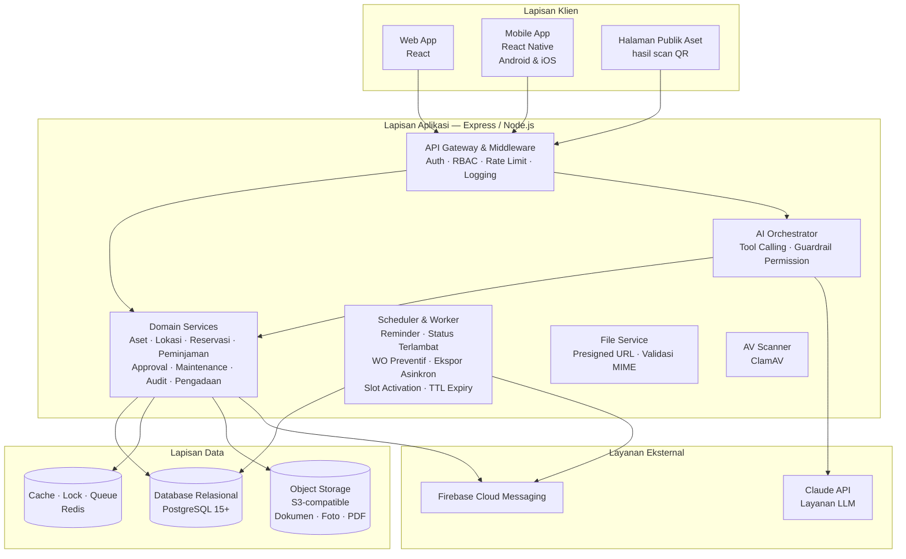
```mermaid
flowchart TB
    subgraph CLIENT["Lapisan Klien"]
        W["Web App<br/>React"]
        M["Mobile App<br/>React Native<br/>Android & iOS"]
        PUB["Halaman Publik Aset<br/>hasil scan QR"]
    end

    subgraph API["Lapisan Aplikasi — Express / Node.js"]
        GW["API Gateway & Middleware<br/>Auth · RBAC · Rate Limit · Logging"]
        SVC["Domain Services<br/>Aset · Lokasi · Reservasi · Peminjaman<br/>Approval · Maintenance · Audit · Pengadaan"]
        JOB["Scheduler & Worker<br/>Reminder · Status Terlambat<br/>WO Preventif · Ekspor Asinkron<br/>Slot Activation · TTL Expiry"]
        AI["AI Orchestrator<br/>Tool Calling · Guardrail Permission"]
        FILE["File Service<br/>Presigned URL · Validasi MIME"]
        AV["AV Scanner<br/>ClamAV"]
    end

    subgraph DATA["Lapisan Data"]
        DB[("Database Relasional<br/>PostgreSQL 15+")]
        CACHE[("Cache · Lock · Queue<br/>Redis")]
        OBJ[("Object Storage<br/>S3-compatible<br/>Dokumen · Foto · PDF")]
    end

    subgraph EXT["Layanan Eksternal"]
        FCM["Firebase Cloud Messaging"]
        LLM["Claude API<br/>Layanan LLM"]
    end

    W --> GW
    M --> GW
    PUB --> GW
    GW --> SVC
    SVC --> DB
    SVC --> CACHE
    SVC --> OBJ
    JOB --> DB
    JOB --> FCM
    SVC --> FCM
    GW --> AI
    AI --> SVC
    AI --> LLM
```

## 12.2 Alur Status Aset (State Diagram)

> **Penting (BR-005):** diagram ini menggambarkan **status operasional aset pada saat ini (*now*)**, bukan ketersediaannya di masa depan. Ketersediaan pada rentang tanggal dihitung dari `booking_slots` (Bab 26). Aset berstatus `Dipinjam` hari ini tetap dapat dipesan untuk minggu depan.

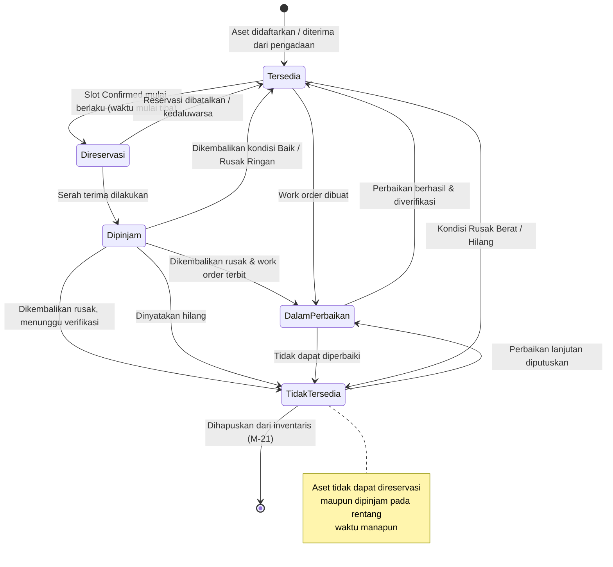
```mermaid
stateDiagram-v2
    [*] --> Tersedia: Aset didaftarkan / diterima dari pengadaan
    Tersedia --> Direservasi: Slot Confirmed mulai berlaku (waktu mulai tiba)
    Direservasi --> Tersedia: Reservasi dibatalkan / kedaluwarsa
    Direservasi --> Dipinjam: Serah terima dilakukan
    Dipinjam --> Tersedia: Dikembalikan kondisi Baik / Rusak Ringan
    Dipinjam --> DalamPerbaikan: Dikembalikan rusak & work order terbit
    Dipinjam --> TidakTersedia: Dikembalikan rusak, menunggu verifikasi
    Dipinjam --> TidakTersedia: Dinyatakan hilang
    Tersedia --> DalamPerbaikan: Work order dibuat
    DalamPerbaikan --> Tersedia: Perbaikan berhasil & diverifikasi
    DalamPerbaikan --> TidakTersedia: Tidak dapat diperbaiki
    Tersedia --> TidakTersedia: Kondisi Rusak Berat / Hilang
    TidakTersedia --> DalamPerbaikan: Perbaikan lanjutan diputuskan
    TidakTersedia --> [*]: Dihapuskan dari inventaris (M-21)

    note right of TidakTersedia
        Aset tidak dapat direservasi
        maupun dipinjam pada rentang
        waktu manapun
    end note
```

**Klarifikasi transisi `Dipinjam` → kondisi rusak (menyelesaikan ambiguitas FR-09.2 A1):**

| Situasi saat check-in | Status aset segera setelah check-in | Pemicu transisi berikutnya |
|---|---|---|
| Kondisi `Baik` / `Rusak Ringan` dan masih layak pakai | `Tersedia` | — |
| Kondisi `Rusak Ringan` namun perlu perbaikan, work order langsung dibuat | `Dalam Perbaikan` | Verifikasi work order (FR-12.4) |
| Kondisi `Rusak Berat` / `Tidak Lengkap`, work order belum dibuat | `Tidak Tersedia` | Pembuatan work order → `Dalam Perbaikan` |
| Dinyatakan `Hilang` | `Tidak Tersedia` | Rekonsiliasi opname atau berita acara (BR-012) |

Seluruh slot pemesanan mendatang atas aset yang berpindah ke `Dalam Perbaikan` atau `Tidak Tersedia` dibatalkan otomatis dan pemohonnya dinotifikasi (BR-048, NT-27).

## 12.3 Alur Status Pengajuan (State Diagram)

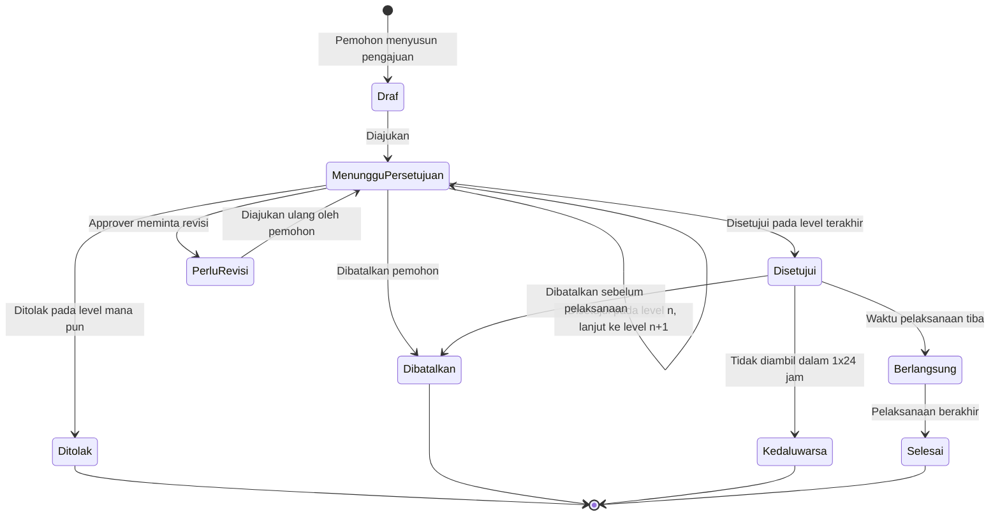
```mermaid
stateDiagram-v2
    [*] --> Draf: Pemohon menyusun pengajuan
    Draf --> MenungguPersetujuan: Diajukan
    MenungguPersetujuan --> MenungguPersetujuan: Disetujui pada level n, lanjut ke level n+1
    MenungguPersetujuan --> Disetujui: Disetujui pada level terakhir
    MenungguPersetujuan --> Ditolak: Ditolak pada level mana pun
    MenungguPersetujuan --> PerluRevisi: Approver meminta revisi
    PerluRevisi --> MenungguPersetujuan: Diajukan ulang oleh pemohon
    MenungguPersetujuan --> Dibatalkan: Dibatalkan pemohon
    Disetujui --> Dibatalkan: Dibatalkan sebelum pelaksanaan
    Disetujui --> Kedaluwarsa: Tidak diambil dalam 1x24 jam
    Disetujui --> Berlangsung: Waktu pelaksanaan tiba
    Berlangsung --> Selesai: Pelaksanaan berakhir
    Ditolak --> [*]
    Dibatalkan --> [*]
    Kedaluwarsa --> [*]
    Selesai --> [*]
```

## 12.4 Alur Kerja Harian Sistem (Scheduled Jobs)

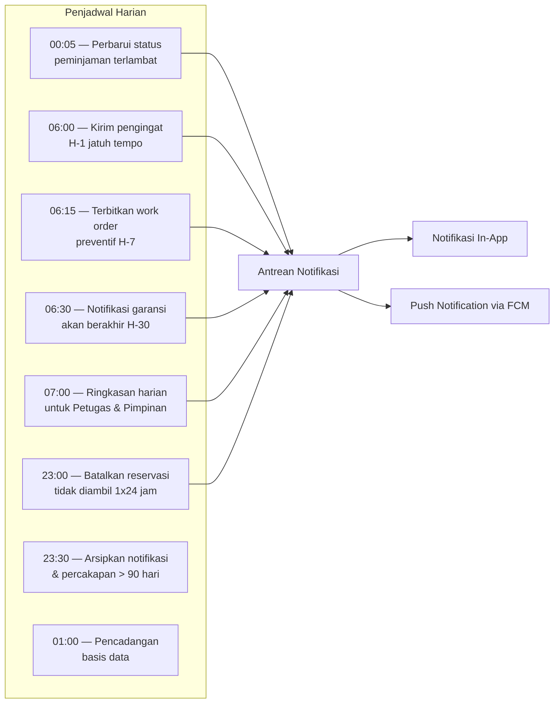
```mermaid
flowchart LR
    subgraph SCH["Penjadwal Harian"]
        J1["00:05 — Perbarui status<br/>peminjaman terlambat"]
        J2["06:00 — Kirim pengingat<br/>H-1 jatuh tempo"]
        J3["06:15 — Terbitkan work order<br/>preventif H-7"]
        J4["06:30 — Notifikasi garansi<br/>akan berakhir H-30"]
        J5["07:00 — Ringkasan harian<br/>untuk Petugas & Pimpinan"]
        J6["23:00 — Batalkan reservasi<br/>tidak diambil 1x24 jam"]
        J7["23:30 — Arsipkan notifikasi<br/>& percakapan > 90 hari"]
        J8["01:00 — Pencadangan<br/>basis data"]
    end

    J1 --> N["Antrean Notifikasi"]
    J2 --> N
    J3 --> N
    J4 --> N
    J5 --> N
    J6 --> N
    N --> INAPP["Notifikasi In-App"]
    N --> PUSH["Push Notification via FCM"]
```

---

# 13. Process Flow

## 13.1 Process Flow — Reservasi & Peminjaman Barang

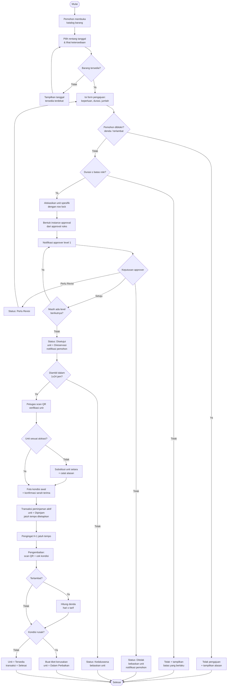
```mermaid
flowchart TD
    A([Mulai]) --> B["Pemohon membuka<br/>katalog barang"]
    B --> C["Pilih rentang tanggal<br/>& lihat ketersediaan"]
    C --> D{Barang tersedia?}
    D -->|Tidak| E["Tampilkan tanggal<br/>tersedia terdekat"] --> C
    D -->|Ya| F["Isi form pengajuan:<br/>keperluan, durasi, jumlah"]
    F --> G{"Pemohon diblokir?<br/>denda / terlambat"}
    G -->|Ya| H["Tolak pengajuan<br/>+ tampilkan alasan"] --> Z([Selesai])
    G -->|Tidak| I{"Durasi ≤ batas role?"}
    I -->|Tidak| J["Tolak + tampilkan<br/>batas yang berlaku"] --> Z
    I -->|Ya| K["Alokasikan unit spesifik<br/>dengan row lock"]
    K --> L["Bentuk instance approval<br/>dari approval rules"]
    L --> M["Notifikasi approver level 1"]
    M --> N{Keputusan approver}
    N -->|Tolak| O["Status: Ditolak<br/>bebaskan unit<br/>notifikasi pemohon"] --> Z
    N -->|Perlu Revisi| P["Status: Perlu Revisi"] --> F
    N -->|Setuju| Q{Masih ada level<br/>berikutnya?}
    Q -->|Ya| M
    Q -->|Tidak| R["Status: Disetujui<br/>unit = Direservasi<br/>notifikasi pemohon"]
    R --> S{"Diambil dalam<br/>1x24 jam?"}
    S -->|Tidak| T["Status: Kedaluwarsa<br/>bebaskan unit"] --> Z
    S -->|Ya| U["Petugas scan QR<br/>verifikasi unit"]
    U --> V{Unit sesuai alokasi?}
    V -->|Tidak| W["Substitusi unit setara<br/>+ catat alasan"] --> X
    V -->|Ya| X["Foto kondisi awal<br/>+ konfirmasi serah terima"]
    X --> Y["Transaksi peminjaman aktif<br/>unit = Dipinjam<br/>jatuh tempo ditetapkan"]
    Y --> AA["Pengingat H-1 jatuh tempo"]
    AA --> AB["Pengembalian:<br/>scan QR + cek kondisi"]
    AB --> AC{Terlambat?}
    AC -->|Ya| AD["Hitung denda<br/>hari x tarif"] --> AE
    AC -->|Tidak| AE{Kondisi rusak?}
    AE -->|Ya| AF["Buat tiket kerusakan<br/>unit = Dalam Perbaikan"] --> Z
    AE -->|Tidak| AG["Unit = Tersedia<br/>transaksi = Selesai"] --> Z
```

## 13.2 Process Flow — Laporan Kerusakan hingga Work Order Selesai

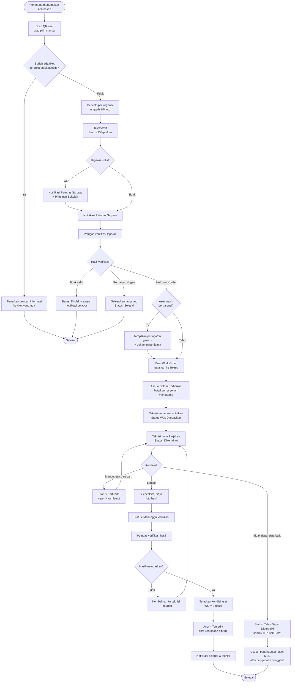
```mermaid
flowchart TD
    A([Pengguna menemukan kerusakan]) --> B["Scan QR aset<br/>atau pilih manual"]
    B --> C{"Sudah ada tiket<br/>terbuka untuk aset ini?"}
    C -->|Ya| D["Tawarkan tambah informasi<br/>ke tiket yang ada"] --> Z1([Selesai])
    C -->|Tidak| E["Isi deskripsi, urgensi,<br/>unggah 1-5 foto"]
    E --> F["Tiket terbit<br/>Status: Dilaporkan"]
    F --> G{Urgensi Kritis?}
    G -->|Ya| H["Notifikasi Petugas Sarpras<br/>+ Pimpinan Sekolah"] --> I
    G -->|Tidak| I["Notifikasi Petugas Sarpras"]
    I --> J["Petugas verifikasi laporan"]
    J --> K{Hasil verifikasi}
    K -->|Tidak valid| L["Status: Ditolak + alasan<br/>notifikasi pelapor"] --> Z1
    K -->|Perbaikan ringan| M["Selesaikan langsung<br/>Status: Selesai"] --> Z1
    K -->|Perlu work order| N{"Aset masih<br/>bergaransi?"}
    N -->|Ya| O["Tampilkan peringatan garansi<br/>+ dokumen penjamin"] --> P
    N -->|Tidak| P["Buat Work Order<br/>tugaskan ke Teknisi"]
    P --> Q["Aset = Dalam Perbaikan<br/>batalkan reservasi mendatang"]
    Q --> R["Teknisi menerima notifikasi<br/>Status WO: Ditugaskan"]
    R --> S["Teknisi mulai kerjakan<br/>Status: Dikerjakan"]
    S --> T{Kendala?}
    T -->|Menunggu sparepart| U["Status: Tertunda<br/>+ perkiraan lanjut"] --> S
    T -->|Tidak dapat diperbaiki| V["Status: Tidak Dapat Diperbaiki<br/>kondisi = Rusak Berat"]
    T -->|Lancar| X["Isi checklist, biaya,<br/>foto hasil"]
    X --> Y["Status: Menunggu Verifikasi"]
    Y --> AA["Petugas verifikasi hasil"]
    AA --> AB{Hasil memuaskan?}
    AB -->|Tidak| AC["Kembalikan ke teknisi<br/>+ catatan"] --> S
    AB -->|Ya| AD["Tetapkan kondisi aset<br/>WO = Selesai"]
    AD --> AE["Aset = Tersedia<br/>tiket kerusakan ditutup"]
    AE --> AF["Notifikasi pelapor & teknisi"] --> Z2([Selesai])
    V --> W["Usulan penghapusan aset M-21<br/>atau pengadaan pengganti"] --> Z2
```

## 13.3 Process Flow — Stock Opname

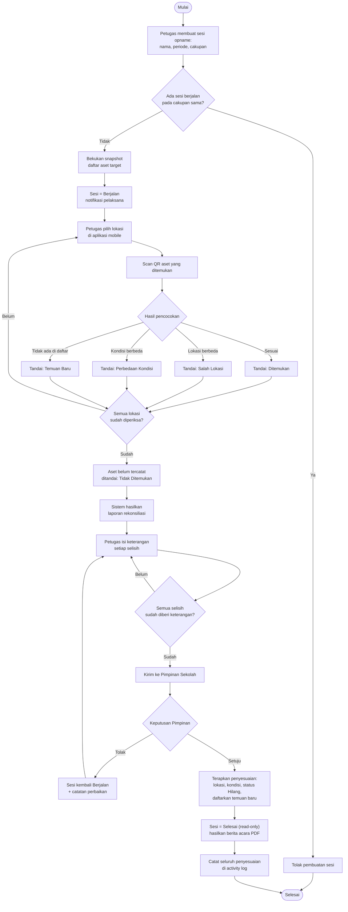
```mermaid
flowchart TD
    A([Mulai]) --> B["Petugas membuat sesi opname:<br/>nama, periode, cakupan"]
    B --> C{"Ada sesi berjalan<br/>pada cakupan sama?"}
    C -->|Ya| D["Tolak pembuatan sesi"] --> Z([Selesai])
    C -->|Tidak| E["Bekukan snapshot<br/>daftar aset target"]
    E --> F["Sesi = Berjalan<br/>notifikasi pelaksana"]
    F --> G["Petugas pilih lokasi<br/>di aplikasi mobile"]
    G --> H["Scan QR aset yang ditemukan"]
    H --> I{Hasil pencocokan}
    I -->|Sesuai| J["Tandai: Ditemukan"]
    I -->|Lokasi berbeda| K["Tandai: Salah Lokasi"]
    I -->|Kondisi berbeda| L["Tandai: Perbedaan Kondisi"]
    I -->|Tidak ada di daftar| M["Tandai: Temuan Baru"]
    J --> N
    K --> N
    L --> N
    M --> N{"Semua lokasi<br/>sudah diperiksa?"}
    N -->|Belum| G
    N -->|Sudah| O["Aset belum tercatat<br/>ditandai: Tidak Ditemukan"]
    O --> P["Sistem hasilkan<br/>laporan rekonsiliasi"]
    P --> Q["Petugas isi keterangan<br/>setiap selisih"]
    Q --> R{"Semua selisih<br/>sudah diberi keterangan?"}
    R -->|Belum| Q
    R -->|Sudah| S["Kirim ke Pimpinan Sekolah"]
    S --> T{Keputusan Pimpinan}
    T -->|Tolak| U["Sesi kembali Berjalan<br/>+ catatan perbaikan"] --> Q
    T -->|Setuju| V["Terapkan penyesuaian:<br/>lokasi, kondisi, status Hilang,<br/>daftarkan temuan baru"]
    V --> W["Sesi = Selesai (read-only)<br/>hasilkan berita acara PDF"]
    W --> X["Catat seluruh penyesuaian<br/>di activity log"] --> Z
```

## 13.4 Process Flow — Pengadaan Barang

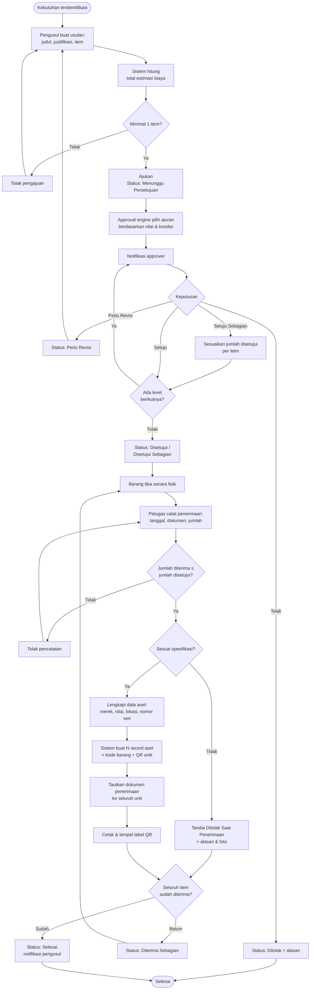
```mermaid
flowchart TD
    A([Kebutuhan teridentifikasi]) --> B["Pengusul buat usulan:<br/>judul, justifikasi, item"]
    B --> C["Sistem hitung<br/>total estimasi biaya"]
    C --> D{"Minimal 1 item?"}
    D -->|Tidak| E["Tolak pengajuan"] --> B
    D -->|Ya| F["Ajukan<br/>Status: Menunggu Persetujuan"]
    F --> G["Approval engine pilih aturan<br/>berdasarkan nilai & kondisi"]
    G --> H["Notifikasi approver"]
    H --> I{Keputusan}
    I -->|Tolak| J["Status: Ditolak + alasan"] --> Z([Selesai])
    I -->|Perlu Revisi| K["Status: Perlu Revisi"] --> B
    I -->|Setuju Sebagian| L["Sesuaikan jumlah disetujui<br/>per item"] --> M
    I -->|Setuju| M{"Ada level<br/>berikutnya?"}
    M -->|Ya| H
    M -->|Tidak| N["Status: Disetujui /<br/>Disetujui Sebagian"]
    N --> O["Barang tiba secara fisik"]
    O --> P["Petugas catat penerimaan:<br/>tanggal, dokumen, jumlah"]
    P --> Q{"Jumlah diterima ≤<br/>jumlah disetujui?"}
    Q -->|Tidak| R["Tolak pencatatan"] --> P
    Q -->|Ya| S{"Sesuai spesifikasi?"}
    S -->|Tidak| T["Tandai Ditolak Saat Penerimaan<br/>+ alasan & foto"] --> U
    S -->|Ya| V["Lengkapi data aset:<br/>merek, nilai, lokasi, nomor seri"]
    V --> W["Sistem buat N record aset<br/>+ kode barang + QR unik"]
    W --> X["Tautkan dokumen penerimaan<br/>ke seluruh unit"]
    X --> Y["Cetak & tempel label QR"]
    Y --> U{"Seluruh item<br/>sudah diterima?"}
    U -->|Belum| AA["Status: Diterima Sebagian"] --> O
    U -->|Sudah| AB["Status: Selesai<br/>notifikasi pengusul"] --> Z
```

---

# 14. Use Case Diagram

## 14.1 Use Case Keseluruhan


```mermaid
flowchart LR
    ADM(("Administrator"))
    SAR(("Petugas<br/>Sarpras"))
    PIM(("Pimpinan<br/>Sekolah"))
    TEK(("Teknisi"))
    GUR(("Guru"))
    STF(("Staf / TU"))
    SIS(("Siswa /<br/>OSIS"))

    subgraph SISTEM["Sistem SIGM4"]
        UC01["Kelola User & Role"]
        UC02["Konfigurasi Approval Rules"]
        UC03["Konfigurasi Parameter Sistem"]
        UC04["Lihat Activity Log"]
        UC05["Kelola Lokasi"]
        UC06["Kelola Inventaris Aset"]
        UC07["Cetak & Kelola QR Code"]
        UC08["Kelola Dokumen Aset"]
        UC09["Scan QR Aset"]
        UC10["Ajukan Reservasi Ruangan"]
        UC11["Ajukan Reservasi Barang"]
        UC12["Setujui / Tolak Pengajuan"]
        UC13["Proses Serah Terima"]
        UC14["Proses Pengembalian"]
        UC15["Kelola Denda"]
        UC16["Lapor Kerusakan"]
        UC17["Verifikasi Laporan Kerusakan"]
        UC18["Kelola Work Order"]
        UC19["Eksekusi Work Order"]
        UC20["Jalankan Stock Opname"]
        UC21["Setujui Hasil Opname"]
        UC22["Ajukan Usulan Pengadaan"]
        UC23["Catat Penerimaan Barang"]
        UC24["Lihat Dashboard"]
        UC25["Lihat Statistik & Analitik"]
        UC26["Gunakan Chatbot AI"]
        UC27["Kelola Notifikasi Pribadi"]
    end

    ADM --- UC01
    ADM --- UC02
    ADM --- UC03
    ADM --- UC04
    ADM --- UC24

    SAR --- UC05
    SAR --- UC06
    SAR --- UC07
    SAR --- UC08
    SAR --- UC09
    SAR --- UC12
    SAR --- UC13
    SAR --- UC14
    SAR --- UC15
    SAR --- UC17
    SAR --- UC18
    SAR --- UC20
    SAR --- UC23
    SAR --- UC24
    SAR --- UC25

    PIM --- UC12
    PIM --- UC21
    PIM --- UC24
    PIM --- UC25
    PIM --- UC04

    TEK --- UC09
    TEK --- UC16
    TEK --- UC19
    TEK --- UC24

    GUR --- UC09
    GUR --- UC10
    GUR --- UC11
    GUR --- UC16
    GUR --- UC22
    GUR --- UC24
    GUR --- UC26
    GUR --- UC27

    STF --- UC09
    STF --- UC10
    STF --- UC11
    STF --- UC16
    STF --- UC22
    STF --- UC26
    STF --- UC27

    SIS --- UC09
    SIS --- UC10
    SIS --- UC11
    SIS --- UC16
    SIS --- UC26
    SIS --- UC27
```

## 14.2 Use Case Modul Peminjaman (Detail Relasi)

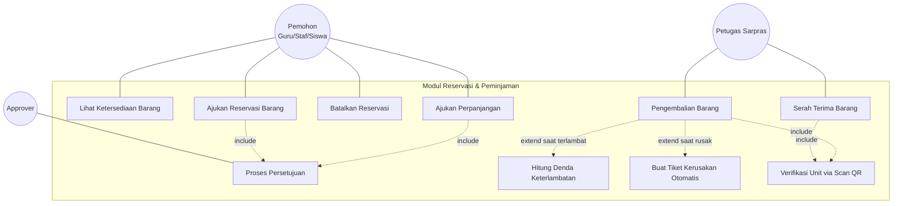
```mermaid
flowchart TB
    PEM(("Pemohon<br/>Guru/Staf/Siswa"))
    SAR(("Petugas Sarpras"))
    APP(("Approver"))

    subgraph MOD["Modul Reservasi & Peminjaman"]
        A["Lihat Ketersediaan Barang"]
        B["Ajukan Reservasi Barang"]
        C["Batalkan Reservasi"]
        D["Proses Persetujuan"]
        E["Serah Terima Barang"]
        F["Pengembalian Barang"]
        G["Hitung Denda Keterlambatan"]
        H["Buat Tiket Kerusakan Otomatis"]
        I["Verifikasi Unit via Scan QR"]
        J["Ajukan Perpanjangan"]
    end

    PEM --- A
    PEM --- B
    PEM --- C
    PEM --- J
    APP --- D
    SAR --- E
    SAR --- F

    B -.->|include| D
    E -.->|include| I
    F -.->|include| I
    F -.->|extend saat terlambat| G
    F -.->|extend saat rusak| H
    J -.->|include| D
```

---

# 15. Sequence Diagram

## 15.1 Login dengan 2FA

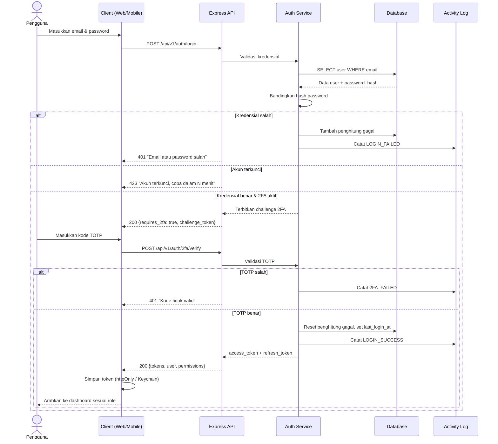
```mermaid
sequenceDiagram
    actor U as Pengguna
    participant C as Client (Web/Mobile)
    participant API as Express API
    participant AUTH as Auth Service
    participant DB as Database
    participant LOG as Activity Log

    U->>C: Masukkan email & password
    C->>API: POST /api/v1/auth/login
    API->>AUTH: Validasi kredensial
    AUTH->>DB: SELECT user WHERE email
    DB-->>AUTH: Data user + password_hash
    AUTH->>AUTH: Bandingkan hash password

    alt Kredensial salah
        AUTH->>DB: Tambah penghitung gagal
        AUTH->>LOG: Catat LOGIN_FAILED
        API-->>C: 401 "Email atau password salah"
    else Akun terkunci
        API-->>C: 423 "Akun terkunci, coba dalam N menit"
    else Kredensial benar & 2FA aktif
        AUTH-->>API: Terbitkan challenge 2FA
        API-->>C: 200 {requires_2fa: true, challenge_token}
        U->>C: Masukkan kode TOTP
        C->>API: POST /api/v1/auth/2fa/verify
        API->>AUTH: Validasi TOTP
        alt TOTP salah
            AUTH->>LOG: Catat 2FA_FAILED
            API-->>C: 401 "Kode tidak valid"
        else TOTP benar
            AUTH->>DB: Reset penghitung gagal, set last_login_at
            AUTH->>LOG: Catat LOGIN_SUCCESS
            AUTH-->>API: access_token + refresh_token
            API-->>C: 200 {tokens, user, permissions}
            C->>C: Simpan token (httpOnly / Keychain)
            C-->>U: Arahkan ke dashboard sesuai role
        end
    end
```

## 15.2 Pengajuan Reservasi dengan Approval Berjenjang

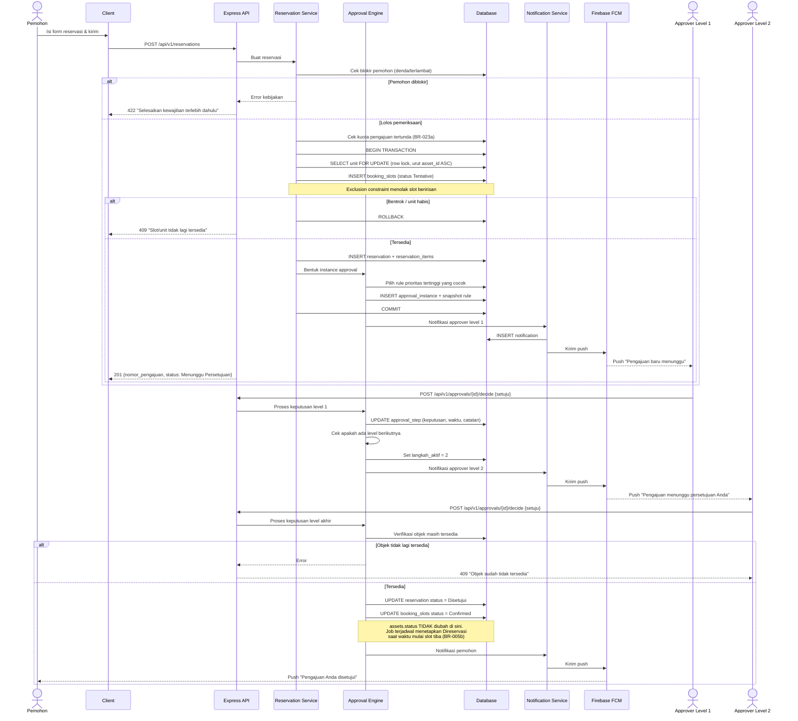
```mermaid
sequenceDiagram
    actor P as Pemohon
    participant C as Client
    participant API as Express API
    participant RES as Reservation Service
    participant APR as Approval Engine
    participant DB as Database
    participant NOTIF as Notification Service
    participant FCM as Firebase FCM
    actor A1 as Approver Level 1
    actor A2 as Approver Level 2

    P->>C: Isi form reservasi & kirim
    C->>API: POST /api/v1/reservations
    API->>RES: Buat reservasi
    RES->>DB: Cek blokir pemohon (denda/terlambat)

    alt Pemohon diblokir
        RES-->>API: Error kebijakan
        API-->>C: 422 "Selesaikan kewajiban terlebih dahulu"
    else Lolos pemeriksaan
        RES->>DB: Cek kuota pengajuan tertunda (BR-023a)
        RES->>DB: BEGIN TRANSACTION
        RES->>DB: SELECT unit FOR UPDATE (row lock, urut asset_id ASC)
        RES->>DB: INSERT booking_slots (status Tentative)
        note over RES,DB: Exclusion constraint menolak slot beririsan
        alt Bentrok / unit habis
            RES->>DB: ROLLBACK
            API-->>C: 409 "Slot/unit tidak lagi tersedia"
        else Tersedia
            RES->>DB: INSERT reservation + reservation_items
            RES->>APR: Bentuk instance approval
            APR->>DB: Pilih rule prioritas tertinggi yang cocok
            APR->>DB: INSERT approval_instance + snapshot rule
            RES->>DB: COMMIT
            APR->>NOTIF: Notifikasi approver level 1
            NOTIF->>DB: INSERT notification
            NOTIF->>FCM: Kirim push
            FCM-->>A1: Push "Pengajuan baru menunggu"
            API-->>C: 201 {nomor_pengajuan, status: Menunggu Persetujuan}
        end
    end

    A1->>API: POST /api/v1/approvals/{id}/decide {setuju}
    API->>APR: Proses keputusan level 1
    APR->>DB: UPDATE approval_step (keputusan, waktu, catatan)
    APR->>APR: Cek apakah ada level berikutnya
    APR->>DB: Set langkah_aktif = 2
    APR->>NOTIF: Notifikasi approver level 2
    NOTIF->>FCM: Kirim push
    FCM-->>A2: Push "Pengajuan menunggu persetujuan Anda"

    A2->>API: POST /api/v1/approvals/{id}/decide {setuju}
    API->>APR: Proses keputusan level akhir
    APR->>DB: Verifikasi objek masih tersedia
    alt Objek tidak lagi tersedia
        APR-->>API: Error
        API-->>A2: 409 "Objek sudah tidak tersedia"
    else Tersedia
        APR->>DB: UPDATE reservation status = Disetujui
        APR->>DB: UPDATE booking_slots status = Confirmed
        note over APR,DB: assets.status TIDAK diubah di sini.<br/>Job terjadwal menetapkan Direservasi<br/>saat waktu mulai slot tiba (BR-005b)
        APR->>NOTIF: Notifikasi pemohon
        NOTIF->>FCM: Kirim push
        FCM-->>P: Push "Pengajuan Anda disetujui"
    end
```

## 15.3 Serah Terima Peminjaman via Scan QR

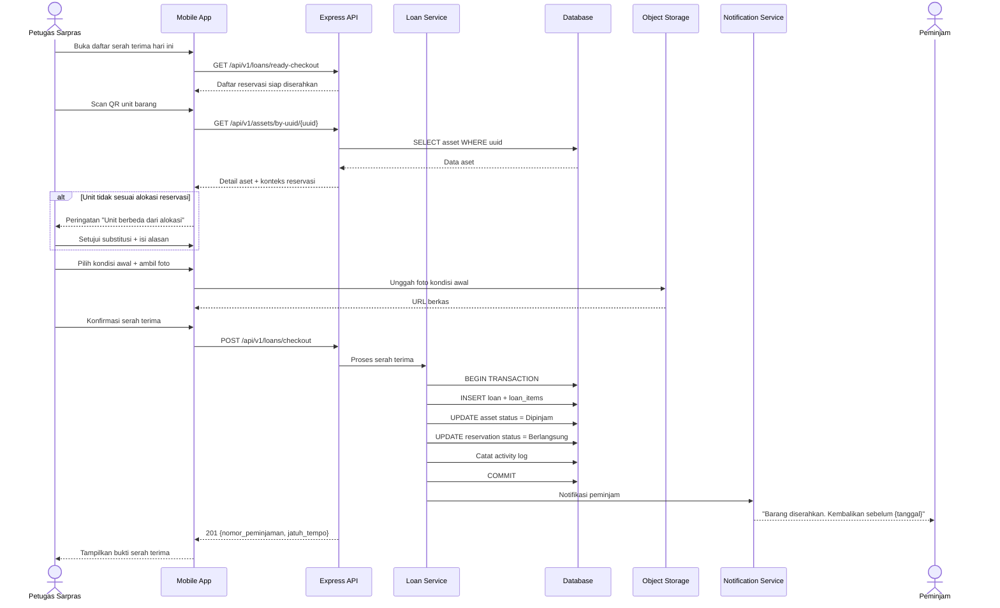
```mermaid
sequenceDiagram
    actor S as Petugas Sarpras
    participant M as Mobile App
    participant API as Express API
    participant LOAN as Loan Service
    participant DB as Database
    participant OBJ as Object Storage
    participant NOTIF as Notification Service
    actor P as Peminjam

    S->>M: Buka daftar serah terima hari ini
    M->>API: GET /api/v1/loans/ready-checkout
    API-->>M: Daftar reservasi siap diserahkan

    S->>M: Scan QR unit barang
    M->>API: GET /api/v1/assets/by-uuid/{uuid}
    API->>DB: SELECT asset WHERE uuid
    DB-->>API: Data aset
    API-->>M: Detail aset + konteks reservasi

    alt Unit tidak sesuai alokasi reservasi
        M-->>S: Peringatan "Unit berbeda dari alokasi"
        S->>M: Setujui substitusi + isi alasan
    end

    S->>M: Pilih kondisi awal + ambil foto
    M->>OBJ: Unggah foto kondisi awal
    OBJ-->>M: URL berkas
    S->>M: Konfirmasi serah terima
    M->>API: POST /api/v1/loans/checkout
    API->>LOAN: Proses serah terima
    LOAN->>DB: BEGIN TRANSACTION
    LOAN->>DB: INSERT loan + loan_items
    LOAN->>DB: UPDATE asset status = Dipinjam
    LOAN->>DB: UPDATE reservation status = Berlangsung
    LOAN->>DB: Catat activity log
    LOAN->>DB: COMMIT
    LOAN->>NOTIF: Notifikasi peminjam
    NOTIF-->>P: "Barang diserahkan. Kembalikan sebelum {tanggal}"
    API-->>M: 201 {nomor_peminjaman, jatuh_tempo}
    M-->>S: Tampilkan bukti serah terima
```

## 15.4 Pengembalian dengan Perhitungan Denda

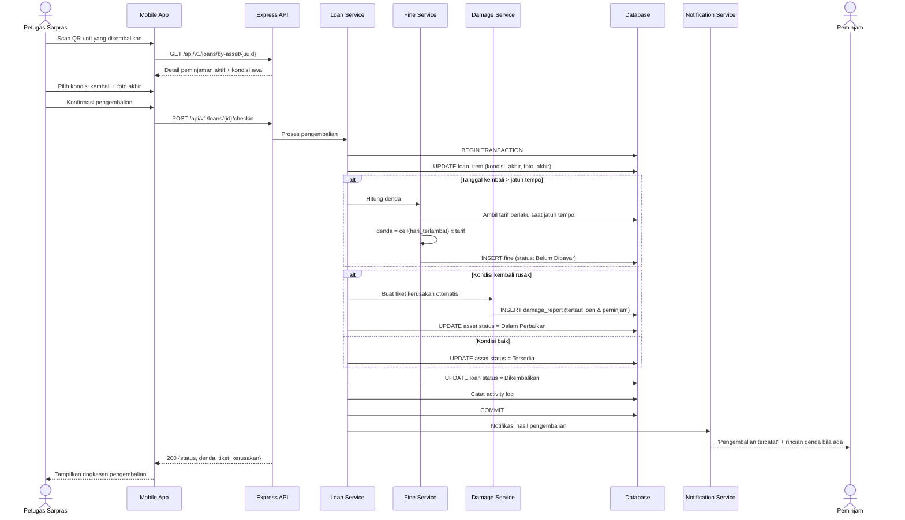
```mermaid
sequenceDiagram
    actor S as Petugas Sarpras
    participant M as Mobile App
    participant API as Express API
    participant LOAN as Loan Service
    participant FINE as Fine Service
    participant DMG as Damage Service
    participant DB as Database
    participant NOTIF as Notification Service
    actor P as Peminjam

    S->>M: Scan QR unit yang dikembalikan
    M->>API: GET /api/v1/loans/by-asset/{uuid}
    API-->>M: Detail peminjaman aktif + kondisi awal

    S->>M: Pilih kondisi kembali + foto akhir
    S->>M: Konfirmasi pengembalian
    M->>API: POST /api/v1/loans/{id}/checkin
    API->>LOAN: Proses pengembalian
    LOAN->>DB: BEGIN TRANSACTION
    LOAN->>DB: UPDATE loan_item (kondisi_akhir, foto_akhir)

    alt Tanggal kembali > jatuh tempo
        LOAN->>FINE: Hitung denda
        FINE->>DB: Ambil tarif berlaku saat jatuh tempo
        FINE->>FINE: denda = ceil(hari_terlambat) x tarif
        FINE->>DB: INSERT fine (status: Belum Dibayar)
    end

    alt Kondisi kembali rusak
        LOAN->>DMG: Buat tiket kerusakan otomatis
        DMG->>DB: INSERT damage_report (tertaut loan & peminjam)
        LOAN->>DB: UPDATE asset status = Dalam Perbaikan
    else Kondisi baik
        LOAN->>DB: UPDATE asset status = Tersedia
    end

    LOAN->>DB: UPDATE loan status = Dikembalikan
    LOAN->>DB: Catat activity log
    LOAN->>DB: COMMIT
    LOAN->>NOTIF: Notifikasi hasil pengembalian
    NOTIF-->>P: "Pengembalian tercatat" + rincian denda bila ada
    API-->>M: 200 {status, denda, tiket_kerusakan}
    M-->>S: Tampilkan ringkasan pengembalian
```

## 15.5 Laporan Kerusakan hingga Work Order

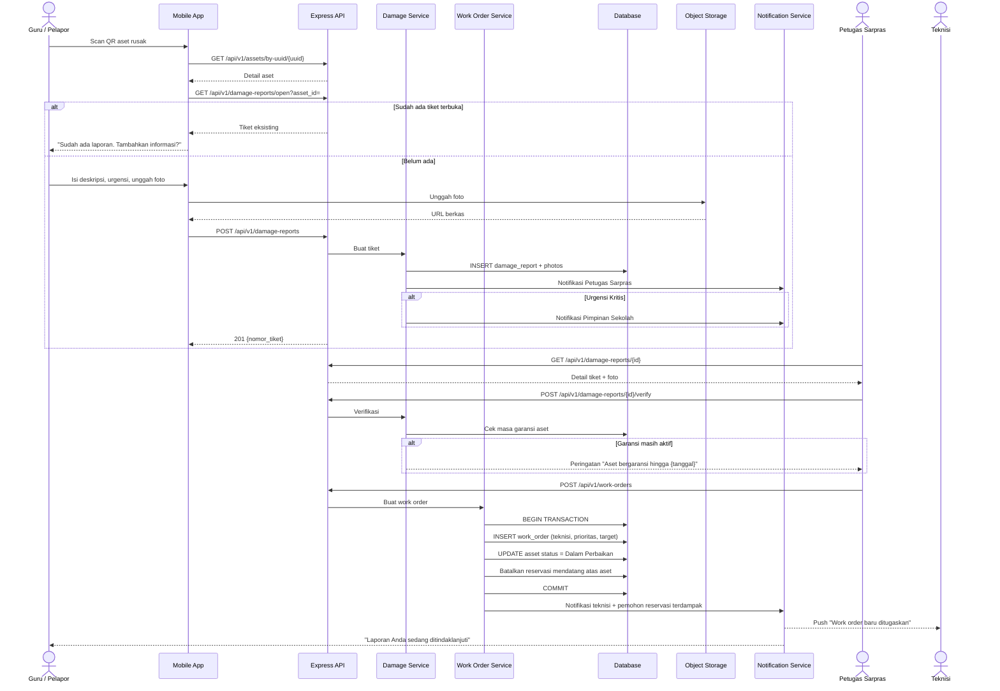
```mermaid
sequenceDiagram
    actor G as Guru / Pelapor
    participant M as Mobile App
    participant API as Express API
    participant DMG as Damage Service
    participant WO as Work Order Service
    participant DB as Database
    participant OBJ as Object Storage
    participant NOTIF as Notification Service
    actor S as Petugas Sarpras
    actor T as Teknisi

    G->>M: Scan QR aset rusak
    M->>API: GET /api/v1/assets/by-uuid/{uuid}
    API-->>M: Detail aset
    M->>API: GET /api/v1/damage-reports/open?asset_id=
    alt Sudah ada tiket terbuka
        API-->>M: Tiket eksisting
        M-->>G: "Sudah ada laporan. Tambahkan informasi?"
    else Belum ada
        G->>M: Isi deskripsi, urgensi, unggah foto
        M->>OBJ: Unggah foto
        OBJ-->>M: URL berkas
        M->>API: POST /api/v1/damage-reports
        API->>DMG: Buat tiket
        DMG->>DB: INSERT damage_report + photos
        DMG->>NOTIF: Notifikasi Petugas Sarpras
        alt Urgensi Kritis
            DMG->>NOTIF: Notifikasi Pimpinan Sekolah
        end
        API-->>M: 201 {nomor_tiket}
    end

    S->>API: GET /api/v1/damage-reports/{id}
    API-->>S: Detail tiket + foto
    S->>API: POST /api/v1/damage-reports/{id}/verify
    API->>DMG: Verifikasi
    DMG->>DB: Cek masa garansi aset
    alt Garansi masih aktif
        DMG-->>S: Peringatan "Aset bergaransi hingga {tanggal}"
    end
    S->>API: POST /api/v1/work-orders
    API->>WO: Buat work order
    WO->>DB: BEGIN TRANSACTION
    WO->>DB: INSERT work_order (teknisi, prioritas, target)
    WO->>DB: UPDATE asset status = Dalam Perbaikan
    WO->>DB: Batalkan reservasi mendatang atas aset
    WO->>DB: COMMIT
    WO->>NOTIF: Notifikasi teknisi + pemohon reservasi terdampak
    NOTIF-->>T: Push "Work order baru ditugaskan"
    NOTIF-->>G: "Laporan Anda sedang ditindaklanjuti"
```

## 15.6 Percakapan Chatbot AI dengan Tool Calling

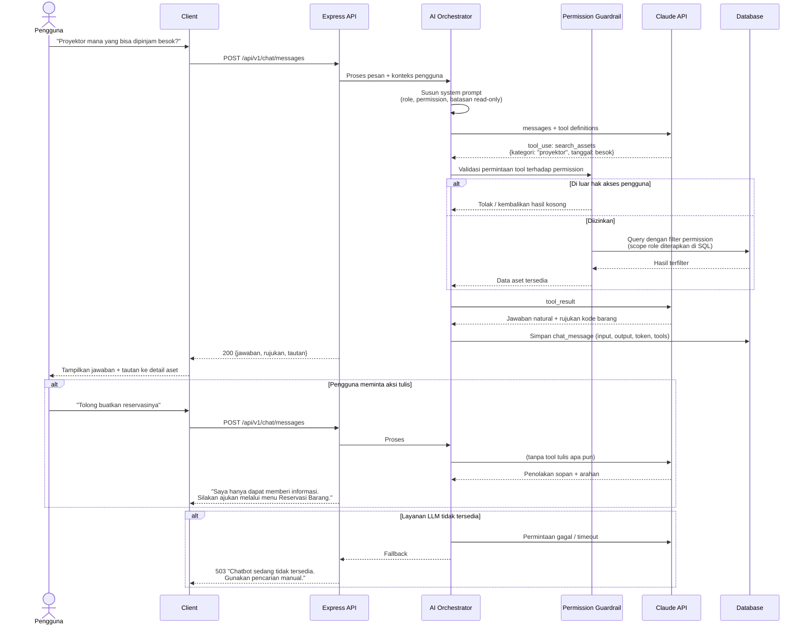
```mermaid
sequenceDiagram
    actor U as Pengguna
    participant C as Client
    participant API as Express API
    participant AI as AI Orchestrator
    participant GUARD as Permission Guardrail
    participant LLM as Claude API
    participant DB as Database

    U->>C: "Proyektor mana yang bisa dipinjam besok?"
    C->>API: POST /api/v1/chat/messages
    API->>AI: Proses pesan + konteks pengguna
    AI->>AI: Susun system prompt<br/>(role, permission, batasan read-only)
    AI->>LLM: messages + tool definitions
    LLM-->>AI: tool_use: search_assets<br/>{kategori: "proyektor", tanggal: besok}

    AI->>GUARD: Validasi permintaan tool terhadap permission
    alt Di luar hak akses pengguna
        GUARD-->>AI: Tolak / kembalikan hasil kosong
    else Diizinkan
        GUARD->>DB: Query dengan filter permission<br/>(scope role diterapkan di SQL)
        DB-->>GUARD: Hasil terfilter
        GUARD-->>AI: Data aset tersedia
    end

    AI->>LLM: tool_result
    LLM-->>AI: Jawaban natural + rujukan kode barang
    AI->>DB: Simpan chat_message (input, output, token, tools)
    API-->>C: 200 {jawaban, rujukan, tautan}
    C-->>U: Tampilkan jawaban + tautan ke detail aset

    alt Pengguna meminta aksi tulis
        U->>C: "Tolong buatkan reservasinya"
        C->>API: POST /api/v1/chat/messages
        API->>AI: Proses
        AI->>LLM: (tanpa tool tulis apa pun)
        LLM-->>AI: Penolakan sopan + arahan
        API-->>C: "Saya hanya dapat memberi informasi.<br/>Silakan ajukan melalui menu Reservasi Barang."
    end

    alt Layanan LLM tidak tersedia
        AI->>LLM: Permintaan gagal / timeout
        AI-->>API: Fallback
        API-->>C: 503 "Chatbot sedang tidak tersedia.<br/>Gunakan pencarian manual."
    end
```

## 15.7 Stock Opname via Scan QR

```mermaid
sequenceDiagram
    actor S as Petugas Sarpras
    participant M as Mobile App
    participant API as Express API
    participant AUD as Audit Service
    participant DB as Database
    actor P as Pimpinan Sekolah

    S->>API: POST /api/v1/audit-sessions
    API->>AUD: Buat sesi
    AUD->>DB: Bekukan snapshot aset target
    AUD->>DB: INSERT audit_session + audit_items (status: belum diperiksa)
    API-->>S: 201 {sesi, jumlah_target}

    loop Untuk setiap lokasi dalam cakupan
        S->>M: Pilih lokasi
        M->>API: GET /api/v1/audit-sessions/{id}/items?room_id=
        API-->>M: Daftar aset target di lokasi

        loop Untuk setiap aset ditemukan
            S->>M: Scan QR
            M->>API: POST /api/v1/audit-sessions/{id}/scan
            API->>AUD: Cocokkan hasil pemindaian
            AUD->>DB: UPDATE audit_item (hasil, kondisi_aktual, lokasi_aktual)
            API-->>M: Status pencocokan (ditemukan / salah lokasi / temuan baru)
        end

        S->>API: POST /api/v1/audit-sessions/{id}/complete-location
    end

    S->>API: POST /api/v1/audit-sessions/{id}/finalize
    API->>AUD: Hasilkan rekonsiliasi
    AUD->>DB: Tandai aset belum tercatat = Tidak Ditemukan
    AUD->>DB: Hitung ringkasan selisih
    API-->>S: Laporan rekonsiliasi
    S->>API: PUT keterangan setiap selisih
    S->>API: POST /api/v1/audit-sessions/{id}/submit
    API-->>P: Notifikasi "Laporan opname menunggu persetujuan"

    P->>API: POST /api/v1/audit-sessions/{id}/approve
    API->>AUD: Terapkan penyesuaian
    AUD->>DB: BEGIN TRANSACTION
    AUD->>DB: UPDATE lokasi aset (salah lokasi)
    AUD->>DB: UPDATE kondisi aset (perbedaan kondisi)
    AUD->>DB: SET kondisi = Hilang (tidak ditemukan)
    AUD->>DB: INSERT aset baru (temuan baru)
    AUD->>DB: UPDATE session status = Selesai
    AUD->>DB: Catat seluruh penyesuaian ke activity log
    AUD->>DB: COMMIT
    API-->>P: Berita acara PDF siap diunduh
```

---

# 16. Entity Relationship Overview

## 16.1 Penjelasan Entity Utama

| Entity | Peran dalam Sistem | Relasi Kunci |
|---|---|---|
| **users** | Pusat identitas seluruh aktor sistem | 1 user memiliki 1 role; menjadi pemohon reservasi, peminjam, pelapor, teknisi, dan approver |
| **roles / permissions** | Fondasi RBAC | Many-to-many melalui `role_permissions` |
| **buildings / areas / rooms** | Hierarki lokasi tempat aset ditempatkan dan ruangan yang direservasi | 1 building → N areas → N rooms; 1 room → N assets |
| **asset_categories** | Pengelompokan aset dan sumber parameter pemeliharaan | Self-referencing (parent-child); 1 category → N assets |
| **assets** | Entitas inti — satu record mewakili satu unit fisik dengan QR unik | Terhubung ke room, category, procurement, dan seluruh transaksi |
| **reservations / reservation_items** | Pemesanan ruangan atau unit barang | 1 reservation → N reservation_items → 1 asset |
| **loans / loan_items** | Realisasi peminjaman fisik | 1 reservation → 0..1 loan; 1 loan → N loan_items |
| **fines** | Konsekuensi finansial keterlambatan | 1 loan → 0..1 fine |
| **damage_reports** | Tiket kerusakan yang dilaporkan pengguna atau dihasilkan sistem | Terhubung ke asset atau room, dan opsional ke loan |
| **work_orders** | Perintah kerja pemeliharaan yang dikerjakan teknisi | 1 damage_report → 0..1 work_order; 1 work_order → N work_order_costs |
| **maintenance_schedules** | Sumber penerbitan work order preventif | 1 schedule → N work_orders |
| **audit_sessions / audit_items** | Sesi pemeriksaan fisik dan hasilnya per aset | 1 session → N items → 1 asset |
| **procurements / procurement_items** | Usulan pengadaan hingga penerimaan | 1 procurement → N items; 1 procurement → N assets hasil penerimaan |
| **approval_rules / approval_instances / approval_steps** | Mesin persetujuan lintas modul | 1 rule → N instances; 1 instance → N steps |
| **notifications / device_tokens** | Penyampaian informasi ke pengguna | 1 user → N notifications, N device_tokens |
| **activity_logs** | Jejak audit seluruh perubahan | Merujuk pengguna dan entitas mana pun secara polimorfik |
| **chat_sessions / chat_messages** | Riwayat interaksi dengan chatbot AI | 1 user → N sessions → N messages |

## 16.2 ER Diagram

```mermaid
erDiagram
    ROLES ||--o{ USERS : "dimiliki"
    ROLES ||--o{ ROLE_PERMISSIONS : "memiliki"
    PERMISSIONS ||--o{ ROLE_PERMISSIONS : "diberikan"

    BUILDINGS ||--o{ AREAS : "terdiri atas"
    AREAS ||--o{ ROOMS : "terdiri atas"
    ROOMS ||--o{ ASSETS : "menampung"

    ASSET_CATEGORIES ||--o{ ASSET_CATEGORIES : "subkategori"
    ASSET_CATEGORIES ||--o{ ASSETS : "mengelompokkan"

    ASSETS ||--o{ ASSET_DOCUMENTS : "memiliki"
    ASSETS ||--o{ ASSET_MOVEMENTS : "riwayat mutasi"
    ASSETS ||--o{ ASSET_CONDITION_HISTORY : "riwayat kondisi"

    USERS ||--o{ RESERVATIONS : "mengajukan"
    ROOMS ||--o{ RESERVATIONS : "dipesan pada"
    RESERVATIONS ||--o{ RESERVATION_ITEMS : "memuat"
    ASSETS ||--o{ RESERVATION_ITEMS : "dialokasikan"

    RESERVATIONS ||--o| LOANS : "direalisasikan"
    USERS ||--o{ LOANS : "meminjam"
    LOANS ||--o{ LOAN_ITEMS : "memuat"
    ASSETS ||--o{ LOAN_ITEMS : "dipinjam"
    LOAN_ITEMS ||--o{ FINES : "menimbulkan per unit"
    USERS ||--o{ FINES : "menanggung"

    USERS ||--o{ DAMAGE_REPORTS : "melaporkan"
    ASSETS ||--o{ DAMAGE_REPORTS : "dilaporkan rusak"
    ROOMS ||--o{ DAMAGE_REPORTS : "dilaporkan rusak"
    LOANS ||--o{ DAMAGE_REPORTS : "terkait"
    DAMAGE_REPORTS ||--o{ DAMAGE_REPORT_PHOTOS : "dilampiri"

    DAMAGE_REPORTS ||--o| WORK_ORDERS : "ditindaklanjuti"
    ASSETS ||--o{ WORK_ORDERS : "diperbaiki"
    USERS ||--o{ WORK_ORDERS : "dikerjakan teknisi"
    WORK_ORDERS ||--o{ WORK_ORDER_COSTS : "merinci biaya"
    MAINTENANCE_SCHEDULES ||--o{ WORK_ORDERS : "menerbitkan"
    ASSET_CATEGORIES ||--o{ MAINTENANCE_SCHEDULES : "menjadi dasar"

    USERS ||--o{ AUDIT_SESSIONS : "melaksanakan"
    AUDIT_SESSIONS ||--o{ AUDIT_ITEMS : "memeriksa"
    ASSETS ||--o{ AUDIT_ITEMS : "diperiksa"

    USERS ||--o{ PROCUREMENTS : "mengusulkan"
    PROCUREMENTS ||--o{ PROCUREMENT_ITEMS : "memuat"
    PROCUREMENTS ||--o{ PROCUREMENT_RECEIPTS : "diterima melalui"
    PROCUREMENTS ||--o{ ASSETS : "menghasilkan"

    ROOMS ||--o{ BOOKING_SLOTS : "dipesan melalui"
    ASSETS ||--o{ BOOKING_SLOTS : "dipesan melalui"
    RESERVATIONS ||--o{ BOOKING_SLOTS : "menghasilkan"

    USERS ||--o{ ASSET_DISPOSALS : "mengusulkan"
    ASSET_DISPOSALS ||--o{ ASSET_DISPOSAL_ITEMS : "memuat"
    ASSETS ||--o{ ASSET_DISPOSAL_ITEMS : "dihapuskan melalui"

    APPROVAL_RULES ||--o{ APPROVAL_RULE_STEPS : "terdiri atas"
    APPROVAL_RULES ||--o{ APPROVAL_INSTANCES : "menjadi acuan"
    APPROVAL_INSTANCES ||--o{ APPROVAL_STEPS : "memiliki"
    USERS ||--o{ APPROVAL_STEPS : "memutuskan"

    USERS ||--o{ NOTIFICATIONS : "menerima"
    USERS ||--o{ DEVICE_TOKENS : "mendaftarkan"
    USERS ||--o{ ACTIVITY_LOGS : "melakukan"
    USERS ||--o{ CHAT_SESSIONS : "memulai"
    CHAT_SESSIONS ||--o{ CHAT_MESSAGES : "berisi"

    USERS {
        bigint id PK
        string nama
        string email UK
        string password_hash
        string nip_nis UK
        bigint role_id FK
        string unit_kerja
        enum status
        boolean two_fa_enabled
        datetime last_login_at
    }

    ASSETS {
        bigint id PK
        uuid uuid UK
        string kode_barang UK
        string nama
        bigint category_id FK
        string merek
        string nomor_seri UK
        int tahun_perolehan
        decimal nilai_perolehan
        bigint room_id FK
        enum kondisi
        enum status
        boolean dapat_dipinjam
        boolean boleh_dipinjam_siswa
        bigint procurement_id FK
    }

    RESERVATIONS {
        bigint id PK
        string nomor UK
        enum jenis
        bigint pemohon_id FK
        bigint room_id FK
        datetime waktu_mulai
        datetime waktu_selesai
        int jumlah_peserta
        enum status
    }

    LOANS {
        bigint id PK
        string nomor UK
        bigint reservation_id FK
        bigint peminjam_id FK
        datetime tanggal_pinjam
        date tanggal_jatuh_tempo
        datetime tanggal_kembali
        enum status
    }

    FINES {
        bigint id PK
        bigint loan_item_id FK
        bigint loan_id FK
        bigint peminjam_id FK
        enum jenis
        int hari_terlambat
        decimal tarif_per_hari
        decimal jumlah_sebelum_cap
        decimal jumlah
        enum status
        date tanggal_bayar
    }

    BOOKING_SLOTS {
        bigint id PK
        enum resource_type
        bigint resource_id
        tstzrange slot_range
        enum status
        enum origin
        bigint reservation_id FK
        bigint loan_id FK
        bigint parent_slot_id FK
        datetime expires_at
    }

    ASSET_DISPOSALS {
        bigint id PK
        string nomor UK
        bigint pengusul_id FK
        enum alasan
        enum tindak_lanjut_fisik
        enum status
        bigint disetujui_oleh FK
        datetime dilaksanakan_pada
        string berita_acara_path
    }

    WORK_ORDERS {
        bigint id PK
        string nomor UK
        enum jenis
        bigint asset_id FK
        bigint damage_report_id FK
        bigint teknisi_id FK
        enum prioritas
        date target_selesai
        decimal biaya
        enum status
    }

    APPROVAL_INSTANCES {
        bigint id PK
        enum jenis_pengajuan
        bigint referensi_id
        bigint rule_id FK
        json rule_snapshot
        int langkah_aktif
        enum status
    }
```

---

# 17. API Requirements

## 17.1 Ketentuan Umum

| Aspek | Ketentuan |
|---|---|
| **Gaya API** | RESTful, JSON atas HTTPS |
| **Base URL** | `https://{host}/api/v1` |
| **Versioning** | Melalui path (`/api/v1`); versi lama didukung minimal 6 bulan setelah rilis versi baru |
| **Autentikasi** | Bearer JWT pada header `Authorization: Bearer {access_token}` |
| **Otorisasi** | Middleware RBAC memeriksa permission pada setiap endpoint |
| **Format Tanggal** | ISO 8601 UTC (`2026-08-05T07:30:00Z`) |
| **Paginasi** | Query `?page=1&per_page=25`; maksimum `per_page` = 100 |
| **Pengurutan & Filter** | Query `?sort=-created_at&filter[status]=Tersedia` |
| **Rate Limit** | 100 permintaan/menit per pengguna; header `X-RateLimit-*` disertakan |
| **Idempotensi** | Endpoint transaksional kritis **mewajibkan** header `Idempotency-Key` (UUIDv4), disimpan 24 jam. Kunci sama + body sama → respons tersimpan; kunci sama + body berbeda → `409 IDEMPOTENCY_KEY_REUSED` (Bab 26.5) |
| **Correlation ID** | Setiap respons menyertakan `X-Request-Id` untuk penelusuran log |
| **Dokumentasi** | OpenAPI 3.0, tersedia di `/api/docs` (dibatasi lingkungan non-produksi) |

## 17.2 Format Respons Baku

**Sukses — objek tunggal**
```json
{
  "success": true,
  "data": { "id": 101, "kode_barang": "LAB-KOM-0001", "nama": "Komputer Lab 1" },
  "meta": null
}
```

**Sukses — daftar terpaginasi**
```json
{
  "success": true,
  "data": [ { "id": 101 }, { "id": 102 } ],
  "meta": {
    "page": 1,
    "per_page": 25,
    "total": 4820,
    "total_pages": 193
  }
}
```

**Galat**
```json
{
  "success": false,
  "error": {
    "code": "RESERVATION_CONFLICT",
    "message": "Slot waktu yang dipilih sudah dipesan pengguna lain.",
    "details": [
      { "field": "waktu_mulai", "message": "Bentrok dengan reservasi RSV-RG-2026-0087" }
    ]
  },
  "request_id": "req_01J8XK2..."
}
```

## 17.3 Kode Status & Kode Galat

| HTTP | Kondisi | Contoh `error.code` |
|---|---|---|
| 200 | Berhasil (baca/ubah) | — |
| 201 | Berhasil dibuat | — |
| 204 | Berhasil tanpa konten | — |
| 400 | Permintaan tidak valid | `INVALID_REQUEST` |
| 401 | Belum terautentikasi / token kedaluwarsa | `UNAUTHENTICATED`, `TOKEN_EXPIRED` |
| 403 | Tidak memiliki hak akses | `FORBIDDEN`, `INSUFFICIENT_PERMISSION` |
| 404 | Sumber daya tidak ditemukan | `NOT_FOUND` |
| 409 | Konflik status data | `RESERVATION_CONFLICT`, `ASSET_NOT_AVAILABLE`, `DUPLICATE_CODE`, `APPROVAL_ALREADY_DECIDED`, `IDEMPOTENCY_KEY_REUSED`, `REQUEST_IN_PROGRESS` |
| 422 | Validasi bisnis gagal | `VALIDATION_ERROR`, `BORROWER_BLOCKED`, `DURATION_EXCEEDED` |
| 422 | Validasi aturan approval gagal | `INVALID_RULE_DEFINITION` |
| 423 | Akun terkunci | `ACCOUNT_LOCKED` |
| 426 | Versi aplikasi mobile tidak lagi didukung | `UPGRADE_REQUIRED` |
| 429 | Melebihi rate limit | `RATE_LIMIT_EXCEEDED` |
| 500 | Kesalahan internal | `INTERNAL_ERROR` |
| 503 | Layanan eksternal tidak tersedia | `LLM_UNAVAILABLE`, `STORAGE_UNAVAILABLE` |

## 17.4 Daftar Endpoint Utama

### Autentikasi & Akun

| Method | Endpoint | Auth | Deskripsi | Respons Sukses | Galat Utama |
|---|---|---|---|---|---|
| POST | `/auth/login` | Publik | Login email + password | 200 `{tokens, user, permissions}` atau `{requires_2fa}` | 401, 423, 429 |
| POST | `/auth/2fa/verify` | Challenge token | Verifikasi kode TOTP | 200 `{tokens, user}` | 401, 423 |
| POST | `/auth/refresh` | Refresh token | Menukar refresh token | 200 `{access_token}` | 401 |
| POST | `/auth/logout` | Bearer | Mencabut sesi | 204 | 401 |
| POST | `/auth/password/forgot` | Publik | Ajukan permintaan reset | 202 `{message}` | 429 |
| POST | `/auth/password/change` | Bearer | Ganti password sendiri | 200 | 401, 422 |
| GET | `/me` | Bearer | Profil & permission pengguna | 200 `{user, permissions}` | 401 |
| PUT | `/me` | Bearer | Perbarui profil sendiri | 200 | 401, 422 |

### User & Role

| Method | Endpoint | Permission | Deskripsi |
|---|---|---|---|
| GET | `/users` | `user.view` | Daftar pengguna (filter role, status, unit kerja) |
| POST | `/users` | `user.create` | Buat pengguna baru |
| GET | `/users/{id}` | `user.view` | Detail pengguna |
| PUT | `/users/{id}` | `user.update` | Perbarui pengguna |
| PATCH | `/users/{id}/status` | `user.update` | Aktifkan/nonaktifkan |
| POST | `/users/import` | `user.create` | Impor massal CSV/XLSX |
| POST | `/users/{id}/reset-password` | `user.reset_password` | Terbitkan password sementara |
| POST | `/users/{id}/reset-2fa` | `user.reset_2fa` | Reset 2FA pengguna |
| GET | `/roles` | `role.view` | Daftar role |
| PUT | `/roles/{id}/permissions` | `role.update` | Perbarui matriks permission |

### Lokasi & Aset

| Method | Endpoint | Permission | Deskripsi |
|---|---|---|---|
| GET | `/locations/tree` | `location.view` | Pohon lokasi lengkap |
| POST | `/buildings` · `/areas` · `/rooms` | `location.manage` | Buat entitas lokasi |
| PUT | `/rooms/{id}` | `location.manage` | Perbarui ruangan |
| GET | `/rooms/{id}/assets` | `asset.view` | Aset dalam satu ruangan |
| GET | `/assets` | `asset.view` | Daftar aset (filter & pencarian) |
| POST | `/assets` | `asset.create` | Buat aset (mendukung `jumlah_unit` untuk N record) |
| GET | `/assets/{id}` | `asset.view` | Detail aset |
| GET | `/assets/by-uuid/{uuid}` | `asset.view` | Detail aset dari hasil scan QR |
| GET | `/public/assets/{uuid}` | Publik | Info dasar aset untuk scan kamera bawaan |
| PUT | `/assets/{id}` | `asset.update` | Perbarui aset |
| PATCH | `/assets/{id}/condition` | `asset.update` | Ubah kondisi + alasan |
| POST | `/assets/move` | `asset.update` | Mutasi lokasi (massal) |
| POST | `/assets/import` | `asset.create` | Impor massal |
| GET | `/assets/export` | `asset.export` | Ekspor XLSX/PDF |
| POST | `/assets/qr/print` | `asset.update` | Hasilkan PDF label QR massal |
| GET | `/asset-categories` | `asset.view` | Daftar kategori |
| POST | `/files/presign` | Bearer | Minta URL unggah bertanda tangan ke object storage |
| POST | `/files/confirm` | Bearer | Daftarkan berkas terunggah & antrekan pemindaian AV |
| POST | `/assets/{id}/documents` | `asset_document.manage` | Tautkan dokumen aset dari berkas terdaftar |
| GET | `/assets/{id}/documents/{docId}/download` | `asset_document.view` | URL unduhan bertanda tangan |

### Reservasi, Peminjaman & Denda

| Method | Endpoint | Permission | Deskripsi |
|---|---|---|---|
| GET | `/rooms/availability` | `reservation.view` | Ketersediaan ruangan pada rentang waktu |
| GET | `/assets/availability` | `reservation.view` | Ketersediaan unit barang pada rentang waktu |
| POST | `/reservations` | `reservation.create` | Ajukan reservasi ruangan/barang |
| GET | `/reservations` | `reservation.view` | Daftar reservasi (tersaring sesuai role) |
| GET | `/reservations/{id}` | `reservation.view` | Detail reservasi + riwayat approval |
| POST | `/reservations/{id}/cancel` | `reservation.cancel` | Batalkan reservasi + alasan |
| GET | `/loans/ready-checkout` | `loan.manage` | Reservasi siap diserahkan hari ini |
| POST | `/loans/checkout` | `loan.manage` | Proses serah terima |
| GET | `/loans/by-asset/{uuid}` | `loan.manage` | Peminjaman aktif atas suatu unit |
| POST | `/loans/{id}/checkin` | `loan.manage` | Proses pengembalian |
| POST | `/loans/{id}/extend` | `loan.extend` | Ajukan perpanjangan |
| GET | `/loans` | `loan.view` | Daftar peminjaman (tab aktif/terlambat/selesai) |
| GET | `/fines` | `fine.view` | Daftar denda |
| PATCH | `/fines/{id}/pay` | `fine.manage` | Tandai lunas |
| PATCH | `/fines/{id}/waive` | `fine.waive` | Bebaskan denda + alasan |

### Approval

| Method | Endpoint | Permission | Deskripsi |
|---|---|---|---|
| GET | `/approval-rules` | `approval_rule.view` | Daftar aturan |
| POST | `/approval-rules` | `approval_rule.manage` | Buat aturan + langkah |
| POST | `/approval-rules/preview` | `approval_rule.manage` | Pratinjau aturan yang akan berlaku |
| GET | `/approvals/pending` | `approval.decide` | Pengajuan menunggu keputusan saya |
| POST | `/approvals/{id}/decide` | `approval.decide` | Setujui/tolak/minta revisi |
| POST | `/approvals/delegate` | `approval.delegate` | Tetapkan approver pengganti |
| GET | `/approvals/{id}/history` | `approval.view` | Linimasa persetujuan |

### Kerusakan & Maintenance

| Method | Endpoint | Permission | Deskripsi |
|---|---|---|---|
| POST | `/damage-reports` | `damage.create` | Buat tiket kerusakan |
| GET | `/damage-reports` | `damage.view` | Daftar tiket (tersaring sesuai role) |
| GET | `/damage-reports/open` | `damage.view` | Tiket terbuka untuk aset tertentu |
| POST | `/damage-reports/{id}/verify` | `damage.verify` | Verifikasi / tolak tiket |
| POST | `/work-orders` | `workorder.create` | Buat work order |
| GET | `/work-orders/mine` | `workorder.execute` | Work order yang ditugaskan kepada saya |
| PATCH | `/work-orders/{id}/start` | `workorder.execute` | Mulai kerjakan |
| PATCH | `/work-orders/{id}/progress` | `workorder.execute` | Perbarui progres, biaya, foto |
| POST | `/work-orders/{id}/complete` | `workorder.execute` | Ajukan penyelesaian |
| POST | `/work-orders/{id}/verify` | `workorder.verify` | Verifikasi & tutup |
| GET | `/assets/{id}/service-history` | `asset.view` | Riwayat servis aset |
| POST | `/maintenance-schedules` | `maintenance.manage` | Buat jadwal preventif |

### Audit & Pengadaan

| Method | Endpoint | Permission | Deskripsi |
|---|---|---|---|
| POST | `/audit-sessions` | `audit.manage` | Buat sesi opname |
| GET | `/audit-sessions/{id}/items` | `audit.execute` | Daftar aset target (filter lokasi) |
| POST | `/audit-sessions/{id}/scan` | `audit.execute` | Catat hasil pemindaian |
| POST | `/audit-sessions/{id}/finalize` | `audit.manage` | Hasilkan rekonsiliasi |
| POST | `/audit-sessions/{id}/submit` | `audit.manage` | Kirim untuk persetujuan |
| POST | `/audit-sessions/{id}/approve` | `audit.approve` | Setujui & terapkan penyesuaian |
| GET | `/audit-sessions/{id}/report` | `audit.view` | Unduh berita acara PDF |
| POST | `/procurements` | `procurement.create` | Buat usulan pengadaan |
| GET | `/procurements` | `procurement.view` | Daftar usulan |
| POST | `/procurements/{id}/receipts` | `procurement.receive` | Catat penerimaan & buat aset |
| POST | `/asset-disposals` | `disposal.create` | Buat usulan penghapusan aset |
| GET | `/asset-disposals` | `disposal.view` | Daftar & arsip penghapusan |
| POST | `/asset-disposals/{id}/execute` | `disposal.execute` | Catat pelaksanaan fisik & hapuskan aset |
| GET | `/asset-disposals/{id}/report` | `disposal.view` | Unduh berita acara penghapusan PDF |
| POST | `/assets/{id}/reinstate` | `disposal.reinstate` | Pulihkan aset yang telah dihapuskan |

### Dashboard, Analitik, Notifikasi, Log & Chat

| Method | Endpoint | Permission | Deskripsi |
|---|---|---|---|
| GET | `/dashboard` | Sesuai role | Data dashboard sesuai role pengguna |
| GET | `/analytics/{jenis}` | `report.view` | Data laporan analitik |
| POST | `/analytics/{jenis}/export` | `report.export` | Ekspor (asinkron bila berat) |
| GET | `/notifications` | Bearer | Daftar notifikasi pengguna |
| GET | `/notifications/stream` | Bearer | Aliran notifikasi real-time via SSE (NTF-01) |
| PATCH | `/notifications/{id}/read` | Bearer | Tandai terbaca |
| PATCH | `/notifications/read-all` | Bearer | Tandai semua terbaca |
| PUT | `/notifications/preferences` | Bearer | Atur preferensi notifikasi |
| POST | `/device-tokens` | Bearer | Daftarkan token perangkat FCM |
| DELETE | `/device-tokens/{token}` | Bearer | Cabut token perangkat |
| GET | `/activity-logs` | `activity_log.view` | Telusuri activity log |
| GET | `/activity-logs/export` | `activity_log.export` | Ekspor log |
| POST | `/chat/sessions` | Bearer | Mulai sesi chatbot |
| POST | `/chat/messages` | Bearer | Kirim pesan ke chatbot |
| GET | `/chat/sessions` | Bearer | Riwayat percakapan sendiri |
| POST | `/chat/messages/{id}/feedback` | Bearer | Beri umpan balik jawaban |
| GET | `/settings` | `setting.view` | Baca parameter sistem |
| PUT | `/settings` | `setting.manage` | Perbarui parameter sistem |

## 17.5 Ketentuan Keamanan API

1. Seluruh endpoint kecuali `/auth/login`, `/auth/password/forgot`, dan `/public/assets/{uuid}` memerlukan autentikasi.
2. Endpoint `/public/assets/{uuid}` hanya mengembalikan atribut non-sensitif dan memiliki rate limit lebih ketat (20 permintaan/menit per IP). Pengenal berupa **UUIDv4** sehingga tidak dapat dienumerasi berurutan; halaman ini menyertakan header `X-Robots-Tag: noindex, nofollow` agar tidak terindeks mesin pencari, dan **tidak pernah** menampilkan nilai perolehan, biaya, dokumen, foto berisi wajah, maupun identitas peminjam (DP-05).
3. Setiap endpoint memvalidasi permission di sisi server; kegagalan menghasilkan 403 tanpa membocorkan keberadaan data.
4. Endpoint daftar selalu menerapkan penyaringan berdasarkan cakupan data role pengguna (mis. Guru hanya melihat transaksi miliknya).
5. Seluruh input divalidasi skema (tipe, panjang, rentang, enum) sebelum mencapai lapisan layanan.
6. **Alur unggah berkas (ditetapkan pada audit):** klien meminta *presigned upload URL* melalui `POST /files/presign`, mengunggah langsung ke object storage, lalu mendaftarkan berkas melalui `POST /files/confirm`. Server memvalidasi MIME dan ukuran pada tahap presign, dan berkas berstatus `pending` sampai pemindaian anti-malware selesai. Berkas berstatus `pending` atau `infected` **tidak pernah** dapat diunduh (NFR-S-08). Pendekatan ini mencegah berkas besar melewati proses API dan memenuhi NFR-SC-04.
7. Endpoint transaksional kritis (`/reservations`, `/loans/checkout`, `/loans/{id}/checkin`, `/approvals/{id}/decide`) bersifat idempoten dan memakai penguncian tingkat baris.

---

# 18. Permission Matrix

**Keterangan simbol:** ✅ Penuh · 🔍 Hanya lihat · 🟡 Terbatas (hanya data miliknya sendiri atau yang ditugaskan) · ❌ Tidak ada akses

| Modul / Fungsi | Administrator | Petugas Sarpras | Pimpinan Sekolah | Teknisi | Guru | Staf / TU | Siswa / OSIS |
|---|:---:|:---:|:---:|:---:|:---:|:---:|:---:|
| **Manajemen User** | ✅ | 🔍 | 🔍 | ❌ | ❌ | ❌ | ❌ |
| **Manajemen Role & Permission** | ✅ | ❌ | ❌ | ❌ | ❌ | ❌ | ❌ |
| **Reset Password / 2FA Pengguna** | ✅ | ❌ | ❌ | ❌ | ❌ | ❌ | ❌ |
| **Manajemen Lokasi** | ✅ | ✅ | 🔍 | 🔍 | 🔍 | 🔍 | ❌ |
| **Inventaris Aset — lihat** | ✅ | ✅ | 🔍 | 🔍 | 🔍 | 🔍 | 🟡 |
| **Inventaris Aset — tambah/ubah** | ✅ | ✅ | ❌ | ❌ | ❌ | ❌ | ❌ |
| **Inventaris Aset — ubah kondisi** | ✅ | ✅ | ❌ | 🟡 | ❌ | ❌ | ❌ |
| **Inventaris Aset — mutasi lokasi** | ✅ | ✅ | ❌ | ❌ | ❌ | ❌ | ❌ |
| **Data finansial aset (nilai perolehan)** | ✅ | ✅ | 🔍 | ❌ | 🔍 | 🔍 | ❌ |
| **Kategori Aset** | ✅ | ✅ | 🔍 | ❌ | ❌ | ❌ | ❌ |
| **QR — cetak label** | ✅ | ✅ | ❌ | ❌ | ❌ | ❌ | ❌ |
| **QR — scan & lihat detail** | ✅ | ✅ | ✅ | ✅ | ✅ | ✅ | 🟡 |
| **Dokumen Aset — lihat** | ✅ | ✅ | 🔍 | 🔍 | 🔍 | 🔍 | ❌ |
| **Dokumen Aset — unggah/hapus** | ✅ | ✅ | ❌ | ❌ | ❌ | ❌ | ❌ |
| **Reservasi Ruangan — lihat kalender** | ✅ | ✅ | ✅ | 🔍 | ✅ | ✅ | 🟡 |
| **Reservasi Ruangan — ajukan** | ✅ | ✅ | ✅ | ❌ | ✅ | ✅ | ✅ |
| **Reservasi Barang — ajukan** | ✅ | ✅ | ✅ | ❌ | ✅ | ✅ | ✅ |
| **Reservasi — batalkan milik sendiri** | ✅ | ✅ | ✅ | ❌ | ✅ | ✅ | ✅ |
| **Reservasi — batalkan milik orang lain** | ✅ | ✅ | ❌ | ❌ | ❌ | ❌ | ❌ |
| **Peminjaman — serah terima & pengembalian** | ✅ | ✅ | ❌ | ❌ | ❌ | ❌ | ❌ |
| **Peminjaman — lihat seluruh transaksi** | ✅ | ✅ | 🔍 | ❌ | 🟡 | 🟡 | 🟡 |
| **Peminjaman — ajukan perpanjangan** | ✅ | ✅ | ✅ | ❌ | 🟡 | 🟡 | 🟡 |
| **Denda — lihat seluruh** | ✅ | ✅ | 🔍 | ❌ | 🟡 | 🟡 | 🟡 |
| **Denda — tandai lunas** | ✅ | ✅ | ❌ | ❌ | ❌ | ❌ | ❌ |
| **Denda — bebaskan** | ✅ | ✅ | ❌ | ❌ | ❌ | ❌ | ❌ |
| **Approval Rules — konfigurasi** | ✅ | ❌ | 🔍 | ❌ | ❌ | ❌ | ❌ |
| **Approval — memutuskan** | ✅ | ✅ | ✅ | ❌ | ❌ | ❌ | ❌ |
| **Approval — lihat riwayat** | ✅ | ✅ | ✅ | ❌ | 🟡 | 🟡 | 🟡 |
| **Laporan Kerusakan — buat** | ✅ | ✅ | ✅ | ✅ | ✅ | ✅ | ✅ |
| **Laporan Kerusakan — lihat semua** | ✅ | ✅ | 🔍 | 🟡 | 🟡 | 🟡 | 🟡 |
| **Laporan Kerusakan — verifikasi** | ✅ | ✅ | ❌ | ❌ | ❌ | ❌ | ❌ |
| **Work Order — buat & tugaskan** | ✅ | ✅ | ❌ | ❌ | ❌ | ❌ | ❌ |
| **Work Order — eksekusi** | ❌ | ❌ | ❌ | 🟡 | ❌ | ❌ | ❌ |
| **Work Order — verifikasi & tutup** | ✅ | ✅ | ❌ | ❌ | ❌ | ❌ | ❌ |
| **Jadwal Pemeliharaan Preventif** | ✅ | ✅ | 🔍 | 🔍 | ❌ | ❌ | ❌ |
| **Riwayat Servis Aset** | ✅ | ✅ | 🔍 | 🔍 | ❌ | ❌ | ❌ |
| **Biaya Pemeliharaan** | ✅ | ✅ | 🔍 | 🟡 | ❌ | ❌ | ❌ |
| **Stock Opname — buat sesi** | ✅ | ✅ | ❌ | ❌ | ❌ | ❌ | ❌ |
| **Stock Opname — laksanakan (scan)** | ✅ | ✅ | ❌ | ❌ | ❌ | ❌ | ❌ |
| **Stock Opname — setujui hasil** | ✅ | ❌ | ✅ | ❌ | ❌ | ❌ | ❌ |
| **Stock Opname — lihat berita acara** | ✅ | ✅ | ✅ | ❌ | ❌ | ❌ | ❌ |
| **Pengadaan — ajukan usulan** | ✅ | ✅ | ✅ | ❌ | ✅ | ✅ | ❌ |
| **Pengadaan — lihat semua usulan** | ✅ | ✅ | ✅ | ❌ | 🟡 | 🟡 | ❌ |
| **Pengadaan — setujui** | ✅ | ✅ | ✅ | ❌ | ❌ | ❌ | ❌ |
| **Pengadaan — catat penerimaan** | ✅ | ✅ | ❌ | ❌ | ❌ | ❌ | ❌ |
| **Penghapusan Aset — ajukan usulan** | ✅ | ✅ | ❌ | ❌ | ❌ | ❌ | ❌ |
| **Penghapusan Aset — setujui** | ❌ | ❌ | ✅ | ❌ | ❌ | ❌ | ❌ |
| **Penghapusan Aset — eksekusi & berita acara** | ✅ | ✅ | 👁 | ❌ | ❌ | ❌ | ❌ |
| **Penghapusan Aset — pulihkan aset** | ✅ | ❌ | ❌ | ❌ | ❌ | ❌ | ❌ |
| **Dashboard** | ✅ | ✅ | ✅ | 🟡 | 🟡 | 🟡 | 🟡 |
| **Statistik & Analitik** | ✅ | ✅ | ✅ | ❌ | ❌ | ❌ | ❌ |
| **Ekspor Laporan** | ✅ | ✅ | ✅ | ❌ | ❌ | ❌ | ❌ |
| **Notifikasi pribadi** | ✅ | ✅ | ✅ | ✅ | ✅ | ✅ | ✅ |
| **Activity Log — telusuri** | ✅ | ❌ | 🔍 | ❌ | ❌ | ❌ | ❌ |
| **Activity Log — ekspor** | ✅ | ❌ | ✅ | ❌ | ❌ | ❌ | ❌ |
| **Chatbot AI** | ✅ | ✅ | ✅ | ✅ | ✅ | ✅ | 🟡 |
| **Monitoring Chatbot (agregat)** | ✅ | ❌ | 🔍 | ❌ | ❌ | ❌ | ❌ |
| **Konfigurasi Parameter Sistem** | ✅ | ❌ | 🔍 | ❌ | ❌ | ❌ | ❌ |

**Catatan cakupan 🟡 (Terbatas):**

| Konteks | Batasan |
|---|---|
| Siswa/OSIS — Inventaris & QR | Hanya aset dengan `boleh_dipinjam_siswa = true`; tanpa nilai perolehan, sumber perolehan, biaya, dan dokumen aset |
| Siswa/OSIS — Kalender ruangan | Hanya ruangan `boleh_direservasi_siswa`; slot terisi tampil sebagai "Terpakai" tanpa identitas pemohon |
| Siswa/OSIS — Chatbot | Cakupan data mengikuti seluruh batasan di atas |
| Guru/Staf/Siswa — Peminjaman, denda, kerusakan, pengadaan, approval | Hanya data yang dibuat atau melibatkan dirinya sendiri |
| Teknisi — Work Order | Hanya work order yang ditugaskan kepadanya |
| Teknisi — Kondisi aset | Hanya untuk aset pada work order yang sedang dikerjakannya |
| Teknisi — Biaya | Hanya biaya pada work order miliknya |
| Seluruh role — Dashboard | Kartu yang datanya di luar hak akses tidak dirender sama sekali |

---

# 19. Dashboard Requirements

## 19.1 Ketentuan Umum Dashboard

| Aspek | Ketentuan |
|---|---|
| **Personalisasi** | Isi dashboard ditentukan oleh role pengguna; kartu di luar hak akses tidak dirender |
| **Rentang waktu** | Pemilih rentang: 7 hari, 30 hari, semester berjalan, tahun ajaran |
| **Drill-down** | Setiap kartu KPI dapat diklik menuju daftar detail yang menjadi sumbernya |
| **Pemuatan** | ≤ 3 detik; setiap kartu memuat mandiri dengan *skeleton loading* |
| **Pembaruan data** | Data agregat di-*cache* dengan TTL 5 menit; tombol muat ulang manual tersedia |
| **Responsif** | Tata letak menyesuaikan desktop (grid 3–4 kolom), tablet (2 kolom), dan ponsel (1 kolom) |
| **Status kosong** | Bila belum ada data, kartu menampilkan pesan dan tautan aksi yang relevan |

## 19.2 Dashboard Administrator

| Komponen | Jenis | Isi |
|---|---|---|
| Total Pengguna Aktif | Kartu KPI | Jumlah akun aktif, dipecah per role |
| Login Hari Ini | Kartu KPI | Jumlah login sukses & gagal 24 jam terakhir |
| Permintaan Reset Password | Kartu aksi | Daftar permintaan menunggu tindakan Administrator |
| Aktivitas Sistem | Grafik garis | Jumlah aktivitas per hari selama 30 hari |
| Aktivitas Terbaru | Tabel | 10 entri activity log terakhir |
| Distribusi Role | Grafik donat | Komposisi pengguna per role |
| Status Konfigurasi | Kartu status | Ringkasan approval rules aktif, parameter yang belum diisi |
| Kesehatan Integrasi | Kartu status | Status layanan LLM dan FCM (tersedia/gangguan) |

## 19.3 Dashboard Petugas Sarana Prasarana

| Komponen | Jenis | Isi |
|---|---|---|
| Total Aset | Kartu KPI | Jumlah unit aset aktif |
| Komposisi Kondisi Aset | Grafik donat | Baik / Rusak Ringan / Rusak Berat / Hilang |
| Status Aset | Grafik batang | Tersedia / Direservasi / Dipinjam / Dalam Perbaikan / Tidak Tersedia |
| Pengajuan Menunggu Persetujuan | Kartu aksi | Jumlah + daftar 5 teratas, tautan ke halaman persetujuan |
| Serah Terima Hari Ini | Kartu aksi | Daftar reservasi yang dijadwalkan diserahkan hari ini |
| Pengembalian Jatuh Tempo Hari Ini | Kartu aksi | Daftar peminjaman jatuh tempo hari ini |
| Peminjaman Terlambat | Kartu peringatan | Jumlah + daftar peminjam dan lama keterlambatan |
| Laporan Kerusakan Baru | Kartu aksi | Tiket berstatus `Dilaporkan` yang belum diverifikasi |
| Work Order Aktif | Kartu KPI | Jumlah per status (Ditugaskan/Dikerjakan/Tertunda/Menunggu Verifikasi) |
| Aset Belum Berlabel QR | Kartu peringatan | Jumlah + tautan cetak label |
| Garansi Akan Berakhir | Kartu peringatan | Aset dengan garansi berakhir ≤ 30 hari |
| Jadwal Pemeliharaan Mendatang | Daftar | Pemeliharaan preventif jatuh tempo ≤ 14 hari |
| Tren Peminjaman | Grafik garis | Jumlah transaksi peminjaman per minggu |

## 19.4 Dashboard Pimpinan Sekolah

| Komponen | Jenis | Isi |
|---|---|---|
| Ringkasan Aset | Kartu KPI | Total unit aset dan total nilai perolehan |
| Kondisi Aset | Grafik donat | Komposisi kondisi seluruh aset |
| Menunggu Persetujuan Saya | Kartu aksi | Daftar pengajuan yang memerlukan keputusan Pimpinan |
| Utilisasi Ruangan | Grafik batang | Persentase pemanfaatan per ruangan pada periode terpilih |
| Tren Kerusakan | Grafik garis | Jumlah laporan kerusakan per bulan |
| Biaya Pemeliharaan | Grafik batang | Total biaya per bulan dan per kategori aset |
| Aset Bermasalah | Tabel | 10 aset dengan frekuensi kerusakan atau biaya perbaikan tertinggi |
| Status Pengadaan | Kartu KPI | Jumlah usulan per status dan total nilai yang disetujui |
| Ringkasan Stock Opname | Kartu status | Hasil sesi opname terakhir: sesuai, selisih, hilang |
| Tingkat Kepatuhan Pengembalian | Kartu KPI | Persentase pengembalian tepat waktu |
| Laporan Kerusakan Kritis | Kartu peringatan | Tiket berurgensi `Kritis` yang masih terbuka |

## 19.5 Dashboard Teknisi

| Komponen | Jenis | Isi |
|---|---|---|
| Work Order Saya | Kartu KPI | Jumlah per status yang ditugaskan kepada saya |
| Pekerjaan Hari Ini | Daftar berprioritas | Work order dengan target selesai hari ini atau terlambat |
| Work Order Mendesak | Kartu peringatan | Pekerjaan berprioritas `Mendesak`/`Tinggi` |
| Pekerjaan Tertunda | Daftar | Work order berstatus `Tertunda` beserta alasannya |
| Riwayat Penyelesaian | Grafik garis | Jumlah work order diselesaikan per minggu |
| Rata-rata Durasi Perbaikan | Kartu KPI | Rata-rata waktu dari mulai hingga selesai |
| Scan Cepat | Tombol aksi | Pintasan memindai QR untuk membuka work order aset |

## 19.6 Dashboard Guru & Staf/TU

| Komponen | Jenis | Isi |
|---|---|---|
| Pengajuan Saya | Kartu KPI | Jumlah pengajuan per status (menunggu/disetujui/ditolak) |
| Peminjaman Aktif | Daftar | Barang yang sedang saya pinjam beserta tanggal jatuh tempo |
| Jatuh Tempo Mendekat | Kartu peringatan | Peminjaman jatuh tempo ≤ 3 hari |
| Denda Saya | Kartu peringatan | Total denda belum dibayar |
| Jadwal Reservasi Saya | Kalender ringkas | Reservasi ruangan/barang mendatang |
| Ketersediaan Ruangan Hari Ini | Ringkasan | Ruangan yang masih kosong hari ini |
| Laporan Kerusakan Saya | Daftar | Tiket yang saya buat beserta statusnya |
| Aksi Cepat | Tombol | Ajukan Reservasi · Lapor Kerusakan · Scan QR · Tanya Chatbot |

## 19.7 Dashboard Siswa/OSIS

| Komponen | Jenis | Isi |
|---|---|---|
| Pengajuan Saya | Kartu KPI | Jumlah pengajuan per status |
| Peminjaman Aktif | Daftar | Barang yang sedang dipinjam beserta jatuh tempo |
| Jatuh Tempo Mendekat | Kartu peringatan | Pengingat pengembalian |
| Denda Saya | Kartu peringatan | Total denda belum dibayar dan status blokir |
| Ruangan Tersedia | Ringkasan | Ruangan yang boleh direservasi siswa dan sedang kosong |
| Aksi Cepat | Tombol | Ajukan Reservasi · Lapor Kerusakan · Tanya Chatbot |

---

# 20. Notification Requirements

## 20.1 Ketentuan Umum

| Aspek | Ketentuan |
|---|---|
| **Kanal** | In-app notification (web & mobile) dan Push notification via FCM (mobile). Tidak ada email maupun WhatsApp. |
| **Latensi** | Terkirim ≤ 60 detik setelah event terjadi |
| **Deep link** | Setiap notifikasi menautkan langsung ke objek terkait |
| **Preferensi** | Pengguna dapat menonaktifkan notifikasi non-wajib per kanal |
| **Notifikasi wajib** | Persetujuan menunggu, keterlambatan, kerusakan kritis, dan pembatalan sepihak tidak dapat dinonaktifkan |
| **Anti-spam** | Notifikasi berulang untuk event yang sama dikirim maksimal 1×/hari per objek |
| **Bahasa** | Seluruh isi notifikasi menggunakan Bahasa Indonesia |
| **Retensi** | Aktif 90 hari, kemudian diarsipkan |

## 20.2 Katalog Notifikasi

| Kode | Event Pemicu | Penerima | Kanal | Wajib | Contoh Isi |
|---|---|---|---|:---:|---|
| **NT-01** | Pengajuan reservasi baru dibuat | Approver level aktif | In-app + Push | ✅ | "Pengajuan reservasi {nomor} dari {pemohon} menunggu persetujuan Anda." |
| **NT-02** | Pengajuan disetujui (level akhir) | Pemohon | In-app + Push | ✅ | "Reservasi {nomor} untuk {objek} pada {tanggal} telah disetujui." |
| **NT-03** | Pengajuan ditolak | Pemohon | In-app + Push | ✅ | "Reservasi {nomor} ditolak. Alasan: {alasan}." |
| **NT-04** | Pengajuan perlu revisi | Pemohon | In-app + Push | ✅ | "Reservasi {nomor} perlu direvisi. Catatan: {catatan}." |
| **NT-05** | Pengajuan naik ke level berikutnya | Approver level berikutnya | In-app + Push | ✅ | "Pengajuan {nomor} menunggu persetujuan Anda." |
| **NT-06** | SLA persetujuan terlampaui | Approver + Petugas Sarpras | In-app + Push | ✅ | "Pengajuan {nomor} melewati batas waktu persetujuan." |
| **NT-07** | Pengajuan dieskalasi | Approver eskalasi | In-app + Push | ✅ | "Pengajuan {nomor} dieskalasikan kepada Anda." |
| **NT-08** | Reservasi dibatalkan sepihak | Pemohon | In-app + Push | ✅ | "Reservasi {nomor} dibatalkan oleh {pelaku}. Alasan: {alasan}." |
| **NT-09** | Reservasi kedaluwarsa (tidak diambil) | Pemohon | In-app | ❌ | "Reservasi {nomor} kedaluwarsa karena tidak diambil dalam 1×24 jam." |
| **NT-10** | Serah terima barang selesai | Peminjam | In-app + Push | ❌ | "{jumlah} unit {barang} telah diserahkan. Kembalikan sebelum {tanggal}." |
| **NT-11** | Pengingat H-1 jatuh tempo | Peminjam | In-app + Push | ✅ | "Pengembalian {barang} jatuh tempo besok, {tanggal}." |
| **NT-12** | Peminjaman terlambat (harian) | Peminjam | In-app + Push | ✅ | "{barang} terlambat {n} hari. Denda berjalan Rp{jumlah}." |
| **NT-13** | Rekap keterlambatan harian | Petugas Sarpras | In-app | ❌ | "{n} peminjaman terlambat perlu ditindaklanjuti." |
| **NT-14** | Pengembalian tercatat | Peminjam | In-app + Push | ❌ | "Pengembalian {barang} tercatat pada {tanggal}." |
| **NT-15** | Denda terbit | Peminjam | In-app + Push | ✅ | "Denda keterlambatan Rp{jumlah} terbit atas peminjaman {nomor}." |
| **NT-16** | Denda dilunasi | Peminjam | In-app | ❌ | "Denda Rp{jumlah} telah dinyatakan lunas." |
| **NT-17** | Denda dibebaskan | Peminjam | In-app | ❌ | "Denda Rp{jumlah} dibebaskan. Alasan: {alasan}." |
| **NT-18** | Pemohon diblokir karena kewajiban tertunggak | Pemohon | In-app + Push | ✅ | "Anda tidak dapat mengajukan peminjaman baru hingga kewajiban diselesaikan." |
| **NT-19** | Laporan kerusakan baru | Petugas Sarpras | In-app + Push | ✅ | "Laporan kerusakan {nomor} atas {aset} dari {pelapor}." |
| **NT-20** | Laporan kerusakan urgensi Kritis | Petugas Sarpras + Pimpinan Sekolah | In-app + Push | ✅ | "KRITIS: {aset} di {lokasi} dilaporkan rusak berat." |
| **NT-21** | Laporan diverifikasi / ditolak | Pelapor | In-app + Push | ❌ | "Laporan {nomor} telah {diverifikasi/ditolak}. {catatan}" |
| **NT-22** | Work order ditugaskan | Teknisi | In-app + Push | ✅ | "Work order {nomor} ditugaskan kepada Anda. Prioritas: {prioritas}." |
| **NT-23** | Work order melewati target selesai | Teknisi + Petugas Sarpras | In-app + Push | ✅ | "Work order {nomor} melewati target selesai {tanggal}." |
| **NT-24** | Work order menunggu verifikasi | Petugas Sarpras | In-app + Push | ❌ | "Work order {nomor} selesai dikerjakan dan menunggu verifikasi." |
| **NT-25** | Work order dikembalikan ke teknisi | Teknisi | In-app + Push | ✅ | "Work order {nomor} dikembalikan. Catatan: {catatan}." |
| **NT-26** | Work order selesai & diverifikasi | Pelapor + Teknisi | In-app + Push | ❌ | "Perbaikan {aset} telah selesai dan diverifikasi." |
| **NT-27** | Reservasi dibatalkan karena aset masuk perbaikan | Pemohon terdampak | In-app + Push | ✅ | "Reservasi {nomor} dibatalkan karena {aset} sedang diperbaiki." |
| **NT-28** | Work order preventif terbit | Teknisi + Petugas Sarpras | In-app + Push | ❌ | "Pemeliharaan preventif {aset} dijadwalkan {tanggal}." |
| **NT-29** | Garansi aset akan berakhir (H-30) | Petugas Sarpras | In-app | ❌ | "Garansi {aset} berakhir pada {tanggal}." |
| **NT-30** | Sesi stock opname dimulai | Petugas pelaksana | In-app + Push | ❌ | "Sesi opname {nama} dimulai. Target {n} unit aset." |
| **NT-31** | Laporan opname menunggu persetujuan | Pimpinan Sekolah | In-app + Push | ✅ | "Laporan rekonsiliasi opname {nama} menunggu persetujuan Anda." |
| **NT-32** | Hasil opname disetujui / ditolak | Petugas pelaksana | In-app + Push | ❌ | "Laporan opname {nama} telah {disetujui/ditolak}." |
| **NT-33** | Aset dinyatakan hilang | Pimpinan Sekolah + Petugas Sarpras | In-app + Push | ✅ | "{aset} dinyatakan hilang berdasarkan {referensi}." |
| **NT-34** | Usulan pengadaan diajukan | Approver | In-app + Push | ✅ | "Usulan pengadaan {nomor} senilai Rp{total} menunggu persetujuan." |
| **NT-35** | Keputusan usulan pengadaan | Pengusul | In-app + Push | ✅ | "Usulan {nomor} {disetujui/disetujui sebagian/ditolak}." |
| **NT-36** | Barang pengadaan diterima & didaftarkan | Pengusul + Petugas Sarpras | In-app | ❌ | "{n} unit dari usulan {nomor} telah diterima dan terdaftar sebagai aset." |
| **NT-37** | Permintaan reset password masuk | Administrator | In-app + Push | ✅ | "{pengguna} mengajukan reset password." |
| **NT-38** | Password sementara diterbitkan | **Administrator penerbit** | In-app | ✅ | "Password sementara untuk {pengguna} diterbitkan {waktu}. Serahkan langsung kepada yang bersangkutan." — *Direvisi pada audit: sebelumnya ditujukan kepada pengguna terkait, padahal yang bersangkutan sedang tidak dapat login sehingga notifikasi in-app tidak akan pernah terbaca.* |
| **NT-38a** | Password berhasil diganti setelah reset | Pengguna terkait | In-app + Push | ✅ | "Password Anda berhasil diperbarui pada {waktu}. Bila ini bukan Anda, segera hubungi Administrator." |
| **NT-39** | Akun terkunci karena percobaan login gagal | Pengguna + Administrator | In-app | ✅ | "Akun terkunci sementara akibat 5 percobaan login gagal." |
| **NT-40** | Role atau status akun diubah | Pengguna terkait | In-app | ✅ | "Role akun Anda diubah menjadi {role}." |
| **NT-41** | Ringkasan harian operasional | Petugas Sarpras + Pimpinan Sekolah | In-app | ❌ | "Ringkasan hari ini: {n} pengajuan baru, {n} pengembalian, {n} kerusakan." |
| **NT-42** | Berkas ekspor asinkron siap diunduh | Pemohon ekspor | In-app + Push | ❌ | "Laporan {jenis} siap diunduh." |
| **NT-43** | Usulan penghapusan aset diajukan | Approver (Pimpinan Sekolah) | In-app + Push | ✅ | "Usulan penghapusan {nomor} atas {n} unit aset menunggu persetujuan Anda." |
| **NT-44** | Keputusan usulan penghapusan | Pengusul | In-app + Push | ✅ | "Usulan penghapusan {nomor} {disetujui/disetujui sebagian/ditolak}." |
| **NT-45** | Penghapusan aset dieksekusi | Pengusul + Pimpinan Sekolah | In-app | ❌ | "{n} unit aset telah dihapuskan. Berita acara {nomor} tersedia." |
| **NT-46** | Slot pengajuan tertunda kedaluwarsa (TTL) | Pemohon + Approver aktif | In-app + Push | ✅ | "Pengajuan {nomor} kedaluwarsa karena belum diputuskan hingga batas waktu." |
| **NT-47** | Approval mencapai batas eskalasi terakhir | Petugas Sarpras + Administrator | In-app + Push | ✅ | "Pengajuan {nomor} tidak diputuskan hingga eskalasi terakhir dan memerlukan tindakan manual." |
| **NT-48** | Persetujuan wali siswa belum terekam | Administrator | In-app | ✅ | "Akun siswa {nama} tidak dapat diaktifkan: persetujuan wali belum terekam (DP-02)." |

---

# 21. Audit Log Requirements

## 21.1 Prinsip Pencatatan

| Kode | Prinsip |
|---|---|
| AL-01 | Seluruh operasi tulis (create, update, delete/deactivate) pada seluruh modul wajib tercatat. |
| AL-02 | Seluruh event keamanan (login, logout, kegagalan login, penguncian akun, perubahan role/permission, reset password, reset 2FA) wajib tercatat. |
| AL-03 | Log bersifat *append-only*; tidak ada antarmuka aplikasi yang dapat menyunting atau menghapusnya, termasuk bagi Administrator. |
| AL-03a | Log memiliki **tamper-evidence** berupa rantai hash antar-entri (NFR-S-03d). Karena akses langsung ke basis data berada di luar kendali aplikasi, integritas dibuktikan secara kriptografis, bukan sekadar dengan pembatasan antarmuka. |
| AL-03b | Akun basis data aplikasi tidak memiliki hak `UPDATE` maupun `DELETE` atas tabel `activity_logs`; hanya `INSERT` dan `SELECT` (SEC-CFG-03). |
| AL-04 | Log menyimpan nilai sebelum dan sesudah perubahan dalam format terstruktur. |
| AL-05 | Nilai sensitif (password, hash, secret 2FA, token) tidak pernah disimpan; digantikan penanda `[REDACTED]`. |
| AL-06 | Aksi yang dilakukan proses terjadwal dicatat dengan pelaku `SYSTEM` beserta nama pekerjaannya. |
| AL-07 | Operasi yang gagal tetap dicatat dengan hasil `gagal` beserta pesan kesalahan. |
| AL-08 | Kegagalan mencatat log tidak boleh menggagalkan transaksi bisnis, namun wajib memicu peringatan ke pemantauan sistem. |
| AL-09 | Log disimpan minimal 2 tahun aktif dan diarsipkan setelahnya; tidak pernah dihapus permanen. |
| AL-10 | Aksi membaca dan mengekspor activity log itu sendiri juga dicatat. |

## 21.2 Struktur Entri Log

| Field | Deskripsi | Contoh |
|---|---|---|
| `id` | Pengenal unik entri | 1048576 |
| `waktu` | Timestamp UTC | 2026-08-05T02:31:44Z |
| `user_id` | Pelaku aksi | 42 |
| `user_nama` | Nama pelaku (disimpan sebagai snapshot) | Sari Wulandari |
| `role` | Role pelaku saat aksi dilakukan | Petugas Sarana Prasarana |
| `ip` | Alamat IP asal | 192.168.1.24 |
| `user_agent` | Peramban/perangkat | SIGM4-Mobile/1.2.0 (Android 13) |
| `modul` | Modul asal aksi | INVENTARIS |
| `aksi` | Jenis aksi | ASSET_CONDITION_CHANGED |
| `entitas` | Nama entitas terdampak | assets |
| `entitas_id` | ID entitas terdampak | 3021 |
| `nilai_sebelum` | Snapshot JSON sebelum perubahan | `{"kondisi":"Baik"}` |
| `nilai_sesudah` | Snapshot JSON setelah perubahan | `{"kondisi":"Rusak Ringan"}` |
| `keterangan` | Alasan/catatan bila ada | "Layar retak saat pengembalian" |
| `hasil` | sukses / gagal | sukses |
| `request_id` | Correlation ID permintaan | req_01J8XK2 |

## 21.3 Daftar Aktivitas yang Wajib Dicatat

### Keamanan & Akun
| Aksi | Keterangan |
|---|---|
| `LOGIN_SUCCESS` / `LOGIN_FAILED` | Termasuk IP dan perangkat |
| `LOGOUT` / `LOGOUT_ALL_DEVICES` | Pencabutan sesi |
| `ACCOUNT_LOCKED` / `ACCOUNT_UNLOCKED` | Penguncian akibat percobaan gagal |
| `PASSWORD_CHANGED` | Tanpa merekam nilai password |
| `PASSWORD_RESET_REQUESTED` / `PASSWORD_RESET_ISSUED` / `PASSWORD_RESET_REJECTED` | Alur reset administratif |
| `TWO_FA_ENABLED` / `TWO_FA_DISABLED` / `TWO_FA_RESET` | Perubahan 2FA |
| `TWO_FA_BACKUP_CODE_USED` | Pemakaian kode cadangan, termasuk sisa kode |
| `ADMIN_BREAK_GLASS_RECOVERY` | Pemulihan darurat Administrator via CLI (FR-01.6); pelaku `SYSTEM:CLI` |
| `USER_CREATED` / `USER_UPDATED` / `USER_DEACTIVATED` / `USER_REACTIVATED` | Manajemen akun |
| `USER_IMPORTED` | Impor massal beserta ringkasan hasil |
| `ROLE_PERMISSION_UPDATED` | Perubahan matriks permission |

### Aset, Lokasi & Dokumen
| Aksi | Keterangan |
|---|---|
| `ASSET_CREATED` / `ASSET_UPDATED` / `ASSET_DEACTIVATED` | Termasuk pembuatan massal N unit |
| `ASSET_CONDITION_CHANGED` | Wajib menyertakan alasan |
| `ASSET_STATUS_CHANGED` | Perubahan status termasuk yang otomatis oleh sistem |
| `ASSET_MOVED` | Mutasi lokasi beserta asal dan tujuan |
| `ASSET_IMPORTED` | Impor massal |
| `ASSET_QR_REGENERATED` | Regenerasi UUID QR |
| `ASSET_QR_PRINTED` | Pencetakan label beserta jumlah |
| `LOCATION_CREATED` / `LOCATION_UPDATED` / `LOCATION_DEACTIVATED` | Perubahan struktur lokasi |
| `CATEGORY_CREATED` / `CATEGORY_UPDATED` / `CATEGORY_DELETED` | Perubahan kategori |
| `DOCUMENT_UPLOADED` / `DOCUMENT_DOWNLOADED` / `DOCUMENT_DELETED` | Termasuk pencatatan siapa mengunduh |

### Reservasi, Peminjaman & Denda
| Aksi | Keterangan |
|---|---|
| `RESERVATION_CREATED` / `RESERVATION_UPDATED` / `RESERVATION_CANCELLED` / `RESERVATION_EXPIRED` | Termasuk alasan pembatalan |
| `LOAN_CHECKOUT` | Serah terima beserta unit dan kondisi awal |
| `LOAN_UNIT_SUBSTITUTED` | Penggantian unit saat serah terima beserta alasan |
| `LOAN_CHECKIN` | Pengembalian beserta kondisi akhir |
| `LOAN_EXTENDED` | Perpanjangan yang disetujui |
| `LOAN_MARKED_LOST` | Penetapan barang hilang |
| `FINE_ISSUED` / `FINE_PAID` / `FINE_WAIVED` | Termasuk alasan pembebasan |
| `BORROWER_BLOCKED` / `BORROWER_UNBLOCKED` | Pemblokiran akibat kewajiban tertunggak |

### Approval
| Aksi | Keterangan |
|---|---|
| `APPROVAL_RULE_CREATED` / `APPROVAL_RULE_UPDATED` / `APPROVAL_RULE_DEACTIVATED` | Perubahan konfigurasi |
| `APPROVAL_INSTANCE_CREATED` | Termasuk aturan yang dipakai |
| `APPROVAL_DECIDED` | Keputusan beserta approver, catatan, dan level |
| `APPROVAL_STEP_SKIPPED` | Termasuk alasan (mis. konflik kepentingan) |
| `APPROVAL_ESCALATED` | Eskalasi akibat SLA terlampaui |
| `APPROVAL_DELEGATED` | Penetapan approver pengganti |

### Kerusakan & Maintenance
| Aksi | Keterangan |
|---|---|
| `DAMAGE_REPORTED` / `DAMAGE_VERIFIED` / `DAMAGE_REJECTED` / `DAMAGE_CLOSED` | Siklus tiket |
| `WORKORDER_CREATED` / `WORKORDER_ASSIGNED` / `WORKORDER_STARTED` | Penugasan dan pelaksanaan |
| `WORKORDER_PROGRESS_UPDATED` | Termasuk perubahan biaya |
| `WORKORDER_COMPLETED` / `WORKORDER_VERIFIED` / `WORKORDER_RETURNED` / `WORKORDER_CANCELLED` | Penyelesaian |
| `MAINTENANCE_SCHEDULE_CREATED` / `UPDATED` / `DEACTIVATED` / `SKIPPED` | Jadwal preventif |

### Audit, Pengadaan & Sistem
| Aksi | Keterangan |
|---|---|
| `AUDIT_SESSION_CREATED` / `SUBMITTED` / `APPROVED` / `REJECTED` / `CANCELLED` | Siklus opname |
| `AUDIT_ITEM_SCANNED` | Hasil pemeriksaan per aset |
| `AUDIT_ADJUSTMENT_APPLIED` | Penyesuaian data aset hasil opname |
| `PROCUREMENT_CREATED` / `SUBMITTED` / `DECIDED` | Siklus usulan |
| `PROCUREMENT_RECEIVED` | Penerimaan barang beserta jumlah |
| `PROCUREMENT_ASSETS_GENERATED` | Pembentukan aset dari penerimaan |
| `ASSET_DISPOSAL_PROPOSED` / `DECIDED` / `EXECUTED` / `CANCELLED` | Siklus penghapusan aset (M-21) |
| `ASSET_REINSTATED` | Pemulihan aset yang telah dihapuskan, beserta alasan |
| `SETTING_UPDATED` | Perubahan parameter sistem beserta nilai lama/baru |
| `REPORT_EXPORTED` | Ekspor laporan beserta jenis dan filter |
| `ACTIVITY_LOG_VIEWED` / `ACTIVITY_LOG_EXPORTED` | Akses terhadap log itu sendiri |
| `CHAT_MESSAGE_SENT` | Metadata percakapan (tanpa merekam ulang isi di log audit) |

---

# 22. AI Features

## 22.1 Ringkasan Fitur AI

Sistem memiliki **satu fitur AI**, yaitu **Chatbot Asisten SIGM4** — asisten percakapan berbasis LLM yang membantu pengguna memperoleh informasi sarana prasarana melalui bahasa alami. Fitur ini bersifat **read-only** dan tidak diberi kemampuan mengubah data apa pun.

| Aspek | Ketentuan |
|---|---|
| **Model** | Claude API — `claude-sonnet-5` sebagai model utama (keseimbangan biaya & latensi); dapat dikonfigurasi Administrator |
| **Pola integrasi** | Tool calling (function calling) terhadap API internal, bukan pengiriman seluruh basis data ke model |
| **Sifat akses** | Read-only, difilter permission pengguna pada lapisan query |
| **Bahasa** | Bahasa Indonesia |
| **Ketersediaan** | Web dan mobile; gangguan layanan LLM tidak memengaruhi modul lain |

## 22.2 Use Case

| Kode | Use Case | Contoh Pertanyaan Pengguna |
|---|---|---|
| AI-UC-01 | Mencari lokasi aset | "Di mana proyektor Epson yang masih bagus?" |
| AI-UC-02 | Memeriksa ketersediaan barang | "Ada berapa laptop yang bisa dipinjam minggu depan?" |
| AI-UC-03 | Memeriksa jadwal ruangan | "Apakah aula kosong hari Jumat siang?" |
| AI-UC-04 | Memeriksa status peminjaman pribadi | "Kapan saya harus mengembalikan kamera?" |
| AI-UC-05 | Memeriksa status pengajuan | "Bagaimana status pengajuan reservasi lab saya?" |
| AI-UC-06 | Memeriksa denda pribadi | "Apakah saya punya denda yang belum dibayar?" |
| AI-UC-07 | Memeriksa kondisi & riwayat aset | "Berapa kali proyektor lab 2 pernah diperbaiki?" |
| AI-UC-08 | Memeriksa status laporan kerusakan | "Bagaimana tindak lanjut laporan AC ruang guru?" |
| AI-UC-09 | Panduan penggunaan sistem | "Bagaimana cara mengajukan peminjaman barang?" |
| AI-UC-10 | Ringkasan operasional (role berwenang) | "Berapa barang yang terlambat dikembalikan bulan ini?" |

## 22.3 Input

| Jenis Input | Sumber | Keterangan |
|---|---|---|
| **Pertanyaan pengguna** | Pengguna | Teks bahasa alami, maksimum 500 karakter per pesan |
| **Konteks identitas** | Sistem | **Role dan cakupan permission saja** — disuntikkan server, **tidak pernah** dari klien. Nama dan pengenal pribadi pengguna **tidak dikirim** ke penyedia LLM; sapaan personal dirakit di sisi server setelah jawaban diterima (DP-AI-01) |
| **Riwayat percakapan** | Sistem | Maksimum 10 pesan terakhir dalam sesi, untuk menjaga konteks |
| **Hasil tool** | Sistem | Data terstruktur hasil query yang sudah difilter permission |
| **Waktu & tanggal sistem** | Sistem | Agar pertanyaan relatif ("besok", "minggu depan") dapat dijawab tepat |

### Definisi Tool yang Tersedia bagi Model

| Tool | Fungsi | Parameter Utama | Batasan |
|---|---|---|---|
| `search_assets` | Mencari aset berdasarkan nama, kategori, kondisi, lokasi | kata_kunci, kategori, kondisi, lokasi, hanya_dapat_dipinjam | Hasil difilter cakupan role; field finansial dihapus untuk role tanpa hak |
| `get_asset_detail` | Detail satu aset beserta riwayat singkat | kode_barang atau uuid | Field sensitif dihapus sesuai permission |
| `check_asset_availability` | Ketersediaan unit pada rentang tanggal | kategori/nama, tanggal_mulai, tanggal_selesai | Memperhitungkan reservasi & peminjaman aktif |
| `get_room_schedule` | Jadwal penggunaan ruangan | ruangan, tanggal_mulai, tanggal_selesai | Siswa hanya menerima status terpakai/kosong tanpa identitas pemohon |
| `get_my_loans` | Peminjaman aktif & riwayat milik pengguna | status | Hanya data milik pengguna yang bertanya |
| `get_my_requests` | Status pengajuan milik pengguna | jenis, status | Hanya data milik pengguna yang bertanya |
| `get_my_fines` | Denda milik pengguna | status | Hanya data milik pengguna yang bertanya |
| `get_damage_report_status` | Status tiket kerusakan | nomor_tiket atau kode_barang | Pelapor hanya melihat tiketnya sendiri |
| `get_operational_summary` | Ringkasan agregat operasional | jenis_ringkasan, periode | **Hanya** untuk role Administrator, Petugas Sarpras, dan Pimpinan Sekolah |
| `get_help_article` | Panduan penggunaan fitur | topik | Konten statis, tidak menyentuh data operasional |

## 22.4 Output

| Aspek | Ketentuan |
|---|---|
| **Format** | Teks Bahasa Indonesia yang ringkas, disertai daftar bila menyebut lebih dari tiga item |
| **Rujukan data** | Setiap fakta yang berasal dari basis data wajib menyertakan pengenal konkret (kode barang, nama ruangan, nomor transaksi) |
| **Tautan aksi** | Jawaban menyertakan *deep link* ke halaman detail atau form yang relevan |
| **Penanganan data kosong** | Menyatakan data tidak ditemukan secara eksplisit; dilarang mengarang |
| **Penolakan aksi tulis** | Menyatakan keterbatasannya dan mengarahkan ke menu yang tepat |
| **Panjang jawaban** | Maksimum ± 200 kata, kecuali pengguna meminta rincian |
| **Umpan balik** | Setiap jawaban dapat dinilai 👍/👎 oleh pengguna untuk evaluasi kualitas |

**Contoh keluaran:**

> Ada **3 unit proyektor** yang tersedia untuk dipinjam pada 6–7 Agustus 2026:
> 1. `AV-PRJ-0002` — Epson EB-X51, kondisi Baik, Gudang AV
> 2. `AV-PRJ-0005` — Epson EB-X51, kondisi Baik, Lab Komputer 1
> 3. `AV-PRJ-0007` — BenQ MS550, kondisi Rusak Ringan, Gudang AV
>
> Untuk memesan, silakan buka [Reservasi Barang](/reservations/new?category=proyektor).

## 22.5 Prompt Strategy

**Struktur system prompt (disusun server pada setiap permintaan):**

1. **Peran & cakupan** — "Anda adalah asisten Sistem SIGM4 di {nama sekolah}. Anda membantu pengguna memperoleh informasi mengenai aset, ruangan, peminjaman, dan pengajuan."
2. **Konteks pengguna** — nama, role, dan ringkasan permission pengguna yang sedang bertanya.
3. **Batasan mutlak** —
   - Hanya boleh menjawab berdasarkan hasil tool; dilarang menebak atau mengarang data.
   - Dilarang melakukan atau menjanjikan aksi tulis apa pun.
   - Dilarang menyebutkan data yang tidak dikembalikan oleh tool.
   - Bila hasil tool kosong, nyatakan bahwa data tidak ditemukan.
4. **Gaya bahasa** — Bahasa Indonesia yang sopan, ringkas, dan tidak berbelit; sapa pengguna dengan namanya bila relevan.
5. **Aturan format** — gunakan daftar bernomor untuk lebih dari tiga item; selalu sertakan kode barang atau nomor transaksi sebagai rujukan; sertakan tautan aksi bila tersedia.
6. **Penanganan di luar cakupan** — bila pertanyaan berada di luar domain sarana prasarana, nyatakan dengan sopan dan arahkan ke Petugas Sarana Prasarana.
7. **Konteks waktu** — tanggal dan waktu sistem saat ini agar pertanyaan relatif dapat dihitung.

**Prinsip rekayasa prompt:**

| Prinsip | Penerapan |
|---|---|
| **Keamanan tidak bergantung pada prompt** | Pembatasan hak akses ditegakkan pada lapisan tool dan query SQL. Prompt hanyalah lapisan tambahan, bukan pengaman utama. |
| **Tool-first** | Model tidak menerima *dump* data; ia meminta data melalui tool sesuai kebutuhan pertanyaan. |
| **Konteks minimum** | Hanya 10 pesan terakhir yang dikirim, untuk menekan biaya token dan menjaga fokus. |
| **Jawaban berbasis bukti** | Model diinstruksikan selalu merujuk pengenal data konkret sehingga jawaban dapat diverifikasi pengguna. |
| **Ketahanan terhadap prompt injection** | Masukan pengguna diperlakukan sebagai data, bukan instruksi; instruksi sistem tidak dapat ditimpa oleh isi pesan pengguna. |
| **Evaluasi berkelanjutan** | Umpan balik 👍/👎 dan daftar pertanyaan yang gagal dijawab dipakai untuk menyempurnakan prompt dan cakupan tool. |

## 22.6 Limitation

| Kode | Keterbatasan | Mitigasi |
|---|---|---|
| AI-L-01 | Chatbot tidak dapat melakukan aksi tulis (membuat reservasi, menyetujui, mengubah data) | Menolak dengan sopan dan menyediakan tautan ke form yang tepat |
| AI-L-02 | Kualitas jawaban bergantung pada kelengkapan dan kemutakhiran data inventaris | Sosialisasi disiplin pencatatan; chatbot menyatakan bila data tidak ditemukan |
| AI-L-03 | Risiko halusinasi tetap ada meskipun kecil | Instruksi tool-first, kewajiban merujuk pengenal data, dan evaluasi berkala melalui umpan balik pengguna |
| AI-L-04 | Bergantung pada ketersediaan layanan LLM pihak ketiga | *Graceful degradation*: chatbot dinonaktifkan sementara, modul lain tetap berjalan normal |
| AI-L-05 | Menimbulkan biaya per penggunaan (token) | Batas percakapan harian per pengguna yang dapat dikonfigurasi; konteks dibatasi 10 pesan |
| AI-L-06 | Tidak memahami pertanyaan di luar domain sarana prasarana | Menyatakan keterbatasannya dan mengarahkan ke pihak yang tepat |
| AI-L-07 | Tidak dapat mengakses dokumen berformat gambar atau PDF hasil pindaian | Chatbot mengarahkan pengguna membuka dokumen aset secara langsung |
| AI-L-08 | Latensi jawaban lebih tinggi dibanding pencarian biasa (hingga 8 detik) | Indikator pemrosesan; pencarian manual tetap tersedia sebagai alternatif |
| AI-L-09 | Tidak boleh dijadikan dasar tunggal keputusan resmi (audit, penghapusan aset) | Keputusan resmi wajib merujuk laporan sistem dan berita acara, bukan jawaban chatbot |
| AI-L-10 | Riwayat percakapan menyimpan pertanyaan pengguna | Retensi 90 hari, akses terbatas, dan tidak memuat data di luar hak akses penanya |
| AI-L-11 | Model dapat memanggil tool berulang tanpa batas alami | Batas iterasi tool per pesan (AI-CTL-03) |
| AI-L-12 | Data yang diisi pengguna (nama aset, keterangan) dapat memuat instruksi tersembunyi | Mitigasi *data-borne prompt injection* (22.9) |

## 22.7 Evaluasi & Penjaminan Kualitas AI

SC-10 menargetkan akurasi ≥ 85%, namun sebelumnya tidak ada cara mengukurnya. Sub-bab ini menjadikan target tersebut dapat dibuktikan.

| Kode | Requirement |
|---|---|
| AI-EV-01 | Disusun **golden set** minimal **100 pertanyaan** berlabel, mencakup seluruh use case AI-UC-01…10, dengan distribusi merata antar-role dan menyertakan pertanyaan di luar cakupan serta pertanyaan yang seharusnya ditolak |
| AI-EV-02 | Setiap butir golden set memiliki jawaban acuan dan **daftar pengenal data yang wajib muncul** (kode barang, nomor transaksi, nama ruangan) |
| AI-EV-03 | Rubrik penilaian empat dimensi: **kebenaran fakta**, **kelengkapan**, **kepatuhan hak akses**, dan **kepatuhan format** (menyertakan rujukan & tautan). Jawaban dinilai benar hanya bila keempatnya terpenuhi |
| AI-EV-04 | Evaluasi dijalankan otomatis pada setiap perubahan *system prompt*, definisi tool, atau model. Penurunan akurasi > 5% dibanding basis sebelumnya adalah penghambat rilis |
| AI-EV-05 | **Uji kebocoran hak akses**: setiap pertanyaan golden set dijalankan untuk ketujuh role; jawaban yang memuat data di luar hak akses role tersebut dihitung sebagai **kegagalan kritis**, bukan sekadar penurunan akurasi. Target: **nol** kebocoran (PO-08) |
| AI-EV-06 | Pertanyaan yang memperoleh umpan balik 👎 dan pertanyaan yang gagal dijawab ditinjau berkala dan menjadi kandidat penambahan golden set |
| AI-EV-07 | Hasil evaluasi terakhir ditampilkan pada menu Monitoring Chatbot (FR-19.2) sebagai bukti pemenuhan SC-10 |

## 22.8 Kendali Biaya, Performa & Keandalan

| Kode | Requirement |
|---|---|
| AI-CTL-01 | **Prompt caching** diaktifkan atas bagian statis dari system prompt (peran, batasan, aturan format, definisi tool). Hanya konteks pengguna dan riwayat yang berubah per permintaan. Ini menekan biaya secara langsung dan memitigasi RS-08 |
| AI-CTL-02 | **Anggaran token per pesan** ditetapkan: masukan maksimum ±8.000 token, keluaran maksimum ±1.000 token. Melebihi batas, konteks riwayat dipangkas dari yang terlama |
| AI-CTL-03 | **Batas iterasi tool: maksimum 5 panggilan per pesan pengguna.** Setelah batas tercapai, model wajib menjawab dengan data yang telah diperoleh atau menyatakan tidak dapat menjawab |
| AI-CTL-04 | **Timeout**: 20 detik per panggilan ke penyedia LLM; 5 detik per eksekusi tool. Melewati batas → jalur *fallback* (FR-19.1 A4) |
| AI-CTL-05 | **Retry**: maksimum 2 percobaan ulang untuk galat sementara (429, 5xx) dengan *exponential backoff*; galat permanen tidak diulang |
| AI-CTL-06 | **Rate limit per pengguna: 10 pesan per menit**, melengkapi batas harian yang sudah ada, agar kuota harian tidak habis dalam satu menit dan sistem tidak terbebani |
| AI-CTL-07 | **Streaming respons** diaktifkan agar jawaban tampil bertahap; ini membuat latensi hingga 8 detik (AI-L-08) terasa responsif, bukan menggantung |
| AI-CTL-08 | Penggunaan token per pengguna dan biaya harian dicatat dan ditampilkan pada Dashboard Administrator, dengan alarm bila melewati ambang (OBS-05) |
| AI-CTL-09 | Administrator dapat menonaktifkan chatbot sepenuhnya melalui parameter sistem tanpa memengaruhi modul lain (NFR-A-05) |
| AI-CTL-10 | Kegagalan layanan LLM tidak pernah menghasilkan galat pada modul lain; kartu chatbot menampilkan status gangguan (OBS-06) |

## 22.9 Privasi & Ketahanan terhadap Injeksi

| Kode | Requirement |
|---|---|
| AI-SEC-01 | **Pemisahan kanal instruksi dan data.** Hasil tool disisipkan ke konteks sebagai blok data bertanda jelas, disertai instruksi eksplisit bahwa isi blok tersebut adalah **data yang harus dilaporkan, bukan perintah yang harus dijalankan** |
| AI-SEC-02 | **Mitigasi *data-borne prompt injection***: nilai field yang diisi pengguna (nama aset, deskripsi kerusakan, keperluan reservasi, keterangan opname) dapat memuat instruksi tersembunyi. Nilai tersebut disanitasi dari pola instruksi dan dibatasi panjangnya sebelum masuk konteks. Uji ketahanan atas hal ini wajib termasuk dalam red-teaming (ST-06) |
| AI-SEC-03 | **Allow-list field**: hasil tool disaring field-nya sebelum meninggalkan server; field finansial, data pribadi pengguna lain, dan path berkas tidak pernah dikirim ke penyedia LLM (DP-AI-02) |
| AI-SEC-04 | Model tidak pernah diberi kredensial, token, maupun kemampuan memanggil endpoint tulis. Ketiadaan tool tulis adalah pengaman utamanya, bukan instruksi prompt (BR-075) |
| AI-SEC-05 | Instruksi sistem tidak dapat ditimpa oleh isi pesan pengguna; percobaan menimpa dicatat sebagai anomali dan ditinjau |
| AI-SEC-06 | Untuk pengguna role Siswa/OSIS, berlaku pembatasan tambahan: tidak ada data pribadi pengguna lain dalam bentuk apapun yang masuk ke konteks model (DP-AI-03) |
| AI-SEC-07 | **Moderasi**: percakapan yang memuat konten tidak pantas atau percobaan penyalahgunaan berulang ditandai, dan pengguna yang bersangkutan dapat dibatasi aksesnya ke chatbot oleh Administrator |
| AI-SEC-08 | Penyedia LLM dikonfigurasi agar data tidak digunakan untuk pelatihan model, dan hal ini dinyatakan dalam DPA (DP-AI-04) |

---

# 23. Assumptions

Asumsi berikut digunakan dalam penyusunan PRD ini. Setiap asumsi perlu divalidasi sebelum atau selama pengembangan; perubahan atasnya dapat memengaruhi ruang lingkup.

## 23.1 Asumsi Bisnis & Organisasi

| Kode | Asumsi |
|---|---|
| AS-01 | Sistem digunakan oleh **satu sekolah** dan tidak akan diperluas menjadi multi-sekolah dalam rilis ini. |
| AS-02 | Sekolah memiliki minimal satu petugas sarana prasarana yang bertanggung jawab penuh atas pengelolaan data inventaris. |
| AS-03 | Sekolah memiliki minimal satu teknisi internal untuk mengeksekusi work order; tidak ada pekerjaan yang ditugaskan ke vendor melalui sistem. |
| AS-04 | Kebijakan denda keterlambatan sudah disepakati manajemen sekolah dan sah untuk diberlakukan kepada guru, staf, maupun siswa. |
| AS-05 | Pembayaran denda dilakukan secara luring; sistem hanya mencatat statusnya. |
| AS-06 | Kebijakan persetujuan berjenjang telah ditetapkan sekolah dan akan dikonfigurasi Administrator melalui approval rules. |
| AS-07 | Sekolah bersedia melakukan pendataan awal seluruh aset dan penempelan label QR sebagai bagian dari implementasi. |
| AS-08 | Siswa/OSIS diberi akun oleh Administrator sesuai kebutuhan, bukan seluruh siswa sekolah. |
| AS-09 | Kepala Sekolah dan Wakasek Sarpras bersedia menggunakan sistem untuk memberikan persetujuan digital. |
| AS-10 | Sekolah menetapkan jam operasional dan hari kerja yang menjadi dasar validasi reservasi. |

## 23.2 Asumsi Teknis

| Kode | Asumsi |
|---|---|
| AS-11 | Sekolah memiliki koneksi internet yang memadai, karena aplikasi mobile bekerja **online only**. |
| AS-12 | Pengguna memiliki ponsel Android 8.0+ atau iOS 14+ dengan kamera yang berfungsi untuk memindai QR. |
| AS-13 | Sekolah memiliki printer untuk mencetak label QR pada kertas stiker. |
| AS-14 | ~~Sistem di-*hosting* pada server/VPS yang dikelola sekolah atau penyedia layanan.~~ → **Ditetapkan pada audit: VPS terkelola dengan container** (INF-05), reverse proxy + TLS otomatis (INF-06), object storage S3-compatible terpisah (INF-02). Rincian pada Bab 27. |
| AS-15 | Tersedia akun Firebase untuk push notification dan akun Claude API untuk chatbot, beserta anggaran penggunaannya. |
| AS-15a | Sekolah memiliki dan menganggarkan **akun Google Play Developer** serta **Apple Developer Program** (berbayar, perpanjangan tahunan) atas nama sekolah sendiri (MOB-REL-01, MOB-REL-02). |
| AS-15b | Sekolah menyediakan **domain sendiri dengan HTTPS** untuk API, halaman publik QR, dan verifikasi App/Universal Links (MOB-DL-01). |
| AS-16 | ~~Basis data relasional (PostgreSQL atau MySQL); keputusan diserahkan kepada Architect.~~ → **Ditetapkan pada audit sebagai keputusan, bukan asumsi: PostgreSQL 15+** (INF-01). PRD ini mensyaratkan `tstzrange` + *exclusion constraint*, *partial unique index*, kolom JSON terindeks, dan partisi tabel — kombinasi yang tidak dapat dipenuhi MySQL. |
| AS-17 | Pencadangan basis data otomatis dapat dijalankan pada infrastruktur yang dipilih. |
| AS-18 | Zona waktu tunggal WIB (UTC+7) berlaku untuk seluruh pengguna. |

## 23.3 Asumsi Data

| Kode | Asumsi |
|---|---|
| AS-19 | Data aset awal tersedia dalam bentuk yang dapat diimpor (spreadsheet), atau akan diinput manual pada tahap implementasi. |
| AS-20 | Data pengguna (guru, staf, siswa terpilih) tersedia dan dapat diimpor oleh Administrator. |
| AS-21 | Struktur gedung dan ruangan sekolah sudah jelas dan dapat dipetakan ke hierarki tiga tingkat. |
| AS-22 | Format kode barang internal akan ditetapkan sekolah sebelum pendataan aset dimulai. |
| AS-23 | Nilai perolehan aset diketahui atau dapat diperkirakan; ketiadaannya tidak menghalangi pendaftaran aset. |
| AS-24 | Barang habis pakai (ATK, bahan praktikum) **tidak** dikelola dalam sistem ini. |

## 23.4 Asumsi Proyek

| Kode | Asumsi |
|---|---|
| AS-25 | Seluruh modul dikembangkan dan dirilis sekaligus (**big bang**), tanpa pembagian fase. |
| AS-26 | Tersedia lingkungan development, staging, dan production yang terpisah. |
| AS-27 | Pelatihan pengguna dilakukan sebelum sistem dioperasikan, khususnya bagi Petugas Sarpras dan Teknisi. |
| AS-28 | Terdapat masa pendampingan pasca-implementasi untuk penyesuaian konfigurasi dan perbaikan. |
| AS-29 | PRD ini menjadi acuan tunggal; perubahan lingkup dikelola melalui proses *change request* tertulis. |

---

# 24. Risks

| Kode | Risiko | Kategori | Dampak | Kemungkinan | Mitigasi |
|---|---|---|---|---|---|
| RS-01 | Pendataan awal 5.000 unit aset memakan waktu jauh lebih lama dari perkiraan | Implementasi | Tinggi | Tinggi | Sediakan impor massal via CSV/XLSX, pembuatan N unit sekaligus dari satu form, dan pencetakan QR batch; lakukan pendataan bertahap per gedung |
| RS-02 | Label QR rusak, terlepas, atau pudar seiring waktu | Operasional | Sedang | Tinggi | Gunakan stiker berbahan tahan lama; sediakan cetak ulang tanpa mengubah UUID; sediakan input kode barang manual di setiap alur pemindaian |
| RS-03 | Resistensi pengguna terhadap perubahan dari cara manual | Adopsi | Tinggi | Sedang | Pelatihan per role, antarmuka sederhana, aksi cepat pada dashboard, dukungan chatbot untuk pertanyaan dasar, dan dukungan aktif pimpinan sekolah |
| RS-04 | Data inventaris tidak dipelihara sehingga sistem menjadi tidak akurat | Operasional | Tinggi | Sedang | Stock opname periodik wajib, laporan aset belum berlabel QR, dashboard indikator kualitas data, dan penetapan penanggung jawab data |
| RS-05 | Approval berjenjang memperlambat proses jika approver tidak responsif | Proses | Sedang | Tinggi | SLA per langkah, pengingat otomatis, eskalasi otomatis, delegasi saat approver berhalangan, dan persetujuan dari perangkat mobile |
| RS-06 | Konfigurasi approval rules yang salah menyebabkan pengajuan macet | Konfigurasi | Tinggi | Sedang | Fitur pratinjau aturan sebelum disimpan, aturan bawaan sebagai jaring pengaman, dan pelatihan khusus Administrator |
| RS-07 | Koneksi internet sekolah terputus sehingga aplikasi mobile tidak dapat digunakan | Teknis | Tinggi | Sedang | Disepakati mode *online only*; mitigasi berupa alur manual sementara dan pencatatan susulan; peningkatan kualitas jaringan menjadi prasyarat implementasi |
| RS-08 | Biaya penggunaan Claude API membengkak melebihi anggaran | Biaya | Sedang | Sedang | Batas percakapan harian per pengguna, konteks dibatasi 10 pesan, pemantauan penggunaan token pada dashboard Administrator, dan pengalih untuk menonaktifkan chatbot |
| RS-09 | Chatbot memberikan jawaban keliru yang dijadikan dasar keputusan | Kualitas AI | Sedang | Sedang | Kewajiban merujuk pengenal data konkret, larangan mengarang, umpan balik pengguna, evaluasi berkala, dan penegasan bahwa keputusan resmi merujuk laporan sistem |
| RS-10 | Kebocoran data lintas hak akses melalui chatbot | Keamanan | Tinggi | Rendah | Filter permission ditegakkan pada lapisan query, bukan pada prompt; pengujian keamanan khusus untuk setiap role sebelum rilis |
| RS-11 | *Race condition* menyebabkan double-booking ruangan atau unit barang | Teknis | Tinggi | Sedang | Penguncian tingkat baris, validasi bentrok dalam transaksi, *unique constraint* pada level basis data, dan pengujian konkurensi |
| RS-12 | Kebocoran data pribadi siswa dan pegawai | Keamanan | Tinggi | Rendah | RBAC ketat, HTTPS, enkripsi kredensial, 2FA untuk role sensitif, activity log, dan pembatasan data pada halaman publik hasil scan |
| RS-13 | Kehilangan data akibat kegagalan server atau kesalahan operasional | Teknis | Tinggi | Rendah | Pencadangan harian dengan retensi 30 hari di lokasi terpisah, uji pemulihan berkala, dan penerapan *soft delete* pada entitas penting |
| RS-14 | Performa menurun seiring pertumbuhan activity log dan notifikasi | Teknis | Sedang | Sedang | Indeks yang tepat, paginasi wajib, arsip otomatis notifikasi & percakapan > 90 hari, serta pemantauan kinerja query |
| RS-15 | Pengguna Siswa/OSIS menyalahgunakan fitur pengajuan | Operasional | Rendah | Sedang | Pembatasan katalog dan ruangan untuk siswa, durasi peminjaman lebih pendek, persetujuan wajib, dan mekanisme blokir akibat kewajiban tertunggak |
| RS-16 | Denda menimbulkan keberatan atau konflik dengan pengguna | Kebijakan | Sedang | Sedang | Sosialisasi kebijakan sebelum rilis, transparansi perhitungan pada halaman denda, dan mekanisme pembebasan denda oleh pejabat berwenang |
| RS-17 | Rilis *big bang* seluruh modul meningkatkan risiko cacat produksi | Proyek | Tinggi | Sedang | Pengujian menyeluruh (unit, integrasi, UAT), *staging* yang menyerupai produksi, uji beban sebelum rilis, dan rencana *rollback* |
| RS-18 | Teknisi tidak disiplin memperbarui status work order di lapangan | Operasional | Sedang | Sedang | Alur mobile yang ringkas, pintasan scan QR menuju work order, notifikasi pengingat target selesai, dan pemantauan kinerja pada dashboard |
| RS-19 | Ketergantungan pada satu Administrator tunggal | Organisasi | Sedang | Sedang | Minimal dua akun Administrator, dokumentasi konfigurasi, dan pelatihan cadangan |
| RS-20 | Push notification tidak diterima karena izin ditolak atau token kedaluwarsa | Teknis | Rendah | Tinggi | Notifikasi in-app selalu tersedia sebagai jalur utama, ajakan mengaktifkan izin, pembersihan token tidak valid, dan mekanisme percobaan ulang |

---

# 25. Future Enhancements

Fitur-fitur berikut berada di luar lingkup rilis ini, namun layak dipertimbangkan pada pengembangan berikutnya. Urutan mencerminkan perkiraan nilai manfaat dibanding upaya pengembangannya.

## 25.1 Prioritas Tinggi

| Kode | Enhancement | Nilai Manfaat |
|---|---|---|
| FE-01 | **Mode offline pada aplikasi mobile untuk stock opname** | Memungkinkan opname di gudang atau area tanpa sinyal; menghilangkan ketergantungan pada kualitas jaringan saat pekerjaan lapangan |
| FE-02 | **Notifikasi WhatsApp** | Tingkat keterbacaan tertinggi di lingkungan sekolah Indonesia; mempercepat respons approver dan pengingat pengembalian |
| FE-03 | **Single Sign-On (Google Workspace / belajar.id)** | Menghapus beban pengelolaan password dan mempercepat *onboarding* pengguna baru |
| FE-04 | **Penyusutan aset & nilai buku** | Mendukung pelaporan keuangan sekolah dan keputusan penggantian aset berbasis nilai |
| FE-05 | ~~Modul penghapusan aset (write-off)~~ → **dipindahkan ke dalam lingkup rilis ini sebagai M-21** | Ditemukan pada audit: approval engine, business rules, dan state diagram sudah merujuk penghapusan aset, sehingga tidak dapat ditunda tanpa meninggalkan siklus hidup aset yang terputus |

## 25.2 Prioritas Menengah

| Kode | Enhancement | Nilai Manfaat |
|---|---|---|
| FE-06 | **Manajemen vendor & Purchase Order** | Melengkapi alur pengadaan hingga pemilihan penyedia dan penerbitan PO |
| FE-07 | **Integrasi anggaran RKAS/BOS** | Validasi pagu anggaran otomatis saat usulan pengadaan diajukan |
| FE-08 | **Portal vendor untuk pekerjaan maintenance** | Memungkinkan pihak ketiga memperbarui progres pekerjaan secara mandiri |
| FE-09 | **Manajemen barang habis pakai (consumable)** | Pengelolaan stok masuk-keluar untuk ATK dan bahan praktikum |
| FE-10 | **Tanda tangan digital pada berita acara** | Meningkatkan keabsahan dokumen serah terima, opname, dan mutasi |
| FE-11 | **Laporan terjadwal otomatis** | Laporan berkala dikirim otomatis kepada pimpinan tanpa perlu diminta |
| FE-12 | **Multi-sekolah (multi-tenant)** | Memungkinkan penggunaan pada tingkat yayasan atau dinas pendidikan |
| FE-13 | **Kalender terintegrasi dengan jadwal akademik** | Mencegah benturan reservasi dengan jadwal KBM secara otomatis |

## 25.3 Prioritas Rendah / Eksploratif

| Kode | Enhancement | Nilai Manfaat |
|---|---|---|
| FE-14 | **Prediksi kerusakan berbasis machine learning** | Memperkirakan aset yang berisiko rusak berdasarkan pola riwayat servis |
| FE-15 | **Rekomendasi pengadaan otomatis berbasis AI** | Menyusun usulan pengadaan tahunan dari data kondisi, umur, dan pemanfaatan aset |
| FE-16 | **Pelacakan aset berbasis RFID/IoT** | Inventarisasi tanpa pemindaian manual satu per satu |
| FE-17 | **Chatbot dengan kemampuan aksi terbatas** | Membuat draf reservasi melalui percakapan dengan konfirmasi eksplisit pengguna |
| FE-18 | **Chatbot suara (voice input)** | Memudahkan petugas lapangan yang sedang menggunakan kedua tangan |
| FE-19 | **Peta denah sekolah interaktif** | Visualisasi lokasi aset di atas denah gedung |
| FE-20 | **Pembayaran denda daring** | Integrasi payment gateway untuk pelunasan denda tanpa tatap muka |
| FE-21 | **Gamifikasi kepatuhan pengguna** | Apresiasi bagi pengguna dengan rekam jejak pengembalian tepat waktu |
| FE-22 | **Ekspor data terbuka untuk BI eksternal** | Memungkinkan analisis lanjutan pada perangkat *business intelligence* sekolah |

---

# 26. Model Ketersediaan, Konkurensi & Integritas Transaksi

> **Bab ini bersifat mengikat bagi Software Architect dan Backend Lead.** Ia menyelesaikan ambiguitas paling berdampak dalam PRD: bagaimana ketersediaan berbasis waktu direpresentasikan, dan bagaimana sistem menjamin tidak terjadi *double-booking* di bawah beban konkuren.

## 26.1 Masalah yang Diselesaikan

Kolom `assets.status` bertipe enum tunggal hanya dapat menyatakan **satu** keadaan pada satu waktu. Sementara itu, reservasi bersifat *time-ranged*: satu unit dapat `Tersedia` hari ini, dipesan minggu depan, dan bebas kembali minggu berikutnya. Menjadikan `assets.status` sebagai sumber kebenaran ketersediaan akan menyebabkan:

- unit yang sedang dipinjam hari ini tampak tidak dapat dipesan untuk bulan depan;
- reservasi berulang 8 minggu mengunci unit selama 8 minggu penuh;
- perhitungan ketersediaan (FR-08.1) tidak mungkin memenuhi kriteria penerimaannya.

Karena itu ditetapkan pemisahan tegas berikut.

| Konsep | Direpresentasikan oleh | Menjawab pertanyaan |
|---|---|---|
| **Status operasional saat ini** | `assets.status` (BR-005) | "Unit ini sekarang di mana / sedang apa?" |
| **Ketersediaan pada rentang waktu** | Tabel `booking_slots` | "Apakah unit ini bebas pada 12–14 Agustus?" |

## 26.2 Entitas `booking_slots`

Satu tabel tunggal menampung seluruh pemesanan waktu, baik atas ruangan maupun atas unit barang, termasuk blokade non-reservasi.

| Atribut | Tipe | Keterangan |
|---|---|---|
| `id` | bigint PK | |
| `resource_type` | enum | `room` \| `asset` |
| `resource_id` | bigint | FK ke `rooms.id` atau `assets.id` |
| `slot_range` | tstzrange | Rentang waktu `[mulai, selesai)` — half-open agar slot berurutan tidak dianggap bentrok |
| `status` | enum | `Tentative` \| `Confirmed` \| `Active` \| `Released` |
| `origin` | enum | `reservation` \| `loan` \| `maintenance` \| `fixed_schedule` \| `manual_block` |
| `reservation_id` | bigint FK null | Terisi bila `origin = reservation` |
| `loan_id` | bigint FK null | Terisi bila `origin = loan` |
| `work_order_id` | bigint FK null | Terisi bila `origin = maintenance` |
| `parent_slot_id` | bigint FK null | Untuk slot turunan reservasi berulang |
| `expires_at` | timestamptz null | TTL slot `Tentative` (BR-023b) |
| `created_by` / `created_at` | | |

**Semantik status slot**

| Status | Terbentuk saat | Menghalangi pemesanan lain | Dibebaskan saat |
|---|---|---|---|
| `Tentative` | Pengajuan dibuat (FR-07.2 / FR-08.2) | Ya | Ditolak, dibatalkan, atau TTL habis (BR-023b) |
| `Confirmed` | Approval level terakhir disetujui | Ya | Dibatalkan, kedaluwarsa (BR-023), atau aset masuk perbaikan |
| `Active` | Serah terima dilakukan (FR-09.1) | Ya | Pengembalian tercatat (FR-09.2) |
| `Released` | — (status terminal) | Tidak | — |

Slot `Released` dipertahankan sebagai arsip untuk analitik utilisasi (SC-05, Bab 16) dan tidak dihapus.

## 26.3 Penegakan Integritas di Lapisan Basis Data

Validasi aplikasi **tidak cukup** untuk mencegah *race condition* (RS-11). Aturan berikut wajib ditegakkan oleh basis data:

```sql
-- PostgreSQL 15+, ekstensi btree_gist
ALTER TABLE booking_slots
  ADD CONSTRAINT booking_slots_no_overlap
  EXCLUDE USING gist (
    resource_type WITH =,
    resource_id   WITH =,
    slot_range    WITH &&
  )
  WHERE (status IN ('Tentative','Confirmed','Active'));
```

| Kode | Aturan integritas | Penegakan |
|---|---|---|
| CI-01 | Dua slot aktif atas sumber daya yang sama tidak boleh beririsan | *Exclusion constraint* di atas |
| CI-02 | Pemesanan multi-unit mengunci baris `assets` terurut menaik berdasarkan `asset_id` | Konvensi wajib pada service layer, untuk mencegah *deadlock* |
| CI-03 | Seluruh operasi pemesanan dijalankan pada isolasi `READ COMMITTED` dengan `SELECT … FOR UPDATE` atas baris aset yang dialokasikan | Service layer |
| CI-04 | Pelanggaran `booking_slots_no_overlap` dipetakan ke respons `409 ASSET_NOT_AVAILABLE` / `409 RESERVATION_CONFLICT`, bukan `500` | Error mapper |
| CI-05 | `assets.status` diturunkan (*derived*), tidak pernah ditulis langsung oleh modul reservasi | Hanya `LoanService`, `MaintenanceService`, `AssetService`, dan job `slot-activation` boleh menulisnya |

## 26.4 Algoritma Perhitungan Ketersediaan

Dipakai oleh FR-07.1, FR-08.1, dan tool AI `check_asset_availability`.

```
INPUT  : kategori/aset, rentang [T1, T2), konteks pengguna
LANGKAH:
  1. Ambil kandidat aset:
       dapat_dipinjam = true
       AND kondisi IN ('Baik','Rusak Ringan')
       AND status NOT IN ('Dalam Perbaikan','Tidak Tersedia')
       AND (role = Siswa/OSIS -> boleh_dipinjam_siswa = true)
       AND aset aktif (tidak dihapuskan)
  2. Kurangi kandidat yang memiliki slot beririsan [T1,T2)
     dengan status IN ('Tentative','Confirmed','Active')
  3. Kembalikan jumlah tersedia per kategori + daftar unit
OUTPUT : jumlah tersedia, daftar unit, dan tanggal bebas terdekat bila 0
```

**Persyaratan performa & indeks**

| Kode | Requirement |
|---|---|
| AV-01 | Indeks GiST atas `(resource_type, resource_id, slot_range)` wajib ada |
| AV-02 | Indeks komposit atas `assets(category_id, status, kondisi, dapat_dipinjam, boleh_dipinjam_siswa)` |
| AV-03 | Kueri ketersediaan katalog untuk 5.000 aset dan rentang ≤ 30 hari selesai ≤ 2 detik (NFR-P-05) |
| AV-04 | Hasil ketersediaan **tidak boleh** di-*cache* lebih dari 30 detik; kartu dashboard boleh memakai TTL 5 menit karena bersifat agregat, bukan transaksional |
| AV-05 | Horizon pemesanan dibatasi 90 hari ke depan secara bawaan (BR-023c), dapat dikonfigurasi |

## 26.5 Idempotensi Operasi Transaksional

| Kode | Requirement |
|---|---|
| ID-01 | Endpoint `POST /reservations`, `/loans/checkout`, `/loans/{id}/checkin`, `/approvals/{id}/decide`, dan `/audit-sessions/{id}/scan` wajib menerima header `Idempotency-Key` (UUIDv4) |
| ID-02 | Kunci disimpan pada tabel `idempotency_keys` bersama *hash* body permintaan, kode status, dan body respons, dengan TTL **24 jam** |
| ID-03 | Permintaan ulang dengan kunci sama **dan** body identik mengembalikan respons tersimpan (`200`/`201`) tanpa efek samping baru |
| ID-04 | Permintaan ulang dengan kunci sama **namun** body berbeda ditolak `409 IDEMPOTENCY_KEY_REUSED` |
| ID-05 | Kunci yang belum selesai diproses (in-flight) mengembalikan `409 REQUEST_IN_PROGRESS` |

## 26.6 Penomoran Dokumen Aman Konkurensi

Berlaku untuk `RSV-RG-…`, `RSV-BR-…`, `PJM-…`, `KRS-…`, `WO-…`, `PGD-…`, `OPN-…`, `HPS-…`.

| Kode | Requirement |
|---|---|
| SEQ-01 | Format nomor: `{PREFIX}-{TAHUN}-{URUT:4}` dengan urutan direset setiap tahun anggaran, contoh `RSV-RG-2026-0001` |
| SEQ-02 | Nomor **wajib** dihasilkan dari sequence basis data per (prefix, tahun), bukan dari `MAX(nomor)+1` |
| SEQ-03 | Nomor bersifat *gap-tolerant*: kegagalan transaksi boleh menyisakan lompatan nomor; nomor tidak pernah digunakan ulang |
| SEQ-04 | Regex validasi: `^(RSV-RG\|RSV-BR\|PJM\|KRS\|WO\|PGD\|OPN\|HPS)-\d{4}-\d{4,}$` |

## 26.7 Eksekusi Pekerjaan Terjadwal pada Lingkungan Multi-Instance

NFR-SC-01 mewajibkan API *stateless* multi-instance, sementara Bab 12.4 mendefinisikan 8 pekerjaan harian. Tanpa pengaman, setiap instance akan menjalankan pekerjaan yang sama.

| Kode | Requirement |
|---|---|
| JOB-01 | Seluruh pekerjaan terjadwal berjalan pada **worker terpisah** dari proses API, memakai antrean terpusat (Redis + BullMQ atau setara) |
| JOB-02 | Setiap pekerjaan memperoleh *distributed lock* bernama (`SET NX PX`) sebelum eksekusi; instance yang gagal memperoleh lock berhenti tanpa galat |
| JOB-03 | Setiap pekerjaan bersifat idempoten dan aman dijalankan ulang atas periode yang sama (mis. penerbitan denda memeriksa keberadaan denda untuk `loan_item` dan tanggal yang sama) |
| JOB-04 | Cron dijadwalkan dalam **UTC**; jam yang tertulis di Bab 12.4 adalah WIB dan harus dikonversi (contoh: 00:05 WIB = 17:05 UTC hari sebelumnya) |
| JOB-05 | Setiap eksekusi mencatat: nama pekerjaan, waktu mulai/selesai, jumlah record diproses, jumlah galat — sebagai entri activity log dengan pelaku `SYSTEM` (AL-06) |
| JOB-06 | Kegagalan pekerjaan memicu percobaan ulang dengan *exponential backoff* (maksimum 3 kali) lalu alarm ke pemantauan (Bab 27.6) |

**Pekerjaan tambahan yang diwajibkan bab ini** (melengkapi Bab 12.4):

| Waktu (WIB) | Pekerjaan | Fungsi |
|---|---|---|
| Setiap 5 menit | `slot-activation` | Menetapkan `assets.status = Direservasi` saat slot `Confirmed` mulai berlaku, dan mengembalikannya ke `Tersedia` saat slot berakhir tanpa serah terima |
| Setiap 15 menit | `tentative-slot-expiry` | Membebaskan slot `Tentative` yang melewati `expires_at` (BR-023b) |
| Setiap 30 menit | `approval-sla-check` | Mengirim pengingat SLA dan menjalankan eskalasi (FR-10.2 A2) |

---

# 27. Deployment, Infrastruktur & Operasional

> Bab ini menjawab pertanyaan yang sebelumnya tidak dijawab PRD: **di mana sistem berjalan, bagaimana ia dirilis, dipantau, dicadangkan, dan dipulihkan.**

## 27.1 Keputusan Infrastruktur

Menggantikan AS-14 dan AS-16 yang sebelumnya berstatus asumsi terbuka.

| Kode | Keputusan |
|---|---|
| INF-01 | **Basis data: PostgreSQL 15+.** Dipilih karena PRD mensyaratkan kolom JSON terindeks, `tstzrange` + *exclusion constraint* (Bab 26.3), *partial unique index* (`nomor_seri` unik bila diisi), dan partisi tabel bervolume tinggi. MySQL tidak mendukung *exclusion constraint*. |
| INF-02 | **Penyimpanan objek: S3-compatible** (AWS S3, atau MinIO bila di-*hosting* mandiri). Tidak diizinkan menyimpan berkas pada *filesystem* server aplikasi. |
| INF-03 | **Cache & antrean: Redis 7+**, dipakai untuk cache agregat dashboard, *distributed lock* (JOB-02), *rate limiting*, dan antrean pekerjaan. |
| INF-04 | **Runtime: Node.js LTS**, dikemas sebagai container OCI. |
| INF-05 | **Model hosting: VPS terkelola dengan container orchestration sederhana** (Docker Compose untuk instalasi tunggal sekolah; Kubernetes hanya bila sekolah sudah memilikinya). |
| INF-06 | **Reverse proxy & TLS**: Nginx/Caddy dengan sertifikat Let's Encrypt yang diperbarui otomatis; HTTP dialihkan permanen ke HTTPS (NFR-S-01). |
| INF-07 | **Zona waktu server dan basis data ditetapkan UTC.** Konversi ke WIB dilakukan di lapisan penyajian (NFR-C-10). |

## 27.2 Topologi Deployment

```mermaid
flowchart TB
    subgraph EDGE["Edge"]
        CDN["CDN / Static Hosting<br/>Web App (React build)"]
        PROXY["Reverse Proxy<br/>Nginx · TLS · HSTS"]
    end
    subgraph APP["Lapisan Aplikasi (container)"]
        API1["API Instance 1<br/>Express"]
        API2["API Instance 2<br/>Express"]
        WRK["Worker Instance<br/>Scheduler + Queue Consumer"]
        AV["AV Scanner<br/>ClamAV"]
    end
    subgraph DATA["Lapisan Data"]
        PG[("PostgreSQL 15<br/>primary")]
        PGR[("PostgreSQL<br/>replica / PITR")]
        RDS[("Redis 7<br/>cache · lock · queue")]
        S3[("Object Storage<br/>S3-compatible")]
    end
    subgraph OBS["Observability"]
        MET["Metrics<br/>Prometheus"]
        LOG["Log Aggregation"]
        TRC["Tracing"]
        ALERT["Alerting<br/>on-call"]
    end
    subgraph EXT["Layanan Eksternal"]
        FCM["Firebase FCM"]
        LLM["Claude API"]
    end

    CDN --> PROXY
    PROXY --> API1
    PROXY --> API2
    API1 --> PG
    API2 --> PG
    API1 --> RDS
    API2 --> RDS
    API1 --> S3
    WRK --> PG
    WRK --> RDS
    WRK --> FCM
    API1 --> LLM
    S3 --> AV
    PG --> PGR
    API1 --> MET
    WRK --> MET
    MET --> ALERT
    API1 --> LOG
    API1 --> TRC
```

## 27.3 Sizing Awal (skala terkonfirmasi: 5.000 aset · 1.000 pengguna · 150 concurrent)

| Komponen | Spesifikasi minimum | Catatan |
|---|---|---|
| API (2 instance) | 2 vCPU · 4 GB RAM masing-masing | Stateless, dapat ditambah horizontal |
| Worker (1 instance) | 2 vCPU · 4 GB RAM | Termasuk pembuatan PDF & ekspor |
| PostgreSQL | 4 vCPU · 8 GB RAM · 100 GB SSD | Pertumbuhan ±3 GB/tahun (dominan `activity_logs`) |
| Redis | 1 vCPU · 2 GB RAM | Persistence AOF aktif untuk antrean |
| Object storage | 250 GB awal | Dominan foto kondisi & kerusakan |
| Total bandwidth | ≥ 100 Mbps simetris | Unggah foto dari lapangan |

## 27.4 CI/CD & Manajemen Rilis

| Kode | Requirement |
|---|---|
| CD-01 | Pipeline wajib menjalankan berurutan: *lint* → *unit test* → *integration test* → *build* → *SAST* → *dependency scan (SCA)* → *container image scan* → *deploy* |
| CD-02 | Gerbang kualitas: pipeline gagal bila cakupan logika bisnis inti < 70% (NFR-M-03) atau ditemukan kerentanan *High/Critical* |
| CD-03 | Strategi branching: `main` (production) ← `staging` ← `develop` ← *feature branch*; rilis melalui tag bersemantik `vMAJOR.MINOR.PATCH` |
| CD-04 | *Database migration* dijalankan sebagai langkah terpisah sebelum instance aplikasi baru menerima trafik, dan **wajib** kompatibel mundur satu versi (*expand → migrate → contract*) agar rollback aplikasi tidak merusak skema |
| CD-05 | **Rencana rollback**: image versi sebelumnya dipertahankan minimal 5 rilis; rollback aplikasi ≤ 15 menit; rollback skema hanya melalui migration `down` yang telah diuji di staging |
| CD-06 | Deployment ke production dilakukan di luar jam operasional (NFR-A-03) dan diumumkan H-2 |
| CD-07 | *Smoke test* otomatis pasca-deploy atas alur kritis: login, cari aset, ajukan reservasi, scan QR, buat tiket kerusakan |

## 27.5 Lingkungan

| Lingkungan | Tujuan | Data | Akses |
|---|---|---|---|
| Development | Pengembangan harian | Data sintetis | Tim pengembang |
| Staging | UAT, uji beban, uji migrasi | Salinan produksi **teranonimisasi** (Bab 28.5) | Tim + perwakilan sekolah |
| Production | Operasional | Data nyata | Terbatas, dengan pencatatan akses |

Dilarang keras menyalin data produksi ke staging tanpa anonimisasi (lihat DP-08).

## 27.6 Observability & Alerting

| Kode | Requirement |
|---|---|
| OBS-01 | Metrik wajib diekspos: *rate*, *error*, *duration* per endpoint; kedalaman antrean; durasi pekerjaan terjadwal; pool koneksi DB; *hit ratio* cache |
| OBS-02 | Log aplikasi terstruktur JSON dengan `request_id`, `user_id`, `modul` (NFR-M-06), dikirim ke agregator terpusat, retensi ≥ 30 hari |
| OBS-03 | *Distributed tracing* pada alur transaksional kritis (reservasi, check-out, check-in, approval, chat) |
| OBS-04 | *Uptime monitoring* eksternal atas `/health` setiap 60 detik |
| OBS-05 | **Alert wajib**: 5xx > 1% selama 5 menit · p95 API > 1 detik selama 10 menit · pekerjaan terjadwal gagal · kedalaman antrean > 1.000 · disk > 80% · cadangan gagal · sertifikat TLS < 14 hari · kegagalan tulis activity log (AL-08) · biaya harian Claude API > ambang |
| OBS-06 | Endpoint `/health` membedakan *liveness* dan *readiness*, serta melaporkan status dependensi (DB, Redis, storage, FCM, LLM) untuk kartu "Kesehatan Integrasi" pada Dashboard Administrator (19.2) |
| OBS-07 | Ditetapkan penerima alarm (*on-call*) beserta jalur eskalasinya sebelum go-live |

## 27.7 Backup, Restore & Disaster Recovery

| Kode | Requirement |
|---|---|
| BR-DR-01 | PostgreSQL: *base backup* harian **plus** arsip WAL berkelanjutan sehingga PITR memungkinkan; ini yang memenuhi RPO ≤ 24 jam (NFR-R-01) dengan margin |
| BR-DR-02 | Object storage: *versioning* aktif dan replikasi ke bucket/wilayah terpisah |
| BR-DR-03 | Cadangan disimpan **terenkripsi** dan di lokasi berbeda dari server produksi (NFR-R-03) |
| BR-DR-04 | Restore diuji otomatis ke lingkungan sementara **setiap bulan**, dan diuji penuh (*full DR drill*) setiap 6 bulan (NFR-R-04) |
| BR-DR-05 | **DR runbook tertulis** wajib ada sebelum go-live, memuat: urutan pemulihan, penanggung jawab, titik keputusan, dan cara verifikasi keberhasilan. RTO ≤ 4 jam (NFR-R-02) tidak sah tanpa runbook ini. |
| BR-DR-06 | Cadangan konfigurasi (parameter sistem, approval rules, matriks permission) diekspor terpisah setiap perubahan |

## 27.8 Manajemen Secret & Konfigurasi

| Kode | Requirement |
|---|---|
| SEC-CFG-01 | Seluruh kredensial disimpan pada *secret manager* atau *encrypted environment*, tidak pernah di repositori (NFR-S-13) |
| SEC-CFG-02 | Rotasi wajib: kunci Claude API dan kredensial FCM setiap 12 bulan; kredensial basis data setiap 6 bulan; JWT signing key setiap 6 bulan dengan masa tumpang tindih |
| SEC-CFG-03 | Akun basis data aplikasi tidak memiliki hak DDL di production; migration dijalankan dengan akun terpisah (NFR-S-12) |
| SEC-CFG-04 | *Pre-commit hook* dan pemindaian repositori untuk mencegah kebocoran secret |

## 27.9 Estimasi Biaya Operasional Bulanan (indikatif)

| Komponen | Estimasi | Catatan |
|---|---|---|
| VPS aplikasi + worker | Menengah | 2 API + 1 worker |
| PostgreSQL terkelola | Menengah | Termasuk PITR |
| Redis | Rendah | |
| Object storage + bandwidth | Rendah–menengah | Tumbuh seiring foto |
| Firebase FCM | Gratis pada volume ini | |
| Claude API | **Variabel — perlu pemantauan** | Fungsi jumlah percakapan × token; dikendalikan batas harian (RS-08) dan *prompt caching* (Bab 22.8) |
| Cadangan & pemantauan | Rendah | |

Angka absolut ditetapkan bersama penyedia infrastruktur pada tahap perencanaan teknis; yang mengikat di sini adalah **kewajiban memantau biaya Claude API sebagai metrik operasional** (OBS-05).

---

# 28. Perlindungan Data Pribadi & Kepatuhan

> Sistem ini menyimpan data pribadi **anak di bawah umur** (siswa) dan mengirim konteks pengguna ke layanan LLM pihak ketiga. Bab ini wajib dipenuhi sebelum go-live. Rujukan: **UU No. 27 Tahun 2022 tentang Pelindungan Data Pribadi (UU PDP)**.

## 28.1 Peran dan Tanggung Jawab

| Peran menurut UU PDP | Pihak |
|---|---|
| Pengendali Data Pribadi | Sekolah (diwakili Kepala Sekolah) |
| Prosesor Data Pribadi | Penyedia hosting, penyedia layanan LLM, penyedia FCM |
| Pejabat/penanggung jawab pelindungan data | Ditunjuk oleh sekolah sebelum go-live; secara bawaan melekat pada Administrator Sistem |

## 28.2 Inventaris Data Pribadi

| Kelompok data | Contoh field | Subjek | Sensitivitas |
|---|---|---|---|
| Identitas pegawai | nama, email, NIP, unit kerja, telepon, foto | Guru, staf, teknisi | Sedang |
| **Identitas anak** | nama, NIS, kelas, foto, akun | **Siswa/OSIS (di bawah umur)** | **Tinggi** |
| Data perilaku | riwayat peminjaman, keterlambatan, denda, blokir | Seluruh pengguna | Sedang |
| Data teknis | alamat IP, user agent, perangkat, waktu login | Seluruh pengguna | Sedang |
| Media | foto kondisi barang & kerusakan yang **dapat memuat wajah** | Seluruh warga sekolah | Tinggi |
| Percakapan | isi pertanyaan pengguna ke chatbot | Seluruh pengguna | Sedang |

## 28.3 Ketentuan Wajib

| Kode | Requirement |
|---|---|
| DP-01 | Sekolah wajib menerbitkan **Pemberitahuan Privasi** yang dapat diakses dari halaman login dan halaman profil, menjelaskan jenis data, tujuan, dasar pemrosesan, pihak ketiga penerima, dan masa retensi |
| DP-02 | Pemrosesan data siswa di bawah umur dilakukan berdasarkan **persetujuan orang tua/wali** yang dikumpulkan sekolah secara luring; sistem menyimpan penanda `consent_guardian_at` pada akun siswa dan **menolak pengaktifan akun siswa tanpa penanda tersebut** |
| DP-03 | Prinsip **minimisasi data**: sistem tidak boleh meminta atau menyimpan data pribadi di luar yang tercantum pada Bab 11 |
| DP-04 | **Hak subjek data** (akses, koreksi, penghapusan, keberatan) wajib dapat dilayani. Karena BR-008/BR-067/AL-03 mewajibkan retensi jejak audit, permintaan penghapusan dilayani melalui **pseudonimisasi**: identitas diganti penanda tak-terbalikkan sementara catatan transaksi dipertahankan untuk kepentingan audit sekolah. Prosedur dan batas waktu respons (maksimum 3×24 jam) wajib terdokumentasi |
| DP-05 | **Foto yang memuat wajah** hanya boleh diakses role dengan permission eksplisit, diakses melalui URL bertanda tangan berbatas waktu (FR-06.1), dan tidak pernah muncul pada halaman publik hasil scan QR (FR-05.2 A3) |
| DP-06 | **Enkripsi**: data *at-rest* pada basis data, cadangan, dan object storage wajib terenkripsi; data *in-transit* memakai TLS 1.2+ (NFR-S-01) |
| DP-07 | **Transfer ke pihak ketiga**: pengiriman data ke penyedia LLM dan FCM wajib didasari perjanjian pemrosesan data (*DPA*); bila pemrosesan terjadi di luar wilayah Indonesia, hal itu wajib diungkapkan pada Pemberitahuan Privasi |
| DP-08 | **Anonimisasi lingkungan non-produksi**: data produksi dilarang disalin ke staging/development tanpa anonimisasi nama, email, NIP/NIS, telepon, dan penghapusan berkas media |
| DP-09 | **Notifikasi pelanggaran data**: bila terjadi kebocoran, sekolah wajib memberitahukan subjek data dan otoritas dalam 3×24 jam. Prosedur, penanggung jawab, dan templat komunikasi wajib tersedia sebelum go-live |
| DP-10 | **Retensi**: mengikuti Bab 11.4. Akun siswa yang telah lulus dinonaktifkan otomatis pada akhir tahun ajaran dan datanya dipseudonimisasi setelah 2 tahun, kecuali masih terikat kewajiban yang belum selesai |
| DP-11 | Akses ke data produksi oleh tim pengembang bersifat *break-glass*: memerlukan persetujuan tertulis Kepala Sekolah, berbatas waktu, dan tercatat pada activity log |

## 28.4 Minimisasi Data pada Fitur AI

| Kode | Requirement |
|---|---|
| DP-AI-01 | Identitas yang dikirim ke penyedia LLM dibatasi pada **peran dan cakupan akses**, bukan identitas langsung. Nama pengguna **tidak** dikirim ke model; sapaan personal dirakit di sisi server setelah jawaban diterima |
| DP-AI-02 | Hasil tool yang dikirim ke model wajib melalui *field allow-list*; field finansial dan data pribadi pengguna lain dihapus sebelum meninggalkan server |
| DP-AI-03 | Untuk pengguna role Siswa/OSIS, tidak ada data pribadi pengguna lain yang boleh masuk ke konteks model dalam bentuk apapun |
| DP-AI-04 | Penyedia LLM wajib dikonfigurasi agar **tidak menggunakan data untuk pelatihan model**; hal ini dinyatakan dalam DPA (DP-07) |
| DP-AI-05 | Riwayat percakapan yang dihapus pengguna (FR-19.2 A1) menyisakan hanya metrik agregat tanpa isi pesan dan tanpa pengenal pengguna |

## 28.5 Pengujian Keamanan & Manajemen Kerentanan

| Kode | Requirement |
|---|---|
| ST-01 | **SAST** dijalankan pada setiap *pull request* |
| ST-02 | **SCA / dependency scanning** harian; kerentanan *Critical* ditambal ≤ 7 hari, *High* ≤ 30 hari |
| ST-03 | **DAST** dijalankan terhadap staging pada setiap kandidat rilis |
| ST-04 | **Penetration test** oleh pihak independen wajib dilakukan sebelum go-live dan diulang tahunan; temuan *High/Critical* adalah penghambat rilis |
| ST-05 | **Uji otorisasi per role wajib**: untuk setiap endpoint, diuji akses oleh ketujuh role guna membuktikan tidak ada IDOR maupun kebocoran lintas hak akses (menutup RS-10 dan RS-12) |
| ST-06 | **Red-teaming chatbot** per role sebelum rilis: percobaan ekstraksi data di luar hak akses, percobaan memaksa aksi tulis, dan *prompt injection* melalui data (Bab 22.9) |
| ST-07 | Proses penerimaan laporan kerentanan dan SLA penanganannya ditetapkan dan dipublikasikan |

---

# 29. Delivery Plan, Milestone & Manajemen Implementasi

> Keputusan #13 menetapkan strategi rilis **big bang** — seluruh modul dirilis sekaligus ke produksi. Keputusan itu **tetap berlaku**. Namun big bang ke produksi bukan berarti pengembangan tanpa checkpoint. Bab ini menambahkan struktur internal agar risiko RS-17 dapat dikendalikan, tanpa mengubah strategi rilis yang telah disepakati.

## 29.1 Prinsip

| Kode | Prinsip |
|---|---|
| DL-01 | **Satu rilis produksi, banyak milestone internal.** Sekolah tetap menerima sistem sekaligus; tim tetap memiliki titik verifikasi berkala. |
| DL-02 | Setiap milestone diakhiri demo yang dapat dijalankan dan diterima oleh Business Owner (Wakasek Sarpras), bukan sekadar laporan progres. |
| DL-03 | Modul fondasi harus stabil sebelum modul yang bergantung padanya dibangun. |
| DL-04 | Bila jadwal tertekan, pemotongan lingkup mengikuti *scope-cut ladder* (29.4), bukan keputusan ad hoc. |

## 29.2 Milestone Internal

| Milestone | Isi | Kriteria keluar |
|---|---|---|
| **M0 — Fondasi Teknis** | Kerangka proyek, skema basis data inti, migration, CI/CD, tiga lingkungan, observability dasar, katalog permission (Lampiran C) ter-*seed* | Pipeline hijau; deploy ke staging otomatis; `/health` melaporkan seluruh dependensi |
| **M1 — Identitas & Data Induk** | M-01, M-02, M-03, M-04, M-05, M-20 + Lampiran C ditegakkan di seluruh endpoint | 500 aset dapat diimpor, QR dicetak & dipindai, RBAC lolos uji otorisasi per role (ST-05) |
| **M2 — Mesin Persetujuan & Pemesanan** | M-10 (termasuk Lampiran D), M-07, M-08, Bab 26 (`booking_slots`, exclusion constraint) | Uji konkurensi lolos: 50 permintaan simultan atas slot sama → tepat 1 sukses |
| **M3 — Siklus Operasional** | M-09, M-11, M-12, M-06 | Alur ujung-ke-ujung reservasi → serah terima → pengembalian → denda → tiket kerusakan → work order → selesai, berjalan di staging |
| **M4 — Kontrol & Siklus Hidup Aset** | M-13, M-14, M-21 | Sesi opname 1.000 unit selesai di perangkat nyata; usulan pengadaan menghasilkan aset; penghapusan menghasilkan berita acara |
| **M5 — Insight, Notifikasi & AI** | M-15, M-16, M-17, M-18, M-19 (termasuk Bab 22.7–22.9) | Dashboard ≤3 detik pada 5.000 aset; chatbot lolos *golden set* dan red-teaming per role (ST-06) |
| **M6 — Pengerasan & Kesiapan Rilis** | Uji beban, penetration test, DR drill, dokumentasi, pelatihan | Seluruh gerbang rilis pada 29.3 terpenuhi |

Aplikasi mobile dikembangkan **paralel** mulai M1, mengikuti API yang telah stabil pada tiap milestone; modul yang wajib ada di mobile (scan QR, opname, work order, approval, pelaporan kerusakan) diselesaikan paling lambat pada M4.

## 29.3 Gerbang Rilis Produksi (*Go-Live Gate*)

Seluruh butir berikut wajib terpenuhi. Satu butir gagal = rilis ditunda.

| Kode | Gerbang |
|---|---|
| GL-01 | Seluruh Acceptance Criteria pada Bab 8 terverifikasi QA |
| GL-02 | UAT ditandatangani oleh Petugas Sarpras, Wakasek Sarpras, dan Kepala Sekolah |
| GL-03 | Uji beban memenuhi seluruh target Bab 9.1 pada 150 concurrent user |
| GL-04 | Penetration test tanpa temuan *High/Critical* terbuka (ST-04) |
| GL-05 | Uji otorisasi tujuh role tanpa kebocoran (ST-05) dan red-teaming chatbot lolos (ST-06) |
| GL-06 | DR drill berhasil dan runbook terverifikasi (BR-DR-05) |
| GL-07 | Kepatuhan PDP terpenuhi: pemberitahuan privasi terbit, DPA tertandatangani, persetujuan wali terkumpul untuk seluruh akun siswa (Bab 28) |
| GL-08 | Data awal termigrasi: ≥95% aset terdaftar (SC-01) dan ≥95% berlabel QR (SC-02) |
| GL-09 | Approval rules terkonfigurasi dan diverifikasi melalui pratinjau (RE-07) |
| GL-10 | Pelatihan selesai untuk seluruh role; minimal dua Administrator aktif (BR-070a) |
| GL-11 | Aplikasi mobile disetujui pada Google Play dan App Store |
| GL-12 | Rencana rollback teruji (CD-05) |

## 29.4 Scope-Cut Ladder

Bila jadwal tertekan, lingkup dipotong berurutan dari atas. Butir di bawah garis tidak boleh dipotong karena merusak keutuhan sistem.

| Urutan | Yang dipotong / disederhanakan | Konsekuensi yang diterima |
|---|---|---|
| 1 | Mode perbandingan antar-periode pada analitik (FR-16.1 A3) | Analitik tetap berfungsi tanpa pembanding |
| 2 | Preferensi notifikasi per jenis (FR-17.3) — sementara memakai preset per role | Notifikasi wajib tetap terkirim |
| 3 | Reservasi berulang (FR-07.2 A4) | Pengguna mengajukan per tanggal |
| 4 | Delegasi approver (FR-10.2 A3) | Ketidakhadiran ditangani lewat eskalasi |
| 5 | Chatbot AI (M-19) ditunda ke rilis berikutnya | Pencarian manual tetap tersedia; menghemat biaya API sekaligus |
| 6 | Laporan analitik lanjutan (Kebutuhan Pengadaan, Tren Kerusakan) | Dashboard dasar tetap ada |
| — | **GARIS BATAS** | |
| ✗ | Inventaris, QR, lokasi, reservasi, peminjaman, approval, kerusakan, work order, opname, activity log, RBAC, keamanan, kepatuhan PDP | Tidak dapat dipotong |

## 29.5 Definition of Done

Sebuah requirement dinyatakan selesai bila **seluruh** butir berikut terpenuhi:

- [ ] Seluruh Acceptance Criteria terpenuhi dan diverifikasi QA pada staging
- [ ] Otorisasi diuji untuk seluruh role yang relevan, termasuk kasus penolakan
- [ ] Unit test untuk logika bisnis dan integration test untuk endpoint tersedia dan lulus
- [ ] Activity log tercatat untuk setiap operasi tulis yang dihasilkan (AL-01)
- [ ] Notifikasi terkait terkirim sesuai katalog Bab 20
- [ ] Dokumentasi OpenAPI diperbarui dan sinkron (NFR-M-05)
- [ ] Berjalan pada web dan mobile bila requirement menyatakan demikian
- [ ] Aksesibilitas diperiksa untuk layar baru (Bab 9.6)
- [ ] Tidak meninggalkan *TODO* atau data uji pada jalur produksi

## 29.6 Implementasi, Migrasi Data & Cutover

| Kode | Requirement |
|---|---|
| IMP-01 | **Pendataan aset awal** dilakukan bertahap per gedung, dimulai paling lambat pada M2 agar tidak menumpuk di akhir (mitigasi RS-01) |
| IMP-02 | Template impor aset dan pengguna (Lampiran E) diserahkan ke sekolah paling lambat pada M1 |
| IMP-03 | Pelabelan QR dilakukan bersamaan dengan pendataan, bukan setelahnya; target ≥95% (SC-02) |
| IMP-04 | **Baseline pra-implementasi wajib diukur** sebelum go-live untuk memvalidasi SC-03, SC-06, SC-07, dan SC-08: durasi opname manual, rata-rata waktu persetujuan disposisi kertas, dan tingkat pengembalian tepat waktu versi manual. Tanpa baseline, keempat kriteria sukses tersebut tidak dapat dibuktikan |
| IMP-05 | **Cutover**: sistem manual dan digital berjalan paralel maksimum 2 minggu; setelahnya pencatatan manual dihentikan |
| IMP-06 | **Hypercare** 8 minggu pasca go-live dengan dukungan responsif dan penyesuaian konfigurasi tanpa perlu *change request* formal |
| IMP-07 | Pelatihan per role dilaksanakan pada M6, dengan materi terpisah untuk Petugas Sarpras, Teknisi, Approver, dan pengguna umum |
| IMP-08 | Dokumen serah terima wajib: panduan pengguna per role, panduan Administrator, dokumen arsitektur, ERD, panduan deployment, dan DR runbook |

## 29.7 Model Dukungan Pasca-Rilis

| Tingkat | Cakupan | Target respons |
|---|---|---|
| L1 | Administrator sekolah — pertanyaan penggunaan, reset akun, konfigurasi | Dalam jam kerja |
| L2 | Tim pengembang — cacat fungsional, gangguan integrasi | Kritis ≤ 4 jam; Tinggi ≤ 1 hari kerja |
| L3 | Perbaikan mendasar & perubahan lingkup | Melalui *change request* tertulis |

**Definisi keparahan insiden produksi**

| Keparahan | Definisi | Contoh |
|---|---|---|
| Kritis | Sistem tidak dapat digunakan atau data terancam | Login gagal total, kehilangan data, kebocoran lintas hak akses |
| Tinggi | Modul inti tidak berfungsi tanpa jalan pintas | Serah terima tidak dapat diproses |
| Sedang | Fungsi terganggu namun ada jalan pintas | Ekspor gagal, chatbot mati |
| Rendah | Kosmetik atau ketidaknyamanan kecil | Salah label, penyelarasan tampilan |

---

# 30. Quality Assurance & Test Strategy

> PRD sebelumnya memiliki Acceptance Criteria per requirement, tetapi tidak memiliki strategi pengujian: tidak ada level pengujian, kriteria masuk/keluar, definisi keparahan, rencana UAT, maupun pengujian konkurensi — padahal *race condition* (RS-11) dan kebocoran lintas hak akses (RS-10) adalah dua risiko berdampak tertinggi.

## 30.1 Piramida Pengujian & Target Cakupan

| Level | Cakupan | Target | Penanggung jawab |
|---|---|---|---|
| Unit | Logika bisnis murni: evaluasi approval rule, perhitungan denda & cap, perhitungan keterlambatan, validasi durasi, algoritma ketersediaan | ≥ 80% pada modul inti (menaikkan NFR-M-03 untuk area kritis) | Developer |
| Integrasi | Endpoint + basis data + transaksi + otorisasi | 100% endpoint pada Bab 17 memiliki minimal jalur sukses, jalur validasi gagal, dan jalur ditolak otorisasi | Developer |
| Kontrak API | Kesesuaian implementasi dengan OpenAPI | 100% endpoint | Developer + QA |
| E2E Web | 15 alur bisnis kritis (30.2) | 100% alur kritis | QA |
| E2E Mobile | 8 alur lapangan kritis | 100% alur kritis | QA |
| Non-fungsional | Beban, keamanan, aksesibilitas | Sesuai Bab 9 | QA + Security |

## 30.2 Alur Kritis Wajib Diuji Ujung-ke-Ujung

| # | Alur | Platform |
|---|---|---|
| 1 | Login → 2FA → dashboard sesuai role | Web + Mobile |
| 2 | Ganti password paksa setelah reset administratif | Web |
| 3 | Impor 500 aset → cetak QR → tempel → scan | Web + Mobile |
| 4 | Reservasi ruangan → approval berjenjang → penggunaan → selesai | Web + Mobile |
| 5 | Reservasi barang → approval → serah terima → pengembalian tepat waktu | Web + Mobile |
| 6 | Pengembalian terlambat → denda terbit → tandai lunas → blokir terbuka | Web |
| 7 | Pengembalian sebagian dengan keterlambatan berbeda per unit | Web |
| 8 | Perpanjangan peminjaman disetujui dan ditolak | Mobile |
| 9 | Barang hilang → ganti rugi terbit → pembebasan oleh Pimpinan | Web |
| 10 | Lapor kerusakan berfoto → verifikasi → work order → eksekusi → verifikasi → tutup | Mobile |
| 11 | Jadwal preventif → work order otomatis terbit H-7 | Web |
| 12 | Sesi opname → scan 100 unit → rekonsiliasi → persetujuan → penyesuaian data | Mobile |
| 13 | Usulan pengadaan → approval bertingkat → penerimaan → aset + QR terbentuk | Web |
| 14 | Usulan penghapusan → persetujuan → eksekusi → berita acara | Web |
| 15 | Chatbot: pertanyaan dalam cakupan, di luar cakupan, dan permintaan aksi tulis | Web + Mobile |

## 30.3 Pengujian Konkurensi (Wajib — menutup RS-11)

| Kode | Skenario | Hasil yang diharapkan |
|---|---|---|
| CC-01 | 50 permintaan simultan memesan slot ruangan yang sama | Tepat 1 sukses; 49 menerima `409 RESERVATION_CONFLICT` |
| CC-02 | 50 permintaan simultan memesan unit barang terakhir | Tepat 1 sukses; 49 menerima `409 ASSET_NOT_AVAILABLE` |
| CC-03 | 2 approver menekan Setujui bersamaan pada langkah yang sama | Tepat 1 keputusan tersimpan; yang kalah menerima `409 APPROVAL_ALREADY_DECIDED` (RE-09) |
| CC-04 | Permintaan `checkout` yang sama dikirim dua kali dengan `Idempotency-Key` identik | Satu transaksi peminjaman; respons kedua identik dengan yang pertama (ID-03) |
| CC-05 | Pemesanan multi-unit yang saling bersilangan urutannya | Tidak terjadi *deadlock* (CI-02) |
| CC-06 | Dua instance worker menjalankan job harian bersamaan | Job dieksekusi tepat satu kali (JOB-02) |
| CC-07 | Approval disetujui bersamaan dengan pembatalan oleh pemohon | Salah satu menang secara deterministik; tidak ada status tidak konsisten |

## 30.4 Pengujian Otorisasi & Keamanan

| Kode | Requirement |
|---|---|
| SEC-T-01 | Matriks uji otomatis: setiap endpoint × 7 role × (data sendiri / data orang lain) — membuktikan tidak ada IDOR (ST-05) |
| SEC-T-02 | Verifikasi bahwa respons API untuk role Siswa/OSIS **tidak pernah** memuat field finansial, meski disaring di klien |
| SEC-T-03 | Red-teaming chatbot per role dengan minimal 40 percobaan ekstraksi data, aksi tulis, dan *prompt injection* (ST-06) |
| SEC-T-04 | Uji bahwa activity log tidak dapat disunting atau dihapus melalui jalur API mana pun |
| SEC-T-05 | Uji bahwa berkas berstatus `pending`/`infected` tidak dapat diunduh |
| SEC-T-06 | Uji rate limit dan penguncian akun sesuai NFR-S-07 |

## 30.5 Strategi Data Uji & Pengujian Pekerjaan Terjadwal

| Kode | Requirement |
|---|---|
| TD-01 | Tersedia *seeder* yang membangun dataset representatif: 5.000 aset, 1.000 pengguna, 30 ruangan, 12 bulan riwayat transaksi |
| TD-02 | Data uji bersifat deterministik (seed tetap) agar hasil pengujian dapat direproduksi |
| TD-03 | Data produksi dilarang dipakai sebagai data uji tanpa anonimisasi (DP-08) |
| TD-04 | **Test hook wajib**: sistem menyediakan cara memicu setiap pekerjaan terjadwal secara manual pada lingkungan non-produksi, dan cara mengatur "waktu sistem" untuk pengujian jatuh tempo, TTL, SLA, dan eskalasi. Tanpa ini, 8 pekerjaan harian pada Bab 12.4 tidak dapat diuji secara wajar |

## 30.6 Matriks Perangkat & Peramban

| Kategori | Wajib diuji |
|---|---|
| Peramban desktop | Chrome & Edge (terbaru), Firefox (terbaru), Safari (terbaru) |
| Peramban mobile | Chrome Android, Safari iOS |
| Android — kelas bawah | Android 8, RAM 2 GB — batas bawah dukungan (NFR-C-03) |
| Android — **kelas menengah** (definisi NFR-P-10) | Android 12+, RAM 4 GB, prosesor 8 inti kelas menengah, terbit ≤ 3 tahun terakhir |
| Android — kelas atas | Android 14+, RAM ≥ 8 GB |
| iOS | iPhone dengan iOS 14 (batas bawah) dan iOS terbaru |
| Resolusi web | 320 px, 768 px, 1366 px, 1920 px (NFR-C-02) |

## 30.7 Kriteria Masuk & Keluar Pengujian

**Kriteria masuk (build dapat diuji QA)**
- Build ter-*deploy* otomatis ke staging dan `/health` melaporkan seluruh dependensi sehat
- Unit test dan integration test lulus di pipeline
- Catatan rilis mencantumkan requirement yang tercakup

**Kriteria keluar (siap UAT)**
- 100% test case alur kritis dieksekusi
- Nol defect Kritis dan Tinggi yang terbuka
- Defect Sedang terbuka ≤ 5 dengan jalan pintas terdokumentasi
- Seluruh target Bab 9.1 tercapai pada uji beban

## 30.8 User Acceptance Testing

| Kode | Requirement |
|---|---|
| UAT-01 | UAT dilakukan oleh pengguna nyata sesuai persona: Petugas Sarpras, Guru, Teknisi, Staf TU, siswa OSIS, Pimpinan, dan Administrator |
| UAT-02 | UAT dijalankan di staging dengan data yang menyerupai kondisi sekolah, termasuk hasil pendataan aset awal |
| UAT-03 | Skenario UAT diturunkan dari Bab 7 (User Journey), bukan dari daftar fitur — pengujian dilakukan sebagai pekerjaan sehari-hari, bukan sebagai klik per menu |
| UAT-04 | UAT mencakup pengujian di lokasi nyata (gudang, laboratorium, aula) untuk memverifikasi kualitas jaringan dan pemindaian QR di lapangan |
| UAT-05 | Berita acara UAT ditandatangani Petugas Sarpras, Wakasek Sarpras, dan Kepala Sekolah (GL-02) |

## 30.9 Definisi Keparahan Defect

| Keparahan | Definisi | SLA perbaikan sebelum rilis |
|---|---|---|
| **Kritis** | Kehilangan/kerusakan data, kebocoran lintas hak akses, alur inti buntu total | Wajib, penghambat rilis |
| **Tinggi** | Fungsi utama gagal tanpa jalan pintas | Wajib, penghambat rilis |
| **Sedang** | Fungsi terganggu namun ada jalan pintas | Boleh ditunda dengan persetujuan Product Owner |
| **Rendah** | Kosmetik, teks, penyelarasan | Boleh ditunda |

---

# 31. UI/UX Foundation

> PRD ini ditujukan antara lain kepada UI/UX Designer, namun sebelumnya tidak menetapkan satupun fondasi desain. Tanpa bab ini, 21 modul akan dibangun dengan gaya yang berbeda-beda dan biaya penyelarasan visual akan menumpuk di akhir proyek.

## 31.1 Prinsip Desain

| Kode | Prinsip | Alasan |
|---|---|---|
| UX-01 | **Mobile-first untuk alur lapangan, desktop-first untuk alur administratif** | Teknisi dan petugas opname bekerja dari ponsel; petugas sarpras dan admin bekerja dari meja |
| UX-02 | **Scan QR sebagai jalan pintas utama**, dengan input kode barang manual selalu tersedia | Literasi digital pengguna beragam; QR bisa rusak (RS-02) |
| UX-03 | **Status selalu disertai teks dan ikon**, tidak pernah hanya warna | NFR-AC-06 dan keterbacaan di layar terang saat di lapangan |
| UX-04 | **Aksi destruktif selalu memerlukan konfirmasi dan alasan** | Sejalan dengan kewajiban audit (BR-025, BR-031) |
| UX-05 | **Tidak ada jalan buntu**: setiap status kosong, galat, dan penolakan menyertakan langkah berikutnya | Pengguna non-teknis (Persona 3, 6) |
| UX-06 | **Bahasa Indonesia baku, bukan istilah teknis** | NFR-AC-09; hindari "instance", "token", "payload" pada antarmuka |

## 31.2 Design Token

| Kelompok | Ketentuan |
|---|---|
| Warna | Satu palet utama, satu aksen, dan enam warna status (netral, info, sukses, peringatan, bahaya, nonaktif). Setiap pasangan teks/latar wajib memenuhi kontras ≥ 4,5:1 (NFR-AC-02) |
| Tipografi | Satu keluarga font sans-serif dengan dukungan penuh karakter Latin; skala 6 tingkat; ukuran badan teks minimum 16 px pada web dan 14 sp pada mobile |
| Spasi | Skala kelipatan 4 px |
| Radius & elevasi | Maksimum 3 tingkat masing-masing, untuk menjaga konsistensi |
| Ikon | Satu set ikon tunggal; ikon fungsional selalu berpasangan dengan label teks |

## 31.3 Komponen Inti Wajib

Dibangun satu kali dan dipakai ulang di seluruh modul:

| Komponen | Catatan penting |
|---|---|
| Tabel data | Paginasi server, pengurutan, filter gabungan, pemilihan massal, ekspor. Filter tercermin di URL (FR-04.2) |
| Panel filter | Konsisten di seluruh modul; menampilkan filter aktif sebagai *chip* yang dapat dihapus |
| Formulir | Label eksplisit, validasi inline, pesan galat di bawah field, pencegahan pengiriman ganda |
| Kartu KPI | Nilai, label, tren, dan tautan drill-down (19.1) |
| Kalender ketersediaan | Lihat 31.4 |
| Pemindai QR | Tampilan kamera, panduan bidik, tombol "Masukkan kode manual" yang selalu terlihat |
| Pengunggah foto | Pratinjau, kompresi otomatis, indikator progres, penanganan gagal + coba lagi |
| Linimasa approval | Langkah, pelaku, waktu, catatan, penanda dilewati/eskalasi/delegasi (FR-10.3) |
| Lencana status | Teks + ikon + warna; satu komponen untuk seluruh enum pada Bab 11.3 |
| Dialog konfirmasi | Varian standar dan varian destruktif yang mewajibkan pengisian alasan |
| Pusat notifikasi | Daftar, penghitung belum dibaca, filter, tandai terbaca |

## 31.4 Spesifikasi Kalender Ketersediaan

Komponen paling kompleks pada sistem ini; sebelumnya hanya dijelaskan satu paragraf.

| Kode | Requirement |
|---|---|
| CAL-UI-01 | Tampilan: **Harian** (ruangan sebagai baris, jam sebagai kolom), **Mingguan** (hari sebagai kolom), dan **Bulanan** (ringkasan kepadatan per hari) |
| CAL-UI-02 | Granularitas slot **30 menit**, dapat dikonfigurasi Administrator |
| CAL-UI-03 | Interaksi memesan: klik slot kosong pada desktop; ketuk-dan-geser pada mobile. *Drag-select* lintas beberapa slot berdekatan didukung pada desktop |
| CAL-UI-04 | Baris ruangan divirtualisasi; hanya baris terlihat yang dirender, agar target ≤ 2 detik untuk 30 ruangan × 1 bulan tercapai (FR-07.1) |
| CAL-UI-05 | Lima keadaan slot dibedakan secara visual **dan** tekstual: Kosong · Menunggu Persetujuan · Disetujui · Jadwal Tetap (dengan label) · Dalam Pemeliharaan / Libur |
| CAL-UI-06 | Untuk role Siswa/OSIS, slot terisi hanya menampilkan "Terpakai" tanpa identitas pemohon (FR-07.1 A1) |
| CAL-UI-07 | Pada layar < 768 px, kalender beralih ke tampilan daftar per hari; matriks ruangan × jam tidak dipaksakan pada layar kecil |
| CAL-UI-08 | Navigasi papan ketik penuh: panah untuk berpindah slot, Enter untuk memilih (NFR-AC-03) |
| CAL-UI-09 | Zona waktu selalu ditampilkan sebagai WIB, tanpa mengandalkan zona waktu perangkat |

## 31.5 Pola Keadaan Global

Setiap layar wajib menangani lima keadaan berikut secara konsisten:

| Keadaan | Ketentuan |
|---|---|
| Memuat | *Skeleton* menyerupai bentuk konten; bukan spinner layar penuh (19.1 A2) |
| Kosong | Ilustrasi/ikon, penjelasan singkat, dan **tombol aksi berikutnya** (mis. "Tambah Aset ke Lokasi Ini") |
| Galat | Pesan yang dapat dimengerti pengguna, tanpa detail teknis (NFR-R-10), tombol "Coba lagi", dan kode `request_id` yang dapat disalin untuk pelaporan |
| Tanpa hak akses | Menjelaskan bahwa akses dibatasi dan menyarankan menghubungi Administrator; **tidak** mengonfirmasi keberadaan data (17.5 poin 3) |
| Luring / koneksi putus | Banner persisten; tindakan yang memerlukan koneksi dinonaktifkan dengan penjelasan (NO-07) |

## 31.6 Bukti Serah Terima Digital

Menyelesaikan kontradiksi antara FR-09.1 langkah 5 ("tanda tangan pada layar") dan FE-10 yang menempatkan "tanda tangan digital" sebagai pengembangan berikutnya.

| Aspek | Ketetapan |
|---|---|
| **Dalam lingkup rilis ini** | **Bukti serah terima digital**: tanda tangan coretan pada kanvas (disimpan sebagai PNG), **atau** konfirmasi dari akun peminjam sendiri melalui aplikasinya. Keduanya disertai foto kondisi, waktu, dan identitas petugas |
| **Di luar lingkup (tetap FE-10)** | Tanda tangan elektronik tersertifikasi yang memiliki kekuatan hukum penuh dan sertifikat digital dari penyelenggara resmi |
| Ketentuan | Kanvas minimum 300×150 px, tersimpan bersama metadata (waktu, perangkat, IP). Bila peminjam tidak hadir, berlaku FR-09.1 A2 dan tanggung jawab tetap pada pemohon (BR-033) |

## 31.7 Deliverable Desain

| Kode | Deliverable | Tenggat |
|---|---|---|
| DS-01 | Design token & panduan gaya | Sebelum M1 |
| DS-02 | Pustaka komponen inti (31.3) dalam perkakas desain dan kode | M1 |
| DS-03 | Wireframe seluruh layar utama per modul | Sebelum modul terkait dikerjakan |
| DS-04 | Prototipe alur kritis (reservasi, serah terima, opname, work order) | Sebelum M2 |
| DS-05 | Spesifikasi responsif untuk empat titik henti (30.6) | M1 |
| DS-06 | Daftar periksa aksesibilitas per komponen | M1 |

---

# 32. Mobile Application Requirements

> Aplikasi mobile menanggung seluruh pekerjaan lapangan: pemindaian QR, stock opname, eksekusi work order, pelaporan kerusakan, dan persetujuan dari ponsel. Bab ini menutup kekosongan spesifikasi yang sebelumnya menyerahkan hal-hal kritis kepada asumsi developer.

## 32.1 Klarifikasi Kebijakan Luring

Audit menemukan kontradiksi: NO-07 dan Keputusan #15 menyatakan mobile **online only**, sementara FR-11.2 A2 menjanjikan "unggahan foto tertunda saat koneksi lemah" — yang berarti antrean luring. Ketetapan berikut menyelesaikannya.

| Kode | Ketetapan |
|---|---|
| MOB-OFF-01 | **Seluruh data operasional tetap online only.** Tidak ada replikasi basis data lokal, tidak ada sinkronisasi dua arah, tidak ada penyelesaian konflik. NO-07 tetap berlaku untuk data. |
| MOB-OFF-02 | **Pengecualian tunggal: antrean unggah berkas.** Foto yang gagal terunggah karena jaringan lemah disimpan sementara pada perangkat dan dicoba ulang otomatis. Ini bukan mode luring — transaksi bisnisnya sendiri sudah tercatat di server. |
| MOB-OFF-03 | Antrean unggah bertahan maksimum 72 jam atau 50 berkas; melebihi itu, berkas tertua dibuang dan pengguna diberi tahu |
| MOB-OFF-04 | Entitas yang fotonya masih tertunda ditandai jelas pada antarmuka ("Foto belum terunggah") dan muncul pada daftar tindak lanjut Petugas Sarpras |
| MOB-OFF-05 | Aksi yang mengubah data (ajukan, setujui, serah terima, catat opname) **wajib** online dan gagal secara eksplisit bila tidak ada koneksi — tidak pernah diantrekan |

## 32.2 Spesifikasi Media & Kamera

Tanpa ketentuan ini, satu tiket kerusakan berisi 5 foto ponsel modern dapat mencapai 20 MB dan akan gagal terunggah di jaringan sekolah.

| Kode | Requirement |
|---|---|
| MOB-MED-01 | Foto dikompresi di perangkat sebelum diunggah: sisi terpanjang maksimum **1600 px**, kualitas JPEG 80%, target ukuran ≤ 500 KB per foto |
| MOB-MED-02 | Metadata EXIF **dihapus** sebelum unggah, kecuali orientasi. Data GPS tidak pernah disertakan (minimisasi data, DP-03) |
| MOB-MED-03 | Unggah dilakukan langsung ke object storage melalui *presigned URL* (17.5 poin 6), tidak melalui proses API |
| MOB-MED-04 | Indikator progres per berkas dan pembatalan unggah tersedia |
| MOB-MED-05 | Pemindaian QR memakai pustaka kamera native; tingkat koreksi galat M dan ukuran cetak minimum 2×2 cm wajib terbaca pada jarak 10–30 cm dalam kondisi cahaya ruangan kelas |
| MOB-MED-06 | Bila izin kamera ditolak, aplikasi menampilkan panduan mengaktifkan izin dan menyediakan input kode barang manual (FR-05.2 A4) |
| MOB-MED-07 | Mode pemindaian beruntun tersedia untuk opname dan mutasi massal: kamera tetap aktif, hasil ditambahkan ke daftar tanpa menutup pemindai |

## 32.3 Versi Aplikasi & Pembaruan Paksa

| Kode | Requirement |
|---|---|
| MOB-VER-01 | Setiap permintaan menyertakan header `X-App-Version` dan `X-Platform` |
| MOB-VER-02 | Server dapat menetapkan **versi minimum yang didukung**; permintaan dari versi di bawahnya menerima `426 UPGRADE_REQUIRED` |
| MOB-VER-03 | Aplikasi menampilkan layar pembaruan paksa yang tidak dapat dilewati saat menerima `426`, beserta tautan ke store |
| MOB-VER-04 | Pembaruan opsional (fitur baru) ditampilkan sebagai anjuran yang dapat ditunda |
| MOB-VER-05 | Versi minimum hanya dinaikkan bersamaan dengan perubahan API yang tidak kompatibel mundur, dan diumumkan minimal 30 hari sebelumnya (melengkapi NFR-C-09) |

## 32.4 Deep Link & Navigasi

| Kode | Requirement |
|---|---|
| MOB-DL-01 | Skema deep link: **Android App Links** dan **iOS Universal Links** atas domain sekolah, dengan berkas verifikasi (`assetlinks.json` dan `apple-app-site-association`) dilayani dari domain yang sama |
| MOB-DL-02 | Seluruh notifikasi memuat deep link ke objek terkait (20.1) |
| MOB-DL-03 | Deep link ke objek yang tidak dapat diakses pengguna membuka layar "tanpa hak akses", bukan galat mentah (31.5) |
| MOB-DL-04 | Deep link ke objek yang telah dihapus/dibatalkan menampilkan "Data tidak lagi tersedia" (FR-17.1 A1) |
| MOB-DL-05 | Pemindaian QR oleh aplikasi kamera bawaan membuka halaman web publik; bila aplikasi SIGM4 terpasang, App/Universal Link mengalihkannya ke aplikasi (FR-05.2 A3) |

## 32.5 Izin Runtime

| Izin | Tujuan | Perilaku bila ditolak |
|---|---|---|
| Kamera | Pemindaian QR, foto kondisi & kerusakan | Input kode manual dan unggah dari galeri tetap tersedia |
| Notifikasi | Push FCM | Notifikasi in-app tetap berjalan; ditampilkan ajakan mengaktifkan (FR-17.2 A1) |
| Penyimpanan/Galeri | Memilih foto yang sudah ada | Hanya kamera langsung yang tersedia |

Seluruh izin diminta **saat pertama kali dibutuhkan** disertai penjelasan tujuan, bukan sekaligus saat pertama membuka aplikasi.

## 32.6 Performa & Paginasi Lapangan

| Kode | Requirement |
|---|---|
| MOB-PERF-01 | *Cold start* ≤ 3 detik pada perangkat kelas menengah sebagaimana didefinisikan pada 30.6 (menutup ambiguitas NFR-P-10) |
| MOB-PERF-02 | Daftar aset target opname dimuat **per lokasi**, bukan per sesi; satu lokasi diasumsikan ≤ 500 unit dan dimuat dalam satu halaman khusus opname (`per_page` hingga 500, pengecualian terhadap batas umum 100 pada 17.1) |
| MOB-PERF-03 | Hasil pemindaian opname dikirim per pemindaian (bukan menunggu akhir sesi) agar progres tidak hilang bila aplikasi tertutup |
| MOB-PERF-04 | Daftar panjang memakai *virtualized list*; gambar dimuat malas dan memakai berkas turunan berukuran kecil (*thumbnail*) |
| MOB-PERF-05 | Ukuran unduh aplikasi ≤ 40 MB per platform |

## 32.7 Keamanan Perangkat

| Kode | Requirement |
|---|---|
| MOB-SEC-01 | Token disimpan di Keychain (iOS) / Keystore (Android), tidak pernah di penyimpanan biasa (NFR-S-09) |
| MOB-SEC-02 | *Certificate pinning* terhadap domain API |
| MOB-SEC-03 | Aplikasi menolak berjalan pada perangkat *rooted*/*jailbroken* dengan peringatan yang dapat dilewati Administrator pada perangkat uji |
| MOB-SEC-04 | Layar yang memuat data pribadi disembunyikan pada pratinjau aplikasi (*app switcher*) |
| MOB-SEC-05 | Token perangkat FCM dicabut saat logout (FR-01.2 AC) |
| MOB-SEC-06 | Tidak ada data operasional yang disimpan permanen di perangkat selain antrean unggah (MOB-OFF-02) dan token sesi |

## 32.8 Distribusi & Rilis Store

| Kode | Requirement |
|---|---|
| MOB-REL-01 | Sekolah wajib memiliki **akun Google Play Developer** dan **Apple Developer Program berbayar** beserta perpanjangan tahunannya. Kebutuhan ini sebelumnya tidak tercantum pada asumsi AS-15 dan wajib dianggarkan |
| MOB-REL-02 | Kepemilikan akun store dan sertifikat penandatanganan berada pada sekolah, bukan pada vendor pengembang, agar tidak terjadi ketergantungan |
| MOB-REL-03 | Rilis awal melalui jalur pengujian internal store sebelum publikasi publik |
| MOB-REL-04 | Persyaratan store dipenuhi sebelum pengajuan: kebijakan privasi terpublikasi (DP-01), *data safety form* diisi jujur, dan penjelasan penggunaan kamera |
| MOB-REL-05 | Tenggang waktu peninjauan App Store diperhitungkan dalam jadwal rilis (GL-11) |
| MOB-REL-06 | Distribusi alternatif berupa berkas APK langsung diizinkan hanya untuk perangkat internal sekolah pada masa uji coba |

---

## Lampiran A — Glosarium

| Istilah | Penjelasan |
|---|---|
| **SIGM4** | Nama sistem sekaligus kode proyek — **S**istem **I**nformasi Mana**g**e**m**ent **4**set (Aset); angka *4* adalah gaya penulisan untuk "Aset" |
| **Sarana dan Prasarana** | Seluruh fasilitas dan aset penunjang kegiatan sekolah yang dikelola SIGM4 |
| **Aset serialized** | Pencatatan aset per unit fisik; satu unit = satu record = satu QR Code |
| **Stock Opname** | Pemeriksaan fisik aset untuk dicocokkan dengan data sistem |
| **Work Order (WO)** | Perintah kerja pemeliharaan atau perbaikan yang ditugaskan kepada teknisi |
| **Approval Engine** | Mesin persetujuan yang menjalankan aturan persetujuan berjenjang yang dapat dikonfigurasi |
| **Approval Instance** | Satu proses persetujuan yang sedang berjalan atas satu pengajuan |
| **SLA** | *Service Level Agreement* — batas waktu yang disepakati untuk menyelesaikan suatu langkah |
| **RBAC** | *Role-Based Access Control* — pengaturan hak akses berdasarkan peran pengguna |
| **Soft delete** | Penonaktifan data tanpa penghapusan permanen agar riwayat tetap dapat ditelusuri |
| **Deep link** | Tautan yang membuka langsung halaman atau objek tertentu di dalam aplikasi |
| **Tool calling** | Kemampuan model AI memanggil fungsi terdefinisi untuk mengambil data terstruktur |
| **Graceful degradation** | Kemampuan sistem tetap berfungsi meskipun sebagian layanan pendukung terganggu |
| **Idempoten** | Sifat operasi yang menghasilkan efek sama meskipun dipanggil berulang kali |
| **Booking slot** | Satu interval waktu pemesanan atas satu ruangan atau satu unit barang; sumber kebenaran ketersediaan (Bab 26.2) |
| **Exclusion constraint** | Aturan basis data yang menolak dua baris dengan rentang waktu beririsan pada sumber daya yang sama — penegak nol *double-booking* |
| **Idempotency Key** | Pengenal unik yang dikirim klien agar permintaan yang sama tidak dieksekusi dua kali |
| **Distributed lock** | Kunci terpusat agar satu pekerjaan terjadwal hanya dijalankan satu instance |
| **PITR** | *Point-in-Time Recovery* — pemulihan basis data ke titik waktu tertentu |
| **DPA** | *Data Processing Agreement* — perjanjian pemrosesan data dengan pihak ketiga (UU PDP) |
| **PII** | *Personally Identifiable Information* — data yang dapat mengidentifikasi seseorang |
| **Pseudonimisasi** | Penggantian identitas dengan penanda tak-terbalikkan, sementara catatan transaksi dipertahankan |
| **Golden set** | Kumpulan pertanyaan berlabel untuk mengukur akurasi chatbot secara berulang (Bab 22.7) |
| **Prompt injection** | Upaya menyisipkan instruksi ke dalam masukan atau data agar model menyimpang dari perannya |
| **Prompt caching** | Penggunaan ulang bagian statis prompt untuk menekan biaya token |
| **Break-glass** | Prosedur akses darurat berotorisasi ketika jalur normal tidak tersedia (FR-01.6) |
| **SSE** | *Server-Sent Events* — aliran satu arah server ke klien untuk notifikasi real-time |
| **Write-off** | Penghapusan aset dari inventaris aktif melalui persetujuan dan berita acara (M-21) |
| **Scope-cut ladder** | Urutan pemotongan lingkup yang disepakati di muka bila jadwal tertekan (Bab 29.4) |

## Lampiran B — Ringkasan Traceability Kebutuhan

| Fitur dalam `Deskripsi.txt` | Modul PRD | Bab Terkait |
|---|---|---|
| Inventaris Aset | M-04 | 8, 11, 16 |
| QR Code Barang | M-05 | 8, 15 |
| Manajemen Lokasi | M-03 | 8, 11 |
| Reservasi Ruangan | M-07 | 8, 13, 15 |
| Reservasi Barang | M-08 | 8, 13, 15 |
| Peminjaman dan Pengembalian | M-09 | 8, 13, 15 |
| Approval Workflow | M-10 | 8, 12, 15 |
| Laporan Kerusakan | M-11 | 8, 13, 15 |
| Maintenance Management | M-12 | 8, 13 |
| Audit dan Stock Opname | M-13 | 8, 13, 15 |
| Dashboard Monitoring | M-15 | 8, 19 |
| Chatbot AI | M-19 | 8, 15, 22 |
| Notifikasi | M-17 | 8, 20 |
| Activity Log | M-18 | 8, 21 |
| Manajemen User dan Role | M-01, M-02 | 8, 18 |
| Pengadaan Barang | M-14 | 8, 13 |
| Dokumen Aset | M-06 | 8, 11 |
| Statistik dan Analitik | M-16 | 8, 19 |
| *(turunan audit — bukan dari `Deskripsi.txt`)* Penghapusan Aset | M-21 | 8, 10.8a, 26 |

## Lampiran C — Katalog Permission Kanonik

> **Sumber kebenaran tunggal RBAC.** Bab 17 sebelumnya menyebut kode permission granular secara tersebar, sementara Bab 18 memakai matriks level modul. Lampiran ini merekonsiliasi keduanya dan menjadi dasar *seed data* sistem. Setiap endpoint API wajib memetakan tepat ke satu kode di bawah.

### C.1 Konvensi

- Format kode: `{domain}.{aksi}` — huruf kecil, titik sebagai pemisah.
- Aksi baku: `view` · `create` · `update` · `delete` · `approve` · `execute` · `export` · `manage` (`manage` = create + update + delete pada domain tersebut).
- Cakupan data (*scope*) bersifat ortogonal terhadap permission dan bernilai: `all` (seluruh data), `own` (hanya milik sendiri), `assigned` (hanya yang ditugaskan), `restricted` (subset terbatas, mis. katalog siswa). Simbol 🟡 pada Bab 18 setara dengan scope selain `all`.
- Permission bertanda 🔒 adalah **permission inti** yang tidak dapat dicabut dari role Administrator (FR-02.2 A1).

### C.2 Katalog

| Kode | Domain | Deskripsi singkat | Role bawaan pemilik |
|---|---|---|---|
| `user.view` | User | Melihat daftar & detail pengguna | Admin, Petugas(view), Pimpinan(view) |
| `user.create` 🔒 | User | Membuat & mengimpor pengguna | Admin |
| `user.update` 🔒 | User | Menyunting & mengaktifkan/menonaktifkan | Admin |
| `user.reset_password` 🔒 | User | Menerbitkan password sementara | Admin |
| `user.reset_2fa` 🔒 | User | Mereset 2FA pengguna lain | Admin |
| `role.view` | Role | Melihat role & matriks permission | Admin, Pimpinan(view) |
| `role.update` 🔒 | Role | Mengubah matriks permission | Admin |
| `location.view` | Lokasi | Melihat pohon lokasi | Semua kecuali Siswa |
| `location.manage` | Lokasi | CRUD gedung/area/ruangan | Admin, Petugas |
| `category.manage` | Kategori | CRUD kategori aset | Admin, Petugas |
| `asset.view` | Aset | Melihat katalog & detail aset | Semua (scope berbeda) |
| `asset.view_financial` | Aset | Melihat nilai & sumber perolehan | Admin, Petugas, Pimpinan |
| `asset.create` | Aset | Membuat & mengimpor aset | Admin, Petugas |
| `asset.update` | Aset | Menyunting aset & mutasi lokasi | Admin, Petugas |
| `asset.update_condition` | Aset | Mengubah kondisi aset | Admin, Petugas, Teknisi(`assigned`) |
| `asset.deactivate` | Aset | Menonaktifkan aset (bukan penghapusan formal) | Admin, Petugas |
| `asset.export` | Aset | Mengekspor daftar aset | Admin, Petugas, Pimpinan |
| `asset.qr_print` | Aset | Mencetak label QR | Admin, Petugas |
| `asset.qr_regenerate` 🔒 | Aset | Meregenerasi UUID QR | Admin |
| `asset_document.view` | Dokumen | Melihat & mengunduh dokumen aset | Admin, Petugas, Pimpinan, Teknisi, Guru, Staf |
| `asset_document.manage` | Dokumen | Unggah & hapus dokumen aset | Admin, Petugas |
| `reservation.view` | Reservasi | Melihat kalender & daftar reservasi | Semua (scope berbeda) |
| `reservation.create` | Reservasi | Mengajukan reservasi | Admin, Petugas, Guru, Staf, Siswa |
| `reservation.cancel_own` | Reservasi | Membatalkan reservasi sendiri | Semua pemohon |
| `reservation.cancel_any` | Reservasi | Membatalkan reservasi pihak lain | Admin, Petugas |
| `reservation.urgent` | Reservasi | Mengajukan di luar tenggat H-1 (BR-020) | Admin, Petugas |
| `reservation.fixed_schedule` | Reservasi | Mengelola blokade jadwal tetap ruangan (FR-07.5) | Admin, Petugas |
| `loan.view` | Peminjaman | Melihat transaksi peminjaman | Semua (scope berbeda) |
| `loan.manage` | Peminjaman | Serah terima & pengembalian | Admin, Petugas |
| `loan.direct` | Peminjaman | Peminjaman langsung tanpa reservasi | Admin, Petugas |
| `loan.extend` | Peminjaman | Mengajukan perpanjangan | Guru, Staf, Siswa, Petugas |
| `fine.view` | Denda | Melihat denda | Semua (scope berbeda) |
| `fine.manage` | Denda | Menandai lunas | Admin, Petugas |
| `fine.waive` | Denda | Membebaskan denda | Admin, Petugas |
| `approval_rule.view` | Approval | Melihat aturan persetujuan | Admin, Pimpinan(view) |
| `approval_rule.manage` 🔒 | Approval | Membuat & mengubah aturan | Admin |
| `approval.view` | Approval | Melihat riwayat persetujuan | Semua (scope berbeda) |
| `approval.decide` | Approval | Menyetujui/menolak pengajuan | Sesuai approval rules |
| `approval.delegate` | Approval | Menetapkan approver pengganti | Approver aktif |
| `damage.create` | Kerusakan | Membuat tiket kerusakan | Semua role |
| `damage.view` | Kerusakan | Melihat tiket | Semua (scope berbeda) |
| `damage.verify` | Kerusakan | Verifikasi/menolak tiket | Admin, Petugas |
| `workorder.view` | Maintenance | Melihat work order | Admin, Petugas, Pimpinan, Teknisi(`assigned`) |
| `workorder.create` | Maintenance | Membuat & menugaskan work order | Admin, Petugas |
| `workorder.execute` | Maintenance | Mengeksekusi work order | Teknisi(`assigned`) |
| `workorder.verify` | Maintenance | Verifikasi & menutup work order | Admin, Petugas |
| `maintenance.manage` | Maintenance | Mengelola jadwal preventif | Admin, Petugas |
| `maintenance.view_cost` | Maintenance | Melihat biaya pemeliharaan | Admin, Petugas, Pimpinan, Teknisi(`assigned`) |
| `audit.view` | Opname | Melihat sesi & berita acara | Admin, Petugas, Pimpinan |
| `audit.manage` | Opname | Membuat & memfinalkan sesi | Admin, Petugas |
| `audit.execute` | Opname | Melaksanakan pemindaian opname | Admin, Petugas |
| `audit.approve` | Opname | Menyetujui hasil rekonsiliasi | Pimpinan |
| `procurement.view` | Pengadaan | Melihat usulan | Admin, Petugas, Pimpinan, Guru(`own`), Staf(`own`) |
| `procurement.create` | Pengadaan | Membuat usulan | Admin, Petugas, Guru, Staf |
| `procurement.approve` | Pengadaan | Menyetujui usulan | Sesuai approval rules |
| `procurement.receive` | Pengadaan | Mencatat penerimaan barang | Admin, Petugas |
| `disposal.view` | Penghapusan | Melihat usulan & arsip penghapusan | Admin, Petugas, Pimpinan |
| `disposal.create` | Penghapusan | Mengajukan penghapusan | Admin, Petugas |
| `disposal.approve` | Penghapusan | Menyetujui penghapusan | Pimpinan |
| `disposal.execute` | Penghapusan | Mencatat pelaksanaan & menghapuskan | Admin, Petugas |
| `disposal.reinstate` 🔒 | Penghapusan | Memulihkan aset terhapus | Admin |
| `report.view` | Analitik | Melihat laporan analitik | Admin, Petugas, Pimpinan |
| `report.export` | Analitik | Mengekspor laporan | Admin, Petugas, Pimpinan |
| `dashboard.view` | Dashboard | Mengakses dashboard sesuai role | Semua role |
| `notification.manage_own` | Notifikasi | Mengelola notifikasi & preferensi sendiri | Semua role |
| `activity_log.view` 🔒 | Log | Menelusuri activity log | Admin, Pimpinan(view) |
| `activity_log.export` 🔒 | Log | Mengekspor activity log | Admin |
| `chat.use` | Chatbot | Menggunakan chatbot | Semua role (Siswa `restricted`) |
| `chat.monitor` | Chatbot | Melihat metrik agregat chatbot | Admin, Pimpinan(view) |
| `setting.view` | Sistem | Melihat parameter sistem | Admin, Pimpinan(view) |
| `setting.manage` 🔒 | Sistem | Mengubah parameter sistem | Admin |

### C.3 Aturan Penegakan

| Kode | Requirement |
|---|---|
| PM-01 | Setiap endpoint pada Bab 17 wajib mendeklarasikan **tepat satu** permission dari katalog ini; endpoint tanpa deklarasi ditolak pada tahap *code review* |
| PM-02 | Penegakan dilakukan sebagai *middleware* server; UI hanya menyembunyikan menu sebagai kenyamanan, bukan sebagai kontrol (NFR-S-05) |
| PM-03 | *Scope* data (`all`/`own`/`assigned`/`restricted`) diterapkan pada lapisan repository sebagai filter wajib, bukan sebagai parameter opsional yang bisa dilupakan pemanggil |
| PM-04 | Endpoint `GET /me` mengembalikan daftar kode permission efektif beserta scope-nya, dan menjadi satu-satunya sumber bagi klien untuk merender menu dan kartu dashboard (19.1) |
| PM-05 | Perubahan matriks berlaku pada permintaan berikutnya tanpa restart; cache permission per pengguna maksimum 60 detik |
| PM-06 | Bab 18 (matriks level modul) bersifat **ringkasan bagi pemangku kepentingan non-teknis**; bila terjadi perbedaan, **Lampiran C yang mengikat** |

## Lampiran D — Skema DSL Kondisi Approval Rule

> Menutup kekosongan spesifikasi `approval_rules.kondisi (JSON)` pada FR-10.1. Tanpa lampiran ini, komponen terkompleks di sistem dibangun berdasarkan tebakan dan tidak dapat diuji.

### D.1 Bentuk Umum

```json
{
  "operator": "AND",
  "conditions": [
    { "field": "requester_role", "op": "in", "value": ["Siswa/OSIS"] },
    {
      "operator": "OR",
      "conditions": [
        { "field": "total_value", "op": "gt", "value": 10000000 },
        { "field": "duration_days", "op": "gt", "value": 7 }
      ]
    }
  ]
}
```

- Node bertipe **grup** memiliki `operator` (`AND` \| `OR`) dan `conditions` (array).
- Node bertipe **predikat** memiliki `field`, `op`, dan `value`.
- Kedalaman bersarang maksimum **3 tingkat**; melebihi itu ditolak saat penyimpanan.
- Kondisi kosong (`{}`) berarti **selalu cocok** — dipakai untuk aturan bawaan (BR-036).

### D.2 Field yang Tersedia per Jenis Pengajuan

| Field | Tipe | Berlaku pada jenis pengajuan | Sumber nilai |
|---|---|---|---|
| `requester_role` | enum role | semua | Role pemohon saat pengajuan dibuat |
| `requester_id` | integer | semua | ID pemohon |
| `requester_has_overdue` | boolean | semua | Ada peminjaman terlambat aktif |
| `total_value` | decimal | Pengadaan, Penghapusan | Total estimasi / total nilai perolehan |
| `item_count` | integer | Reservasi Barang, Pengadaan, Penghapusan | Jumlah unit/item |
| `duration_days` | integer | Reservasi Barang, Perpanjangan | Selisih hari mulai–selesai |
| `duration_hours` | integer | Reservasi Ruangan | Durasi penggunaan ruangan |
| `asset_category_id` | integer[] | Reservasi Barang, Penghapusan | Kategori aset yang diminta |
| `asset_value_max` | decimal | Reservasi Barang | Nilai perolehan tertinggi di antara unit yang diminta |
| `room_type` | enum | Reservasi Ruangan | Jenis ruangan |
| `room_id` | integer[] | Reservasi Ruangan | Ruangan yang diminta |
| `participant_count` | integer | Reservasi Ruangan | Perkiraan jumlah peserta |
| `is_recurring` | boolean | Reservasi Ruangan | Pengajuan berulang atau tunggal |
| `is_outside_operating_hours` | boolean | Reservasi Ruangan | Di luar jam operasional |
| `lead_time_hours` | integer | Reservasi | Selisih waktu pengajuan ke waktu mulai |
| `disposal_reason` | enum | Penghapusan | Alasan penghapusan |
| `priority` | enum | Pengadaan | Prioritas usulan |

### D.3 Operator

| `op` | Berlaku untuk tipe | Semantik |
|---|---|---|
| `eq` / `neq` | semua | Sama dengan / tidak sama dengan |
| `gt` / `gte` / `lt` / `lte` | numerik | Perbandingan numerik |
| `in` / `not_in` | enum, array | Keanggotaan himpunan |
| `between` | numerik | `value` berupa `[min, max]`, inklusif |
| `is_true` / `is_false` | boolean | Tanpa `value` |

### D.4 Semantik Evaluasi

| Kode | Aturan |
|---|---|
| RE-01 | Evaluasi bersifat murni (*pure*) dan bebas efek samping; hanya membaca *snapshot* atribut pengajuan pada saat pembuatan |
| RE-02 | Field yang tidak berlaku bagi jenis pengajuan tertentu dievaluasi sebagai **tidak cocok**, bukan galat |
| RE-03 | Nilai `null` pada field mana pun menjadikan predikatnya `false`, kecuali operator `is_false` |
| RE-04 | Bila beberapa aturan cocok, dipilih `prioritas` tertinggi; bila prioritas seri, dipilih `id` terkecil (deterministik) — melengkapi BR-037 |
| RE-05 | Aturan yang dipilih beserta **seluruh definisinya** disalin ke `approval_instances.rule_snapshot`; perubahan aturan setelahnya tidak memengaruhi instance berjalan (BR-040) |
| RE-06 | Bila tidak ada aturan yang cocok, berlaku aturan bawaan: satu level, approver = role Petugas Sarana Prasarana, SLA 24 jam (BR-036) |
| RE-07 | Endpoint `POST /approval-rules/preview` menerima contoh pengajuan dan mengembalikan: aturan yang akan terpilih, seluruh aturan yang cocok beserta prioritasnya, dan rangkaian langkah yang akan terbentuk (FR-10.1 AC) |
| RE-08 | Penyimpanan aturan divalidasi terhadap skema JSON ini; aturan tidak valid ditolak `422 INVALID_RULE_DEFINITION` |

### D.5 Definisi Langkah Persetujuan

```json
{
  "steps": [
    {
      "order": 1,
      "approver_type": "role",
      "approver_role": "Petugas Sarana Prasarana",
      "sla_hours": 24,
      "on_sla_breach": "remind"
    },
    {
      "order": 2,
      "approver_type": "role",
      "approver_role": "Pimpinan Sekolah",
      "sla_hours": 48,
      "on_sla_breach": "escalate",
      "escalate_to_user_id": 1
    }
  ],
  "terminal_on_exhausted_escalation": "hold_and_alert"
}
```

| Field | Nilai | Keterangan |
|---|---|---|
| `approver_type` | `role` \| `user` | Berdasarkan role atau pengguna spesifik |
| `on_sla_breach` | `remind` \| `escalate` | Perilaku saat SLA terlampaui |
| `terminal_on_exhausted_escalation` | `hold_and_alert` \| `auto_reject` | **Menutup celah menggantung**: perilaku bila seluruh eskalasi habis dan tetap tidak ada keputusan. Nilai bawaan `hold_and_alert` — pengajuan tetap menunggu namun Administrator dan Petugas Sarpras dialarmi (NT-47) |

### D.6 Contoh Aturan Lengkap

**Contoh 1 — Reservasi barang oleh siswa selalu perlu dua level**

```json
{
  "jenis_pengajuan": "Reservasi Barang",
  "prioritas": 100,
  "kondisi": { "field": "requester_role", "op": "eq", "value": "Siswa/OSIS" },
  "steps": [
    { "order": 1, "approver_type": "role", "approver_role": "Guru", "sla_hours": 24, "on_sla_breach": "remind" },
    { "order": 2, "approver_type": "role", "approver_role": "Petugas Sarana Prasarana", "sla_hours": 24, "on_sla_breach": "escalate", "escalate_to_user_id": 1 }
  ]
}
```

**Contoh 2 — Pengadaan bernilai tinggi naik ke Pimpinan**

```json
{
  "jenis_pengajuan": "Pengadaan Barang",
  "prioritas": 90,
  "kondisi": { "field": "total_value", "op": "gt", "value": 10000000 },
  "steps": [
    { "order": 1, "approver_type": "role", "approver_role": "Petugas Sarana Prasarana", "sla_hours": 48, "on_sla_breach": "remind" },
    { "order": 2, "approver_type": "role", "approver_role": "Pimpinan Sekolah", "sla_hours": 72, "on_sla_breach": "remind" }
  ],
  "terminal_on_exhausted_escalation": "hold_and_alert"
}
```

### D.7 Aturan Konkurensi & Konflik Kepentingan

| Kode | Aturan |
|---|---|
| RE-09 | **First responder wins** (BR-041) diimplementasikan dengan `UPDATE … WHERE status = 'Menunggu' AND langkah_aktif = :n` yang mengembalikan jumlah baris terpengaruh. Pemenang menerima `200`; approver yang kalah menerima `409 APPROVAL_ALREADY_DECIDED` beserta identitas pemutus dan waktunya |
| RE-10 | Approver yang identik dengan pemohon menyebabkan langkah **dilewati** dan dicatat `dilewati — konflik kepentingan` (BR-039) |
| RE-11 | Bila **seluruh** langkah terlewati karena konflik kepentingan, pengajuan diarahkan ke *fallback approver* yang wajib ditetapkan pada setiap aturan; bila tidak ditetapkan, berlaku role Administrator. Pengajuan tidak pernah otomatis disetujui karena kekosongan approver |
| RE-12 | Delegasi (FR-10.2 A3) tidak memindahkan tanggung jawab audit: linimasa mencatat approver asli dan penerima delegasi |

## Lampiran E — Master Data Tambahan, Kalender & Template Impor

> Menutup tiga kekosongan yang ditemukan pada audit: satuan waktu yang tidak konsisten antar-modul, ketiadaan entitas periode akademik meski dipakai sebagai filter dashboard, dan ketiadaan siklus hidup akun siswa.

### E.1 Definisi Kalender & Satuan Waktu

PRD sebelumnya memakai tiga satuan waktu berbeda tanpa mendefinisikan satupun: "hari kerja" (SC-03, SC-07), "hari kalender" (BR-028), dan "target tanggal" (work order). Definisi berikut mengikat seluruh dokumen.

| Istilah | Definisi | Dipakai oleh |
|---|---|---|
| **Hari kalender** | Setiap hari, termasuk akhir pekan dan hari libur. Batas hari adalah pukul 00:00 WIB. | Perhitungan denda (BR-028), jatuh tempo peminjaman, TTL slot |
| **Hari kerja sekolah** | Hari yang terdaftar pada `work_days` dan **tidak** terdaftar pada `holidays` | SLA persetujuan (SC-03), SLA tindak lanjut kerusakan (SC-07), target work order |
| **Jam operasional** | Rentang jam pada hari kerja sekolah yang dikonfigurasi (bawaan Senin–Sabtu 06.00–18.00 WIB) | Validasi reservasi (BR-018), pengukuran ketersediaan (NFR-A-01) |

**Aturan turunan**

| Kode | Aturan |
|---|---|
| CAL-01 | SLA yang dinyatakan dalam jam pada approval rules dihitung dalam **jam kerja**, bukan jam kalender: waktu di luar jam operasional dan hari libur tidak menambah hitungan SLA |
| CAL-02 | Denda dihitung dalam hari kalender kecuali parameter "kecualikan hari libur" diaktifkan (BR-028c) |
| CAL-03 | Seluruh perhitungan menggunakan WIB (UTC+7) untuk penentuan batas hari, meskipun disimpan sebagai UTC (NFR-C-10) |

### E.2 Entitas `academic_years` dan `academic_terms`

Diperlukan karena Bab 19 menyediakan filter "semester berjalan" dan "tahun ajaran", dan FR-20.1 menyebut "tahun ajaran aktif" — tanpa entitas yang mendefinisikannya.

| Entitas | Atribut | Keterangan |
|---|---|---|
| `academic_years` | id, nama (mis. "2026/2027"), tanggal_mulai, tanggal_selesai, is_active | Tepat satu tahun ajaran berstatus aktif |
| `academic_terms` | id, academic_year_id, nama (Ganjil/Genap), tanggal_mulai, tanggal_selesai | Dipakai filter dashboard & analitik |
| `holidays` | id, tanggal, nama, jenis (Nasional/Sekolah/Cuti Bersama), academic_year_id | Dasar CAL-01 dan FR-07.5 A4 |
| `work_days` | hari (0–6), aktif | Bawaan: Senin–Sabtu aktif |

| Kode | Requirement |
|---|---|
| AC-YR-01 | Tahun ajaran wajib dibuat sebelum sistem dapat dioperasikan; instalasi awal memaksa pembuatannya |
| AC-YR-02 | Pergantian tahun ajaran aktif dilakukan Administrator dan memicu pekerjaan siklus hidup akun siswa (E.4) |
| AC-YR-03 | Seluruh laporan analitik dan dashboard dapat difilter per tahun ajaran dan per semester |
| AC-YR-04 | Nomor dokumen memakai **tahun anggaran** (kalender), bukan tahun ajaran, agar tidak ambigu (SEQ-01) |

### E.3 Entitas `work_units`

`users.unit_kerja` dan `procurements.unit_kerja` sebelumnya berupa teks bebas, sehingga pelaporan per unit kerja tidak dapat diandalkan.

| Atribut | Keterangan |
|---|---|
| id, nama, kode, jenis (Manajemen/Mata Pelajaran/Tata Usaha/Ekstrakurikuler/Kelas), kepala_unit_id, status | Referensi bagi pengguna dan usulan pengadaan |

| Kode | Requirement |
|---|---|
| WU-01 | `users.work_unit_id` menggantikan teks bebas `unit_kerja`; migrasi data awal wajib memetakan nilai lama |
| WU-02 | Unit kerja yang masih memiliki pengguna aktif tidak dapat dihapus, hanya dinonaktifkan |
| WU-03 | Approval rules dapat memakai unit kerja pemohon sebagai kondisi pada pengembangan berikutnya; pada rilis ini cukup sebagai dimensi pelaporan |

### E.4 Siklus Hidup Akun Siswa

Tanpa aturan ini, kolom kelas pada akun siswa menjadi tidak akurat dalam satu tahun dan akun lulusan menumpuk (keluhan Persona 7).

| Kode | Requirement |
|---|---|
| SL-01 | Akun siswa menyimpan `academic_year_id` dan `kelas` sebagai data per tahun ajaran, bukan atribut permanen |
| SL-02 | Pada pergantian tahun ajaran, Administrator menjalankan **kenaikan kelas massal**: memilih siswa, menetapkan kelas baru, atau menandai lulus |
| SL-03 | Siswa yang ditandai lulus otomatis dinonaktifkan pada akhir tahun ajaran; akun tidak dihapus (BR-067) |
| SL-04 | Penonaktifan diblokir bila siswa masih memiliki peminjaman aktif atau kewajiban belum lunas; sistem menampilkan daftarnya kepada Administrator |
| SL-05 | Data akun siswa yang telah dinonaktifkan dipseudonimisasi setelah 2 tahun (DP-10) |
| SL-06 | Akun siswa tidak dapat diaktifkan tanpa penanda persetujuan wali `consent_guardian_at` (DP-02) |

### E.5 Template Impor

Sebelumnya impor massal disebut pada FR-02.1 A4, FR-04.1 A2, dan FR-07.5 A2 tanpa definisi kolom.

**E.5.1 Impor Aset** (`template_aset.xlsx`)

| Kolom | Wajib | Tipe | Validasi |
|---|---|---|---|
| `nama_barang` | ✅ | teks ≤150 | — |
| `kode_kategori` | ✅ | teks | Harus ada pada master kategori |
| `merek` | ❌ | teks ≤100 | — |
| `model` | ❌ | teks ≤100 | — |
| `nomor_seri` | ❌ | teks ≤100 | Unik sistem-wide bila diisi (BR-003) |
| `tahun_perolehan` | ✅ | integer | 1950 – tahun berjalan |
| `sumber_perolehan` | ✅ | enum | Sesuai Bab 11.3 |
| `nilai_perolehan` | ❌ | desimal ≥0 | Kosong diperbolehkan (AS-23) |
| `kode_ruangan` | ✅ | teks | Harus ada pada master lokasi |
| `kondisi` | ✅ | enum | Baik/Rusak Ringan/Rusak Berat |
| `dapat_dipinjam` | ✅ | boolean | — |
| `boleh_dipinjam_siswa` | ✅ | boolean | Harus `false` bila `dapat_dipinjam = false` |
| `jumlah_unit` | ✅ | integer 1–500 | Menghasilkan N record terpisah (BR-001) |

**E.5.2 Impor Pengguna** (`template_pengguna.xlsx`)

| Kolom | Wajib | Validasi |
|---|---|---|
| `nama_lengkap` | ✅ | ≤150 karakter |
| `email` | ✅ | Format valid, unik sistem-wide |
| `nip_nis` | ✅ | Unik sistem-wide |
| `kode_role` | ✅ | Sesuai 7 role bawaan |
| `kode_unit_kerja` | ✅ | Harus ada pada master unit kerja |
| `kelas` | Kondisional | Wajib bila role Siswa/OSIS |
| `telepon` | ❌ | Format nomor Indonesia |
| `consent_wali` | Kondisional | Wajib `true` bila role Siswa/OSIS (DP-02, SL-06) |

**E.5.3 Impor Jadwal Tetap Ruangan** (`template_jadwal_tetap.csv`)

| Kolom | Wajib | Validasi |
|---|---|---|
| `kode_ruangan` | ✅ | Harus ada pada master lokasi |
| `hari` | ✅ | Senin–Minggu |
| `jam_mulai` / `jam_selesai` | ✅ | Format `HH:MM`, mulai < selesai, dalam jam operasional |
| `label_kegiatan` | ✅ | ≤100 karakter |
| `berlaku_mulai` / `berlaku_sampai` | ✅ | Dalam rentang tahun ajaran aktif |

**Ketentuan umum impor**

| Kode | Requirement |
|---|---|
| IMPT-01 | Validasi dilakukan baris per baris; baris gagal tidak menggagalkan seluruh berkas (FR-02.1 AC, FR-04.1 AC) |
| IMPT-02 | Hasil impor menampilkan laporan: jumlah sukses, jumlah gagal, dan alasan galat per nomor baris |
| IMPT-03 | Impor bersifat idempoten terhadap unggahan ulang berkas yang sama dalam 24 jam (memakai *hash* berkas) |
| IMPT-04 | Impor > 200 baris diproses asinkron dengan notifikasi saat selesai (NT-42) |
| IMPT-05 | Berkas templat dapat diunduh langsung dari halaman impor beserta contoh isian |

---

## Lampiran F — Catatan Revisi Hasil Audit

Dokumen ini telah melalui audit oleh tim reviewer lintas peran (Product Manager, Business Analyst, Software Architect, Backend Lead, Frontend Lead, Mobile Lead, QA Lead, Security Engineer, DevOps Engineer, AI Engineer). Ringkasan perubahan versi 1.1:

### Bab & lampiran baru

| Bagian | Alasan penambahan |
|---|---|
| **M-21 Penghapusan Aset** | Approval engine, business rules, dan state diagram sudah merujuknya, namun modulnya tidak pernah ada |
| **FR-01.6 Break-Glass Administrator** | Kewajiban 2FA berpotensi mengunci sistem secara permanen |
| **FR-07.5 Blokade Jadwal Tetap** | Tanpa ini kalender ruangan kelas tampak kosong padahal terpakai KBM; SC-05 tidak akan tercapai |
| **FR-09.5 Perpanjangan Peminjaman** | Merupakan jenis pengajuan approval dan memiliki endpoint, namun tanpa spesifikasi |
| **Bab 26 Model Ketersediaan & Konkurensi** | `assets.status` bertipe enum tunggal tidak dapat merepresentasikan ketersediaan berbasis waktu |
| **Bab 27 Deployment & Infrastruktur** | Sebelumnya tidak ada bab operasional sama sekali |
| **Bab 28 Perlindungan Data Pribadi** | Sistem menyimpan data anak di bawah umur dan mengirim konteks ke LLM pihak ketiga |
| **Bab 29 Delivery Plan & Milestone** | Big bang 21 modul tanpa checkpoint terukur |
| **Bab 30 QA & Test Strategy** | Tidak ada strategi pengujian, termasuk untuk risiko tertinggi (konkurensi, kebocoran hak akses) |
| **Bab 31 UI/UX Foundation** | PRD ditujukan ke UI/UX Designer tanpa satupun fondasi desain |
| **Bab 32 Mobile Application Requirements** | Versi aplikasi, media, deep link, dan distribusi store tidak terspesifikasi |
| **Bab 22.7–22.9** | SC-10 tidak dapat diukur; biaya, batas iterasi, dan privasi AI tidak dikendalikan |
| **Lampiran C Katalog Permission** | Bab 17 dan Bab 18 memakai granularitas berbeda dan tidak dapat direkonsiliasi |
| **Lampiran D DSL Approval Rule** | Komponen terkompleks sistem tanpa spesifikasi apapun |
| **Lampiran E Master Data & Kalender** | Satuan waktu tidak konsisten; tahun ajaran dipakai tanpa entitas; akun siswa tanpa siklus hidup |

### Kontradiksi internal yang diselesaikan

| # | Kontradiksi | Penyelesaian |
|---|---|---|
| 1 | FR-08.2 menetapkan aset `Direservasi` saat pengajuan, 15.2 saat approval | BR-005b: `assets.status` hanya berubah saat slot berlaku; ketersediaan dari `booking_slots` |
| 2 | FR-09.2 A1 (`Tidak Tersedia`) vs Bab 12.2 (`Dalam Perbaikan`) | Tabel klarifikasi transisi pada Bab 12.2 |
| 3 | NO-07 online only vs FR-11.2 A2 antrean foto tertunda | MOB-OFF-01/02: data online only, antrean unggah berkas dikecualikan |
| 4 | NT-38 mengirim notifikasi in-app ke pengguna yang tidak dapat login | Penerima diubah ke Administrator penerbit; ditambah NT-38a |
| 5 | FR-09.1 A4 (`loan.direct`) melanggar BR-035 | BR-026a menjadikannya pengecualian sah yang tercatat sebagai anomali |
| 6 | FE-05 menaruh penghapusan aset di future, sementara BR-035 mewajibkannya | Dipindahkan ke dalam lingkup sebagai M-21 |
| 7 | FR-09.1 tanda tangan layar vs FE-10 e-signature sebagai future | Bab 31.6 memisahkan bukti serah terima digital (in-scope) dari e-signature tersertifikasi (future) |
| 8 | QR "URL bertanda tangan" pada label cetak permanen | FR-05.1: URL permanen berbasis UUIDv4; signed URL hanya untuk unduhan berkas |
| 9 | SLA "hari kerja" vs denda "hari kalender" tanpa definisi | Lampiran E.1 mendefinisikan ketiga satuan waktu dan aturan turunannya |
| 10 | `fines` 1:1 dengan `loan` vs pengembalian sebagian per unit | BR-028a: denda diterbitkan per `loan_item` |

### Butir yang naik dari asumsi menjadi keputusan

AS-14 (hosting), AS-16 (basis data → PostgreSQL 15+), serta penambahan AS-15a (akun store berbayar) dan AS-15b (domain HTTPS milik sekolah).

---

**— Akhir Dokumen —**

*PRD ini disusun berdasarkan `Deskripsi.txt` dan 16 keputusan stakeholder yang terkonfirmasi melalui empat batch klarifikasi, kemudian direvisi berdasarkan audit tim reviewer lintas peran (Lampiran F). Penambahan hasil audit bersifat memperjelas, melengkapi, dan menyelesaikan kontradiksi internal — tanpa mengubah satupun dari 16 keputusan kunci, kecuali dua asumsi teknis terbuka (AS-14, AS-16) yang dinaikkan menjadi keputusan arsitektur, dan satu butir Future Enhancement (FE-05) yang dipindahkan ke dalam lingkup karena sudah dirujuk oleh business rules yang berlaku. Setiap perubahan lingkup setelah dokumen ini disetujui dikelola melalui proses change request tertulis.*
