# 1. Executive Summary

## 1.1 Ringkasan Produk

SIGM4 adalah sistem informasi terintegrasi berbasis web dan aplikasi mobile yang mendigitalkan seluruh siklus hidup sarana dan prasarana sekolah, mencakup **dua domain yang dikelola terpisah** ([Lampiran A.1](../00-foundation/glossary.md)):

- **Aset** — unit fisik ber-identitas individual: perencanaan pengadaan, pencatatan inventaris per unit, penempatan lokasi, pemanfaatan melalui reservasi dan peminjaman, pelaporan kerusakan, pemeliharaan terjadwal, audit/stock opname, mutasi, hingga penghapusan.
- **Bahan** — persediaan yang dikelola per jumlah dan satuan: perencanaan, pengadaan, penerimaan, penyimpanan, permintaan, pengeluaran, penyesuaian, hingga stock opname bahan.

Di atas keduanya berdiri approval berjenjang, notifikasi, activity log, dan pelaporan analitik untuk pengambilan keputusan.

Setiap unit aset memiliki identitas digital unik yang diwakili oleh QR Code fisik. Dengan satu kali pemindaian, petugas maupun pengguna dapat langsung mengakses profil aset, status penggunaan terkini, lokasi, serta riwayat pemeliharaannya. Seluruh proses persetujuan berjalan di atas *approval engine* yang dapat dikonfigurasi sesuai kebijakan sekolah, dan seluruh perubahan data terekam dalam *activity log* yang tidak dapat dimanipulasi.

Sistem dilengkapi Chatbot AI berbasis LLM yang mampu menjawab pertanyaan pengguna mengenai aset, jadwal ruangan, dan status peminjaman secara percakapan, dengan akses data yang tetap tunduk pada hak akses pengguna dan bersifat *read-only*.

## 1.2 Business Problem

| # | Masalah | Dampak |
|---|---|---|
| BP-01 | Pencatatan inventaris masih manual (buku induk/spreadsheet) dan tersebar | Data tidak sinkron, sulit dipertanggungjawabkan saat audit |
| BP-02 | Identifikasi fisik aset lambat; kode aset ditulis manual dan sering pudar/hilang | Pencarian dan verifikasi aset memakan waktu lama |
| BP-03 | Reservasi ruangan dan aset dilakukan lisan/WhatsApp tanpa jadwal terpusat | Benturan jadwal, ruangan menganggur, konflik antar guru |
| BP-04 | Peminjaman tidak tercatat rapi, pengembalian tidak terpantau | Aset hilang/terlambat kembali tanpa jejak pertanggungjawaban |
| BP-05 | Persetujuan berjenjang berjalan lewat kertas disposisi | Proses lambat, tidak ada jejak siapa menyetujui apa dan kapan |
| BP-06 | Laporan kerusakan disampaikan lisan tanpa dokumentasi | Perbaikan tertunda, tidak ada prioritas, kerusakan berulang tidak terdeteksi |
| BP-07 | Pemeliharaan bersifat reaktif, bukan terjadwal | Umur aset memendek, biaya perbaikan membengkak |
| BP-08 | Stock opname manual memakan waktu berhari-hari | Selisih data ditemukan terlambat, kehilangan aset tidak terdeteksi dini |
| BP-09 | Pimpinan tidak memiliki visibilitas real-time atas kondisi dan pemanfaatan aset | Keputusan pengadaan tidak berbasis data |
| BP-10 | Dokumen aset (faktur, garansi, manual) tersimpan fisik dan mudah hilang | Klaim garansi gagal, informasi teknis tidak tersedia saat dibutuhkan |

## 1.3 Solution Overview

SIGM4 menyelesaikan permasalahan di atas melalui 20 modul terintegrasi di atas satu basis data tunggal:

```mermaid
flowchart LR
    subgraph INTI["Fondasi Data"]
        A1["Inventaris Aset<br/>per unit + QR"]
        A2["Manajemen Lokasi"]
        A3["Dokumen Aset"]
        A4["User & Role"]
    end
    subgraph OPS["Operasional Harian"]
        B1["Reservasi Ruangan"]
        B2["Reservasi Aset"]
        B3["Peminjaman &<br/>Pengembalian"]
        B4["Laporan Kerusakan"]
    end
    subgraph KONTROL["Kontrol & Perawatan"]
        C1["Approval Engine"]
        C2["Maintenance"]
        C3["Audit &<br/>Stock Opname"]
        C4["Pengadaan"]
    end
    subgraph INSIGHT["Insight & Layanan"]
        D1["Dashboard"]
        D2["Statistik & Analitik"]
        D3["Chatbot AI"]
        D4["Notifikasi"]
        D5["Activity Log"]
    end

    INTI --> OPS
    INTI --> KONTROL
    OPS --> KONTROL
    OPS --> INSIGHT
    KONTROL --> INSIGHT
```

**Prinsip solusi:**
1. **Satu aset = satu record = satu QR** — sumber kebenaran tunggal untuk identitas fisik dan digital.
2. **Semua transaksi mengubah status aset** — status aset selalu mencerminkan kondisi nyata.
3. **Semua pengajuan melewati approval engine yang sama** — konsistensi kontrol lintas modul.
4. **Semua perubahan tercatat di activity log** — akuntabilitas penuh.
5. **AI hanya membaca, manusia yang memutuskan** — chatbot mempercepat akses informasi tanpa mengambil alih otoritas.

## 1.4 Goals

| Kode | Goal | Deskripsi |
|---|---|---|
| G-01 | Sentralisasi data aset | 100% aset sekolah tercatat digital per unit dengan QR Code terpasang |
| G-02 | Transparansi pemanfaatan | Seluruh reservasi dan peminjaman tercatat dan dapat ditelusuri |
| G-03 | Percepatan proses persetujuan | Persetujuan digital berjenjang menggantikan disposisi kertas |
| G-04 | Pemeliharaan proaktif | Perawatan aset berjalan terjadwal, bukan menunggu rusak |
| G-05 | Akurasi inventaris | Selisih data hasil stock opname dapat diketahui dan direkonsiliasi |
| G-06 | Pengambilan keputusan berbasis data | Pimpinan memiliki dashboard dan analitik real-time |
| G-07 | Kemudahan akses informasi | Informasi aset dapat diperoleh via QR scan dan chatbot dalam hitungan detik |
| G-08 | Akuntabilitas | Setiap perubahan data memiliki jejak pelaku, waktu, dan nilai sebelum/sesudah |
| G-09 | Kendali persediaan bahan | 100% bahan habis pakai sekolah terkelola saldonya di sistem |

## 1.5 Success Criteria

| Kode | Kriteria Sukses | Target | Cara Ukur |
|---|---|---|---|
| SC-01 | Cakupan digitalisasi aset | ≥ 95% aset fisik terdaftar dalam sistem | Hasil stock opname pertama vs data sistem |
| SC-02 | Cakupan pelabelan QR | ≥ 95% aset aktif memiliki QR tercetak & terpasang | Laporan status pelabelan aset |
| SC-03 | Waktu proses persetujuan | Rata-rata ≤ 1 hari kerja per pengajuan | Selisih `submitted_at` → `final_decided_at` |
| SC-04 | Adopsi pengguna | ≥ 80% guru & staf aktif melakukan ≥ 1 transaksi/bulan | Activity log per user per bulan |
| SC-05 | Pengurangan benturan jadwal | 0 double-booking ruangan tervalidasi sistem | Jumlah konflik jadwal yang lolos |
| SC-06 | Ketepatan pengembalian | ≥ 90% peminjaman dikembalikan tepat waktu | Rasio loan status `Dikembalikan` tepat waktu |
| SC-07 | Waktu tindak lanjut kerusakan | ≥ 85% laporan kerusakan ditindaklanjuti ≤ 3 hari kerja | Selisih `reported_at` → `first_action_at` |
| SC-08 | Efisiensi stock opname | Durasi opname turun ≥ 50% dibanding manual | Perbandingan durasi siklus opname |
| SC-09 | Kepuasan pengguna | Skor kepuasan ≥ 4 dari 5 | Survei pengguna pasca-implementasi |
| SC-10 | Akurasi chatbot | ≥ 85% pertanyaan dalam cakupan dijawab benar | Sampling evaluasi berkala + feedback thumbs up/down |
| SC-11 | Kelengkapan audit trail | 100% operasi tulis tercatat di activity log | Uji sampling QA & audit internal |
| SC-12 | Akurasi saldo bahan | ≥ 95% bahan tanpa selisih antara saldo sistem dan hasil hitung fisik | Hasil sesi opname bahan (`BR-094`) vs saldo sistem |

---

---

# 2. Background

## 2.1 Kondisi Saat Ini

Pengelolaan sarana dan prasarana sekolah saat ini berjalan secara manual dan terfragmentasi:

- **Inventaris** dicatat dalam buku induk barang dan/atau spreadsheet yang dipegang oleh petugas sarana prasarana. Pembaruan bergantung pada ingatan dan disiplin pencatatan individu.
- **Identifikasi aset** mengandalkan kode aset yang ditulis atau ditempel manual, sering pudar, terlepas, atau tidak konsisten formatnya.
- **Penempatan aset** hanya diketahui berdasarkan pengetahuan petugas, tanpa peta lokasi digital yang dapat ditelusuri.
- **Reservasi ruangan dan aset** dilakukan melalui percakapan lisan, pesan WhatsApp, atau buku agenda di ruang tata usaha.
- **Peminjaman** dicatat pada buku peminjaman; pengembalian sering tidak diverifikasi ulang.
- **Persetujuan** menggunakan lembar disposisi fisik yang harus diantar antar-ruangan.
- **Laporan kerusakan** disampaikan lisan kepada petugas atau teknisi tanpa dokumentasi foto dan tanpa nomor tiket.
- **Pemeliharaan** dilakukan reaktif ketika aset sudah tidak berfungsi.
- **Stock opname** dilakukan tahunan secara manual dengan mencocokkan daftar cetak.
- **Pelaporan ke pimpinan** disusun manual menjelang rapat atau audit.

## 2.2 Permasalahan

| Kategori | Permasalahan Spesifik |
|---|---|
| **Akurasi Data** | Data inventaris tidak mencerminkan kondisi nyata; jumlah, kondisi, dan lokasi sering tidak sesuai |
| **Ketertelusuran** | Tidak diketahui siapa terakhir memegang, memindahkan, atau mengubah data aset |
| **Efisiensi** | Waktu terbuang untuk mencari aset, menyusun laporan, dan mengantar disposisi |
| **Kontrol** | Peminjaman tanpa otorisasi formal; aset keluar tanpa jejak |
| **Pemanfaatan** | Ruangan dan alat menganggur karena ketersediaannya tidak terpublikasi |
| **Perawatan** | Tidak ada jadwal preventif; biaya perbaikan tidak terekap |
| **Akuntabilitas** | Sulit membuktikan pertanggungjawaban aset saat audit internal maupun eksternal |
| **Pengambilan Keputusan** | Usulan pengadaan disusun berdasarkan perkiraan, bukan data pemanfaatan dan kondisi aset |

## 2.3 Opportunity

1. **Identitas digital per unit aset.** Dengan pencatatan serialized dan QR Code unik, sekolah memperoleh ketertelusuran tingkat unit — sesuatu yang mustahil dicapai dengan pencatatan batch manual.
2. **Aplikasi mobile untuk petugas lapangan.** Pekerjaan yang selama ini dilakukan dengan clipboard dan kertas (opname, verifikasi serah terima, pelaporan kerusakan) dapat dikerjakan langsung di lokasi.
3. **Approval engine yang dapat dikonfigurasi.** Kebijakan persetujuan sekolah dapat berubah tanpa perlu mengubah kode program.
4. **Data historis sebagai aset strategis.** Riwayat kerusakan, biaya pemeliharaan, dan tingkat pemanfaatan menjadi dasar objektif untuk perencanaan pengadaan tahunan.
5. **AI sebagai lapisan akses informasi.** Chatbot menurunkan hambatan penggunaan sistem bagi pengguna non-teknis, terutama guru dan siswa.
6. **Kepatuhan audit.** Activity log lengkap menyiapkan sekolah menghadapi audit internal maupun pemeriksaan eksternal.

---

---

# 3. Objectives

## 3.1 Business Objectives

| Kode | Objective | Indikator |
|---|---|---|
| BO-01 | Meningkatkan akuntabilitas pengelolaan aset sekolah | 100% transaksi aset memiliki jejak audit |
| BO-02 | Menurunkan tingkat kehilangan dan kerusakan aset yang tidak terlaporkan | Selisih stock opname menurun antar-siklus |
| BO-03 | Meningkatkan tingkat pemanfaatan fasilitas sekolah | Utilisasi ruangan meningkat dibanding baseline manual |
| BO-04 | Mempercepat siklus layanan sarana prasarana | Waktu persetujuan dan tindak lanjut kerusakan menurun |
| BO-05 | Mengoptimalkan anggaran pemeliharaan dan pengadaan | Usulan pengadaan didukung data kondisi & pemanfaatan aset |
| BO-06 | Menyiapkan sekolah menghadapi audit sarana prasarana | Laporan aset dapat dihasilkan sistem kapan saja tanpa rekap manual |

## 3.2 Product Objectives

| Kode | Objective | Indikator |
|---|---|---|
| PO-01 | Menyediakan katalog aset per unit yang lengkap, akurat, dan dapat dicari | Pencarian aset menghasilkan hasil ≤ 2 detik |
| PO-02 | Menyediakan identifikasi aset instan melalui QR Code | Scan → tampil detail aset ≤ 3 detik |
| PO-03 | Menyediakan kalender ketersediaan ruangan dan aset yang bebas konflik | Sistem menolak 100% overlapping booking |
| PO-04 | Menyediakan approval engine yang dapat dikonfigurasi Administrator tanpa deployment | Perubahan aturan berlaku efektif tanpa restart layanan |
| PO-05 | Menyediakan siklus lengkap kerusakan → work order → selesai | Setiap laporan kerusakan dapat ditelusuri hingga penyelesaian |
| PO-06 | Menyediakan stock opname berbasis scan QR di aplikasi mobile | Rekonsiliasi selisih otomatis di akhir sesi opname |
| PO-07 | Menyediakan dashboard peran-spesifik dan analitik multi-dimensi | Setiap role memiliki dashboard sesuai kebutuhannya |
| PO-08 | Menyediakan chatbot AI read-only yang menghormati hak akses pengguna | 0 kebocoran data lintas hak akses pada pengujian |
| PO-09 | Menyediakan notifikasi in-app dan push yang tepat waktu | Notifikasi terkirim ≤ 60 detik setelah event |
| PO-10 | Menyediakan activity log yang immutable dan dapat difilter | Log tidak dapat diubah/dihapus oleh role mana pun |
| PO-11 | Menyediakan saldo bahan per lokasi penyimpanan yang hanya berubah lewat transaksi | Sistem menolak 100% transaksi yang membuat saldo negatif; 0 saldo negatif |

## 3.3 Non Objectives

Hal-hal berikut **secara eksplisit berada di luar cakupan** rilis ini:

| Kode | Non Objective | Alasan |
|---|---|---|
| NO-01 | Multi-tenant / multi-sekolah | Dikonfirmasi single sekolah |
| NO-02 | Perhitungan penyusutan (depresiasi) dan nilai buku aset | Dikonfirmasi tanpa penyusutan; kode aset internal |
| NO-03 | Kodefikasi standar BMN/BMD dan pelaporan SIMAK-BMN | Dikonfirmasi memakai kode internal sekolah |
| NO-04 | Modul vendor, perbandingan penawaran, dan Purchase Order | Alur pengadaan dikonfirmasi sederhana |
| NO-05 | Integrasi RKAS/BOS dan validasi pagu anggaran | Di luar alur pengadaan yang disepakati |
| NO-06 | Akun dan portal untuk vendor/pihak ketiga | Maintenance dikerjakan teknisi internal saja |
| NO-07 | Mode offline dan sinkronisasi data pada aplikasi mobile | Dikonfirmasi online only. **Klarifikasi audit:** yang dikecualikan adalah replikasi data dan sinkronisasi dua arah. Antrean unggah berkas dengan percobaan ulang **termasuk dalam lingkup** karena transaksi bisnisnya sendiri sudah tercatat di server (lihat Bab 32.1) |
| NO-08 | Notifikasi email dan WhatsApp | Kanal dibatasi in-app dan push notification |
| NO-09 | Single Sign-On (Google Workspace / Dapodik) | Autentikasi dikonfirmasi email + password lokal |
| NO-10 | Integrasi dengan sistem akademik, keuangan, atau perpustakaan | Tidak disebut dalam kebutuhan |
| NO-11 | Aksi tulis oleh Chatbot AI (membuat reservasi, menyetujui, mengubah data) | Chatbot dibatasi read-only |
| NO-12 | Pembayaran denda secara online (payment gateway) | Sistem hanya mencatat status pembayaran |
| ~~NO-13~~ | ~~Manajemen persediaan habis pakai (ATK/consumable) dengan stok masuk-keluar~~ → **ditarik ke dalam lingkup rilis ini sebagai M-22 Manajemen Bahan** | Keputusan pemilik produk: target produk mencakup **seluruh** sarpras, sedangkan Non Objective ini hanya mencakup Aset. Bahan menjadi domain kedua yang setara — lihat [Lampiran A.1](../00-foundation/glossary.md) |
| NO-14 | Pelacakan lokasi real-time (RFID/GPS/IoT) | QR Code bersifat pemindaian manual |
| NO-15 | Tarif sewa atau biaya pemakaian atas reservasi dan peminjaman | Fasilitas dan aset sekolah dipakai warga sekolah sendiri tanpa pungutan. Satu-satunya kewajiban bernilai uang adalah **denda keterlambatan** (BR-028) dan **ganti rugi** atas kehilangan/kerusakan berat (BR-028d) — keduanya tetap berlaku |

---

---

# 4. Stakeholders

| Kode | Stakeholder | Peran dalam Proyek | Tanggung Jawab |
|---|---|---|---|
| ST-01 | **Kepala Sekolah** | Project Sponsor / Decision Maker | Menyetujui kebijakan pengelolaan sarpras, menetapkan aturan approval, menyetujui pengajuan bernilai tinggi, memantau dashboard eksekutif |
| ST-02 | **Wakil Kepala Sekolah Bidang Sarpras** | Business Owner | Menetapkan proses bisnis sarpras, menjadi approver level menengah, memvalidasi hasil audit dan usulan pengadaan |
| ST-03 | **Petugas Sarana Prasarana** | Primary User / Data Owner | Mengelola data inventaris, lokasi, QR, verifikasi serah terima peminjaman & pengembalian, menjalankan stock opname, memproses pengajuan |
| ST-04 | **Teknisi Sekolah** | Operational User | Mengeksekusi work order perbaikan & pemeliharaan, memperbarui progres dan biaya pekerjaan, memperbarui kondisi aset pasca-perbaikan |
| ST-05 | **Guru** | End User | Mengajukan reservasi ruangan/aset untuk KBM, meminjam dan mengembalikan aset, melaporkan kerusakan, mengajukan usulan kebutuhan barang |
| ST-06 | **Staf / Tata Usaha** | End User | Mengajukan reservasi & peminjaman untuk kegiatan kedinasan, membantu pencatatan administratif, melaporkan kerusakan |
| ST-07 | **Siswa / Pengurus OSIS** | End User (akses terbatas) | Mengajukan reservasi ruangan/aset untuk kegiatan kesiswaan, melaporkan kerusakan fasilitas |
| ST-08 | **Administrator Sistem** | System Owner | Mengelola akun & role, mengonfigurasi approval rules, format kode aset, tarif denda, parameter sistem, memantau kesehatan sistem |
| ST-09 | **Bendahara / Bagian Keuangan** | Supporting Stakeholder | Menerima informasi biaya pemeliharaan dan denda; memvalidasi estimasi biaya usulan pengadaan *(konsumen laporan, bukan pengguna transaksional)* |
| ST-10 | **Tim Pengembang (Dev, QA, UI/UX)** | Delivery Team | Merancang, membangun, menguji, dan memelihara sistem sesuai PRD ini |
| ST-11 | **Auditor Internal / Pengawas Sekolah** | External Reviewer | Memeriksa kelengkapan data aset, jejak audit, dan hasil stock opname *(akses baca melalui laporan)* |

---
