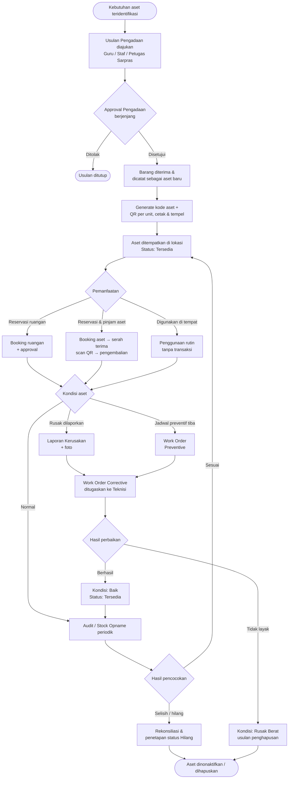
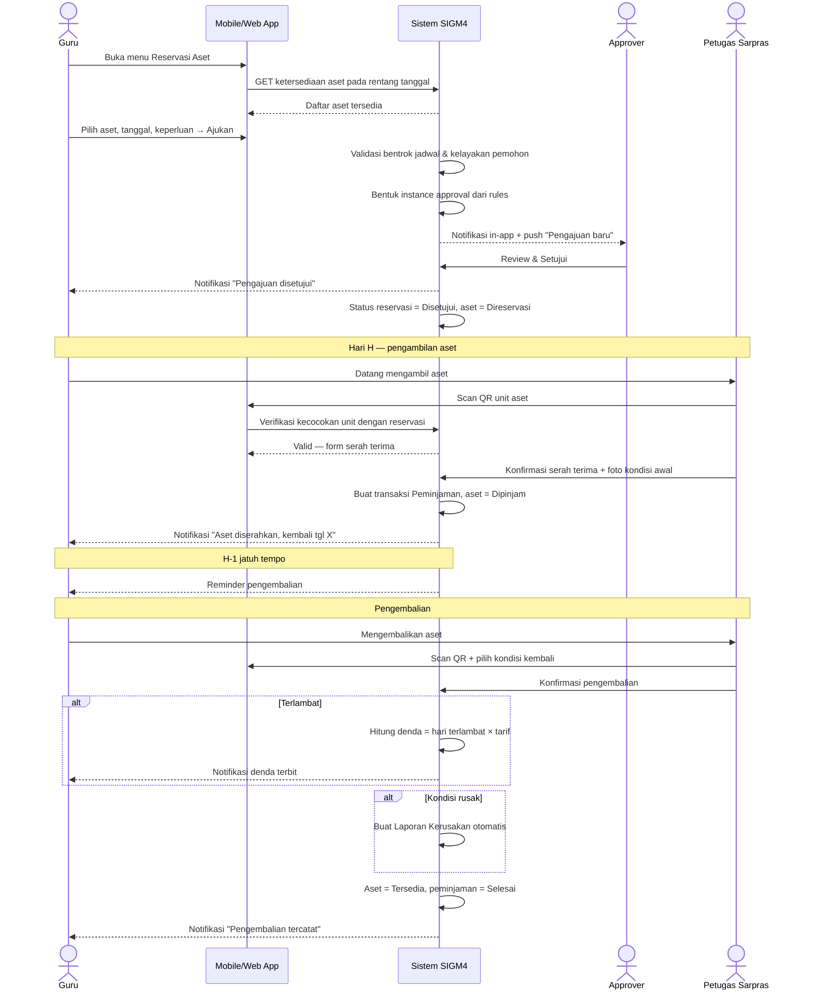
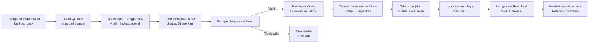

# 6. User Persona

## Persona 1 — Bu Sari, Petugas Sarana Prasarana (Power User)

| Aspek | Uraian |
|---|---|
| **Profil** | Perempuan, 38 tahun, 10 tahun mengelola sarpras sekolah, terbiasa dengan spreadsheet, literasi digital menengah |
| **Perangkat** | Desktop di ruang sarpras, ponsel Android untuk pekerjaan lapangan |
| **Goals** | Semua aset tercatat dan mudah dilacak; serah terima peminjaman cepat diverifikasi; stock opname selesai tanpa lembur; laporan siap kapan pun diminta pimpinan |
| **Pain Points** | Data spreadsheet berantakan dan sering bentrok versi; aset dipinjam tanpa lapor; mencari satu unit proyektor bisa memakan setengah jam; menjelang audit harus rekap manual berhari-hari |
| **Needs** | Input aset massal dan cepat; pencetakan label QR secara batch; verifikasi serah terima lewat scan; daftar aset terlambat kembali; laporan selisih opname otomatis |
| **Motivations** | Terbebas dari pekerjaan rekap manual; tidak lagi disalahkan atas aset yang hilang tanpa jejak; pekerjaan terlihat rapi dan profesional di mata pimpinan |

## Persona 2 — Pak Budi, Guru IPA (Frequent Requester)

| Aspek | Uraian |
|---|---|
| **Profil** | Laki-laki, 34 tahun, guru IPA, sering menggunakan laboratorium dan alat peraga, literasi digital baik |
| **Perangkat** | Ponsel Android (utama), laptop di ruang guru |
| **Goals** | Memastikan lab dan alat tersedia saat jadwal mengajar; meminjam alat tanpa proses berbelit; tidak terkena masalah karena alat rusak yang bukan kesalahannya |
| **Pain Points** | Datang ke lab ternyata sudah dipakai kelas lain; harus mencari petugas untuk meminjam aset; tidak tahu status pengajuannya sudah disetujui atau belum; alat rusak dilaporkan lisan lalu terlupakan |
| **Needs** | Kalender ketersediaan ruangan; pengajuan cepat dari ponsel; notifikasi status persetujuan; pelaporan kerusakan berfoto agar jelas kondisinya bukan karena dirinya |
| **Motivations** | Pembelajaran berjalan lancar sesuai rencana; tidak membuang waktu mengejar administrasi; bukti digital melindunginya dari kesalahpahaman |

## Persona 3 — Pak Hendra, Kepala Sekolah (Decision Maker)

| Aspek | Uraian |
|---|---|
| **Profil** | Laki-laki, 51 tahun, kepala sekolah, jadwal padat dan sering di luar sekolah, literasi digital dasar–menengah |
| **Perangkat** | Ponsel (utama, saat mobile), laptop saat di kantor |
| **Goals** | Memastikan aset sekolah terkelola dan terlindungi; menyetujui pengajuan penting dengan cepat; menyusun rencana pengadaan berbasis data; siap saat pemeriksaan |
| **Pain Points** | Disposisi kertas menumpuk di meja; tidak tahu kondisi aset tanpa bertanya ke petugas; usulan pengadaan datang tanpa dasar data; laporan untuk pengawas selalu dadakan |
| **Needs** | Dashboard ringkas satu layar; approval dari ponsel; ringkasan kondisi aset, biaya pemeliharaan, dan tren kerusakan; laporan yang dapat diekspor |
| **Motivations** | Keputusan yang dapat dipertanggungjawabkan; tata kelola sekolah yang tertib dan transparan; tidak ada temuan saat audit |

## Persona 4 — Pak Andi, Teknisi Sekolah (Field Executor)

| Aspek | Uraian |
|---|---|
| **Profil** | Laki-laki, 29 tahun, teknisi serbaguna (listrik, komputer, meubelair), bekerja berpindah ruangan, literasi digital menengah |
| **Perangkat** | Ponsel Android (utama, hampir selalu di lapangan) |
| **Goals** | Mengetahui pekerjaan hari ini secara jelas dan berprioritas; menyelesaikan perbaikan tanpa bolak-balik mencari informasi; pekerjaannya tercatat dan diakui |
| **Pain Points** | Perintah kerja disampaikan lisan dan mudah terlupa; sampai di lokasi baru tahu kerusakannya berbeda dari yang diceritakan; riwayat servis unit tidak diketahui sehingga mengulang diagnosis; biaya pembelian sparepart sulit dipertanggungjawabkan |
| **Needs** | Daftar work order berprioritas di ponsel; foto & deskripsi kerusakan dari pelapor; riwayat servis unit lewat scan QR; input biaya dan foto hasil perbaikan langsung dari lokasi |
| **Motivations** | Pekerjaan terdokumentasi dan terukur; tidak dituduh lalai; tidak membuang tenaga untuk pekerjaan berulang |

## Persona 5 — Ibu Rina, Staf Tata Usaha (Administrative User)

| Aspek | Uraian |
|---|---|
| **Profil** | Perempuan, 41 tahun, staf tata usaha, menangani administrasi kegiatan sekolah, literasi digital menengah |
| **Perangkat** | Desktop di ruang TU, ponsel |
| **Goals** | Menyiapkan ruangan dan perlengkapan untuk rapat/kegiatan dinas tepat waktu; administrasi rapi dan dapat dipertanggungjawabkan |
| **Pain Points** | Reservasi ruang rapat sering bentrok dengan kegiatan lain; harus menelepon beberapa pihak untuk memastikan ketersediaan kursi/sound system; arsip peminjaman tersebar |
| **Needs** | Melihat jadwal seluruh ruangan sekaligus; mengajukan reservasi ruangan beserta aset pendukung dalam satu pengajuan; rekap kegiatan yang menggunakan fasilitas |
| **Motivations** | Kegiatan sekolah berjalan tanpa insiden; pekerjaannya dinilai rapi; tidak menjadi pihak yang disalahkan saat fasilitas tidak siap |

## Persona 6 — Dika, Ketua OSIS (Limited User)

| Aspek | Uraian |
|---|---|
| **Profil** | Laki-laki, 16 tahun, siswa kelas XI, ketua OSIS, sangat melek digital, aktif menggunakan ponsel |
| **Perangkat** | Ponsel Android (satu-satunya perangkat) |
| **Goals** | Mendapatkan izin penggunaan aula dan perlengkapan untuk kegiatan OSIS; kegiatan berjalan sesuai rencana |
| **Pain Points** | Harus menemui banyak pihak untuk minta izin; sering ditolak di menit terakhir karena ruangan sudah dipakai; tidak tahu perlengkapan apa saja yang boleh dipinjam siswa |
| **Needs** | Katalog aset yang boleh dipinjam siswa; pengajuan langsung dari ponsel; kejelasan status pengajuan dan alasan penolakan; pengingat jadwal pengembalian |
| **Motivations** | Kegiatan OSIS sukses; belajar berorganisasi secara profesional; tidak merepotkan guru pembina |

## Persona 7 — Pak Yoga, Administrator Sistem (Technical Owner)

| Aspek | Uraian |
|---|---|
| **Profil** | Laki-laki, 31 tahun, guru TIK merangkap admin sistem sekolah, literasi digital tinggi |
| **Perangkat** | Laptop/desktop |
| **Goals** | Sistem berjalan stabil; akun pengguna tertata sesuai jabatan; aturan persetujuan mengikuti kebijakan sekolah tanpa perlu memanggil vendor |
| **Pain Points** | Setiap perubahan kebijakan biasanya berarti permintaan perubahan ke pengembang; pergantian pegawai membuat akun menumpuk; sulit menelusuri siapa mengubah data |
| **Needs** | Manajemen user & role mandiri; konfigurasi approval rules tanpa coding; activity log yang dapat difilter; reset password & penonaktifan akun |
| **Motivations** | Sistem mandiri tanpa ketergantungan vendor; keamanan data terjaga; dapat menjawab pertanyaan "siapa yang mengubah ini" dalam hitungan menit |

---

---

# 7. User Journey

## 7.1 Journey Map Ringkas per Persona

| Tahap | Petugas Sarpras | Guru / Staf / Siswa | Teknisi | Pimpinan |
|---|---|---|---|---|
| **Awareness** | Diberi akun oleh Admin, mengikuti pelatihan | Menerima akun & sosialisasi | Menerima akun & pelatihan mobile | Menerima akun & demo dashboard |
| **Onboarding** | Login, ganti password, atur profil | Login via mobile, ganti password | Login mobile, aktifkan notifikasi | Login, kenali dashboard |
| **First Value** | Input aset & cetak QR pertama | Mengajukan reservasi pertama & disetujui | Menyelesaikan work order pertama | Menyetujui pengajuan dari ponsel |
| **Habitual Use** | Verifikasi serah terima harian, kelola kerusakan | Reservasi & peminjaman rutin, lapor kerusakan | Menyelesaikan work order harian | Memantau dashboard mingguan |
| **Advanced Use** | Stock opname periodik, analitik pemanfaatan | Menggunakan chatbot untuk cek jadwal & status | Menggunakan riwayat servis untuk diagnosis | Menyusun rencana pengadaan dari analitik |
| **Retention** | Laporan audit dihasilkan otomatis | Proses cepat & transparan | Pekerjaan terdokumentasi | Keputusan berbasis data |

## 7.2 End-to-End Journey: Siklus Hidup Aset

## 7.3 Journey Detail: Guru Mengajukan Reservasi hingga Pengembalian

## 7.4 Journey Detail: Pelaporan Kerusakan hingga Selesai Diperbaiki

---
