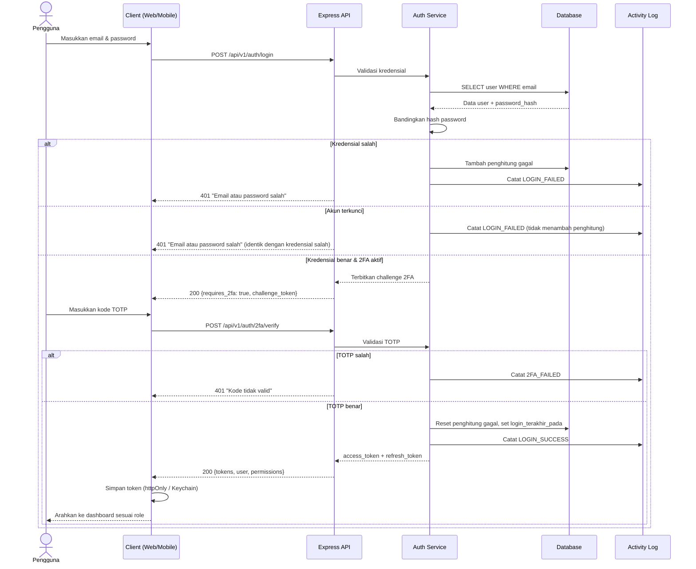

# M-01 — Autentikasi & Manajemen Akun

> **Modul self-contained.** Seluruh yang diperlukan untuk mengimplementasikan modul ini ada di
> berkas ini: requirement, aturan bisnis, endpoint, entitas, notifikasi, permission, jejak audit,
> dan kriteria penerimaan. Baris yang dimiliki modul lain dirujuk melalui ID, tidak disalin.
>
> Isi requirement bersifat **verbatim dari PRD v1.1**. Sumber kebenaran tunggal.

## 1. Overview

Lihat [`../01-product/overview.md`](../01-product/overview.md) untuk konteks produk menyeluruh.
Modul ini adalah **M-01 — Autentikasi & Manajemen Akun** sebagaimana terdaftar pada Daftar Modul PRD.

## 2. Scope

Cakupan modul ditentukan oleh Functional Requirement yang tercantum pada bagian 5.
Hal di luar daftar tersebut berada di luar cakupan modul ini.

## 3. Actors

Aktor per requirement tercantum pada tabel **Actor** di tiap FR (bagian 5).
Definisi role: [`../00-foundation/roles-permissions.md`](../00-foundation/roles-permissions.md).

## 4. Business Flow

## 15.1 Login dengan 2FA

## 5. Functional Requirements

### FR-01.1 Login

| Aspek | Uraian |
|---|---|
| **Description** | Pengguna masuk ke sistem menggunakan email dan password yang terdaftar. Berlaku pada aplikasi web maupun mobile. |
| **Actor** | Seluruh role (R-01 s/d R-07) |
| **Preconditions** | Akun sudah dibuat oleh Administrator dan berstatus `Aktif`; perangkat terhubung internet |

**Main Flow**
1. Pengguna membuka halaman login.
2. Pengguna memasukkan email dan password.
3. Sistem memvalidasi kredensial terhadap hash password.
4. Sistem memeriksa status akun (`Aktif`).
5. Jika role pengguna mewajibkan 2FA, sistem meminta kode OTP (lihat FR-01.5).
6. Sistem menerbitkan *access token* (JWT, masa berlaku 60 menit) dan *refresh token* (30 hari untuk mobile, 12 jam untuk web).
7. Sistem mengarahkan pengguna ke dashboard sesuai role.
8. Sistem mencatat aktivitas `LOGIN_SUCCESS` pada activity log.

**Alternative Flow**
- **A1 — Kredensial salah:** Sistem menampilkan pesan generik "Email atau password salah", menambah penghitung percobaan gagal, dan mencatat `LOGIN_FAILED`. Berlaku sama untuk email yang tidak terdaftar (tanpa penghitung akun; `LOGIN_FAILED` tetap dicatat tanpa menyimpan email yang dicoba).
- **A2 — Percobaan gagal ≥ 5 kali dalam 15 menit:** Akun dikunci sementara 15 menit (jendela 15 menit dihitung dari kegagalan pertama). Selama terkunci, login — termasuk dengan password yang benar — dijawab **persis sama** dengan kredensial salah (`401`, pesan generik A1): sistem TIDAK menampilkan status terkunci maupun sisa waktu, supaya endpoint login tidak dapat dipakai untuk menebak email yang terdaftar. Percobaan selama terkunci dicatat `LOGIN_FAILED` tetapi tidak dihitung dan tidak memperpanjang penguncian. Pemilik akun dan Administrator diberi tahu lewat `NT-39`; kunci terbuka otomatis setelah 15 menit.
- **A3 — Akun nonaktif:** Sistem menampilkan "Akun Anda dinonaktifkan. Hubungi Administrator."
- **A4 — Login pertama kali / password hasil reset Admin:** Sistem memaksa penggantian password sebelum menu lain dapat diakses.
- **A5 — Token kedaluwarsa saat sesi berjalan:** Klien menukar *refresh token*; bila gagal, pengguna diarahkan ke halaman login.

**Post Conditions**
- Sesi aktif terbentuk; token tersimpan aman (web: `httpOnly cookie`; mobile: Keychain/Keystore).
- Waktu `login_terakhir_pada` diperbarui.

**Acceptance Criteria**
- [ ] Login berhasil dengan kredensial valid pada web dan mobile.
- [ ] Pesan kesalahan tidak membocorkan apakah email terdaftar.
- [ ] Respons login untuk email tak terdaftar, password salah, dan akun terkunci **identik** (status, kode, dan pesan); `423` dan sisa waktu kunci tidak pernah dikirim `/auth/login`.
- [ ] Akun terkunci otomatis setelah 5 kegagalan dalam 15 menit dan terbuka otomatis setelahnya; percobaan selama terkunci tidak memperpanjangnya.
- [ ] Pengguna dengan password hasil reset wajib mengganti password sebelum melanjutkan.
- [ ] Setiap login sukses maupun gagal tercatat di activity log beserta alamat IP dan perangkat.

### FR-01.2 Logout

| Aspek | Uraian |
|---|---|
| **Description** | Mengakhiri sesi pengguna dan mencabut token. |
| **Actor** | Seluruh role |
| **Preconditions** | Pengguna sedang login |

**Main Flow**
1. Pengguna menekan menu Logout.
2. Sistem mencabut sesi pada sisi server: seluruh *refresh token* keluarga sesi itu, sehingga *access token*-nya pun ditolak pada permintaan berikutnya.
3. Sistem menghapus token pada klien dan mengarahkan ke halaman login.
4. Sistem mencatat `LOGOUT`.

**Alternative Flow**
- **A1 — Keluar dari semua perangkat:** Seluruh refresh token milik pengguna dicabut.
- **A3 — Cabut satu perangkat:** Pengguna melihat daftar sesi aktifnya (platform, alamat IP, perangkat, waktu login dan pembaruan terakhir; sesi yang sedang dipakai ditandai) dan mencabut salah satunya. Sesi milik orang lain tidak dapat dilihat maupun dicabut.
- **A2 — Sesi idle 30 menit (web):** Sistem melakukan auto-logout dan menampilkan pesan sesi berakhir.

**Post Conditions** — Sesi berakhir; token tidak dapat digunakan kembali.

**Acceptance Criteria**
- [ ] Token (access maupun refresh) dari sesi yang sudah dicabut ditolak API dengan HTTP 401 pada permintaan berikutnya — paling lambat 60 detik.
- [ ] Pengguna hanya dapat melihat dan mencabut sesinya sendiri; mencabut sesi orang lain atau yang tidak ada dijawab sama (`403`).
- [ ] Auto-logout web berjalan setelah 30 menit tanpa aktivitas.
- [ ] Token push notification perangkat dinonaktifkan saat logout mobile.

### FR-01.3 Lupa Password & Reset

| Aspek | Uraian |
|---|---|
| **Description** | Pengguna yang lupa password mengajukan permintaan reset kepada Administrator; Administrator menerbitkan password sementara. Karena sistem tidak menggunakan kanal email, reset dilakukan melalui mekanisme administratif. |
| **Actor** | Seluruh role (pemohon), Administrator (pelaksana) |
| **Preconditions** | Akun terdaftar |

**Main Flow**
1. Pengguna menekan "Lupa Password" dan memasukkan email terdaftar.
2. Sistem membuat permintaan reset berstatus `Menunggu` dan menotifikasi Administrator (in-app + push).
3. Administrator membuka daftar permintaan dan **memverifikasi identitas pemohon melalui salah satu kanal terverifikasi** yang ditetapkan sekolah: tatap muka dengan menunjukkan kartu identitas pegawai/siswa, atau konfirmasi oleh atasan langsung/wali kelas. Administrator mencatat metode verifikasi yang dipakai.
4. Administrator menekan "Terbitkan Password Sementara". Sistem menghasilkan password sementara acak dan menampilkannya **satu kali** kepada Administrator, serta menandai akun `must_change_password = true`. Sistem juga mencabut seluruh sesi aktif pemilik akun dan menghapus penguncian loginnya (identitas sudah diverifikasi luring).
5. Administrator menyerahkan password sementara secara **langsung kepada pemohon** (tatap muka atau kanal yang telah diverifikasi pada langkah 3). Dilarang menyerahkan melalui pesan instan atau pihak ketiga.
6. Pengguna login dengan password sementara dan wajib menggantinya sebelum dapat mengakses menu apa pun.

**Alternative Flow**
- **A1 — Email tidak terdaftar:** Sistem tetap menampilkan pesan netral "Permintaan diterima" untuk mencegah enumerasi akun dan tidak membuat permintaan. Berlaku sama untuk akun nonaktif dan untuk permintaan yang melebihi batas A4: jawabannya (status dan badan) tidak dapat dibedakan dari permintaan yang dibuat.
- **A2 — Administrator menolak permintaan:** Permintaan ditandai `Ditolak` beserta alasan; pemohon dinotifikasi **setelah** ia berhasil login kembali, atau diberitahu secara luring.
- **A3 — Password sementara tidak digunakan dalam 72 jam:** Password kedaluwarsa dan permintaan ditutup otomatis. Kedaluwarsa ditegakkan saat login: password sementara yang lewat 72 jam ditolak seperti password salah dan permintaannya ditutup `Kedaluwarsa`; antrean Administrator menampilkan status yang sama.
- **A4 — Pemohon mengajukan reset berulang kali:** Maksimum 3 permintaan per akun per 24 jam (dihitung sejak diajukan, apa pun statusnya); yang ke-4 tetap dijawab netral (A1) tetapi tidak dibuat, dan dicatat sebagai anomali keamanan (`PASSWORD_RESET_REQUESTED` dengan hasil `Gagal`).
- **A5 — Reset langsung dari detail pengguna:** Administrator dapat menerbitkan password sementara dari halaman detail pengguna tanpa menunggu permintaan pemohon. Metode verifikasi identitas tetap wajib dan tercatat pada permintaan yang dibuat — atau pada permintaan `Menunggu` akun itu, bila ada, yang lalu diselesaikan (tidak ada permintaan ganda).

**Post Conditions** — Pengguna dapat mengakses kembali akunnya dengan password baru pilihannya; metode verifikasi identitas tercatat.

**Acceptance Criteria**
- [ ] Password sementara hanya ditampilkan satu kali dan tidak dapat dilihat ulang, termasuk oleh Administrator yang menerbitkannya.
- [ ] Password sementara tidak pernah dikirim melalui kanal notifikasi apa pun (in-app maupun push), karena pengguna yang bersangkutan sedang tidak dapat login.
- [ ] Pengguna tidak dapat mengakses menu apa pun sebelum mengganti password sementara.
- [ ] Metode verifikasi identitas wajib dipilih sebelum penerbitan dan tersimpan pada permintaan.
- [ ] Seluruh permintaan dan tindakan reset tercatat di activity log tanpa merekam nilai password.
- [ ] Jawaban "Lupa Password" identik untuk email terdaftar, tak terdaftar, akun nonaktif, dan permintaan yang melebihi batas.
- [ ] Menerbitkan password sementara mencabut seluruh sesi aktif pemilik akun dan membuka penguncian loginnya.
- [ ] Password sementara yang tidak dipakai dalam 72 jam ditolak saat login.

### FR-01.4 Ganti Password & Kelola Profil

| Aspek | Uraian |
|---|---|
| **Description** | Pengguna memperbarui password dan data profil pribadi (nama, telepon, foto). |
| **Actor** | Seluruh role |
| **Preconditions** | Pengguna sedang login |

**Main Flow**
1. Pengguna membuka halaman Profil.
2. Untuk ganti password: memasukkan password lama, password baru, dan konfirmasi.
3. Sistem memvalidasi password lama dan kekuatan password baru: **minimal 12 karakter**, mengandung huruf besar, huruf kecil, dan angka, **tidak terdapat pada daftar password yang diketahui bocor**, serta tidak memuat nama atau email pengguna. Sistem menampilkan indikator kekuatan password secara langsung.
4. Sistem menyimpan hash password baru dan mencabut seluruh sesi lain milik pengguna.
5. Untuk data profil: pengguna menyunting nama, telepon, atau foto lalu menyimpan.

**Alternative Flow**
- **A1 — Password lama salah:** Sistem menolak.
- **A2 — Password baru sama dengan 3 password terakhir:** Sistem menolak.
- **A3 — Foto profil > 2 MB atau bukan JPG/PNG:** Sistem menolak dengan pesan spesifik.

**Post Conditions** — Kredensial/profil diperbarui; sesi lain dicabut saat penggantian password.

**Acceptance Criteria**
- [ ] Password policy divalidasi di sisi server, bukan hanya klien.
- [ ] Email dan role tidak dapat diubah oleh pengguna sendiri.
- [ ] Perubahan tercatat di activity log tanpa merekam nilai password.

### FR-01.5 Two-Factor Authentication (2FA) untuk Role Sensitif

| Aspek | Uraian |
|---|---|
| **Description** | Verifikasi dua langkah berbasis TOTP, wajib bagi Administrator dan Pimpinan Sekolah, opsional bagi role lain. |
| **Actor** | Administrator, Pimpinan Sekolah (wajib); role lain (opsional) |
| **Preconditions** | Pengguna memiliki aplikasi authenticator TOTP |

**Main Flow**
1. Saat login pertama, pengguna role sensitif diarahkan ke halaman aktivasi 2FA.
2. Sistem menampilkan QR Code *secret* TOTP dan 10 kode cadangan sekali pakai.
3. Pengguna memindai dengan aplikasi authenticator dan memasukkan 6 digit kode verifikasi.
4. Sistem memvalidasi dan mengaktifkan 2FA.
5. Pada login berikutnya, setelah password valid, sistem meminta kode TOTP.

**Alternative Flow**
- **A1 — Kode TOTP salah:** Ditolak; setelah 5 kegagalan akun dikunci 15 menit.
- **A2 — Perangkat authenticator hilang:** Pengguna memakai kode cadangan; bila habis, Administrator melakukan reset 2FA.
- **A3 — Administrator me-reset 2FA pengguna:** Pengguna wajib mendaftar ulang saat login berikutnya.
- **A4 — Administrator sendiri kehilangan perangkat 2FA dan kode cadangan:** Berlaku prosedur *break-glass* (FR-01.6). Tanpa prosedur ini sistem dapat terkunci permanen.

**Post Conditions** — Sesi terbentuk hanya setelah dua faktor terverifikasi.

**Acceptance Criteria**
- [ ] Administrator dan Pimpinan Sekolah tidak dapat menonaktifkan 2FA sendiri.
- [ ] Kode cadangan hanya dapat digunakan satu kali.
- [ ] Kode cadangan disimpan dalam bentuk hash, bukan teks terbaca, dan hanya ditampilkan satu kali saat pembuatan.
- [ ] Reset 2FA oleh Administrator tercatat di activity log.
- [ ] Sistem memperingatkan pengguna bila kode cadangan tersisa ≤ 2 dan menawarkan pembuatan ulang.

### FR-01.6 Prosedur Break-Glass Administrator

| Aspek | Uraian |
|---|---|
| **Description** | Jalur pemulihan darurat ketika seluruh akun Administrator kehilangan akses (perangkat 2FA hilang **dan** kode cadangan habis). Tanpa prosedur ini, kewajiban 2FA pada BR-070 dapat mengunci sistem secara permanen. |
| **Actor** | Kepala Sekolah (pemberi otorisasi), Administrator cadangan atau operator infrastruktur (pelaksana) |
| **Preconditions** | Tidak ada akun Administrator yang dapat login |

**Main Flow**
1. Kepala Sekolah menerbitkan otorisasi tertulis pemulihan darurat (formulir baku, ditandatangani, disimpan sebagai arsip sekolah).
2. Operator infrastruktur menjalankan **perintah CLI pemulihan** yang disediakan sistem (`sigm4 admin:recover --email=<email>`), dijalankan langsung di server dan hanya dapat dijalankan oleh pemilik akses server.
3. Perintah tersebut: menonaktifkan 2FA pada akun yang ditunjuk, menerbitkan password sementara, memaksa `must_change_password = true`, dan **mencabut seluruh sesi aktif di sistem**.
4. Sistem mencatat aksi `ADMIN_BREAK_GLASS_RECOVERY` dengan pelaku `SYSTEM:CLI` beserta email target dan waktu.
5. Administrator masuk kembali, mengganti password, mendaftarkan ulang 2FA, dan **wajib** memverifikasi bahwa terdapat minimal dua akun Administrator aktif (RS-19).
6. Sistem mengirim notifikasi kepada seluruh Pimpinan Sekolah bahwa pemulihan darurat telah dijalankan.

**Alternative Flow**
- **A1 — Terdapat Administrator lain yang masih dapat login:** Prosedur break-glass **tidak boleh** digunakan; pemulihan dilakukan melalui reset 2FA biasa (FR-01.5 A3).
- **A2 — Otorisasi tertulis tidak tersedia:** Pelaksana wajib menolak menjalankan perintah.

**Post Conditions** — Akses Administrator pulih; seluruh tindakan terekam permanen dan dapat diaudit.

**Acceptance Criteria**
- [ ] Perintah pemulihan hanya dapat dijalankan dari server (akses shell), tidak pernah melalui antarmuka web maupun API.
- [ ] Perintah menolak berjalan bila masih ada akun Administrator aktif yang login dalam 24 jam terakhir, kecuali dipaksa dengan flag eksplisit yang juga tercatat.
- [ ] Setiap penggunaan break-glass menghasilkan alarm ke pemantauan sistem (OBS-05) dan notifikasi ke seluruh Pimpinan Sekolah.
- [ ] Sistem menolak kondisi "hanya satu akun Administrator" pada saat instalasi awal; minimal dua akun wajib dibuat (RS-19).
- [ ] Entri activity log break-glass tidak dapat dihapus atau disunting oleh siapa pun (AL-03).

## 6. Business Rules

### Dimiliki modul ini

| Kode | Business Rule |
|---|---|
| BR-070 | Role Administrator dan Pimpinan Sekolah wajib mengaktifkan 2FA. |
| BR-070a | Sistem wajib memiliki **minimal dua** akun Administrator aktif; instalasi awal tidak dianggap selesai sebelum syarat ini terpenuhi (RS-19). |
| BR-070b | Kehilangan total akses Administrator dipulihkan melalui prosedur *break-glass* berbasis CLI di sisi server dengan otorisasi tertulis Kepala Sekolah (FR-01.6). Prosedur ini tidak pernah tersedia melalui antarmuka web atau API. |
| BR-070c | Kode cadangan 2FA disimpan dalam bentuk hash dan hanya ditampilkan satu kali pada saat pembuatan. |

## 7. API Endpoints

### Endpoint

| Method | Endpoint | Permission | Deskripsi |
|---|---|---|---|
| POST | `/auth/login` | Publik | Login email + password + `platform` (`WEB`, `ANDROID`, `IOS`) | 200 `{tokens, expires_in, user, permissions}` (`tokens` null pada WEB: token hanya di cookie httpOnly) atau `{requires_2fa, challenge_token, expires_in}` (akun ber-2FA: sesi belum terbit) | 400, 401, 403, 429 |
| POST | `/auth/2fa/verify` | Challenge token | Verifikasi faktor kedua — kode TOTP 6 digit atau kode cadangan — dengan challenge token dari login; menerbitkan sesi | 200 `{tokens, expires_in, user, permissions, sisa_kode_cadangan, kode_cadangan_menipis}` (`tokens` null pada WEB) | 400, 401, 423 |
| POST | `/auth/2fa/enroll` | Bearer | Mulai pendaftaran 2FA: secret TOTP, URI `otpauth://`, dan 10 kode cadangan — tampil **satu kali**. Terjangkau oleh sesi yang belum lolos 2FA | 200 `{secret, otpauth_uri, kode_cadangan}` | 401, 422 |
| POST | `/auth/2fa/enroll/confirm` | Bearer | Konfirmasi pendaftaran dengan kode 6 digit; 2FA berlaku dan sesi ini naik ke `amr` `["pwd","otp"]`. Terjangkau oleh sesi yang belum lolos 2FA | 200 `{access_token}` (null pada WEB) | 400, 401, 422 |
| POST | `/auth/2fa/backup-codes/regenerate` | Bearer (2FA terverifikasi) | Membuat ulang seluruh kode cadangan; yang lama, terpakai atau tidak, tak berlaku lagi | 200 `{kode_cadangan}` | 401, 403, 422 |
| POST | `/auth/refresh` | Refresh token | Menukar refresh token (rotasi; refresh token baru ikut diterbitkan, pemakaian ulang mencabut seluruh rantai) | 200 `{tokens, expires_in}` (`tokens` null pada WEB) | 401 |
| POST | `/auth/logout` | Bearer | Mencabut sesi yang membawa permintaan ini | 204 | 401 |
| POST | `/auth/logout-all` | Bearer | Keluar dari semua perangkat: mencabut seluruh sesi pengguna | 204 | 401 |
| GET | `/auth/sessions` | Bearer | Daftar sesi (perangkat) aktif milik pengguna | 200 `[{id, platform, ip, user_agent, dibuat_pada, terakhir_diperbarui, berlaku_sampai, saat_ini}]` | 401 |
| DELETE | `/auth/sessions/{id}` | Bearer | Mencabut satu sesi milik pengguna sendiri | 204 | 400, 401, 403 |
| POST | `/auth/password/forgot` | Publik | Ajukan permintaan reset; jawaban netral untuk email apa pun (`FR-01.3 A1`) | 202 `{message}` | 400, 429 |
| GET | `/auth/password/requests` | `user.reset_password` | Antrean permintaan reset (filter status; memuat identitas pemohon untuk verifikasi luring) | 200 daftar terpaginasi | 401, 403 |
| POST | `/auth/password/requests/{id}/issue` | `user.reset_password` | Terbitkan password sementara; `metode_verifikasi` wajib; password tampil **satu kali** pada respons | 200 `{permintaan, password_sementara}` | 400, 401, 403, 404, 422 |
| POST | `/auth/password/requests/{id}/reject` | `user.reset_password` | Tolak permintaan; `alasan` wajib (`FR-01.3 A2`) | 200 `{permintaan}` | 400, 401, 403, 404, 422 |
| POST | `/auth/password/change` | Bearer | Ganti password sendiri | 200 | 401, 422 |
| GET | `/me` | Bearer | Profil & permission pengguna | 200 `{user, permissions}` | 401 |
| PUT | `/me` | Bearer | Perbarui profil sendiri | 200 | 401, 422 |

**Gerbang 2FA (`BR-070`).** Role Administrator dan Pimpinan Sekolah yang sesinya baru membuktikan password ditolak `403 TWO_FACTOR_REQUIRED` pada seluruh endpoint terlindung, termasuk yang permission-nya mereka pegang. Yang terjangkau hanya `POST /auth/2fa/enroll`, `POST /auth/2fa/enroll/confirm`, dan `POST /auth/logout`. Role lain tidak terpengaruh, dengan atau tanpa 2FA.

Konvensi umum, format respons, kode galat, dan ketentuan keamanan API:
[`../03-architecture/api-conventions.md`](../03-architecture/api-conventions.md).

## 8. Database Entity

### Entitas

| Entitas | Deskripsi | Atribut Utama | Keterangan |
|---|---|---|---|
| **password_reset_requests** | Permintaan reset password | id, user_id, status, metode_verifikasi, diminta_pada, diproses_oleh, diproses_pada, kedaluwarsa_pada, alasan_penolakan | ± 100 |

Model data menyeluruh dan ERD: [`../03-architecture/data-model.md`](../03-architecture/data-model.md).

## 9. Notification

### Notifikasi diterbitkan modul ini

| Kode | Event Pemicu | Penerima | Kanal | Wajib | Contoh Isi |
|---|---|---|---|:---:|---|
| **NT-37** | Permintaan reset password masuk | Administrator | In-app + Push | ✅ | "{pengguna} mengajukan reset password." |
| **NT-38** | Password sementara diterbitkan | **Administrator penerbit** | In-app | ✅ | "Password sementara untuk {pengguna} diterbitkan {waktu}. Serahkan langsung kepada yang bersangkutan." — *Direvisi pada audit: sebelumnya ditujukan kepada pengguna terkait, padahal yang bersangkutan sedang tidak dapat login sehingga notifikasi in-app tidak akan pernah terbaca.* |
| **NT-38a** | Password berhasil diganti setelah reset | Pengguna terkait | In-app + Push | ✅ | "Password Anda berhasil diperbarui pada {waktu}. Bila ini bukan Anda, segera hubungi Administrator." |
| **NT-39** | Akun terkunci karena percobaan login gagal | Pengguna + Administrator | In-app | ✅ | "Akun terkunci sementara akibat 5 percobaan login gagal." |

Ketentuan umum kanal, latensi, dan preferensi: [`m17-notifications.md`](m17-notifications.md).

## 10. Permission

### Kode permission

_Tidak ada permission khusus modul ini._

Katalog kanonik & aturan scope: [`../00-foundation/roles-permissions.md`](../00-foundation/roles-permissions.md).

## 11. Activity Log

### Aksi yang wajib dicatat

| Aksi | Keterangan |
|---|---|
| `LOGIN_SUCCESS` / `LOGIN_FAILED` | Termasuk IP dan perangkat. `LOGIN_FAILED` juga mencatat email tak terdaftar dan percobaan atas akun terkunci — pelaku kosong, akun sasaran pada entitas, email yang dicoba tidak disimpan. Kode 2FA yang salah pada `/auth/2fa/verify` juga dicatat di sini, dengan alasan `KODE_2FA_SALAH` |
| `LOGOUT` / `LOGOUT_ALL_DEVICES` | Pencabutan sesi. `LOGOUT` juga dicatat saat pengguna mencabut satu perangkat lain (nilai memuat `alasan: device_revoked`); `LOGOUT_ALL_DEVICES` memuat jumlah sesi yang dicabut. Termasuk IP dan perangkat pelaku |
| `REFRESH_TOKEN_REUSE_DETECTED` | Refresh token yang sudah dirotasi dipakai ulang; seluruh rantai dicabut. Termasuk IP dan perangkat |
| `ACCOUNT_LOCKED` / `ACCOUNT_UNLOCKED` | Penguncian akibat percobaan gagal (kegagalan ke-5 dalam jendela 15 menit). Kunci yang berakhir sendiri tidak menulis entri |
| `PASSWORD_CHANGED` | Ganti password sendiri (`FR-01.4`); memuat jumlah sesi lain yang dicabut, tanpa merekam nilai password |
| `PASSWORD_RESET_REQUESTED` / `PASSWORD_RESET_ISSUED` / `PASSWORD_RESET_REJECTED` | Alur reset administratif. `PASSWORD_RESET_REQUESTED` dicatat tanpa pelaku (pemohon belum login; akun sasaran pada entitas), juga untuk percobaan yang tidak menghasilkan permintaan — email tak terdaftar, akun nonaktif, melebihi batas — dengan hasil `Gagal` dan tanpa menyimpan email yang dicoba. `PASSWORD_RESET_ISSUED` memuat metode verifikasi dan jumlah sesi yang dicabut. Tidak satu pun memuat password |
| `PROFILE_UPDATED` | Perubahan nama/telepon profil sendiri (`FR-01.4` langkah 5, `PUT /me`); foto menunggu `PR-03-04` |
| `TWO_FA_ENABLED` / `TWO_FA_DISABLED` / `TWO_FA_RESET` | Perubahan 2FA |
| `TWO_FA_ENROLLMENT_STARTED` | Pendaftaran 2FA dimulai (secret dan kode cadangan dibangkitkan). Secret dan kode tidak pernah dicatat |
| `TWO_FA_BACKUP_CODES_REGENERATED` | Seluruh kode cadangan diganti (`FR-01.5` AC); nilainya tidak dicatat |
| `TWO_FA_BACKUP_CODE_USED` | Pemakaian kode cadangan, termasuk sisa kode |
| `ADMIN_BREAK_GLASS_RECOVERY` | Pemulihan darurat Administrator via CLI (FR-01.6); pelaku `SYSTEM:CLI` |

Prinsip, struktur entri, dan tamper-evidence: [`../03-architecture/activity-log.md`](../03-architecture/activity-log.md).

## 12. Acceptance Criteria

Kriteria penerimaan tercantum **inline** pada tiap Functional Requirement di bagian 5,
sesuai bentuk aslinya di PRD. Tidak diringkas maupun dipindahkan agar tidak terpisah dari
konteks requirement-nya.

Strategi pengujian: [`../06-quality/test-strategy.md`](../06-quality/test-strategy.md).

## 13. Dependencies

- [`m02-users.md`](m02-users.md) — M-02 Manajemen User & Role

## 14. Related Modules

- [`m02-users.md`](m02-users.md) — M-02 Manajemen User & Role

## 15. Open Issues

_Tidak ada isu terbuka._
