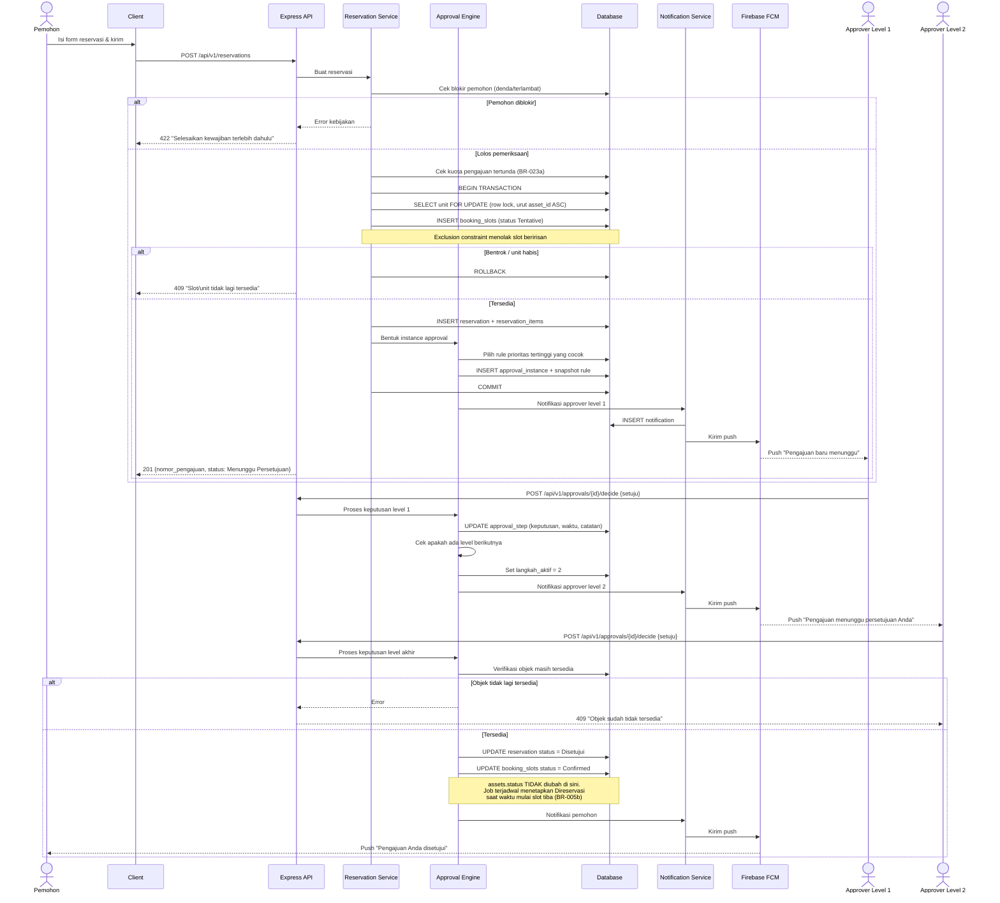

# M-07 — Reservasi Ruangan

> **Modul self-contained.** Seluruh yang diperlukan untuk mengimplementasikan modul ini ada di
> berkas ini: requirement, aturan bisnis, endpoint, entitas, notifikasi, permission, jejak audit,
> dan kriteria penerimaan. Baris yang dimiliki modul lain dirujuk melalui ID, tidak disalin.
>
> Isi requirement bersifat **verbatim dari PRD v1.1**. Sumber kebenaran tunggal.

## 1. Overview

Lihat [`../01-product/overview.md`](../01-product/overview.md) untuk konteks produk menyeluruh.
Modul ini adalah **M-07 — Reservasi Ruangan** sebagaimana terdaftar pada Daftar Modul PRD.

## 2. Scope

Cakupan modul ditentukan oleh Functional Requirement yang tercantum pada bagian 5.
Hal di luar daftar tersebut berada di luar cakupan modul ini.

## 3. Actors

Aktor per requirement tercantum pada tabel **Actor** di tiap FR (bagian 5).
Definisi role: [`../00-foundation/roles-permissions.md`](../00-foundation/roles-permissions.md).

## 4. Business Flow

## 15.2 Pengajuan Reservasi dengan Approval Berjenjang

## 5. Functional Requirements

### FR-07.1 Melihat Ketersediaan Ruangan

| Aspek | Uraian |
|---|---|
| **Description** | Kalender ketersediaan seluruh ruangan yang dapat direservasi, menampilkan slot terpakai dan kosong. |
| **Actor** | Guru, Staf/TU, Siswa/OSIS, Petugas Sarpras, Pimpinan Sekolah, Administrator |
| **Preconditions** | Terdapat ruangan dengan `dapat_direservasi = true` |

**Main Flow**
1. Pengguna membuka menu Reservasi Ruangan.
2. Sistem menampilkan kalender (tampilan harian/mingguan/bulanan) dengan ruangan sebagai baris dan waktu sebagai kolom.
3. Pengguna memfilter berdasarkan gedung, jenis ruangan, dan kapasitas minimum.
4. Sistem menampilkan slot terisi lengkap dengan nama kegiatan dan pemohon, serta slot kosong yang dapat dipilih.
5. Pengguna memilih slot kosong untuk melanjutkan ke pengajuan.

**Alternative Flow**
- **A1 — Role Siswa/OSIS:** Sistem hanya menampilkan ruangan yang ditandai `boleh_direservasi_siswa`, dan pada slot terisi hanya menampilkan status "Terpakai" tanpa detail pemohon.
- **A2 — Ruangan sedang dalam pemeliharaan:** Slot ditandai "Dalam Pemeliharaan" dan tidak dapat dipilih.
- **A3 — Di luar jam operasional sekolah:** Slot ditandai tidak tersedia sesuai konfigurasi jam operasional (FR-20.1).
- **A4 — Slot terpakai jadwal tetap (KBM/ekstrakurikuler):** Slot ditandai dengan label kegiatannya dan tidak dapat dipilih (FR-07.5).
- **A5 — Hari libur sekolah:** Seluruh slot pada tanggal tersebut ditandai libur beserta keterangannya (Lampiran E).

**Post Conditions** — Tidak ada perubahan data.

**Acceptance Criteria**
- [ ] Kalender memuat data hingga 30 ruangan × 1 bulan dalam ≤ 2 detik.
- [ ] Slot yang sedang menunggu persetujuan ditampilkan dengan warna berbeda dari slot yang sudah disetujui.
- [ ] Detail pemohon tidak terlihat oleh role Siswa/OSIS.

### FR-07.2 Pengajuan Reservasi Ruangan

| Aspek | Uraian |
|---|---|
| **Description** | Pengguna mengajukan pemesanan ruangan pada rentang tanggal dan waktu tertentu; pengajuan diteruskan ke approval engine. |
| **Actor** | Guru, Staf/TU, Siswa/OSIS |
| **Preconditions** | Pengguna login; ruangan aktif dan dapat direservasi; pengguna tidak sedang diblokir (BR-030) |

**Main Flow**
1. Pengguna memilih ruangan dan slot waktu dari kalender.
2. Pengguna mengisi: nama kegiatan, jenis kegiatan, tanggal & jam mulai–selesai, perkiraan jumlah peserta, kebutuhan tambahan, dan keterangan.
3. Pengguna dapat menambahkan aset pendukung dalam pengajuan yang sama (opsional; memicu validasi ketersediaan aset — FR-08.2).
4. Sistem memvalidasi: tidak bentrok dengan reservasi berstatus `Disetujui`, dalam jam operasional, jumlah peserta ≤ kapasitas ruangan, dan pengajuan minimal H-1 (dapat dikonfigurasi).
5. Sistem membuat reservasi berstatus `Menunggu Persetujuan` dan membentuk instance approval dari rules (FR-10.2).
6. Sistem menotifikasi approver level pertama.
7. Sistem menampilkan nomor pengajuan kepada pemohon.

**Alternative Flow**
- **A1 — Slot sudah dipesan pihak lain (race condition):** Sistem menolak dengan pesan "Slot baru saja dipesan pengguna lain" dan menyarankan slot alternatif terdekat.
- **A2 — Peserta melebihi kapasitas ruangan:** Sistem menolak dan menyarankan ruangan berkapasitas cukup.
- **A3 — Pengajuan mendadak (< H-1):** Sistem menolak, kecuali pengguna memiliki permission `reservation.urgent` (Petugas Sarpras/Administrator).
- **A4 — Reservasi berulang (mis. setiap Senin selama 8 minggu):** Pengguna memilih pola pengulangan; sistem memvalidasi seluruh tanggal sekaligus dan menampilkan tanggal yang bentrok untuk disesuaikan atau dilewati.
- **A5 — Pemohon memiliki denda belum lunas atau sedang diblokir:** Sistem menolak pengajuan disertai alasan.

**Post Conditions** — Reservasi tercatat berstatus `Menunggu Persetujuan`; slot ditandai *tentative* pada kalender; approval instance aktif.

**Acceptance Criteria**
- [ ] Sistem menolak 100% pengajuan yang beririsan waktu dengan reservasi berstatus `Disetujui` pada ruangan yang sama.
- [ ] Validasi bentrok dilakukan di sisi server dengan penguncian transaksional (bukan hanya pemeriksaan di klien).
- [ ] Reservasi berulang menghasilkan **satu** pengajuan induk dengan **satu** instance approval dan N slot turunan per tanggal (BR-024a); keputusan approval berlaku untuk seluruh tanggal.
- [ ] Pembatalan satu tanggal turunan tidak membatalkan induk maupun tanggal lainnya.
- [ ] Reservasi gabungan ruangan + aset pendukung diperlakukan *all-or-nothing* dalam satu instance approval (BR-024b).
- [ ] Reservasi berulang tidak dapat melampaui horizon pemesanan yang dikonfigurasi (BR-023c).
- [ ] Nomor pengajuan unik dan mengikuti format `RSV-RG-{TAHUN}-{URUT}` sesuai regex SEQ-04; tanggal turunan memakai sufiks `.{n}` (mis. `RSV-RG-2026-0001.03`).

### FR-07.3 Pembatalan & Perubahan Reservasi Ruangan

| Aspek | Uraian |
|---|---|
| **Description** | Pemohon membatalkan reservasi atau Petugas/Approver membatalkan secara sepihak dengan alasan. |
| **Actor** | Pemohon (miliknya sendiri), Petugas Sarpras, Administrator |
| **Preconditions** | Reservasi berstatus `Menunggu Persetujuan` atau `Disetujui` dan belum dimulai |

**Main Flow**
1. Pengguna membuka detail reservasi dan menekan "Batalkan".
2. Pengguna mengisi alasan pembatalan.
3. Sistem mengubah status menjadi `Dibatalkan`, membebaskan slot kalender, dan menotifikasi pihak terkait.

**Alternative Flow**
- **A1 — Pembatalan setelah kegiatan dimulai:** Sistem menolak; petugas dapat menandai reservasi `Selesai` atau `Tidak Digunakan`.
- **A2 — Pembatalan sepihak oleh Petugas/Administrator** (mis. ruangan dipakai kegiatan mendesak sekolah): Alasan wajib diisi dan pemohon dinotifikasi segera.
- **A3 — Perubahan jadwal:** Diperlakukan sebagai pembatalan + pengajuan baru agar jejak approval tetap jelas.

**Post Conditions** — Slot kembali tersedia; riwayat pembatalan tersimpan lengkap dengan pelaku dan alasan.

**Acceptance Criteria**
- [ ] Slot yang dibatalkan langsung dapat dipesan pengguna lain.
- [ ] Alasan pembatalan wajib diisi dan tampil pada riwayat.
- [ ] Pemohon menerima notifikasi in-app dan push saat reservasinya dibatalkan pihak lain.

### FR-07.4 Penggunaan & Penyelesaian Reservasi Ruangan

| Aspek | Uraian |
|---|---|
| **Description** | Menandai realisasi penggunaan ruangan dan menutup reservasi. |
| **Actor** | Petugas Sarpras, Pemohon |
| **Preconditions** | Reservasi berstatus `Disetujui` dan waktu kegiatan telah berlangsung |

**Main Flow**
1. Pada waktu mulai, status reservasi otomatis berubah menjadi `Berlangsung`.
2. Setelah waktu selesai, sistem mengubah status menjadi `Selesai` secara otomatis.
3. Petugas Sarpras dapat menandai kondisi ruangan pasca-kegiatan (Baik / Perlu Perhatian) dan menambahkan catatan.

**Alternative Flow**
- **A1 — Ruangan tidak digunakan:** Petugas menandai `Tidak Digunakan`; sistem mencatatnya pada rekam jejak pemohon untuk keperluan analitik utilisasi.
- **A2 — Ditemukan kerusakan pasca-kegiatan:** Petugas membuat Laporan Kerusakan yang tertaut ke reservasi tersebut.

**Post Conditions** — Reservasi tertutup; data utilisasi ruangan terbarui untuk analitik.

**Acceptance Criteria**
- [ ] Perubahan status otomatis berjalan tanpa intervensi manual.
- [ ] Reservasi berstatus `Tidak Digunakan` tercatat dan terhitung pada statistik pemanfaatan.

### FR-07.5 Blokade Jadwal Tetap & Blokade Manual Ruangan

| Aspek | Uraian |
|---|---|
| **Description** | Menandai ruangan sebagai terpakai pada pola waktu berulang (jadwal KBM, ekstrakurikuler, ibadah) atau pada rentang tertentu (renovasi, libur), tanpa memerlukan integrasi dengan sistem akademik. |
| **Actor** | Petugas Sarana Prasarana, Administrator |
| **Preconditions** | Pengguna memiliki permission `reservation.fixed_schedule` |

> **Latar belakang revisi:** tanpa fitur ini, kalender ruangan kelas akan tampak kosong sepanjang hari padahal ruangan tersebut terpakai untuk KBM. Pengguna akan memesan ruangan yang sebenarnya terpakai, dan SC-05 (nol benturan jadwal) tidak akan tercapai. Integrasi penuh dengan sistem akademik tetap berada di luar lingkup (NO-10, FE-13); fitur ini adalah pengganti minimum yang memadai.

**Main Flow**
1. Pengguna membuka Manajemen Lokasi → tab Jadwal Tetap pada suatu ruangan.
2. Pengguna menambahkan blokade dengan pola: hari dalam seminggu, jam mulai–selesai, tanggal berlaku mulai–sampai, dan label kegiatan (mis. "KBM Kelas XI-A").
3. Alternatifnya, pengguna menambahkan blokade rentang tunggal (mis. "Renovasi 10–20 Agustus").
4. Sistem membuat slot `Confirmed` dengan `origin = fixed_schedule` atau `manual_block` (Bab 26.2) untuk seluruh kemunculan dalam horizon pemesanan.
5. Kalender menampilkan slot tersebut dengan gaya visual berbeda dari reservasi pengguna, beserta labelnya.

**Alternative Flow**
- **A1 — Blokade bentrok dengan reservasi yang sudah disetujui:** Sistem menampilkan daftar reservasi terdampak dan meminta keputusan eksplisit: batalkan reservasi tersebut (dengan notifikasi ke pemohon) atau sesuaikan blokade.
- **A2 — Impor massal jadwal:** Pengguna mengunggah CSV berisi ruangan, hari, jam, dan label (Lampiran E) — jalur cepat pada tahap implementasi awal.
- **A3 — Blokade dinonaktifkan:** Slot mendatang dilepas; slot yang telah lewat tetap tersimpan sebagai arsip utilisasi.
- **A4 — Hari libur sekolah:** Blokade berulang otomatis dilewati pada tanggal yang terdaftar sebagai hari libur (Lampiran E).

**Post Conditions** — Slot blokade aktif; ruangan tidak dapat dipesan pada waktu tersebut oleh siapa pun kecuali pengguna dengan permission `reservation.urgent`.

**Acceptance Criteria**
- [ ] Slot blokade menghalangi pengajuan reservasi dengan mekanisme yang sama seperti reservasi biasa (*exclusion constraint*, CI-01).
- [ ] Kalender membedakan secara visual: blokade jadwal tetap, blokade manual, reservasi menunggu persetujuan, dan reservasi disetujui — dan pembedaan itu tidak hanya melalui warna (NFR-AC-06).
- [ ] Blokade berulang tidak dibuat pada tanggal yang terdaftar sebagai hari libur.
- [ ] Blokade tidak dihitung sebagai reservasi pengguna pada analitik utilisasi, namun dihitung sebagai waktu terpakai.
- [ ] Regenerasi blokade untuk horizon 90 hari pada 30 ruangan selesai ≤ 10 detik dan dijalankan sebagai pekerjaan asinkron.

## 6. Business Rules

### Dimiliki modul ini

| Kode | Business Rule |
|---|---|
| BR-017 | Dua slot pemesanan berstatus `Tentative`, `Confirmed`, atau `Active` tidak boleh beririsan waktu pada ruangan atau unit aset yang sama. Aturan ini ditegakkan sebagai *constraint* basis data, bukan hanya validasi aplikasi (Bab 26). |
| BR-018 | Reservasi hanya dapat diajukan pada hari dan jam operasional sekolah yang dikonfigurasi. |
| BR-019 | Jumlah peserta pada reservasi ruangan tidak boleh melebihi kapasitas ruangan. |
| BR-020 | Pengajuan reservasi wajib dilakukan minimal H-1 sebelum waktu penggunaan, kecuali oleh pengguna dengan permission `reservation.urgent`. |
| BR-021 | Durasi maksimum peminjaman aset ditetapkan per role melalui konfigurasi sistem; nilai bawaan: Guru & Staf 7 hari, Siswa/OSIS 3 hari. |
| BR-022 | Role Siswa/OSIS hanya dapat mereservasi aset dengan penanda `boleh_dipinjam_siswa = true` dan ruangan dengan penanda `boleh_direservasi_siswa = true`. |
| BR-023 | Reservasi yang telah disetujui namun tidak diambil dalam 1×24 jam sejak waktu mulai otomatis berstatus `Kedaluwarsa` dan unitnya dibebaskan. |
| BR-023a | Setiap pemohon dibatasi jumlah pengajuan berstatus `Menunggu Persetujuan` yang boleh berjalan bersamaan (nilai bawaan: Guru & Staf 5, Siswa/OSIS 2; dikonfigurasi Administrator). Pengajuan melebihi kuota ditolak. |
| BR-023b | Slot `Tentative` memiliki masa berlaku (TTL) yang dikonfigurasi Administrator (bawaan 48 jam, atau hingga H-1 waktu mulai — mana yang lebih dulu). Bila pengajuan belum diputuskan sampai TTL habis, slot dibebaskan otomatis dan pengajuan berstatus `Kedaluwarsa`. Aturan ini mencegah penguncian ketersediaan oleh pengajuan menggantung. |
| BR-023c | Reservasi berulang (BR-024a) tidak boleh menahan slot lebih dari horizon pemesanan yang dikonfigurasi (bawaan 90 hari ke depan). |
| BR-024 | Perubahan jadwal reservasi diperlakukan sebagai pembatalan disertai pengajuan baru. |
| BR-024a | Reservasi berulang menghasilkan **satu** pengajuan induk dengan **satu** instance approval, dan N slot turunan per tanggal. Keputusan approval berlaku untuk seluruh tanggal. Pembatalan dapat dilakukan per tanggal turunan tanpa membatalkan induk. |
| BR-024b | Reservasi gabungan (ruangan + aset pendukung dalam satu pengajuan) diperlakukan sebagai **satu** pengajuan dengan **satu** instance approval dan bersifat *all-or-nothing*: bila salah satu objek tidak tersedia atau ditolak, seluruh pengajuan ditolak. Pemohon dapat mengajukan ulang secara terpisah. |
| BR-025 | Pembatalan reservasi wajib menyertakan alasan. |

## 7. API Endpoints

### Endpoint

| Method | Endpoint | Permission | Deskripsi |
|---|---|---|---|
| GET | `/rooms/availability` | `reservation.view` | Ketersediaan ruangan pada rentang waktu |
| POST | `/reservations` | `reservation.create` | Ajukan reservasi ruangan/aset |
| GET | `/reservations` | `reservation.view` | Daftar reservasi (tersaring sesuai role) |
| GET | `/reservations/{id}` | `reservation.view` | Detail reservasi + riwayat approval |
| POST | `/reservations/{id}/cancel` | `reservation.cancel_own` · `reservation.cancel_any` | Batalkan reservasi + alasan. Pemilik reservasi cukup `cancel_own`; membatalkan reservasi pihak lain wajib `cancel_any` (`FR-07.3 A2`). Kepemilikan diperiksa di server, bukan disimpulkan dari role |

Konvensi umum, format respons, kode galat, dan ketentuan keamanan API:
[`../03-architecture/api-conventions.md`](../03-architecture/api-conventions.md).

## 8. Database Entity

### Entitas

| Entitas | Deskripsi | Atribut Utama | Keterangan |
|---|---|---|---|
| **reservations** | Pengajuan reservasi ruangan & aset | id, nomor, jenis (ruangan/aset), pemohon_id, room_id, nama_kegiatan, waktu_mulai, waktu_selesai, jumlah_peserta, keperluan, status, parent_id (untuk berulang) | ± 3.000 |
| **reservation_items** | Unit aset yang dialokasikan pada reservasi | id, reservation_id, asset_id, jumlah | ± 6.000 |
| **room_fixed_schedules** | Blokade jadwal tetap ruangan (FR-07.5) | id, room_id, hari, jam_mulai, jam_selesai, label_kegiatan, berlaku_mulai, berlaku_sampai, status | Petugas Sarpras |

Model data menyeluruh dan ERD: [`../03-architecture/data-model.md`](../03-architecture/data-model.md).

## 9. Notification

### Notifikasi diterbitkan modul ini

| Kode | Event Pemicu | Penerima | Kanal | Wajib | Contoh Isi |
|---|---|---|---|:---:|---|
| **NT-08** | Reservasi dibatalkan sepihak | Pemohon | In-app + Push | ✅ | "Reservasi {nomor} dibatalkan oleh {pelaku}. Alasan: {alasan}." |
| **NT-09** | Reservasi kedaluwarsa (tidak diambil) | Pemohon | In-app | ❌ | "Reservasi {nomor} kedaluwarsa karena tidak diambil dalam 1×24 jam." |
| **NT-46** | Slot pengajuan tertunda kedaluwarsa (TTL) | Pemohon + Approver aktif | In-app + Push | ✅ | "Pengajuan {nomor} kedaluwarsa karena belum diputuskan hingga batas waktu." |

Ketentuan umum kanal, latensi, dan preferensi: [`m17-notifications.md`](m17-notifications.md).

## 10. Permission

### Kode permission

| Kode | Domain | Deskripsi singkat | Role bawaan pemilik |
|---|---|---|---|
| `reservation.view` | Reservasi | Melihat kalender & daftar reservasi | Semua (scope berbeda) |
| `reservation.create` | Reservasi | Mengajukan reservasi | Admin, Petugas, Guru, Staf, Siswa |
| `reservation.cancel_own` | Reservasi | Membatalkan reservasi sendiri | Semua pemohon |
| `reservation.cancel_any` | Reservasi | Membatalkan reservasi pihak lain | Admin, Petugas |
| `reservation.urgent` | Reservasi | Mengajukan di luar tenggat H-1 (BR-020) | Admin, Petugas |
| `reservation.fixed_schedule` | Reservasi | Mengelola blokade jadwal tetap ruangan (FR-07.5) | Admin, Petugas |

Katalog kanonik & aturan scope: [`../00-foundation/roles-permissions.md`](../00-foundation/roles-permissions.md).

## 11. Activity Log

### Aksi yang wajib dicatat

| Aksi | Keterangan |
|---|---|
| `RESERVATION_CREATED` / `RESERVATION_UPDATED` / `RESERVATION_CANCELLED` / `RESERVATION_EXPIRED` | Termasuk alasan pembatalan |

Prinsip, struktur entri, dan tamper-evidence: [`../03-architecture/activity-log.md`](../03-architecture/activity-log.md).

## 12. Acceptance Criteria

Kriteria penerimaan tercantum **inline** pada tiap Functional Requirement di bagian 5,
sesuai bentuk aslinya di PRD. Tidak diringkas maupun dipindahkan agar tidak terpisah dari
konteks requirement-nya.

Strategi pengujian: [`../06-quality/test-strategy.md`](../06-quality/test-strategy.md).

## 13. Dependencies

- [`m03-locations.md`](m03-locations.md) — M-03 Manajemen Lokasi
- [`m10-approval.md`](m10-approval.md) — M-10 Approval Workflow Engine

## 14. Related Modules

- [`m03-locations.md`](m03-locations.md) — M-03 Manajemen Lokasi
- [`m10-approval.md`](m10-approval.md) — M-10 Approval Workflow Engine

## 15. Open Issues

- Endpoint `/reservations`, `/reservations/{id}`, dan `/reservations/{id}/cancel` melayani reservasi ruangan **dan** aset. Untuk menjaga aturan satu-pemilik, seluruh baris tersebut ditempatkan di modul ini dan dirujuk oleh M-08. Perlu keputusan apakah pemisahan endpoint per jenis reservasi diinginkan pada tahap desain teknis (SDD).
- BR-017 … BR-025 berlaku untuk reservasi ruangan maupun aset; dimiliki modul ini dan dirujuk oleh M-08.
