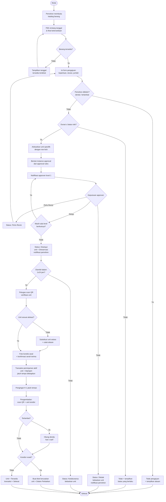

# M-08 — Reservasi Barang

> **Modul self-contained.** Seluruh yang diperlukan untuk mengimplementasikan modul ini ada di
> berkas ini: requirement, aturan bisnis, endpoint, entitas, notifikasi, permission, jejak audit,
> dan kriteria penerimaan. Baris yang dimiliki modul lain dirujuk melalui ID, tidak disalin.
>
> Isi requirement bersifat **verbatim dari PRD v1.1**. Sumber kebenaran tunggal.

## 1. Overview

Lihat [`../01-product/overview.md`](../01-product/overview.md) untuk konteks produk menyeluruh.
Modul ini adalah **M-08 — Reservasi Barang** sebagaimana terdaftar pada Daftar Modul PRD.

## 2. Scope

Cakupan modul ditentukan oleh Functional Requirement yang tercantum pada bagian 5.
Hal di luar daftar tersebut berada di luar cakupan modul ini.

## 3. Actors

Aktor per requirement tercantum pada tabel **Actor** di tiap FR (bagian 5).
Definisi role: [`../00-foundation/roles-permissions.md`](../00-foundation/roles-permissions.md).

## 4. Business Flow

## 13.1 Process Flow — Reservasi & Peminjaman Barang

## 5. Functional Requirements

### FR-08.1 Melihat Ketersediaan Barang

| Aspek | Uraian |
|---|---|
| **Description** | Menampilkan katalog barang yang dapat dipinjam beserta ketersediaannya pada rentang tanggal tertentu. |
| **Actor** | Guru, Staf/TU, Siswa/OSIS, Petugas Sarpras |
| **Preconditions** | Terdapat aset dengan `dapat_dipinjam = true`, kondisi `Baik`/`Rusak Ringan`, dan tidak berstatus `Dalam Perbaikan`/`Tidak Tersedia` |

**Main Flow**
1. Pengguna membuka menu Reservasi Barang dan menentukan rentang tanggal peminjaman.
2. Sistem menampilkan katalog barang dikelompokkan per kategori beserta jumlah unit yang tersedia pada rentang tersebut.
3. Pengguna dapat menelusuri hingga tingkat unit untuk melihat kode barang dan kondisinya.
4. Pengguna memilih barang dan jumlah unit yang dibutuhkan.

**Alternative Flow**
- **A1 — Role Siswa/OSIS:** Katalog dibatasi pada aset dengan `boleh_dipinjam_siswa = true`.
- **A2 — Seluruh unit terpesan pada rentang tanggal tersebut:** Sistem menampilkan tanggal terdekat saat unit kembali tersedia.
- **A3 — Barang berkondisi `Rusak Berat`, `Hilang`, atau berstatus `Dalam Perbaikan`:** Tidak ditampilkan sebagai tersedia.

**Post Conditions** — Tidak ada perubahan data.

**Acceptance Criteria**
- [ ] Ketersediaan dihitung dari tabel `booking_slots` (Bab 26), **bukan** dari kolom `assets.status`.
- [ ] Perhitungan ketersediaan memperhitungkan slot berstatus `Tentative` (pengajuan menunggu persetujuan), `Confirmed` (disetujui), dan `Active` (sedang dipinjam), serta blokade pemeliharaan dan blokade jadwal tetap (FR-07.5).
- [ ] Aset yang sedang `Dipinjam` hari ini **tetap** ditampilkan tersedia untuk rentang tanggal mendatang yang tidak beririsan dengan slot manapun.
- [ ] Katalog menampilkan foto barang bila tersedia.
- [ ] Ketersediaan dihitung ulang ketika pengguna mengubah rentang tanggal, dengan respons ≤ 2 detik pada volume 5.000 aset (NFR-P-05).

### FR-08.2 Pengajuan Reservasi Barang

| Aspek | Uraian |
|---|---|
| **Description** | Pengguna mengajukan pemesanan unit barang untuk rentang waktu tertentu; pengajuan masuk ke approval engine. |
| **Actor** | Guru, Staf/TU, Siswa/OSIS |
| **Preconditions** | Pengguna login dan tidak diblokir; barang tersedia pada rentang tanggal yang diminta |

**Main Flow**
1. Pengguna memilih barang dan jumlah unit dari katalog.
2. Pengguna mengisi: tanggal & jam mulai, tanggal & jam rencana pengembalian, keperluan, dan lokasi penggunaan.
3. Sistem mengalokasikan unit spesifik (`asset_id`) secara otomatis berdasarkan ketersediaan, dengan opsi bagi Petugas Sarpras untuk memilih unit tertentu secara manual.
4. Sistem memvalidasi durasi peminjaman maksimum sesuai kebijakan role (BR-021) dan kuota pengajuan tertunda pemohon (BR-023a).
5. Sistem membuat reservasi berstatus `Menunggu Persetujuan` dan **slot pemesanan berstatus `Tentative`** untuk setiap unit yang dialokasikan (Bab 26), lalu membentuk instance approval.
6. Sistem menotifikasi approver level pertama dan menampilkan nomor pengajuan.

**Alternative Flow**
- **A1 — Unit terpesan pihak lain saat pengajuan diproses:** Sistem mengalokasikan unit pengganti yang setara; bila tidak ada, pengajuan ditolak dengan penjelasan.
- **A2 — Durasi melebihi batas maksimum role:** Sistem menolak dan menampilkan batas yang berlaku.
- **A3 — Pemohon memiliki peminjaman terlambat atau denda belum lunas:** Sistem menolak pengajuan (BR-030).
- **A4 — Barang bernilai tinggi:** Approval rules dapat menambahkan level persetujuan Pimpinan Sekolah secara otomatis (FR-10.1).
- **A5 — Kuota pengajuan tertunda terlampaui:** Sistem menolak dengan pesan "Anda memiliki {n} pengajuan yang masih menunggu persetujuan. Batas maksimum {maks}." (BR-023a).
- **A6 — Pengajuan tidak diputuskan sampai batas TTL:** Slot `Tentative` otomatis kedaluwarsa dan dibebaskan (BR-023b); pemohon dan approver dinotifikasi.

**Post Conditions** — Reservasi tercatat; slot `Tentative` terbentuk untuk setiap unit pada rentang waktu yang diminta. Kolom `assets.status` **tidak** diubah pada tahap ini.

**Acceptance Criteria**
- [ ] Satu unit fisik tidak pernah memiliki dua slot beririsan waktu berstatus `Tentative`/`Confirmed`/`Active` (dijamin *exclusion constraint* basis data, bukan hanya validasi aplikasi).
- [ ] Alokasi unit dilakukan atomik dengan penguncian baris terurut menaik berdasarkan `asset_id` untuk mencegah *deadlock* pada pemesanan multi-unit.
- [ ] 50 permintaan simultan atas unit terakhir yang sama menghasilkan **tepat 1** sukses dan 49 respons `409 ASSET_NOT_AVAILABLE`.
- [ ] Pemohon melihat kode barang unit yang dialokasikan setelah pengajuan disetujui.
- [ ] `assets.status` berubah menjadi `Direservasi` hanya ketika slot `Confirmed` mulai berlaku pada waktu saat ini, bukan saat pengajuan dibuat (BR-005b).

### FR-08.3 Pembatalan Reservasi Barang

| Aspek | Uraian |
|---|---|
| **Description** | Membatalkan reservasi barang sebelum serah terima dilakukan. |
| **Actor** | Pemohon, Petugas Sarpras, Administrator |
| **Preconditions** | Reservasi berstatus `Menunggu Persetujuan` atau `Disetujui`, dan belum terjadi serah terima |

**Main Flow**
1. Pengguna membuka detail reservasi dan menekan "Batalkan" serta mengisi alasan.
2. Sistem mengubah status menjadi `Dibatalkan` dan membebaskan alokasi unit.
3. Sistem menotifikasi pihak terkait.

**Alternative Flow**
- **A1 — Reservasi tidak diambil hingga 1×24 jam setelah waktu mulai:** Sistem otomatis membatalkan (`Kedaluwarsa`), membebaskan unit, dan mencatatnya pada rekam jejak pemohon.
- **A2 — Serah terima sudah terjadi:** Pembatalan tidak diizinkan; alur beralih ke proses pengembalian.

**Post Conditions** — Unit kembali tersedia untuk pengguna lain.

**Acceptance Criteria**
- [ ] Pembebasan unit berlaku seketika setelah pembatalan.
- [ ] Pembatalan otomatis akibat tidak diambil tercatat terpisah dari pembatalan manual.

## 6. Business Rules

### Dimiliki modul ini

_Tidak ada aturan bisnis yang dimiliki modul ini._

**Aturan bersama yang juga berlaku** (dimiliki modul lain, dirujuk melalui ID — tidak disalin ke sini):

`BR-017` (m07) · `BR-018` (m07) · `BR-020` (m07) · `BR-021` (m07) · `BR-022` (m07) · `BR-023` (m07) · `BR-023a` (m07) · `BR-023b` (m07) · `BR-023c` (m07) · `BR-024` (m07) · `BR-024a` (m07) · `BR-024b` (m07) · `BR-025` (m07) · `BR-030` (m09)

## 7. API Endpoints

### Endpoint

| Method | Endpoint | Permission | Deskripsi |
|---|---|---|---|
| GET | `/assets/availability` | `reservation.view` | Ketersediaan unit barang pada rentang waktu |

Konvensi umum, format respons, kode galat, dan ketentuan keamanan API:
[`../03-architecture/api-conventions.md`](../03-architecture/api-conventions.md).

## 8. Database Entity

### Entitas

_Tidak memiliki entitas sendiri._

Model data menyeluruh dan ERD: [`../03-architecture/data-model.md`](../03-architecture/data-model.md).

## 9. Notification

### Notifikasi diterbitkan modul ini

_Modul ini tidak menerbitkan notifikasi._

Ketentuan umum kanal, latensi, dan preferensi: [`m17-notifications.md`](m17-notifications.md).

## 10. Permission

### Kode permission

_Tidak ada permission khusus modul ini._

Katalog kanonik & aturan scope: [`../00-foundation/roles-permissions.md`](../00-foundation/roles-permissions.md).

## 11. Activity Log

### Aksi yang wajib dicatat

_Tidak ada aksi khusus modul ini._

Prinsip, struktur entri, dan tamper-evidence: [`../03-architecture/activity-log.md`](../03-architecture/activity-log.md).

## 12. Acceptance Criteria

Kriteria penerimaan tercantum **inline** pada tiap Functional Requirement di bagian 5,
sesuai bentuk aslinya di PRD. Tidak diringkas maupun dipindahkan agar tidak terpisah dari
konteks requirement-nya.

Strategi pengujian: [`../06-quality/test-strategy.md`](../06-quality/test-strategy.md).

## 13. Dependencies

- [`m04-assets.md`](m04-assets.md) — M-04 Inventaris Aset
- [`m10-approval.md`](m10-approval.md) — M-10 Approval Workflow Engine
- [`m07-reservation-room.md`](m07-reservation-room.md) — M-07 Reservasi Ruangan

## 14. Related Modules

- [`m04-assets.md`](m04-assets.md) — M-04 Inventaris Aset
- [`m07-reservation-room.md`](m07-reservation-room.md) — M-07 Reservasi Ruangan
- [`m10-approval.md`](m10-approval.md) — M-10 Approval Workflow Engine

## 15. Open Issues

- Modul ini memakai endpoint dan Business Rules yang dimiliki M-07 (lihat Related Modules). Tidak ada salinan di berkas ini — perubahan aturan dilakukan di M-07.
