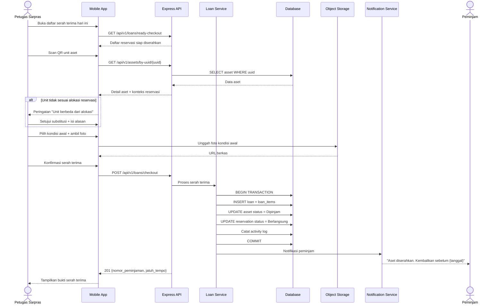
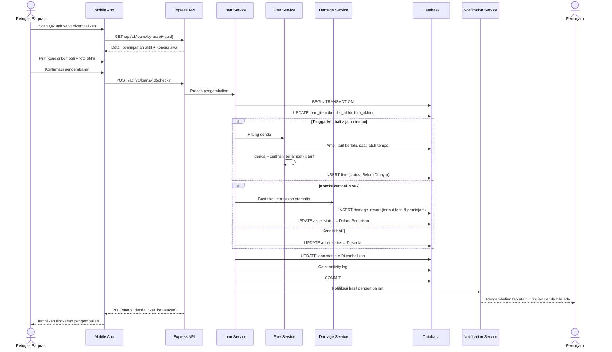
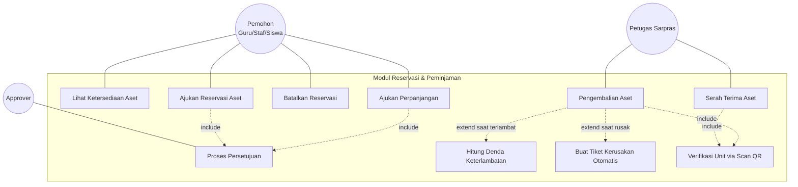

# M-09 — Peminjaman & Pengembalian

> **Modul self-contained.** Seluruh yang diperlukan untuk mengimplementasikan modul ini ada di
> berkas ini: requirement, aturan bisnis, endpoint, entitas, notifikasi, permission, jejak audit,
> dan kriteria penerimaan. Baris yang dimiliki modul lain dirujuk melalui ID, tidak disalin.
>
> Isi requirement bersifat **verbatim dari PRD v1.1**. Sumber kebenaran tunggal.

## 1. Overview

Lihat [`../01-product/overview.md`](../01-product/overview.md) untuk konteks produk menyeluruh.
Modul ini adalah **M-09 — Peminjaman & Pengembalian** sebagaimana terdaftar pada Daftar Modul PRD.

## 2. Scope

Cakupan modul ditentukan oleh Functional Requirement yang tercantum pada bagian 5.
Hal di luar daftar tersebut berada di luar cakupan modul ini.

## 3. Actors

Aktor per requirement tercantum pada tabel **Actor** di tiap FR (bagian 5).
Definisi role: [`../00-foundation/roles-permissions.md`](../00-foundation/roles-permissions.md).

## 4. Business Flow

## 15.3 Serah Terima Peminjaman via Scan QR

## 15.4 Pengembalian dengan Perhitungan Denda

## 14.2 Use Case Modul Peminjaman (Detail Relasi)

---

## 5. Functional Requirements

### FR-09.1 Serah Terima Peminjaman (Check-out)

| Aspek | Uraian |
|---|---|
| **Description** | Petugas menyerahkan unit aset kepada peminjam berdasarkan reservasi yang telah disetujui, diverifikasi melalui pemindaian QR. |
| **Actor** | Petugas Sarana Prasarana (pelaksana), Peminjam (penerima) |
| **Preconditions** | Terdapat reservasi aset berstatus `Disetujui`; unit fisik tersedia di tempat |

**Main Flow**
1. Peminjam datang; Petugas membuka daftar reservasi yang siap diserahkan hari ini.
2. Petugas memindai QR unit aset (atau memasukkan kode aset manual).
3. Sistem memverifikasi bahwa unit yang dipindai sesuai dengan unit yang dialokasikan pada reservasi.
4. Petugas mencatat kondisi awal aset dan mengunggah foto kondisi serah terima.
5. Petugas menekan "Serahkan"; peminjam melakukan konfirmasi digital (tanda tangan pada layar atau konfirmasi dari akun peminjam).
6. Sistem membuat transaksi Peminjaman berstatus `Dipinjam`, mengubah status unit menjadi `Dipinjam`, dan menetapkan tanggal jatuh tempo.
7. Sistem menotifikasi peminjam berisi rincian dan tanggal pengembalian.

**Alternative Flow**
- **A1 — Unit yang dipindai berbeda dari alokasi:** Sistem menampilkan peringatan; Petugas dapat menyetujui penggantian unit setara (dicatat sebagai `substitusi unit` beserta alasan).
- **A2 — Peminjam tidak dapat hadir dan diwakilkan:** Petugas mencatat nama penerima kuasa; tanggung jawab tetap melekat pada pemohon.
- **A3 — Kondisi aset menurun sejak reservasi disetujui:** Petugas menampilkan kondisi terkini; peminjam dapat menerima atau membatalkan.
- **A4 — Peminjaman langsung tanpa reservasi:** Hanya dapat dilakukan oleh Petugas Sarpras dengan permission `loan.direct`; sistem membuat reservasi retroaktif berstatus `Disetujui` demi konsistensi jejak audit.

**Post Conditions** — Transaksi peminjaman aktif; unit berstatus `Dipinjam`; jatuh tempo terjadwal; reminder tersiapkan.

**Acceptance Criteria**
- [ ] Serah terima tidak dapat dilakukan tanpa reservasi yang disetujui, kecuali oleh pengguna dengan permission `loan.direct`.
- [ ] Foto kondisi awal wajib ada minimal 1 berkas.
- [ ] Status unit berubah menjadi `Dipinjam` seketika dan tercermin pada katalog.
- [ ] Nomor transaksi peminjaman unik (mis. `PJM-2026-0001`).

### FR-09.2 Pengembalian Aset (Check-in)

| Aspek | Uraian |
|---|---|
| **Description** | Peminjam mengembalikan unit; Petugas memverifikasi kondisi, menghitung denda bila terlambat, dan menutup transaksi. |
| **Actor** | Petugas Sarana Prasarana (pelaksana), Peminjam |
| **Preconditions** | Terdapat transaksi peminjaman berstatus `Dipinjam` |

**Main Flow**
1. Peminjam menyerahkan aset; Petugas memindai QR unit.
2. Sistem menampilkan detail peminjaman: peminjam, tanggal pinjam, jatuh tempo, kondisi awal, dan foto serah terima.
3. Petugas memeriksa fisik aset, memilih kondisi kembali (Baik / Rusak Ringan / Rusak Berat / Tidak Lengkap), dan mengunggah foto kondisi akhir.
4. Sistem menghitung keterlambatan: `hari_terlambat = tanggal_kembali - tanggal_jatuh_tempo` (dibulatkan ke atas per hari kalender).
5. Bila terlambat, sistem menerbitkan denda: `denda = hari_terlambat × tarif_denda_per_hari` (tarif dikonfigurasi Administrator — FR-20.1).
6. Petugas menekan "Konfirmasi Pengembalian".
7. Sistem menutup transaksi (`Dikembalikan`), mengubah status unit menjadi `Tersedia`, dan menotifikasi peminjam.

**Alternative Flow**
- **A1 — Aset kembali dalam kondisi rusak:** Sistem otomatis membuat Laporan Kerusakan tertaut ke transaksi peminjaman dan peminjam; status unit ditetapkan sesuai tabel klarifikasi transisi pada Bab 12.2 (`Tidak Tersedia` bila work order belum terbit, `Dalam Perbaikan` bila work order langsung dibuat). Seluruh slot pemesanan mendatang atas unit tersebut dibatalkan otomatis.
- **A2 — Aset hilang / tidak dikembalikan:** Petugas menandai `Hilang`; sistem mengubah kondisi aset menjadi `Hilang`, membuat catatan tanggung jawab peminjam, menerbitkan **kewajiban ganti rugi** sebesar nilai perolehan atau nilai penggantian yang ditetapkan (BR-028d), dan menotifikasi Pimpinan Sekolah. Denda keterlambatan berhenti bertambah sejak aset dinyatakan hilang.
- **A3 — Pengembalian sebagian** (reservasi lebih dari satu unit): Sistem mencatat pengembalian per unit; transaksi tetap berstatus `Sebagian Dikembalikan` hingga seluruh unit kembali.
- **A4 — Terlambat namun ada alasan sah:** Petugas Sarpras atau Administrator dapat membebaskan denda (`Dibebaskan`) dengan alasan wajib.
- **A5 — Perpanjangan sebelum jatuh tempo:** Peminjam mengajukan perpanjangan; bila unit tidak dipesan pihak lain dan disetujui approver, jatuh tempo diperbarui tanpa denda.

**Post Conditions** — Unit kembali tersedia atau masuk alur perbaikan; denda tercatat bila ada; riwayat peminjaman lengkap.

**Acceptance Criteria**
- [ ] Perhitungan denda tepat sesuai jumlah hari keterlambatan dan tarif yang berlaku saat jatuh tempo.
- [ ] Pembebasan denda hanya dapat dilakukan role berwenang dan wajib menyertakan alasan.
- [ ] Foto kondisi akhir wajib ada minimal 1 berkas.
- [ ] Pengembalian sebagian tidak menutup transaksi induk.

### FR-09.3 Pemantauan Peminjaman & Keterlambatan

| Aspek | Uraian |
|---|---|
| **Description** | Daftar pantau seluruh peminjaman aktif, jatuh tempo, dan keterlambatan, disertai pengingat otomatis. |
| **Actor** | Petugas Sarpras, Administrator, Pimpinan Sekolah; Peminjam (miliknya sendiri) |
| **Preconditions** | Terdapat transaksi peminjaman |

**Main Flow**
1. Pengguna membuka menu Peminjaman.
2. Sistem menampilkan tab: Aktif, Akan Jatuh Tempo (≤ 3 hari), Terlambat, dan Selesai.
3. Pengguna memfilter berdasarkan peminjam, kategori aset, dan rentang tanggal.
4. Sistem menjalankan tugas terjadwal harian untuk mengirim pengingat H-1 jatuh tempo dan notifikasi harian keterlambatan.

**Alternative Flow**
- **A1 — Peminjam melihat halaman ini:** Hanya menampilkan transaksi miliknya sendiri beserta status dendanya.
- **A2 — Ekspor daftar keterlambatan:** Pengguna berwenang mengekspor ke XLSX/PDF untuk tindak lanjut administratif.

**Post Conditions** — Tidak ada perubahan data selain status `Terlambat` yang diperbarui otomatis oleh sistem.

**Acceptance Criteria**
- [ ] Status `Terlambat` diperbarui otomatis setiap hari pukul 00:05 waktu lokal.
- [ ] Pengingat H-1 terkirim ke seluruh peminjam yang jatuh tempo esok hari.
- [ ] Notifikasi keterlambatan dikirim maksimal satu kali per hari per transaksi.

### FR-09.4 Pengelolaan Denda

| Aspek | Uraian |
|---|---|
| **Description** | Pencatatan, penagihan, pelunasan, dan pembebasan denda keterlambatan. Sistem tidak memproses pembayaran daring, hanya mencatat statusnya. |
| **Actor** | Petugas Sarana Prasarana, Administrator; Peminjam (melihat) |
| **Preconditions** | Terdapat denda terbit akibat keterlambatan |

**Main Flow**
1. Denda terbit otomatis saat pengembalian terlambat, berstatus `Belum Dibayar`.
2. Peminjam melihat rincian denda pada menu "Denda Saya" beserta nomor transaksi dan jumlah hari terlambat.
3. Peminjam membayar secara luring kepada Petugas Sarpras.
4. Petugas membuka data denda, menekan "Tandai Lunas", mengisi tanggal pembayaran dan nomor bukti, lalu menyimpan.
5. Sistem mengubah status denda menjadi `Lunas` dan menotifikasi peminjam.

**Alternative Flow**
- **A1 — Pembebasan denda keterlambatan:** Administrator atau Petugas Sarpras menandai `Dibebaskan` dengan alasan wajib; tercatat di activity log (BR-031).
- **A1a — Pembebasan ganti rugi:** Hanya Pimpinan Sekolah, penuh atau sebagian, dengan alasan wajib; tercatat di activity log sebagai `COMPENSATION_WAIVED` (BR-028e).
- **A2 — Denda menumpuk melewati ambang batas:** Sistem otomatis memblokir pengajuan baru dari peminjam sampai denda diselesaikan (BR-030).
- **A3 — Rekap denda:** Petugas mengekspor rekap denda per periode untuk pelaporan ke bendahara.

**Post Conditions** — Status denda terbarui; blokir pemohon terbuka ketika seluruh denda lunas atau dibebaskan.

**Acceptance Criteria**
- [ ] Denda dicatat **per unit yang dipinjam (`loan_item`)**, bukan per transaksi peminjaman — agar pengembalian sebagian dengan keterlambatan berbeda per unit dapat dihitung benar (BR-028a).
- [ ] Perubahan status denda hanya dapat dilakukan role berwenang.
- [ ] Pembebasan `Ganti Rugi` ditolak bagi Administrator dan Petugas Sarpras, dan diterima bagi Pimpinan Sekolah (BR-028e).
- [ ] Pembebasan sebagian menyisakan tagihan `jumlah − jumlah_dibebaskan` dan tetap terhitung pada ambang BR-030.
- [ ] Denda yang sudah `Lunas` tidak dapat diubah kembali kecuali oleh Administrator, dengan pencatatan alasan.
- [ ] Rekap denda per periode dapat diekspor ke XLSX/PDF.
- [ ] Total kewajiban pemohon adalah penjumlahan seluruh denda keterlambatan dan ganti rugi yang berstatus `Belum Dibayar`.

### FR-09.5 Perpanjangan Peminjaman

| Aspek | Uraian |
|---|---|
| **Description** | Peminjam mengajukan perpanjangan tanggal jatuh tempo sebelum peminjaman berakhir. Sebelumnya hanya disinggung pada FR-09.2 A5 dan BR-034 tanpa spesifikasi sendiri, padahal merupakan jenis pengajuan tersendiri di approval engine dan memiliki endpoint API. |
| **Actor** | Peminjam (pemohon), Approver sesuai approval rules |
| **Preconditions** | Terdapat peminjaman berstatus `Dipinjam` yang **belum** melewati jatuh tempo; pengguna memiliki permission `loan.extend` |

**Main Flow**
1. Peminjam membuka detail peminjamannya dan menekan "Ajukan Perpanjangan".
2. Peminjam mengisi tanggal jatuh tempo baru dan alasan perpanjangan.
3. Sistem memvalidasi: peminjaman belum jatuh tempo, durasi total (asli + perpanjangan) tidak melebihi batas maksimum role (BR-021), jumlah perpanjangan belum melebihi batas yang dikonfigurasi (bawaan: 1 kali), dan **tidak ada slot pemesanan pihak lain** yang beririsan dengan perpanjangan yang diminta.
4. Sistem memperpanjang slot `Active` unit terkait secara *tentative* dan membentuk instance approval jenis "Perpanjangan Peminjaman".
5. Setelah disetujui, sistem memperbarui `tanggal_jatuh_tempo`, memperpanjang slot, dan menjadwalkan ulang pengingat H-1.

**Alternative Flow**
- **A1 — Unit sudah dipesan pihak lain pada periode perpanjangan:** Sistem menolak dan menampilkan tanggal jatuh tempo maksimum yang masih memungkinkan.
- **A2 — Peminjaman sudah terlambat:** Sistem menolak; perpanjangan tidak dapat menghapus keterlambatan yang telah terjadi (BR-034).
- **A3 — Batas jumlah perpanjangan tercapai:** Sistem menolak dan mengarahkan peminjam untuk mengembalikan aset lalu mengajukan reservasi baru.
- **A4 — Pengajuan ditolak approver:** Jatuh tempo asli tetap berlaku; slot tentative perpanjangan dilepas; peminjam dinotifikasi.
- **A5 — Perpanjangan disetujui setelah jatuh tempo lewat:** Denda yang telah terbit untuk hari-hari sebelum keputusan **tetap berlaku**; perpanjangan hanya berlaku prospektif.

**Post Conditions** — Jatuh tempo diperbarui bila disetujui; jejak approval tersimpan; tidak ada denda yang timbul selama periode perpanjangan yang disetujui.

**Acceptance Criteria**
- [ ] Perpanjangan hanya dapat diajukan sebelum jatuh tempo (BR-034).
- [ ] Sistem tidak pernah menyetujui perpanjangan yang bertabrakan dengan slot pemesanan pihak lain.
- [ ] Jumlah perpanjangan per peminjaman dibatasi parameter sistem dan tercatat pada riwayat.
- [ ] Riwayat jatuh tempo (asli dan hasil perpanjangan) tersimpan dan tampil pada detail peminjaman.
- [ ] Perpanjangan dapat diajukan dan disetujui dari perangkat mobile.

## 6. Business Rules

### Dimiliki modul ini

| Kode | Business Rule |
|---|---|
| BR-026 | Serah terima peminjaman hanya dapat dilakukan atas reservasi berstatus `Disetujui`, kecuali oleh pengguna dengan permission `loan.direct`. |
| BR-026a | Peminjaman langsung dengan permission `loan.direct` merupakan **satu-satunya pengecualian sah** terhadap BR-035. Sistem membentuk reservasi retroaktif berstatus `Disetujui` dengan penanda `bypass_approval = true` beserta alasan wajib, dan mencatatnya sebagai anomali pada activity log serta laporan kepatuhan bulanan. |
| BR-027 | Serah terima dan pengembalian wajib disertai verifikasi unit (pemindaian QR atau input kode aset) dan minimal satu foto kondisi. |
| BR-028 | Denda keterlambatan dihitung `jumlah_hari_terlambat × tarif_denda_per_hari`, dengan pembulatan ke atas pada satuan **hari kalender** (bukan hari kerja). Definisi hari mengikuti Lampiran E. |
| BR-028a | Denda diterbitkan **per unit yang dipinjam (`loan_item`)**, bukan per transaksi peminjaman. Pada pengembalian sebagian, setiap unit dihitung keterlambatannya sendiri. |
| BR-028b | Denda keterlambatan per unit dibatasi maksimum (*cap*) sebesar persentase nilai perolehan unit tersebut yang dikonfigurasi Administrator (bawaan 30%), atau nominal maksimum bila nilai perolehan tidak diketahui. Cap mencegah denda melampaui nilai asetnya sendiri. |
| BR-028c | Hari libur sekolah **tetap dihitung** sebagai hari keterlambatan, kecuali Administrator mengaktifkan parameter "kecualikan hari libur". Kebijakan yang dipilih wajib disosialisasikan kepada pengguna sebelum go-live (RS-16). |
| BR-028d | Aset yang dinyatakan `Hilang` atau rusak berat akibat kelalaian peminjam menimbulkan **kewajiban ganti rugi** terpisah dari denda keterlambatan, sebesar nilai perolehan aset atau nilai penggantian yang ditetapkan Petugas Sarpras dengan persetujuan Pimpinan Sekolah. Kewajiban ini dicatat dengan jenis `Ganti Rugi` dan mengikuti alur status yang sama dengan denda. |
| BR-028e | Kewajiban berjenis `Ganti Rugi` dapat dibebaskan sepenuhnya atau sebagian **hanya oleh Pimpinan Sekolah**, melalui permission `fine.waive_compensation`, dengan alasan wajib dan tercatat pada activity log. Petugas Sarpras maupun Administrator tidak berwenang membebaskannya — `fine.waive` (BR-031) tidak berlaku atas jenis ini. Pembebasan sebagian mengisi `jumlah_dibebaskan` dan menyisakan tagihan sebesar `jumlah − jumlah_dibebaskan` dengan status `Dibebaskan Sebagian`; kewajiban tersisa tetap diperhitungkan pada ambang pemblokiran BR-030. |
| BR-029 | Tarif denda yang berlaku adalah tarif pada saat tanggal jatuh tempo, bukan tarif saat pengembalian. |
| BR-030 | Pengguna yang memiliki peminjaman terlambat yang belum dikembalikan, atau denda `Belum Dibayar` melebihi ambang yang dikonfigurasi, diblokir dari mengajukan reservasi/peminjaman baru sampai kewajibannya diselesaikan. |
| BR-031 | Pembebasan denda berjenis `Keterlambatan` hanya dapat dilakukan oleh Administrator atau Petugas Sarana Prasarana, wajib menyertakan alasan, dan tercatat pada activity log. Pembebasan berjenis `Ganti Rugi` tunduk pada BR-028e, bukan aturan ini. |
| BR-032 | Aset yang kembali dalam kondisi rusak otomatis menghasilkan tiket Laporan Kerusakan yang tertaut ke transaksi peminjaman dan peminjamnya. |
| BR-033 | Tanggung jawab peminjaman tetap melekat pada pemohon meskipun pengambilan aset diwakilkan pihak lain. |
| BR-034 | Perpanjangan peminjaman hanya dapat diajukan sebelum jatuh tempo, hanya bila unit tidak dipesan pihak lain, dan wajib melalui persetujuan. |

**Aturan bersama yang juga berlaku** (dimiliki modul lain, dirujuk melalui ID — tidak disalin ke sini):

`BR-005` (m04) · `BR-017` (m07)

## 7. API Endpoints

### Endpoint

| Method | Endpoint | Permission | Deskripsi |
|---|---|---|---|
| GET | `/loans/ready-checkout` | `loan.manage` | Reservasi siap diserahkan hari ini |
| POST | `/loans/checkout` | `loan.manage` | Proses serah terima |
| GET | `/loans/by-asset/{uuid}` | `loan.manage` | Peminjaman aktif atas suatu unit |
| POST | `/loans/{id}/checkin` | `loan.manage` | Proses pengembalian |
| POST | `/loans/{id}/extend` | `loan.extend` | Ajukan perpanjangan |
| GET | `/loans` | `loan.view` | Daftar peminjaman (tab aktif/terlambat/selesai) |
| GET | `/fines` | `fine.view` | Daftar denda |
| PATCH | `/fines/{id}/pay` | `fine.manage` | Tandai lunas |
| PATCH | `/fines/{id}/waive` | `fine.waive` | Bebaskan denda keterlambatan + alasan |
| PATCH | `/fines/{id}/waive-compensation` | `fine.waive_compensation` | Bebaskan ganti rugi penuh/sebagian + alasan |

Konvensi umum, format respons, kode galat, dan ketentuan keamanan API:
[`../03-architecture/api-conventions.md`](../03-architecture/api-conventions.md).

## 8. Database Entity

### Entitas

| Entitas | Deskripsi | Atribut Utama | Keterangan |
|---|---|---|---|
| **loans** | Transaksi peminjaman | id, nomor, reservation_id, peminjam_id, petugas_serah_id, tanggal_pinjam, tanggal_jatuh_tempo, tanggal_kembali, status | ± 2.500 |
| **loan_items** | Unit yang dipinjam & kondisinya | id, loan_id, asset_id, kondisi_awal, kondisi_akhir, foto_awal, foto_akhir, status_kembali | ± 5.000 |
| **fines** | Denda keterlambatan & ganti rugi | id, **loan_item_id**, loan_id, peminjam_id, jenis (`Keterlambatan`/`Ganti Rugi`), hari_terlambat, tarif_per_hari, jumlah_sebelum_cap, jumlah, status, tanggal_bayar, nomor_bukti, jumlah_dibebaskan, alasan_pembebasan, dibebaskan_oleh | ± 300 |

Model data menyeluruh dan ERD: [`../03-architecture/data-model.md`](../03-architecture/data-model.md).

## 9. Notification

### Notifikasi diterbitkan modul ini

| Kode | Event Pemicu | Penerima | Kanal | Wajib | Contoh Isi |
|---|---|---|---|:---:|---|
| **NT-10** | Serah terima aset selesai | Peminjam | In-app + Push | ❌ | "{jumlah} unit {aset} telah diserahkan. Kembalikan sebelum {tanggal}." |
| **NT-11** | Pengingat H-1 jatuh tempo | Peminjam | In-app + Push | ✅ | "Pengembalian {aset} jatuh tempo besok, {tanggal}." |
| **NT-12** | Peminjaman terlambat (harian) | Peminjam | In-app + Push | ✅ | "{aset} terlambat {n} hari. Denda berjalan Rp{jumlah}." |
| **NT-13** | Rekap keterlambatan harian | Petugas Sarpras | In-app | ❌ | "{n} peminjaman terlambat perlu ditindaklanjuti." |
| **NT-14** | Pengembalian tercatat | Peminjam | In-app + Push | ❌ | "Pengembalian {aset} tercatat pada {tanggal}." |
| **NT-15** | Denda terbit | Peminjam | In-app + Push | ✅ | "Denda keterlambatan Rp{jumlah} terbit atas peminjaman {nomor}." |
| **NT-16** | Denda dilunasi | Peminjam | In-app | ❌ | "Denda Rp{jumlah} telah dinyatakan lunas." |
| **NT-17** | Denda atau ganti rugi dibebaskan, penuh maupun sebagian | Peminjam | In-app | ❌ | "Kewajiban Rp{jumlah_dibebaskan} dibebaskan. Sisa tagihan Rp{sisa}. Alasan: {alasan}." |
| **NT-18** | Pemohon diblokir karena kewajiban tertunggak | Pemohon | In-app + Push | ✅ | "Anda tidak dapat mengajukan peminjaman baru hingga kewajiban diselesaikan." |

Ketentuan umum kanal, latensi, dan preferensi: [`m17-notifications.md`](m17-notifications.md).

## 10. Permission

### Kode permission

| Kode | Domain | Deskripsi singkat | Role bawaan pemilik |
|---|---|---|---|
| `loan.view` | Peminjaman | Melihat transaksi peminjaman | Semua (scope berbeda) |
| `loan.manage` | Peminjaman | Serah terima & pengembalian | Admin, Petugas |
| `loan.direct` | Peminjaman | Peminjaman langsung tanpa reservasi | Admin, Petugas |
| `loan.extend` | Peminjaman | Mengajukan perpanjangan | Guru, Staf, Siswa, Petugas |
| `fine.view` | Denda | Melihat denda | Semua (scope berbeda) |
| `fine.manage` | Denda | Menandai lunas | Admin, Petugas |
| `fine.waive` | Denda | Membebaskan denda berjenis `Keterlambatan` | Admin, Petugas |
| `fine.waive_compensation` | Denda | Membebaskan kewajiban `Ganti Rugi`, penuh atau sebagian | Pimpinan |

Katalog kanonik & aturan scope: [`../00-foundation/roles-permissions.md`](../00-foundation/roles-permissions.md).

## 11. Activity Log

### Aksi yang wajib dicatat

| Aksi | Keterangan |
|---|---|
| `LOAN_CHECKOUT` | Serah terima beserta unit dan kondisi awal |
| `LOAN_UNIT_SUBSTITUTED` | Penggantian unit saat serah terima beserta alasan |
| `LOAN_CHECKIN` | Pengembalian beserta kondisi akhir |
| `LOAN_EXTENDED` | Perpanjangan yang disetujui |
| `LOAN_MARKED_LOST` | Penetapan aset hilang |
| `FINE_ISSUED` / `FINE_PAID` / `FINE_WAIVED` | Termasuk alasan pembebasan |
| `COMPENSATION_WAIVED` | Pembebasan ganti rugi oleh Pimpinan beserta alasan dan nilai yang dibebaskan (BR-028e) |
| `BORROWER_BLOCKED` / `BORROWER_UNBLOCKED` | Pemblokiran akibat kewajiban tertunggak |

Prinsip, struktur entri, dan tamper-evidence: [`../03-architecture/activity-log.md`](../03-architecture/activity-log.md).

## 12. Acceptance Criteria

Kriteria penerimaan tercantum **inline** pada tiap Functional Requirement di bagian 5,
sesuai bentuk aslinya di PRD. Tidak diringkas maupun dipindahkan agar tidak terpisah dari
konteks requirement-nya.

Strategi pengujian: [`../06-quality/test-strategy.md`](../06-quality/test-strategy.md).

## 13. Dependencies

- [`m08-reservation-item.md`](m08-reservation-item.md) — M-08 Reservasi Aset
- [`m10-approval.md`](m10-approval.md) — M-10 Approval Workflow Engine
- [`m11-damage-reports.md`](m11-damage-reports.md) — M-11 Laporan Kerusakan

## 14. Related Modules

- [`m08-reservation-item.md`](m08-reservation-item.md) — M-08 Reservasi Aset
- [`m10-approval.md`](m10-approval.md) — M-10 Approval Workflow Engine
- [`m11-damage-reports.md`](m11-damage-reports.md) — M-11 Laporan Kerusakan

## 15. Open Issues

- BR-030 (pemblokiran pemohon) ditegakkan saat pengajuan reservasi di M-07/M-08, namun aturannya dimiliki modul ini karena bersumber dari kewajiban peminjaman.
