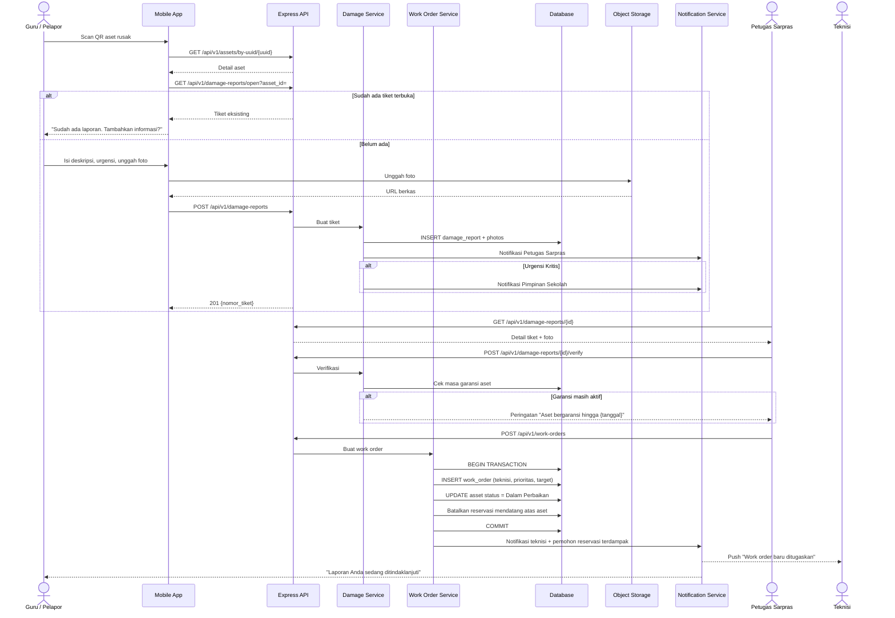
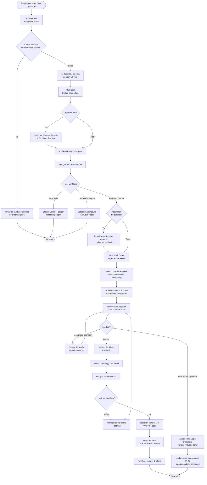

# M-11 — Laporan Kerusakan

> **Modul self-contained.** Seluruh yang diperlukan untuk mengimplementasikan modul ini ada di
> berkas ini: requirement, aturan bisnis, endpoint, entitas, notifikasi, permission, jejak audit,
> dan kriteria penerimaan. Baris yang dimiliki modul lain dirujuk melalui ID, tidak disalin.
>
> Isi requirement bersifat **verbatim dari PRD v1.1**. Sumber kebenaran tunggal.

## 1. Overview

Lihat [`../01-product/overview.md`](../01-product/overview.md) untuk konteks produk menyeluruh.
Modul ini adalah **M-11 — Laporan Kerusakan** sebagaimana terdaftar pada Daftar Modul PRD.

## 2. Scope

Cakupan modul ditentukan oleh Functional Requirement yang tercantum pada bagian 5.
Hal di luar daftar tersebut berada di luar cakupan modul ini.

## 3. Actors

Aktor per requirement tercantum pada tabel **Actor** di tiap FR (bagian 5).
Definisi role: [`../00-foundation/roles-permissions.md`](../00-foundation/roles-permissions.md).

## 4. Business Flow

## 15.5 Laporan Kerusakan hingga Work Order

## 13.2 Process Flow — Laporan Kerusakan hingga Work Order Selesai

## 5. Functional Requirements

### FR-11.1 Melaporkan Kerusakan

| Aspek | Uraian |
|---|---|
| **Description** | Pengguna melaporkan kerusakan aset atau fasilitas, disertai deskripsi, foto, dan tingkat urgensi. |
| **Actor** | Guru, Staf/TU, Siswa/OSIS, Petugas Sarpras, Teknisi |
| **Preconditions** | Pengguna login; aset/ruangan yang dilaporkan terdaftar |

**Main Flow**
1. Pengguna menekan "Lapor Kerusakan" (dari menu, dari detail aset, atau setelah memindai QR).
2. Sistem mengisi otomatis identitas aset bila laporan berasal dari pemindaian QR.
3. Pengguna mengisi: objek yang rusak (aset atau ruangan), deskripsi kerusakan, tingkat urgensi (Rendah / Sedang / Tinggi / Kritis), dan mengunggah 1–5 foto.
4. Sistem membuat tiket berstatus `Dilaporkan` dengan nomor tiket unik.
5. Sistem menotifikasi Petugas Sarana Prasarana; untuk urgensi `Kritis`, Pimpinan Sekolah juga dinotifikasi.

**Alternative Flow**
- **A1 — Sudah ada tiket terbuka untuk aset yang sama:** Sistem menampilkan tiket tersebut dan menawarkan opsi "Tambahkan informasi ke tiket yang ada" alih-alih membuat duplikat.
- **A2 — Foto tidak dapat diunggah karena koneksi lemah:** Sistem menyimpan tiket dan menandai unggahan foto tertunda; pengguna dapat melengkapi kemudian.
- **A3 — Kerusakan terdeteksi saat pengembalian aset:** Tiket dibuat otomatis oleh sistem dan tertaut ke transaksi peminjaman serta peminjamnya.
- **A4 — Objek adalah ruangan, bukan aset:** Pengguna memilih ruangan dari daftar lokasi; tiket tertaut ke lokasi.

**Post Conditions** — Tiket kerusakan tercatat; Petugas Sarpras dinotifikasi; kondisi aset belum berubah hingga diverifikasi.

**Acceptance Criteria**
- [ ] Minimal satu foto wajib diunggah, kecuali laporan dibuat otomatis oleh sistem.
- [ ] Nomor tiket unik dan mudah dibaca (mis. `KRS-2026-0001`).
- [ ] Pelapor dapat memantau status tiketnya kapan saja.
- [ ] Laporan berurgensi `Kritis` menghasilkan notifikasi ke Pimpinan Sekolah ≤ 60 detik.

### FR-11.2 Verifikasi & Tindak Lanjut Laporan

| Aspek | Uraian |
|---|---|
| **Description** | Petugas Sarpras memverifikasi kebenaran laporan dan menentukan tindak lanjutnya. |
| **Actor** | Petugas Sarana Prasarana, Administrator |
| **Preconditions** | Terdapat tiket berstatus `Dilaporkan` |

**Main Flow**
1. Petugas membuka daftar laporan kerusakan dan memilih tiket.
2. Petugas memeriksa deskripsi dan foto, serta dapat memeriksa fisik di lokasi.
3. Petugas memutuskan tindak lanjut:
   - **Buat Work Order** → tiket berstatus `Diverifikasi`, dilanjutkan ke FR-12.1
   - **Perbaikan ringan langsung** → tiket langsung ditutup `Selesai` dengan catatan
   - **Tolak** → tiket berstatus `Ditolak` beserta alasan
4. Petugas memperbarui kondisi aset bila diperlukan.
5. Sistem menotifikasi pelapor mengenai hasil verifikasi.

**Alternative Flow**
- **A1 — Kerusakan berat dan aset tidak dapat dipakai:** Petugas mengubah status aset menjadi `Tidak Tersedia` dan sistem membatalkan reservasi mendatang atas aset tersebut.
- **A2 — Kerusakan akibat kelalaian peminjam:** Petugas menautkan tiket ke transaksi peminjaman dan mencatat pihak yang bertanggung jawab.
- **A3 — Aset masih dalam masa garansi:** Sistem menampilkan peringatan garansi aktif beserta dokumen garansinya agar perbaikan diajukan ke penjamin.

**Post Conditions** — Tiket berpindah status; work order terbentuk bila diperlukan; kondisi aset tersesuaikan.

**Acceptance Criteria**
- [ ] Penolakan tiket wajib menyertakan alasan yang terlihat oleh pelapor.
- [ ] Sistem menampilkan peringatan otomatis bila aset masih bergaransi.
- [ ] Waktu verifikasi tercatat untuk pengukuran SLA (SC-07).

### FR-11.3 Pemantauan Status Kerusakan

| Aspek | Uraian |
|---|---|
| **Description** | Daftar pantau seluruh tiket kerusakan beserta statusnya, dengan filter dan indikator SLA. |
| **Actor** | Petugas Sarpras, Administrator, Pimpinan Sekolah, Teknisi; Pelapor (miliknya sendiri) |
| **Preconditions** | Terdapat tiket kerusakan |

**Main Flow**
1. Pengguna membuka menu Laporan Kerusakan.
2. Sistem menampilkan tiket dikelompokkan per status: Dilaporkan, Diverifikasi, Dalam Perbaikan, Selesai, Ditolak.
3. Pengguna memfilter berdasarkan urgensi, lokasi, kategori aset, rentang tanggal, dan pelapor.
4. Sistem menampilkan indikator tiket yang melampaui SLA tindak lanjut.

**Alternative Flow**
- **A1 — Pelapor:** Hanya melihat tiket yang dibuatnya.
- **A2 — Teknisi:** Hanya melihat tiket yang tertaut work order miliknya.

**Post Conditions** — Tidak ada perubahan data.

**Acceptance Criteria**
- [ ] Tiket melebihi SLA ditandai visual yang jelas.
- [ ] Daftar dapat diekspor oleh pengguna dengan permission `report.export`.

## 6. Business Rules

### Dimiliki modul ini

| Kode | Business Rule |
|---|---|
| BR-044 | Laporan kerusakan yang dibuat pengguna wajib menyertakan minimal satu foto, kecuali laporan yang dihasilkan otomatis oleh sistem. |
| BR-045 | Tiket kerusakan wajib diverifikasi Petugas Sarana Prasarana sebelum menjadi work order. |

**Aturan bersama yang juga berlaku** (dimiliki modul lain, dirujuk melalui ID — tidak disalin ke sini):

`BR-032` (m09) · `BR-052` (m12)

## 7. API Endpoints

### Endpoint

| Method | Endpoint | Permission | Deskripsi |
|---|---|---|---|
| POST | `/damage-reports` | `damage.create` | Buat tiket kerusakan |
| GET | `/damage-reports` | `damage.view` | Daftar tiket (tersaring sesuai role) |
| GET | `/damage-reports/{id}` | `damage.view` | Detail tiket beserta foto |
| GET | `/damage-reports/open` | `damage.view` | Tiket terbuka untuk aset tertentu |
| POST | `/damage-reports/{id}/verify` | `damage.verify` | Verifikasi / tolak tiket |

Konvensi umum, format respons, kode galat, dan ketentuan keamanan API:
[`../03-architecture/api-conventions.md`](../03-architecture/api-conventions.md).

## 8. Database Entity

### Entitas

| Entitas | Deskripsi | Atribut Utama | Keterangan |
|---|---|---|---|
| **damage_reports** | Tiket laporan kerusakan | id, nomor, pelapor_id, asset_id, room_id, deskripsi, urgensi, status, loan_id, verified_by, verified_at | ± 600 |
| **damage_report_photos** | Foto laporan kerusakan | id, damage_report_id, path, urutan | ± 1.800 |

Model data menyeluruh dan ERD: [`../03-architecture/data-model.md`](../03-architecture/data-model.md).

## 9. Notification

### Notifikasi diterbitkan modul ini

| Kode | Event Pemicu | Penerima | Kanal | Wajib | Contoh Isi |
|---|---|---|---|:---:|---|
| **NT-19** | Laporan kerusakan baru | Petugas Sarpras | In-app + Push | ✅ | "Laporan kerusakan {nomor} atas {aset} dari {pelapor}." |
| **NT-20** | Laporan kerusakan urgensi Kritis | Petugas Sarpras + Pimpinan Sekolah | In-app + Push | ✅ | "KRITIS: {aset} di {lokasi} dilaporkan rusak berat." |
| **NT-21** | Laporan diverifikasi / ditolak | Pelapor | In-app + Push | ❌ | "Laporan {nomor} telah {diverifikasi/ditolak}. {catatan}" |

Ketentuan umum kanal, latensi, dan preferensi: [`m17-notifications.md`](m17-notifications.md).

## 10. Permission

### Kode permission

| Kode | Domain | Deskripsi singkat | Role bawaan pemilik |
|---|---|---|---|
| `damage.create` | Kerusakan | Membuat tiket kerusakan | Semua role |
| `damage.view` | Kerusakan | Melihat tiket | Semua (scope berbeda) |
| `damage.verify` | Kerusakan | Verifikasi/menolak tiket | Admin, Petugas |

Katalog kanonik & aturan scope: [`../00-foundation/roles-permissions.md`](../00-foundation/roles-permissions.md).

## 11. Activity Log

### Aksi yang wajib dicatat

| Aksi | Keterangan |
|---|---|
| `DAMAGE_REPORTED` / `DAMAGE_VERIFIED` / `DAMAGE_REJECTED` / `DAMAGE_CLOSED` | Siklus tiket |

Prinsip, struktur entri, dan tamper-evidence: [`../03-architecture/activity-log.md`](../03-architecture/activity-log.md).

## 12. Acceptance Criteria

Kriteria penerimaan tercantum **inline** pada tiap Functional Requirement di bagian 5,
sesuai bentuk aslinya di PRD. Tidak diringkas maupun dipindahkan agar tidak terpisah dari
konteks requirement-nya.

Strategi pengujian: [`../06-quality/test-strategy.md`](../06-quality/test-strategy.md).

## 13. Dependencies

- [`m04-assets.md`](m04-assets.md) — M-04 Inventaris Aset
- [`m03-locations.md`](m03-locations.md) — M-03 Manajemen Lokasi

## 14. Related Modules

- [`m03-locations.md`](m03-locations.md) — M-03 Manajemen Lokasi
- [`m04-assets.md`](m04-assets.md) — M-04 Inventaris Aset

## 15. Open Issues

- BR-032 (aset kembali rusak menghasilkan tiket otomatis) dimiliki M-09; modul ini adalah konsumennya.
