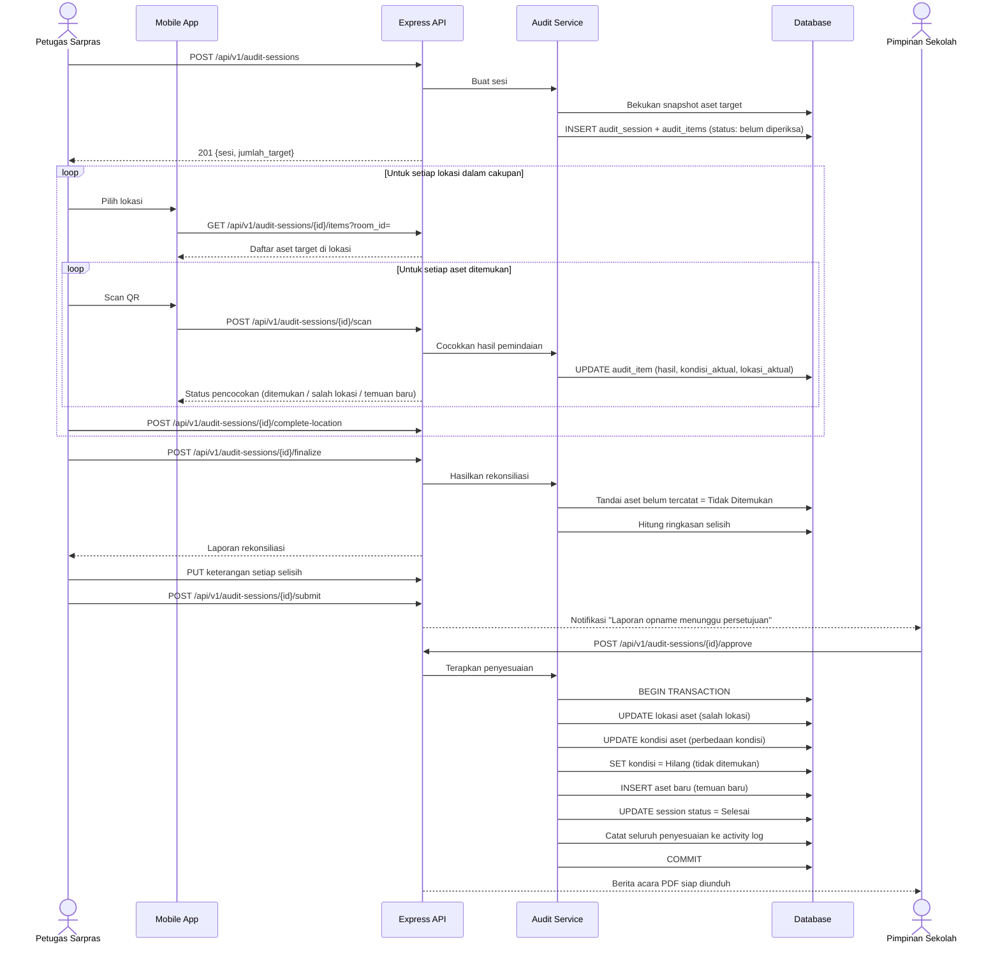
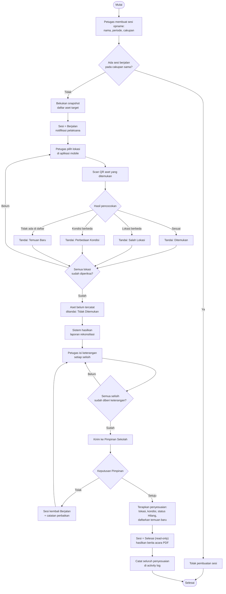

# M-13 — Audit & Stock Opname

> **Modul self-contained.** Seluruh yang diperlukan untuk mengimplementasikan modul ini ada di
> berkas ini: requirement, aturan bisnis, endpoint, entitas, notifikasi, permission, jejak audit,
> dan kriteria penerimaan. Baris yang dimiliki modul lain dirujuk melalui ID, tidak disalin.
>
> Isi requirement bersifat **verbatim dari PRD v1.1**. Sumber kebenaran tunggal.

## 1. Overview

Lihat [`../01-product/overview.md`](../01-product/overview.md) untuk konteks produk menyeluruh.
Modul ini adalah **M-13 — Audit & Stock Opname** sebagaimana terdaftar pada Daftar Modul PRD.

## 2. Scope

Cakupan modul ditentukan oleh Functional Requirement yang tercantum pada bagian 5.
Hal di luar daftar tersebut berada di luar cakupan modul ini.

## 3. Actors

Aktor per requirement tercantum pada tabel **Actor** di tiap FR (bagian 5).
Definisi role: [`../00-foundation/roles-permissions.md`](../00-foundation/roles-permissions.md).

## 4. Business Flow

## 15.7 Stock Opname via Scan QR

---

## 13.3 Process Flow — Stock Opname

## 5. Functional Requirements

### FR-13.1 Membuat Sesi Stock Opname

| Aspek | Uraian |
|---|---|
| **Description** | Membuat sesi pemeriksaan fisik aset dengan cakupan tertentu (seluruh sekolah, per gedung, per ruangan, atau per kategori). |
| **Actor** | Petugas Sarana Prasarana, Administrator |
| **Preconditions** | Terdapat data aset; pengguna memiliki permission `audit.manage` |

**Main Flow**
1. Pengguna membuka menu Audit & Stock Opname dan menekan "Buat Sesi".
2. Pengguna mengisi: nama sesi, periode (tanggal mulai–selesai), cakupan (lokasi dan/atau kategori), serta petugas pelaksana.
3. Sistem membekukan *snapshot* daftar aset yang termasuk cakupan beserta lokasi dan kondisinya saat sesi dibuat.
4. Sistem membuat sesi berstatus `Berjalan` dan menotifikasi petugas pelaksana.

**Alternative Flow**
- **A1 — Sudah ada sesi berjalan pada cakupan yang sama:** Sistem menolak untuk mencegah tumpang tindih.
- **A2 — Cakupan menghasilkan 0 aset:** Sistem menampilkan peringatan dan tidak membuat sesi.

**Post Conditions** — Sesi opname aktif dengan daftar aset target yang telah dibekukan.

**Acceptance Criteria**
- [ ] Snapshot tidak berubah meskipun data aset berubah selama sesi berjalan.
- [ ] Satu aset hanya boleh berada dalam satu sesi opname aktif.
- [ ] Sesi menampilkan progres: jumlah aset diperiksa dari total target.

### FR-13.2 Pelaksanaan Opname via Scan QR

| Aspek | Uraian |
|---|---|
| **Description** | Petugas memeriksa fisik aset di lokasi dengan memindai QR dan mencatat temuan langsung dari aplikasi mobile. |
| **Actor** | Petugas Sarana Prasarana |
| **Preconditions** | Terdapat sesi opname berstatus `Berjalan`; petugas terdaftar sebagai pelaksana |

**Main Flow**
1. Petugas membuka sesi opname aktif pada aplikasi mobile dan memilih lokasi yang akan diperiksa.
2. Sistem menampilkan daftar aset yang seharusnya ada di lokasi tersebut beserta status pemeriksaannya.
3. Petugas memindai QR setiap aset yang ditemukan.
4. Sistem mencocokkan hasil pemindaian dengan daftar target dan menandai aset `Ditemukan`.
5. Petugas menetapkan kondisi fisik aktual dan dapat menambahkan catatan serta foto.
6. Setelah selesai pada satu lokasi, petugas menekan "Selesaikan Lokasi Ini".

**Alternative Flow**
- **A1 — Aset ditemukan di lokasi berbeda dari data sistem:** Sistem menandai `Salah Lokasi` dan menawarkan pembaruan lokasi setelah sesi disetujui.
- **A2 — Aset dalam daftar tidak ditemukan sampai sesi berakhir:** Otomatis ditandai `Tidak Ditemukan` dan masuk daftar selisih.
- **A3 — Ditemukan aset fisik tanpa data di sistem:** Petugas mencatatnya sebagai `Temuan Baru` (deskripsi, kategori perkiraan, kondisi, lokasi, foto) untuk didaftarkan setelah sesi disetujui. **Catatan model data:** temuan baru disimpan pada tabel terpisah `audit_new_findings` yang **tidak** memiliki FK ke `assets`, karena asetnya memang belum ada. `audit_items` tetap ber-FK ke `assets` dan hanya memuat aset yang termasuk snapshot target.
- **A4 — QR rusak/tidak terbaca:** Petugas memasukkan kode aset manual atau memilih dari daftar target.
- **A5 — Kondisi aktual berbeda dari data sistem:** Sistem menandai `Perbedaan Kondisi` dan mencatat kedua nilainya.

**Post Conditions** — Hasil pemeriksaan per aset tercatat pada sesi; progres opname terbarui real-time.

**Acceptance Criteria**
- [ ] Satu aset hanya dapat dicatat satu kali dalam satu sesi; pemindaian ulang menampilkan status yang sudah tercatat.
- [ ] Progres per lokasi dan keseluruhan terlihat real-time.
- [ ] Aset berstatus `Dipinjam` ditandai khusus dan tidak dihitung sebagai selisih bila memang sedang dipinjam.
- [ ] Seluruh alur dapat diselesaikan dari aplikasi mobile.

### FR-13.3 Rekonsiliasi & Penyelesaian Sesi Opname

| Aspek | Uraian |
|---|---|
| **Description** | Membandingkan hasil pemeriksaan fisik dengan data sistem, menghasilkan laporan selisih, dan menerapkan penyesuaian setelah disetujui. |
| **Actor** | Petugas Sarpras (menyusun), Pimpinan Sekolah (menyetujui) |
| **Preconditions** | Seluruh lokasi dalam cakupan sesi telah diperiksa atau periode sesi berakhir |

**Main Flow**
1. Petugas menekan "Selesaikan Sesi".
2. Sistem menghasilkan laporan rekonsiliasi berisi: total aset target, ditemukan sesuai, salah lokasi, perbedaan kondisi, tidak ditemukan, dan temuan baru.
3. Petugas memberi keterangan pada setiap selisih dan mengusulkan tindakan (perbarui lokasi, perbarui kondisi, tetapkan `Hilang`, daftarkan aset baru).
4. Petugas mengirim laporan kepada Pimpinan Sekolah untuk persetujuan.
5. Pimpinan Sekolah meninjau dan menyetujui.
6. Sistem menerapkan seluruh penyesuaian ke data aset dan menutup sesi (`Selesai`).
7. Sistem menghasilkan berita acara stock opname dalam format PDF.

**Alternative Flow**
- **A1 — Pimpinan menolak laporan:** Sesi kembali berstatus `Berjalan` dengan catatan perbaikan.
- **A2 — Terdapat aset `Tidak Ditemukan`:** Sistem mewajibkan keterangan pada setiap aset sebelum laporan dapat dikirim.
- **A3 — Sesi dibatalkan:** Administrator dapat membatalkan sesi; seluruh hasil pemeriksaan tetap tersimpan sebagai arsip tanpa diterapkan ke data aset.

**Post Conditions** — Data aset tersesuaikan dengan kondisi fisik; berita acara tersimpan; sesi tertutup permanen dan hasilnya tidak dapat diubah.

**Acceptance Criteria**
- [ ] Penyesuaian data aset hanya diterapkan setelah persetujuan Pimpinan Sekolah.
- [ ] Setiap penyesuaian tercatat di activity log dengan referensi ke sesi opname.
- [ ] Berita acara memuat identitas sesi, pelaksana, penyetuju, ringkasan selisih, dan tanggal.
- [ ] Sesi yang sudah `Selesai` bersifat *read-only* bagi seluruh role.

### FR-13.4 Sesi Stock Opname Bahan

| Aspek | Uraian |
|---|---|
| **Description** | Memeriksa jumlah fisik bahan di lokasi penyimpanan dan mencocokkannya dengan saldo sistem. Sesi bahan **terpisah** dari sesi aset — satu sesi tidak pernah mencampur kedua domain (`BR-093`). |
| **Actor** | Petugas Sarpras (melaksanakan), Pimpinan Sekolah (menyetujui) |
| **Preconditions** | Terdapat data bahan bersaldo; pengguna memiliki permission `audit.manage` |

**Main Flow**
1. Pengguna membuat sesi opname dan memilih domain **Bahan** beserta cakupan lokasi penyimpanan.
2. Sistem membekukan *snapshot* saldo sistem tiap bahan pada lokasi yang tercakup.
3. Petugas mencatat **jumlah fisik hasil hitungan** per bahan per lokasi — dapat dibantu pemindaian QR bahan untuk melompat ke barisnya (`BR-090`).
4. Sistem menghitung selisih antara jumlah fisik dan saldo sistem.
5. Petugas memberi keterangan pada setiap selisih dan mengirim laporan kepada Pimpinan Sekolah.
6. Setelah disetujui, sistem menerbitkan transaksi bahan berjenis `OPNAME` sebesar selisihnya, memperbarui saldo, dan menutup sesi.
7. Sistem menghasilkan berita acara opname bahan dalam format PDF.

**Alternative Flow**
- **A1 — Bahan tercatat 0 tetapi ditemukan fisiknya:** Selisih positif dicatat dan diberi keterangan; saldo bertambah setelah disetujui.
- **A2 — Terdapat selisih tanpa keterangan:** Sistem menolak pengiriman laporan (`BR-095`).
- **A3 — Pimpinan menolak laporan:** Sesi kembali `Berjalan`; saldo **tidak** tersentuh.

**Post Conditions** — Saldo bahan tersesuaikan dengan hasil hitungan fisik melalui transaksi `OPNAME`; berita acara tersimpan; sesi tertutup permanen.

**Acceptance Criteria**
- [ ] Satu sesi opname hanya mencakup satu domain — memilih bahan dan aset sekaligus ditolak.
- [ ] Saldo bahan berubah **hanya** setelah laporan disetujui Pimpinan Sekolah (`BR-094`).
- [ ] Penyesuaian hasil opname tercatat sebagai transaksi bahan berjenis `OPNAME`, bukan sebagai suntingan saldo langsung (`BR-081`).
- [ ] Selisih tanpa keterangan menghalangi pengiriman laporan.

## 6. Business Rules

### Dimiliki modul ini

| Kode | Business Rule |
|---|---|
| BR-054 | Satu aset hanya boleh tercakup dalam satu sesi stock opname **domain Aset** yang berstatus `Berjalan`. |
| BR-055 | Daftar aset target dibekukan sebagai *snapshot* saat sesi dibuat dan tidak berubah selama sesi berjalan. |
| BR-056 | Aset berstatus `Dipinjam` pada saat opname tidak dihitung sebagai selisih. |
| BR-057 | Hasil opname baru diterapkan ke data aset setelah laporan rekonsiliasi disetujui Pimpinan Sekolah. |
| BR-058 | Setiap aset berstatus `Tidak Ditemukan` wajib diberi keterangan sebelum laporan dapat diajukan. |
| BR-059 | Sesi opname yang telah `Selesai` bersifat *read-only* dan tidak dapat diubah oleh role mana pun. |
| BR-093 | Satu sesi stock opname hanya mencakup **satu domain**: Aset atau Bahan. Sesi tidak pernah mencampur keduanya. `BR-054`…`BR-058` berlaku bagi sesi domain **Aset**. |
| BR-094 | Hasil opname bahan baru diterapkan ke saldo setelah laporan rekonsiliasi disetujui Pimpinan Sekolah — sejajar dengan `BR-057` pada sesi aset. |
| BR-095 | Setiap selisih pada sesi opname bahan wajib diberi keterangan sebelum laporan dapat diajukan — sejajar dengan `BR-058` pada sesi aset. |

**Aturan bersama yang juga berlaku** (dimiliki modul lain, dirujuk melalui ID — tidak disalin ke sini):

`BR-012` (m04)

## 7. API Endpoints

### Endpoint

| Method | Endpoint | Permission | Deskripsi |
|---|---|---|---|
| POST | `/audit-sessions` | `audit.manage` | Buat sesi opname |
| GET | `/audit-sessions/{id}/items` | `audit.execute` | Daftar aset target (filter lokasi) |
| POST | `/audit-sessions/{id}/scan` | `audit.execute` | Catat hasil pemindaian |
| POST | `/audit-sessions/{id}/complete-location` | `audit.execute` | Tandai satu lokasi selesai diperiksa |
| POST | `/audit-sessions/{id}/finalize` | `audit.manage` | Hasilkan rekonsiliasi |
| POST | `/audit-sessions/{id}/submit` | `audit.manage` | Kirim untuk persetujuan |
| POST | `/audit-sessions/{id}/approve` | `audit.approve` | Setujui & terapkan penyesuaian |
| GET | `/audit-sessions/{id}/report` | `audit.view` | Unduh berita acara PDF |

Konvensi umum, format respons, kode galat, dan ketentuan keamanan API:
[`../03-architecture/api-conventions.md`](../03-architecture/api-conventions.md).

## 8. Database Entity

### Entitas

| Entitas | Deskripsi | Atribut Utama | Keterangan |
|---|---|---|---|
| **audit_sessions** | Sesi stock opname | id, nama, **domain (ASET/BAHAN — `BR-093`)**, periode_mulai, periode_selesai, cakupan (JSON), pelaksana_id, status, disetujui_oleh, disetujui_pada | ± 8 |
| **audit_items** | Hasil pemeriksaan per aset yang termasuk snapshot target | id, audit_session_id, asset_id (FK wajib), lokasi_sistem, lokasi_aktual, kondisi_sistem, kondisi_aktual, hasil (`DITEMUKAN`/`SALAH_LOKASI`/`TIDAK_DITEMUKAN`/`PERBEDAAN_KONDISI` — `stocktake_result` tanpa `TEMUAN_BARU`, yang tidak dapat berdiri di sini karena `asset_id` wajib; temuan baru dimiliki `audit_new_findings`), keterangan, foto, diperiksa_oleh, diperiksa_pada | ± 5.000 per sesi |
| **audit_material_items** | Hasil hitungan fisik per bahan pada sesi domain Bahan | id, audit_session_id, material_id, room_id, saldo_sistem, jumlah_fisik, selisih, keterangan, diperiksa_oleh, diperiksa_pada | ± 300 per sesi |
| **audit_new_findings** | Aset fisik yang ditemukan tanpa data sistem (tanpa FK ke `assets`) | id, audit_session_id, deskripsi, kategori_perkiraan_id, kondisi, room_id, foto, keterangan, ditemukan_oleh, asset_id_hasil (terisi setelah didaftarkan) | ± 50 per sesi |

Model data menyeluruh dan ERD: [`../03-architecture/data-model.md`](../03-architecture/data-model.md).

## 9. Notification

### Notifikasi diterbitkan modul ini

| Kode | Event Pemicu | Penerima | Kanal | Wajib | Contoh Isi |
|---|---|---|---|:---:|---|
| **NT-30** | Sesi stock opname dimulai | Petugas pelaksana | In-app + Push | ❌ | "Sesi opname {nama} dimulai. Target {n} unit aset." |
| **NT-31** | Laporan opname menunggu persetujuan | Pimpinan Sekolah | In-app + Push | ✅ | "Laporan rekonsiliasi opname {nama} menunggu persetujuan Anda." |
| **NT-32** | Hasil opname disetujui / ditolak | Petugas pelaksana | In-app + Push | ❌ | "Laporan opname {nama} telah {disetujui/ditolak}." |
| **NT-33** | Aset dinyatakan hilang | Pimpinan Sekolah + Petugas Sarpras | In-app + Push | ✅ | "{aset} dinyatakan hilang berdasarkan {referensi}." |

Ketentuan umum kanal, latensi, dan preferensi: [`m17-notifications.md`](m17-notifications.md).

## 10. Permission

### Kode permission

| Kode | Domain | Deskripsi singkat | Role bawaan pemilik |
|---|---|---|---|
| `audit.view` | Opname | Melihat sesi & berita acara | Admin, Petugas, Pimpinan |
| `audit.manage` | Opname | Membuat & memfinalkan sesi | Admin, Petugas |
| `audit.execute` | Opname | Melaksanakan pemindaian opname | Admin, Petugas |
| `audit.approve` | Opname | Menyetujui hasil rekonsiliasi | Pimpinan |

Katalog kanonik & aturan scope: [`../00-foundation/roles-permissions.md`](../00-foundation/roles-permissions.md).

## 11. Activity Log

### Aksi yang wajib dicatat

| Aksi | Keterangan |
|---|---|
| `AUDIT_SESSION_CREATED` / `SUBMITTED` / `APPROVED` / `REJECTED` / `CANCELLED` | Siklus opname |
| `AUDIT_ITEM_SCANNED` | Hasil pemeriksaan per aset |
| `AUDIT_ADJUSTMENT_APPLIED` | Penyesuaian data aset hasil opname |

Prinsip, struktur entri, dan tamper-evidence: [`../03-architecture/activity-log.md`](../03-architecture/activity-log.md).

## 12. Acceptance Criteria

Kriteria penerimaan tercantum **inline** pada tiap Functional Requirement di bagian 5,
sesuai bentuk aslinya di PRD. Tidak diringkas maupun dipindahkan agar tidak terpisah dari
konteks requirement-nya.

Strategi pengujian: [`../06-quality/test-strategy.md`](../06-quality/test-strategy.md).

## 13. Dependencies

- [`m04-assets.md`](m04-assets.md) — M-04 Inventaris Aset
- [`m05-qr.md`](m05-qr.md) — M-05 QR Code
- [`m10-approval.md`](m10-approval.md) — M-10 Approval Workflow Engine
- [`m22-materials.md`](m22-materials.md) — M-22 Manajemen Bahan

## 14. Related Modules

- [`m04-assets.md`](m04-assets.md) — M-04 Inventaris Aset
- [`m05-qr.md`](m05-qr.md) — M-05 QR Code
- [`m10-approval.md`](m10-approval.md) — M-10 Approval Workflow Engine
- [`m22-materials.md`](m22-materials.md) — M-22 Manajemen Bahan

## 15. Open Issues

_Tidak ada isu terbuka._
