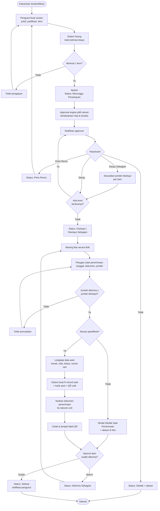

# M-14 — Pengadaan Barang

> **Modul self-contained.** Seluruh yang diperlukan untuk mengimplementasikan modul ini ada di
> berkas ini: requirement, aturan bisnis, endpoint, entitas, notifikasi, permission, jejak audit,
> dan kriteria penerimaan. Baris yang dimiliki modul lain dirujuk melalui ID, tidak disalin.
>
> Isi requirement bersifat **verbatim dari PRD v1.1**. Sumber kebenaran tunggal.

## 1. Overview

Lihat [`../01-product/overview.md`](../01-product/overview.md) untuk konteks produk menyeluruh.
Modul ini adalah **M-14 — Pengadaan Barang** sebagaimana terdaftar pada Daftar Modul PRD.

## 2. Scope

Cakupan modul ditentukan oleh Functional Requirement yang tercantum pada bagian 5.
Hal di luar daftar tersebut berada di luar cakupan modul ini.

## 3. Actors

Aktor per requirement tercantum pada tabel **Actor** di tiap FR (bagian 5).
Definisi role: [`../00-foundation/roles-permissions.md`](../00-foundation/roles-permissions.md).

## 4. Business Flow

## 13.4 Process Flow — Pengadaan Barang

---

## 5. Functional Requirements

> Cakupan alur: **Usulan → Approval → Penerimaan**. Tidak mencakup manajemen vendor, perbandingan penawaran, Purchase Order, maupun validasi pagu anggaran (lihat NO-04 dan NO-05).

### FR-14.1 Pengajuan Usulan Pengadaan

| Aspek | Uraian |
|---|---|
| **Description** | Unit kerja atau pengguna mengajukan kebutuhan barang baru beserta justifikasi dan estimasi biaya. |
| **Actor** | Guru, Staf/TU, Petugas Sarana Prasarana |
| **Preconditions** | Pengguna login dan memiliki permission `procurement.create` |

**Main Flow**
1. Pengguna membuka menu Pengadaan dan menekan "Buat Usulan".
2. Pengguna mengisi kepala usulan: judul usulan, unit kerja pengusul, tahun anggaran, prioritas (Rendah/Sedang/Tinggi/Mendesak), dan justifikasi kebutuhan.
3. Pengguna menambahkan baris item: nama barang, kategori, spesifikasi, jumlah, satuan, estimasi harga satuan, dan keterangan.
4. Sistem menghitung total estimasi biaya secara otomatis.
5. Pengguna dapat melampirkan dokumen pendukung (brosur, foto kondisi aset lama, referensi harga).
6. Pengguna menekan "Ajukan".
7. Sistem membuat usulan berstatus `Menunggu Persetujuan`, membentuk instance approval sesuai rules (nilai total menentukan jumlah level), dan menotifikasi approver pertama.

**Alternative Flow**
- **A1 — Usulan disimpan sebagai draf:** Pengguna dapat menyimpan tanpa mengajukan; draf hanya terlihat oleh pembuatnya.
- **A2 — Usulan berasal dari rekomendasi sistem:** Sistem dapat mengisi otomatis dari daftar aset berkondisi `Rusak Berat` atau yang biaya pemeliharaannya melewati ambang penggantian (FR-12.5).
- **A3 — Tidak ada item ditambahkan:** Sistem menolak pengajuan.
- **A4 — Total estimasi melewati ambang tertentu:** Approval rules otomatis menambahkan level persetujuan Pimpinan Sekolah.

**Post Conditions** — Usulan tercatat dan masuk alur persetujuan; pengusul dapat memantau statusnya.

**Acceptance Criteria**
- [ ] Nomor usulan unik (mis. `PGD-2026-0001`).
- [ ] Total estimasi biaya dihitung sistem, bukan diisi manual.
- [ ] Usulan tidak dapat disunting setelah diajukan, kecuali berstatus `Perlu Revisi`.
- [ ] Pengusul menerima notifikasi setiap perubahan status.

### FR-14.2 Persetujuan Usulan Pengadaan

| Aspek | Uraian |
|---|---|
| **Description** | Approver meninjau usulan pengadaan dan memberikan keputusan, termasuk kemungkinan menyetujui sebagian item. |
| **Actor** | Petugas Sarpras, Pimpinan Sekolah (sesuai approval rules) |
| **Preconditions** | Terdapat usulan berstatus `Menunggu Persetujuan` |

**Main Flow**
1. Approver menerima notifikasi dan membuka detail usulan.
2. Approver meninjau justifikasi, daftar item, estimasi biaya, dan lampiran.
3. Approver dapat melihat data pendukung dari sistem: jumlah aset sejenis yang dimiliki, kondisinya, dan tingkat pemanfaatannya.
4. Approver memilih Setujui / Setujui Sebagian / Tolak / Perlu Revisi, disertai catatan.
5. Pada "Setujui Sebagian", approver menyesuaikan jumlah per item atau menandai item yang tidak disetujui.
6. Sistem meneruskan ke level berikutnya atau memfinalkan status.

**Alternative Flow**
- **A1 — Ditolak:** Usulan ditutup dengan status `Ditolak` beserta alasan; pengusul dinotifikasi.
- **A2 — Perlu Revisi:** Pengusul dapat menyunting dan mengajukan ulang; alur persetujuan dimulai dari awal.
- **A3 — Approver meminta data pemanfaatan tambahan:** Approver dapat membuka analitik pemanfaatan kategori terkait langsung dari halaman usulan.

**Post Conditions** — Usulan berstatus `Disetujui`, `Disetujui Sebagian`, `Ditolak`, atau `Perlu Revisi`; usulan yang disetujui siap masuk tahap penerimaan.

**Acceptance Criteria**
- [ ] Persetujuan sebagian menyimpan jumlah disetujui per item secara terpisah dari jumlah diusulkan.
- [ ] Seluruh keputusan tercatat pada riwayat persetujuan (FR-10.3).
- [ ] Approver dapat menyetujui dari perangkat mobile.

### FR-14.3 Penerimaan Barang & Pencatatan sebagai Aset

| Aspek | Uraian |
|---|---|
| **Description** | Mencatat barang yang telah diterima dari usulan yang disetujui. Item **berjenis Aset** dikonversi menjadi record aset per unit lengkap dengan kode aset dan QR; item **berjenis Bahan** menambah saldo bahan (`BR-064`). Alur penerimaan bahan dimiliki M-22 dan **belum ditulis**. |
| **Actor** | Petugas Sarana Prasarana |
| **Preconditions** | Terdapat usulan berstatus `Disetujui` atau `Disetujui Sebagian`; barang telah tiba secara fisik |

**Main Flow**
1. Petugas membuka usulan yang disetujui dan menekan "Catat Penerimaan".
2. Petugas mengisi: tanggal penerimaan, nomor dokumen penerimaan/faktur, dan jumlah diterima per item.
3. Petugas melengkapi data aset: merek, model, nilai perolehan aktual, lokasi penempatan, kondisi awal, dan nomor seri per unit bila ada.
4. Petugas mengunggah dokumen penerimaan (faktur, berita acara, foto barang).
5. Petugas menekan "Terima & Daftarkan sebagai Aset".
6. Sistem membuat record aset sebanyak jumlah unit diterima, masing-masing dengan kode aset dan QR Code unik, berstatus `Tersedia`.
7. Sistem menautkan seluruh aset yang terbentuk ke usulan pengadaan asalnya, dan menautkan dokumen penerimaan ke setiap aset.
8. Sistem mengubah status usulan menjadi `Diterima Sebagian` atau `Selesai`.
9. Sistem menotifikasi pengusul dan menyediakan tombol cetak QR massal.

**Alternative Flow**
- **A1 — Barang diterima bertahap:** Petugas mencatat penerimaan sebagian; usulan berstatus `Diterima Sebagian` hingga seluruh item lengkap.
- **A2 — Barang diterima tidak sesuai spesifikasi:** Petugas menandai item `Ditolak Saat Penerimaan` dengan alasan dan foto; item tersebut tidak menjadi aset.
- **A3 — Jumlah diterima melebihi jumlah disetujui:** Sistem menolak; kelebihan harus melalui usulan baru.
- **A4 — Usulan tidak pernah direalisasikan hingga akhir tahun anggaran:** Petugas atau Administrator dapat menutup usulan dengan status `Tidak Direalisasikan` beserta alasan.

**Post Conditions** — Aset baru terdaftar dan siap dilabeli QR; usulan pengadaan tertutup atau berstatus diterima sebagian; jejak dari usulan hingga aset dapat ditelusuri.

**Acceptance Criteria**
- [ ] Menerima 10 unit menghasilkan 10 record aset dengan 10 kode aset unik.
- [ ] Setiap aset hasil pengadaan menyimpan referensi ke nomor usulan asalnya dan dapat ditelusuri dua arah.
- [ ] Dokumen penerimaan otomatis tertaut sebagai dokumen aset pada seluruh unit terkait.
- [ ] Jumlah diterima tidak pernah melebihi jumlah yang disetujui.

## 6. Business Rules

### Dimiliki modul ini

| Kode | Business Rule |
|---|---|
| BR-060 | Usulan pengadaan wajib memuat minimal satu item beserta justifikasi kebutuhan. |
| BR-061 | Total estimasi biaya dihitung sistem dari jumlah × estimasi harga satuan, tidak diisi manual. |
| BR-062 | Usulan yang telah diajukan tidak dapat disunting kecuali berstatus `Perlu Revisi`. |
| BR-063 | Jumlah barang yang dicatat diterima tidak boleh melebihi jumlah yang disetujui. |
| BR-064 | Penerimaan item pengadaan **berjenis Aset** wajib menghasilkan record aset per unit lengkap dengan kode aset dan QR. Item **berjenis Bahan** menambah saldo bahan melalui transaksi penerimaan dan **tidak** menghasilkan record aset (Keputusan #27; alur bahannya dimiliki M-22). |
| BR-065 | Dokumen penerimaan otomatis tertaut sebagai dokumen aset pada seluruh unit yang terbentuk. |

## 7. API Endpoints

### Endpoint

| Method | Endpoint | Permission | Deskripsi |
|---|---|---|---|
| POST | `/procurements` | `procurement.create` | Buat usulan pengadaan |
| GET | `/procurements` | `procurement.view` | Daftar usulan |
| POST | `/procurements/{id}/receipts` | `procurement.receive` | Catat penerimaan & buat aset |

Konvensi umum, format respons, kode galat, dan ketentuan keamanan API:
[`../03-architecture/api-conventions.md`](../03-architecture/api-conventions.md).

## 8. Database Entity

### Entitas

| Entitas | Deskripsi | Atribut Utama | Keterangan |
|---|---|---|---|
| **procurements** | Usulan pengadaan | id, nomor, judul, pengusul_id, unit_kerja, tahun_anggaran, prioritas, justifikasi, total_estimasi, status | ± 100 |
| **procurement_items** | Item dalam usulan | id, procurement_id, jenis (Aset/Bahan — Keputusan #27), nama_barang, category_id, spesifikasi, jumlah_diusulkan, jumlah_disetujui, jumlah_diterima, satuan, estimasi_harga_satuan | ± 500 |
| **procurement_receipts** | Catatan penerimaan barang | id, procurement_id, tanggal_terima, nomor_dokumen, diterima_oleh, catatan | ± 120 |

Model data menyeluruh dan ERD: [`../03-architecture/data-model.md`](../03-architecture/data-model.md).

## 9. Notification

### Notifikasi diterbitkan modul ini

| Kode | Event Pemicu | Penerima | Kanal | Wajib | Contoh Isi |
|---|---|---|---|:---:|---|
| **NT-34** | Usulan pengadaan diajukan | Approver | In-app + Push | ✅ | "Usulan pengadaan {nomor} senilai Rp{total} menunggu persetujuan." |
| **NT-35** | Keputusan usulan pengadaan | Pengusul | In-app + Push | ✅ | "Usulan {nomor} {disetujui/disetujui sebagian/ditolak}." |
| **NT-36** | Barang pengadaan diterima & didaftarkan | Pengusul + Petugas Sarpras | In-app | ❌ | "{n} unit dari usulan {nomor} telah diterima dan terdaftar sebagai aset." |

Ketentuan umum kanal, latensi, dan preferensi: [`m17-notifications.md`](m17-notifications.md).

## 10. Permission

### Kode permission

| Kode | Domain | Deskripsi singkat | Role bawaan pemilik |
|---|---|---|---|
| `procurement.view` | Pengadaan | Melihat usulan | Admin, Petugas, Pimpinan, Guru(`own`), Staf(`own`) |
| `procurement.create` | Pengadaan | Membuat usulan | Admin, Petugas, Guru, Staf |
| `procurement.approve` | Pengadaan | Menyetujui usulan | Sesuai approval rules |
| `procurement.receive` | Pengadaan | Mencatat penerimaan barang | Admin, Petugas |

Katalog kanonik & aturan scope: [`../00-foundation/roles-permissions.md`](../00-foundation/roles-permissions.md).

## 11. Activity Log

### Aksi yang wajib dicatat

| Aksi | Keterangan |
|---|---|
| `PROCUREMENT_CREATED` / `SUBMITTED` / `DECIDED` | Siklus usulan |
| `PROCUREMENT_RECEIVED` | Penerimaan barang beserta jumlah |
| `PROCUREMENT_ASSETS_GENERATED` | Pembentukan aset dari penerimaan |

Prinsip, struktur entri, dan tamper-evidence: [`../03-architecture/activity-log.md`](../03-architecture/activity-log.md).

## 12. Acceptance Criteria

Kriteria penerimaan tercantum **inline** pada tiap Functional Requirement di bagian 5,
sesuai bentuk aslinya di PRD. Tidak diringkas maupun dipindahkan agar tidak terpisah dari
konteks requirement-nya.

Strategi pengujian: [`../06-quality/test-strategy.md`](../06-quality/test-strategy.md).

## 13. Dependencies

- [`m10-approval.md`](m10-approval.md) — M-10 Approval Workflow Engine
- [`m04-assets.md`](m04-assets.md) — M-04 Inventaris Aset

## 14. Related Modules

- [`m04-assets.md`](m04-assets.md) — M-04 Inventaris Aset
- [`m10-approval.md`](m10-approval.md) — M-10 Approval Workflow Engine

## 15. Open Issues

_Tidak ada isu terbuka._
