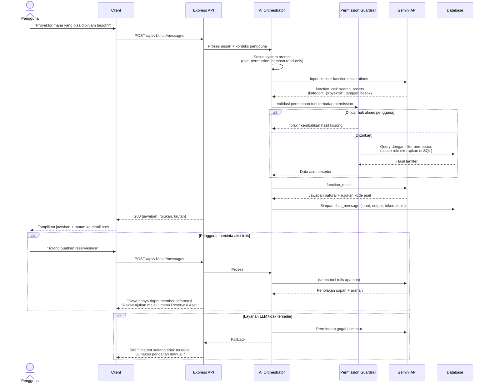

# M-19 — Chatbot AI

> **Modul self-contained.** Seluruh yang diperlukan untuk mengimplementasikan modul ini ada di
> berkas ini: requirement, aturan bisnis, endpoint, entitas, notifikasi, permission, jejak audit,
> dan kriteria penerimaan. Baris yang dimiliki modul lain dirujuk melalui ID, tidak disalin.
>
> Isi requirement bersifat **verbatim dari PRD v1.1**. Sumber kebenaran tunggal.

## 1. Overview

Lihat [`../01-product/overview.md`](../01-product/overview.md) untuk konteks produk menyeluruh.
Modul ini adalah **M-19 — Chatbot AI** sebagaimana terdaftar pada Daftar Modul PRD.

## 2. Scope

Cakupan modul ditentukan oleh Functional Requirement yang tercantum pada bagian 5.
Hal di luar daftar tersebut berada di luar cakupan modul ini.

## 3. Actors

Aktor per requirement tercantum pada tabel **Actor** di tiap FR (bagian 5).
Definisi role: [`../00-foundation/roles-permissions.md`](../00-foundation/roles-permissions.md).

## 4. Business Flow

## 15.6 Percakapan Chatbot AI dengan Tool Calling

## 5. Functional Requirements

### FR-19.1 Percakapan Asisten AI

| Aspek | Uraian |
|---|---|
| **Description** | Asisten percakapan berbasis LLM yang menjawab pertanyaan pengguna mengenai aset, lokasi, jadwal ruangan, status peminjaman, dan status pengajuan, dengan akses data **read-only** yang dibatasi oleh hak akses pengguna. Rincian teknis pada Bab 22. |
| **Actor** | Seluruh role |
| **Preconditions** | Pengguna login; layanan LLM tersedia |

**Main Flow**
1. Pengguna membuka panel Chatbot (tersedia di web dan mobile).
2. Pengguna mengetik pertanyaan dalam Bahasa Indonesia, misalnya "Di mana proyektor yang bisa dipinjam besok?".
3. Sistem menyusun konteks: identitas pengguna, role, dan permission-nya.
4. LLM menentukan *tool* yang perlu dipanggil (mis. `search_assets`, `get_room_schedule`).
5. Sistem menjalankan tool tersebut terhadap basis data dengan **filter permission pengguna diterapkan di lapisan data**, bukan diserahkan kepada model.
6. LLM menyusun jawaban berbahasa Indonesia berdasarkan hasil tool.
7. Sistem menampilkan jawaban beserta rujukan data (kode aset, nama ruangan, nomor transaksi) dan tautan menuju halaman terkait.
8. Pengguna dapat memberi umpan balik (👍/👎) atas jawaban.

**Alternative Flow**
- **A1 — Pertanyaan di luar cakupan:** Chatbot menyatakan keterbatasannya dan mengarahkan ke menu yang relevan atau ke Petugas Sarpras.
- **A2 — Data tidak ditemukan:** Chatbot menyatakan data tidak ditemukan dan menyarankan penyempurnaan pertanyaan; tidak boleh mengarang jawaban.
- **A3 — Pengguna meminta aksi tulis** (mis. "tolong buatkan reservasi"): Chatbot menolak dengan sopan, menjelaskan bahwa ia hanya dapat memberikan informasi, dan menyediakan tautan menuju form pengajuan.
- **A4 — Layanan LLM tidak tersedia:** Sistem menampilkan pesan gangguan sementara dan mengarahkan pengguna ke pencarian manual; kegagalan dicatat pada pemantauan.
- **A5 — Batas penggunaan tercapai:** Sistem menampilkan pesan batas harian dan waktu ketersediaan berikutnya.
- **A6 — Pertanyaan menyangkut data di luar hak akses pengguna:** Tool mengembalikan data kosong dan chatbot menyatakan informasi tersebut tidak dapat diakses oleh pengguna.

**Post Conditions** — Riwayat percakapan tersimpan; tidak ada perubahan pada data operasional.

**Acceptance Criteria**
- [ ] Chatbot tidak pernah dapat melakukan operasi tulis pada basis data.
- [ ] Pembatasan hak akses diterapkan pada lapisan tool/query, bukan pada instruksi prompt semata.
- [ ] Role Siswa/OSIS tidak pernah menerima informasi nilai aset, biaya, maupun data pribadi pengguna lain melalui chatbot.
- [ ] Jawaban menyertakan rujukan data konkret bila berasal dari basis data.
- [ ] Waktu respons ≤ 8 detik untuk pertanyaan umum, dengan **streaming** sehingga token pertama tampil ≤ 2 detik (AI-CTL-07).
- [ ] Jumlah panggilan tool per pesan tidak pernah melebihi 5 (AI-CTL-03).
- [ ] Nama dan pengenal pribadi pengguna tidak pernah dikirim ke penyedia LLM (DP-AI-01).
- [ ] Sistem lolos golden set dengan akurasi ≥ 85% dan **nol** kebocoran hak akses pada ketujuh role (AI-EV-05).
- [ ] Seluruh percakapan tercatat untuk keperluan evaluasi kualitas.

### FR-19.2 Riwayat & Evaluasi Percakapan

| Aspek | Uraian |
|---|---|
| **Description** | Pengguna melihat riwayat percakapannya; Administrator memantau kualitas jawaban dan volume penggunaan. |
| **Actor** | Seluruh role (riwayat pribadi), Administrator (agregat) |
| **Preconditions** | Terdapat riwayat percakapan |

**Main Flow**
1. Pengguna membuka panel chatbot dan melihat daftar sesi percakapan sebelumnya.
2. Pengguna dapat melanjutkan sesi lama atau memulai sesi baru.
3. Administrator membuka menu Monitoring Chatbot dan melihat: jumlah percakapan, pertanyaan tersering, rasio umpan balik positif/negatif, dan daftar pertanyaan yang gagal dijawab.

**Alternative Flow**
- **A1 — Pengguna menghapus riwayat:** Sesi dihapus dari tampilan pengguna, namun data agregat anonim tetap tersimpan untuk evaluasi kualitas.
- **A2 — Percakapan lebih dari 90 hari:** Diarsipkan otomatis.

**Post Conditions** — Riwayat terkelola; data evaluasi tersedia bagi Administrator.

**Acceptance Criteria**
- [ ] Pengguna hanya dapat melihat riwayat percakapannya sendiri.
- [ ] Administrator melihat metrik agregat tanpa membuka isi percakapan pribadi, kecuali percakapan yang ditandai bermasalah oleh pengguna.

## 6. Business Rules

### Dimiliki modul ini

| Kode | Business Rule |
|---|---|
| BR-075 | Chatbot AI bersifat *read-only* dan tidak pernah diberi kemampuan mengubah data. |
| BR-076 | Seluruh data yang diakses chatbot difilter berdasarkan permission pengguna pada lapisan query, bukan pada instruksi prompt. |
| BR-077 | Chatbot wajib menyatakan ketidaktahuan bila data tidak ditemukan, dan dilarang mengarang jawaban. |
| BR-078 | Percakapan chatbot disimpan untuk keperluan evaluasi kualitas dan diarsipkan setelah 90 hari. |
| BR-079 | Gangguan pada layanan LLM tidak boleh memengaruhi ketersediaan modul lain. |

## 7. API Endpoints

### Endpoint

| Method | Endpoint | Permission | Deskripsi |
|---|---|---|---|
| POST | `/chat/sessions` | Bearer | Mulai sesi chatbot |
| POST | `/chat/messages` | Bearer | Kirim pesan ke chatbot |
| GET | `/chat/sessions` | Bearer | Riwayat percakapan sendiri |
| POST | `/chat/messages/{id}/feedback` | Bearer | Beri umpan balik jawaban |

Konvensi umum, format respons, kode galat, dan ketentuan keamanan API:
[`../03-architecture/api-conventions.md`](../03-architecture/api-conventions.md).

## 8. Database Entity

### Entitas

| Entitas | Deskripsi | Atribut Utama | Keterangan |
|---|---|---|---|
| **chat_sessions** | Sesi percakapan chatbot | id, user_id, judul, dimulai_pada, terakhir_aktif | ± 5.000 |
| **chat_messages** | Pesan dalam percakapan | id, session_id, peran (`USER`/`ASSISTANT`), isi, tools_dipanggil (JSON), token_input, token_output, umpan_balik, waktu | ± 25.000 |

Model data menyeluruh dan ERD: [`../03-architecture/data-model.md`](../03-architecture/data-model.md).

## 9. Notification

### Notifikasi diterbitkan modul ini

_Modul ini tidak menerbitkan notifikasi._

Ketentuan umum kanal, latensi, dan preferensi: [`m17-notifications.md`](m17-notifications.md).

## 10. Permission

### Kode permission

| Kode | Domain | Deskripsi singkat | Role bawaan pemilik |
|---|---|---|---|
| `chat.use` | Chatbot | Menggunakan chatbot | Semua role (Siswa `restricted`) |
| `chat.monitor` | Chatbot | Melihat metrik agregat chatbot | Admin, Pimpinan(view) |

Katalog kanonik & aturan scope: [`../00-foundation/roles-permissions.md`](../00-foundation/roles-permissions.md).

## 11. Activity Log

### Aksi yang wajib dicatat

| Aksi | Keterangan |
|---|---|
| `CHAT_MESSAGE_SENT` | Metadata percakapan (tanpa merekam ulang isi di log audit) |

Prinsip, struktur entri, dan tamper-evidence: [`../03-architecture/activity-log.md`](../03-architecture/activity-log.md).

## 12. Acceptance Criteria

Kriteria penerimaan tercantum **inline** pada tiap Functional Requirement di bagian 5,
sesuai bentuk aslinya di PRD. Tidak diringkas maupun dipindahkan agar tidak terpisah dari
konteks requirement-nya.

Strategi pengujian: [`../06-quality/test-strategy.md`](../06-quality/test-strategy.md).

## 13. Dependencies

- [`m02-users.md`](m02-users.md) — M-02 Manajemen User & Role
- [`m04-assets.md`](m04-assets.md) — M-04 Inventaris Aset

## 14. Related Modules

- [`m02-users.md`](m02-users.md) — M-02 Manajemen User & Role
- [`m04-assets.md`](m04-assets.md) — M-04 Inventaris Aset

## 15. Open Issues

_Tidak ada isu terbuka._
