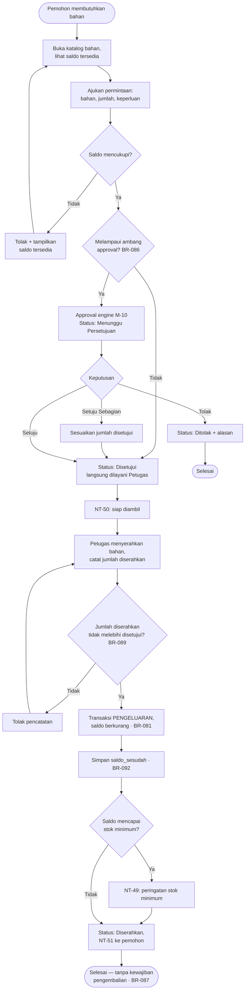

# M-22 — Manajemen Bahan

> **Modul self-contained.** Seluruh yang diperlukan untuk mengimplementasikan modul ini ada di
> berkas ini: requirement, aturan bisnis, endpoint, entitas, notifikasi, permission, jejak audit,
> dan kriteria penerimaan. Baris yang dimiliki modul lain dirujuk melalui ID, tidak disalin.
>
> Modul ini lahir dari **perubahan lingkup** yang dicatat pada
> [`../01-product/bahan-scope-change.md`](../01-product/bahan-scope-change.md) dan Keputusan Kunci
> **#17–#28** pada [`../00-foundation/decisions.md`](../00-foundation/decisions.md).

## 1. Overview

Lihat [`../01-product/overview.md`](../01-product/overview.md) untuk konteks produk menyeluruh.
Modul ini adalah **M-22 — Manajemen Bahan** sebagaimana terdaftar pada Daftar Modul PRD.

**Bahan** adalah barang sarpras berupa persediaan yang dikelola per jumlah dan satuan serta habis
saat dipakai — kertas, tinta, spidol, ATK, bahan kebersihan, dan bahan praktik. Batas tegas antara
Bahan dan Aset ditetapkan [Lampiran A.1](../00-foundation/glossary.md).

**Yang membedakan modul ini dari M-04.** Bahan **tidak** memiliki identitas per unit: tidak ada kode
aset, tidak ada QR per unit, tidak ada kondisi, tidak ada mutasi, tidak ada maintenance, tidak ada
peminjaman, dan tidak ada penghapusan. Yang ada adalah **saldo** dan **transaksi yang mengubahnya**.

## 2. Scope

Cakupan modul ditentukan oleh Functional Requirement yang tercantum pada bagian 5.
Hal di luar daftar tersebut berada di luar cakupan modul ini.

**Berada di luar modul ini** meskipun menyangkut Bahan:

| Hal | Pemilik |
|---|---|
| Usulan pengadaan bahan & penerimaannya dari pengadaan | [`m14-procurement.md`](m14-procurement.md) — `BR-064`, Keputusan #27 |
| Stock Opname Bahan | [`m13-audit-stocktake.md`](m13-audit-stocktake.md) — Keputusan #24 |
| Aturan & instance persetujuan permintaan bahan | [`m10-approval.md`](m10-approval.md) |
| Master satuan bahan dan ambang approval permintaan | [`m20-settings.md`](m20-settings.md) — `FR-20.1` |
| Pembuatan & pencetakan label QR bahan | [`m05-qr.md`](m05-qr.md) — Keputusan #23 |

## 3. Actors

Aktor per requirement tercantum pada tabel **Actor** di tiap FR (bagian 5).
Definisi role: [`../00-foundation/roles-permissions.md`](../00-foundation/roles-permissions.md).

## 4. Business Flow

## 13.5 Process Flow — Permintaan & Pengeluaran Bahan

---

## 5. Functional Requirements

### FR-22.1 Mengelola Master Bahan & Kategori Bahan

| Aspek | Uraian |
|---|---|
| **Description** | Mendaftarkan dan memelihara jenis bahan beserta kategorinya. Satu record mewakili satu **jenis** bahan, bukan satu unit fisik. |
| **Actor** | Petugas Sarana Prasarana, Administrator |
| **Preconditions** | Master satuan tersedia (`FR-20.1`); pengguna memiliki permission `material.manage` |

**Main Flow**
1. Pengguna membuka menu Bahan dan menekan "Tambah Bahan".
2. Pengguna mengisi: nama bahan, kategori bahan, satuan (dipilih dari master satuan), stok minimum, lokasi penyimpanan bawaan, dan keterangan.
3. Sistem memvalidasi bahwa nama bahan belum dipakai dalam kategori yang sama.
4. Sistem membuat record bahan berstatus `Aktif` dengan saldo awal 0 pada seluruh lokasi.
5. Sistem membentuk UUID bahan sebagai dasar QR per jenis bahan (`m05-qr.md`).

**Alternative Flow**
- **A1 — Kategori bahan belum ada:** Pengguna membuat kategori bahan lebih dulu; kategori bahan **terpisah** dari kategori aset.
- **A2 — Menonaktifkan bahan yang masih bersaldo:** Sistem mengizinkan, namun bahan tidak lagi dapat diminta; saldo dan riwayatnya tetap dapat ditelusuri (`BR-091`).
- **A3 — Menghapus kategori yang masih dipakai bahan:** Sistem menolak dan menampilkan jumlah bahan terkait.

**Post Conditions** — Record bahan tersimpan berstatus `Aktif`; UUID QR terbentuk; activity log tercatat.

**Acceptance Criteria**
- [ ] Satu record bahan mewakili satu jenis, bukan satu unit fisik.
- [ ] Satuan hanya dapat dipilih dari master satuan, tidak dapat diketik bebas (`BR-084`).
- [ ] Kategori bahan tidak pernah muncul pada pemilihan kategori aset, dan sebaliknya.
- [ ] Bahan nonaktif tidak muncul pada katalog permintaan namun riwayatnya tetap terbuka.

### FR-22.2 Melihat Saldo & Riwayat Transaksi Bahan

| Aspek | Uraian |
|---|---|
| **Description** | Menampilkan saldo bahan per lokasi penyimpanan beserta seluruh transaksi yang membentuknya (kartu stok). |
| **Actor** | Seluruh role dengan permission `material.view` |
| **Preconditions** | Terdapat data bahan |

**Main Flow**
1. Pengguna membuka menu Bahan.
2. Sistem menampilkan daftar bahan terpaginasi: nama, kategori, satuan, saldo total, dan penanda bila saldo mencapai stok minimum.
3. Pengguna mencari berdasarkan nama atau kategori, dan memfilter berdasarkan lokasi penyimpanan serta status stok.
4. Pengguna membuka satu bahan untuk melihat rincian saldo per lokasi.
5. Sistem menampilkan kartu stok: seluruh transaksi berurutan waktu beserta jenis, jumlah, saldo sesudah, pelaku, dan rujukan dokumennya.

**Alternative Flow**
- **A1 — Bahan belum pernah bertransaksi:** Kartu stok kosong dengan saldo 0 dan pesan penjelas.

**Post Conditions** — Tidak ada perubahan data.

**Acceptance Criteria**
- [ ] Saldo yang ditampilkan selalu sama dengan `saldo_sesudah` pada transaksi terakhir bahan tersebut per lokasi.
- [ ] Kartu stok menampilkan rujukan ke dokumen asal tiap transaksi (penerimaan, permintaan, atau sesi opname).
- [ ] Bahan yang saldonya mencapai stok minimum ditandai secara visual pada daftar.

### FR-22.3 Mencatat Penerimaan Bahan

| Aspek | Uraian |
|---|---|
| **Description** | Menambah saldo bahan atas barang yang diterima, baik dari usulan pengadaan yang disetujui maupun dari hibah/bantuan langsung. |
| **Actor** | Petugas Sarana Prasarana |
| **Preconditions** | Bahan terdaftar; pengguna memiliki permission `material.receive` |

**Main Flow**
1. Pengguna membuka menu Penerimaan Bahan dan memilih sumber: **dari usulan pengadaan** atau **penerimaan langsung**.
2. Untuk sumber pengadaan, sistem menampilkan item usulan berjenis **Bahan** yang belum diterima penuh (Keputusan #27).
3. Pengguna mengisi: bahan, jumlah diterima, lokasi penyimpanan tujuan, tanggal terima, nomor dokumen, dan catatan.
4. Pengguna mengunggah dokumen penerimaan (faktur atau berita acara).
5. Sistem membuat transaksi berjenis `PENERIMAAN`, menambah saldo pada lokasi tujuan, dan menyimpan `saldo_sesudah`.

**Alternative Flow**
- **A1 — Jumlah diterima melebihi jumlah disetujui pada usulan:** Sistem menolak; kelebihan harus melalui usulan baru (`BR-063`).
- **A2 — Penerimaan bertahap:** Item usulan tetap berstatus diterima sebagian hingga seluruh jumlah tercatat.

**Post Conditions** — Saldo bertambah; transaksi tercatat; activity log tercatat.

**Acceptance Criteria**
- [ ] Penerimaan item pengadaan berjenis Bahan menambah saldo dan **tidak** menghasilkan record aset (`BR-064`).
- [ ] Menerima 10 rim kertas menambah saldo tepat 10 pada lokasi tujuan, bukan membuat 10 record.
- [ ] Setiap penerimaan menyimpan `saldo_sesudah` sehingga kartu stok dapat direkonstruksi.

### FR-22.4 Mengajukan Permintaan Bahan

| Aspek | Uraian |
|---|---|
| **Description** | Pengguna mengajukan kebutuhan bahan; pengajuan melewati approval hanya bila melampaui ambang yang dikonfigurasi. |
| **Actor** | Guru, Staf/Tata Usaha, Teknisi, Petugas Sarana Prasarana |
| **Preconditions** | Pengguna login dan tidak diblokir; bahan berstatus `Aktif` |

**Main Flow**
1. Pengguna membuka katalog bahan dan melihat saldo tersedia.
2. Pengguna menambahkan baris permintaan: bahan, jumlah, dan keperluan.
3. Sistem memvalidasi saldo tersedia mencukupi pada lokasi penyimpanan yang dipilih.
4. Sistem membandingkan permintaan terhadap ambang approval (`BR-086`).
5. Bila di bawah ambang, permintaan berstatus `Disetujui` dan langsung dapat dilayani Petugas.
6. Bila melampaui ambang, sistem membentuk instance approval sesuai rules M-10 dan permintaan berstatus `Menunggu Persetujuan`.

**Alternative Flow**
- **A1 — Saldo tidak mencukupi:** Sistem menolak dan menampilkan saldo tersedia beserta lokasi lain yang masih memiliki saldo.
- **A2 — Bahan berstatus nonaktif:** Bahan tidak muncul pada katalog permintaan (`BR-091`).
- **A3 — Permintaan ditolak approver:** Status `Ditolak` beserta alasan; saldo tidak tersentuh.

**Post Conditions** — Permintaan tersimpan; instance approval terbentuk bila diperlukan; activity log tercatat.

**Acceptance Criteria**
- [ ] Permintaan di bawah ambang tidak membentuk instance approval sama sekali.
- [ ] Permintaan di atas ambang tidak dapat dilayani sebelum berstatus `Disetujui`.
- [ ] Permintaan tidak pernah mengurangi saldo — saldo hanya berkurang saat penyerahan (`FR-22.5`).
- [ ] Uji penolakan: pengguna tanpa permission `material.request` menerima `403`.

### FR-22.5 Pengeluaran & Penyerahan Bahan

| Aspek | Uraian |
|---|---|
| **Description** | Petugas menyerahkan bahan kepada pemohon; saldo berkurang dan transaksi tercatat. Penyerahan bersifat final. |
| **Actor** | Petugas Sarana Prasarana |
| **Preconditions** | Terdapat permintaan berstatus `Disetujui`; pengguna memiliki permission `material.issue` |

**Main Flow**
1. Petugas membuka permintaan berstatus `Disetujui`.
2. Petugas mencatat jumlah yang benar-benar diserahkan per baris permintaan dan nama penerima.
3. Sistem memvalidasi jumlah diserahkan tidak melebihi jumlah disetujui (`BR-089`) dan saldo mencukupi (`BR-083`).
4. Sistem membuat transaksi berjenis `PENGELUARAN`, mengurangi saldo, dan menyimpan `saldo_sesudah`.
5. Sistem mengevaluasi stok minimum dan menerbitkan `NT-49` bila saldo mencapai atau turun di bawah ambang.
6. Sistem menetapkan permintaan berstatus `Diserahkan` dan menotifikasi pemohon (`NT-51`).

**Alternative Flow**
- **A1 — Penyerahan sebagian:** Permintaan berstatus `Diserahkan Sebagian` hingga seluruh baris terlayani atau permintaan ditutup Petugas dengan alasan.
- **A2 — Saldo berubah sejak permintaan disetujui sehingga tidak lagi mencukupi:** Sistem menolak penyerahan dan menampilkan saldo terkini; Petugas dapat menyerahkan sebagian.

**Post Conditions** — Saldo berkurang; permintaan selesai; **tidak ada kewajiban pengembalian** (`BR-087`).

**Acceptance Criteria**
- [ ] Saldo berkurang tepat sebesar jumlah yang diserahkan, bukan jumlah yang diminta.
- [ ] Penyerahan yang membuat saldo negatif ditolak (`BR-083`).
- [ ] Bahan yang telah diserahkan tidak memunculkan jadwal pengembalian, denda, maupun kewajiban ganti rugi.
- [ ] Uji penolakan: pengguna dengan `material.request` tetapi tanpa `material.issue` menerima `403`.

### FR-22.6 Penyesuaian Saldo Bahan

| Aspek | Uraian |
|---|---|
| **Description** | Mengoreksi saldo bahan di luar penerimaan dan pengeluaran — misalnya bahan rusak, tumpah, atau kedaluwarsa. |
| **Actor** | Petugas Sarana Prasarana, Administrator |
| **Preconditions** | Pengguna memiliki permission `material.adjust` |

**Main Flow**
1. Pengguna membuka detail bahan dan menekan "Penyesuaian".
2. Pengguna memilih arah penyesuaian (tambah atau kurang), jumlah, lokasi, dan **alasan wajib**.
3. Sistem membuat transaksi berjenis `PENYESUAIAN`, memperbarui saldo, dan menyimpan `saldo_sesudah`.

**Alternative Flow**
- **A1 — Penyesuaian membuat saldo negatif:** Sistem menolak (`BR-083`).
- **A2 — Alasan dikosongkan:** Sistem menolak (`BR-088`).

**Post Conditions** — Saldo terkoreksi; transaksi dan activity log tercatat lengkap dengan alasannya.

**Acceptance Criteria**
- [ ] Penyesuaian tanpa alasan ditolak.
- [ ] Saldo tidak pernah dapat disunting langsung — perubahan hanya melalui transaksi (`BR-081`).
- [ ] Alasan penyesuaian muncul pada kartu stok dan activity log.

### FR-22.7 Peringatan Stok Minimum

| Aspek | Uraian |
|---|---|
| **Description** | Menandai dan menotifikasi bahan yang saldonya mencapai atau turun di bawah stok minimum. |
| **Actor** | Sistem (otomatis), Petugas Sarana Prasarana |
| **Preconditions** | Bahan memiliki stok minimum lebih besar dari 0 |

**Main Flow**
1. Setiap transaksi yang mengurangi saldo memicu evaluasi terhadap stok minimum bahan tersebut.
2. Bila saldo total mencapai atau turun di bawah ambang, sistem menerbitkan `NT-49` kepada Petugas Sarana Prasarana.
3. Bahan tersebut muncul pada daftar "Stok Menipis" di dashboard dan dapat dijadikan dasar usulan pengadaan (`m14-procurement.md`).

**Alternative Flow**
- **A1 — Saldo kembali di atas ambang:** Penanda hilang; notifikasi berikutnya baru terbit bila saldo turun lagi melewati ambang.
- **A2 — Stok minimum bernilai 0:** Bahan tidak pernah memunculkan peringatan.

**Post Conditions** — Peringatan tampil dan notifikasi terkirim; tidak ada perubahan saldo.

**Acceptance Criteria**
- [ ] Notifikasi terbit tepat pada transaksi yang menyebabkan saldo melewati ambang, bukan berulang pada setiap transaksi berikutnya.
- [ ] Bahan berstok minimum 0 tidak pernah memicu notifikasi.
- [ ] Daftar "Stok Menipis" hanya memuat bahan berstatus `Aktif`.

---

## 6. Business Rules

### Dimiliki modul ini

| Kode | Business Rule |
|---|---|
| BR-080 | Bahan dikelola berdasarkan jumlah dan satuan; satu record bahan mewakili satu **jenis**, tidak pernah satu unit fisik, dan tidak pernah didaftarkan sebagai record aset. |
| BR-081 | Saldo bahan selalu merupakan **akibat transaksi** dan tidak dapat disunting langsung oleh role mana pun. |
| BR-082 | Saldo dicatat per kombinasi **bahan × lokasi penyimpanan**; saldo total adalah penjumlahan seluruh lokasi. |
| BR-083 | Saldo bahan tidak boleh negatif. Transaksi yang membuatnya negatif ditolak. |
| BR-084 | Satuan bahan hanya boleh berasal dari master satuan yang dikelola Administrator (`FR-20.1`), tidak dapat diketik bebas. |
| BR-085 | Stok minimum ditetapkan per bahan dan dievaluasi terhadap **saldo total** seluruh lokasi penyimpanan. |
| BR-086 | Permintaan bahan melewati approval engine hanya bila melampaui ambang yang dikonfigurasi Administrator; di bawah ambang permintaan berstatus `Disetujui` tanpa instance approval. |
| BR-087 | Bahan yang telah diserahkan **tidak memiliki kewajiban pengembalian**. Tidak berlaku jadwal pengembalian, denda keterlambatan (`BR-028`), maupun ganti rugi. |
| BR-088 | Setiap transaksi `PENYESUAIAN` wajib menyertakan alasan sebelum dapat disimpan. |
| BR-089 | Jumlah bahan yang diserahkan tidak boleh melebihi jumlah yang disetujui pada permintaan. |
| BR-090 | QR bahan mengikat satu **jenis bahan** dan tidak pernah bermakna unit individual. |
| BR-091 | Bahan berstatus nonaktif tidak dapat diminta, namun saldo dan seluruh riwayat transaksinya tetap dapat ditelusuri. |
| BR-092 | Setiap transaksi bahan menyimpan `saldo_sesudah` sehingga kartu stok dapat direkonstruksi tanpa menghitung ulang seluruh riwayat. |

**Aturan bersama yang juga berlaku** (dimiliki modul lain, dirujuk melalui ID — tidak disalin ke sini):

`BR-063` `BR-064` (m14) · `BR-071` (m18)

## 7. API Endpoints

### Endpoint

| Method | Endpoint | Permission | Deskripsi |
|---|---|---|---|
| GET | `/materials` | `material.view` | Daftar bahan + saldo (filter kategori, lokasi, status stok) |
| POST | `/materials` | `material.manage` | Daftarkan bahan baru |
| GET | `/materials/{id}` | `material.view` | Detail bahan beserta saldo per lokasi |
| PATCH | `/materials/{id}` | `material.manage` | Ubah data bahan |
| GET | `/materials/{id}/transactions` | `material.view` | Kartu stok — riwayat transaksi |
| GET | `/material-categories` | `material.view` | Daftar kategori bahan |
| POST | `/material-categories` | `material.manage` | Buat kategori bahan |
| POST | `/materials/{id}/receipts` | `material.receive` | Catat penerimaan bahan |
| POST | `/materials/{id}/adjustments` | `material.adjust` | Catat penyesuaian saldo |
| GET | `/material-requests` | `material.view` | Daftar permintaan bahan |
| POST | `/material-requests` | `material.request` | Ajukan permintaan bahan |
| POST | `/material-requests/{id}/issue` | `material.issue` | Catat penyerahan bahan |
| POST | `/material-requests/{id}/cancel` | `material.request` | Batalkan permintaan sebelum diserahkan |

Konvensi umum, format respons, kode galat, dan ketentuan keamanan API:
[`../03-architecture/api-conventions.md`](../03-architecture/api-conventions.md).

## 8. Database Entity

### Entitas

| Entitas | Deskripsi | Atribut Utama | Keterangan |
|---|---|---|---|
| **material_categories** | Kategori bahan — terpisah dari kategori aset | id, nama, kode, keterangan, status | ± 15 |
| **materials** | Master jenis bahan | id, uuid (dasar QR per jenis), nama, material_category_id, satuan_id, stok_minimum, room_id_default, keterangan, status | ± 300 |
| **material_balances** | Saldo per bahan per lokasi penyimpanan | id, material_id, room_id, saldo | ± 900 |
| **material_transactions** | Seluruh peristiwa yang mengubah saldo | id, material_id, room_id, jenis (PENERIMAAN/PENGELUARAN/PENYESUAIAN/OPNAME), jumlah, saldo_sesudah, referensi_tipe, referensi_id, alasan, dibuat_oleh, dibuat_pada | ± 20.000 |
| **material_requests** | Permintaan bahan | id, nomor, pemohon_id, keperluan, status, approval_instance_id (nullable — `BR-086`), diserahkan_oleh, diserahkan_pada | ± 1.500 |
| **material_request_items** | Baris permintaan | id, material_request_id, material_id, jumlah_diminta, jumlah_disetujui, jumlah_diserahkan | ± 3.000 |

Model data menyeluruh dan ERD: [`../03-architecture/data-model.md`](../03-architecture/data-model.md).

## 9. Notification

### Notifikasi diterbitkan modul ini

| Kode | Event Pemicu | Penerima | Kanal | Wajib | Contoh Isi |
|---|---|---|---|:---:|---|
| **NT-49** | Saldo bahan mencapai / turun di bawah stok minimum | Petugas Sarpras + Administrator | In-app + Push | ✅ | "Stok {bahan} tersisa {saldo} {satuan}, di bawah minimum {ambang}." |
| **NT-50** | Permintaan bahan siap diambil | Pemohon | In-app + Push | ❌ | "Permintaan {nomor} siap diambil di {lokasi}." |
| **NT-51** | Bahan diserahkan | Pemohon | In-app | ❌ | "{jumlah} {satuan} {bahan} telah diserahkan pada {tanggal}." |

Notifikasi persetujuan permintaan bahan memakai `NT-01`…`NT-04` yang dimiliki
[`m10-approval.md`](m10-approval.md) — tidak diduplikasi di sini.

Ketentuan umum kanal, latensi, dan preferensi: [`m17-notifications.md`](m17-notifications.md).

## 10. Permission

### Kode permission

| Kode | Domain | Deskripsi singkat | Role bawaan pemilik |
|---|---|---|---|
| `material.view` | Bahan | Melihat bahan, saldo, dan kartu stok | Admin, Petugas, Pimpinan, Teknisi, Guru, Staf |
| `material.manage` | Bahan | Kelola master bahan & kategori bahan | Admin, Petugas |
| `material.request` | Bahan | Mengajukan & membatalkan permintaan bahan | Admin, Petugas, Teknisi, Guru, Staf |
| `material.receive` | Bahan | Mencatat penerimaan bahan | Admin, Petugas |
| `material.issue` | Bahan | Menyerahkan bahan kepada pemohon | Admin, Petugas |
| `material.adjust` | Bahan | Menyesuaikan saldo dengan alasan | Admin, Petugas |
| `material.qr_print` | Bahan | Mencetak label QR per jenis bahan | Admin, Petugas |

Katalog kanonik & aturan scope: [`../00-foundation/roles-permissions.md`](../00-foundation/roles-permissions.md).

## 11. Activity Log

### Aksi yang wajib dicatat

| Aksi | Keterangan |
|---|---|
| `MATERIAL_CREATED` / `UPDATED` / `DEACTIVATED` | Siklus master bahan |
| `MATERIAL_CATEGORY_CREATED` / `UPDATED` / `DELETED` | Siklus kategori bahan |
| `MATERIAL_RECEIVED` | Penerimaan bahan beserta jumlah & lokasi |
| `MATERIAL_REQUEST_SUBMITTED` / `APPROVED` / `REJECTED` / `CANCELLED` | Siklus permintaan bahan |
| `MATERIAL_ISSUED` | Penyerahan bahan beserta penerima |
| `MATERIAL_ADJUSTED` | Penyesuaian saldo beserta alasan wajib |

Prinsip, struktur entri, dan tamper-evidence: [`../03-architecture/activity-log.md`](../03-architecture/activity-log.md).

## 12. Acceptance Criteria

Kriteria penerimaan tercantum **inline** pada tiap Functional Requirement di bagian 5,
sesuai bentuk aslinya di PRD. Tidak diringkas maupun dipindahkan agar tidak terpisah dari
konteks requirement-nya.

Strategi pengujian: [`../06-quality/test-strategy.md`](../06-quality/test-strategy.md).

## 13. Dependencies

- [`m03-locations.md`](m03-locations.md) — M-03 Manajemen Lokasi
- [`m05-qr.md`](m05-qr.md) — M-05 QR Code
- [`m10-approval.md`](m10-approval.md) — M-10 Approval Workflow Engine
- [`m14-procurement.md`](m14-procurement.md) — M-14 Pengadaan Barang
- [`m20-settings.md`](m20-settings.md) — M-20 Konfigurasi Sistem

## 14. Related Modules

- [`m13-audit-stocktake.md`](m13-audit-stocktake.md) — M-13 Audit & Stock Opname
- [`m15-dashboard.md`](m15-dashboard.md) — M-15 Dashboard
- [`m16-analytics.md`](m16-analytics.md) — M-16 Analitik & Laporan
- [`m17-notifications.md`](m17-notifications.md) — M-17 Notifikasi
- [`m18-activity-log.md`](m18-activity-log.md) — M-18 Activity Log

## 15. Open Issues

_Tidak ada isu terbuka._
