# 11. Data Requirements

## 11.1 Master Data

Data induk yang relatif stabil dan menjadi acuan seluruh transaksi.

| Entitas | Deskripsi | Atribut Utama | Pemilik Data |
|---|---|---|---|
| **users** | Data pengguna sistem | id, nama, email, password_hash, nip_nis, role_id, unit_kerja, telepon, foto, status, 2fa_enabled, must_change_password, last_login_at | Administrator |
| **roles** | Peran pengguna | id, nama, deskripsi, is_system | Administrator |
| **permissions** | Daftar hak akses granular | id, modul, aksi, kode | Sistem |
| **role_permissions** | Relasi role–permission | role_id, permission_id | Administrator |
| **buildings** | Gedung sekolah | id, nama, kode, keterangan, status | Petugas Sarpras |
| **areas** | Lantai/area dalam gedung | id, building_id, nama, kode, lantai | Petugas Sarpras |
| **rooms** | Ruangan | id, area_id, nama, kode, jenis, kapasitas, penanggung_jawab_id, dapat_direservasi, boleh_direservasi_siswa, status | Petugas Sarpras |
| **asset_categories** | Kategori & subkategori aset | id, parent_id, nama, kode, umur_teknis_tahun, interval_preventif_hari | Petugas Sarpras |
| **assets** | Unit aset (serialized) | id, uuid, kode_barang, nama, category_id, merek, model, nomor_seri, tahun_perolehan, sumber_perolehan, nilai_perolehan, room_id, kondisi, status, dapat_dipinjam, boleh_dipinjam_siswa, penanggung_jawab_id, qr_terpasang, procurement_id, dihapuskan, tanggal_penghapusan — *foto dipindahkan ke tabel `asset_photos` karena satu aset dapat memiliki banyak foto* | Petugas Sarpras |
| **approval_rules** | Aturan persetujuan | id, jenis_pengajuan, kondisi (JSON), prioritas, status_aktif, versi | Administrator |
| **approval_rule_steps** | Langkah dalam aturan | id, rule_id, urutan, approver_type, approver_role_id, approver_user_id, sla_jam, eskalasi_ke | Administrator |
| **maintenance_schedules** | Jadwal pemeliharaan preventif | id, asset_id/category_id, interval_hari, tanggal_mulai, checklist (JSON), teknisi_default_id, jatuh_tempo_berikutnya, status | Petugas Sarpras |
| **system_settings** | Parameter global sistem | key, value, tipe, kelompok, deskripsi | Administrator |
| **academic_years** | Tahun ajaran (Lampiran E.2) | id, nama, tanggal_mulai, tanggal_selesai, is_active | Administrator |
| **academic_terms** | Semester dalam tahun ajaran | id, academic_year_id, nama, tanggal_mulai, tanggal_selesai | Administrator |
| **holidays** | Hari libur sekolah & nasional | id, tanggal, nama, jenis, academic_year_id | Administrator |
| **work_days** | Hari kerja sekolah | hari, aktif | Administrator |
| **work_units** | Unit kerja / kelas (Lampiran E.3) | id, nama, kode, jenis, kepala_unit_id, status | Administrator |
| **room_fixed_schedules** | Blokade jadwal tetap ruangan (FR-07.5) | id, room_id, hari, jam_mulai, jam_selesai, label_kegiatan, berlaku_mulai, berlaku_sampai, status | Petugas Sarpras |

## 11.2 Transaction Data

Data yang tumbuh seiring operasional harian.

| Entitas | Deskripsi | Atribut Utama | Volume Estimasi/Tahun |
|---|---|---|---|
| **reservations** | Pengajuan reservasi ruangan & barang | id, nomor, jenis (ruangan/barang), pemohon_id, room_id, nama_kegiatan, waktu_mulai, waktu_selesai, jumlah_peserta, keperluan, status, parent_id (untuk berulang) | ± 3.000 |
| **reservation_items** | Unit barang yang dialokasikan pada reservasi | id, reservation_id, asset_id, jumlah | ± 6.000 |
| **loans** | Transaksi peminjaman | id, nomor, reservation_id, peminjam_id, petugas_serah_id, tanggal_pinjam, tanggal_jatuh_tempo, tanggal_kembali, status | ± 2.500 |
| **loan_items** | Unit yang dipinjam & kondisinya | id, loan_id, asset_id, kondisi_awal, kondisi_akhir, foto_awal, foto_akhir, status_kembali | ± 5.000 |
| **fines** | Denda keterlambatan & ganti rugi | id, **loan_item_id**, loan_id, peminjam_id, jenis (`Keterlambatan`/`Ganti Rugi`), hari_terlambat, tarif_per_hari, jumlah_sebelum_cap, jumlah, status, tanggal_bayar, nomor_bukti, alasan_pembebasan, dibebaskan_oleh | ± 300 |
| **damage_reports** | Tiket laporan kerusakan | id, nomor, pelapor_id, asset_id, room_id, deskripsi, urgensi, status, loan_id, verified_by, verified_at | ± 600 |
| **damage_report_photos** | Foto laporan kerusakan | id, damage_report_id, path, urutan | ± 1.800 |
| **work_orders** | Perintah kerja pemeliharaan | id, nomor, jenis (preventif/korektif), asset_id, room_id, damage_report_id, teknisi_id, prioritas, deskripsi, target_selesai, waktu_mulai, waktu_selesai, biaya, catatan_teknisi, hasil, status | ± 700 |
| **work_order_costs** | Rincian biaya & sparepart | id, work_order_id, deskripsi, jumlah, harga_satuan, total | ± 1.000 |
| **audit_sessions** | Sesi stock opname | id, nama, periode_mulai, periode_selesai, cakupan (JSON), pelaksana_id, status, disetujui_oleh, disetujui_pada | ± 4 |
| **audit_items** | Hasil pemeriksaan per aset yang termasuk snapshot target | id, audit_session_id, asset_id (FK wajib), lokasi_sistem, lokasi_aktual, kondisi_sistem, kondisi_aktual, hasil (ditemukan/salah_lokasi/tidak_ditemukan/perbedaan_kondisi), keterangan, foto, diperiksa_oleh, diperiksa_pada | ± 5.000 per sesi |
| **audit_new_findings** | Aset fisik yang ditemukan tanpa data sistem (tanpa FK ke `assets`) | id, audit_session_id, deskripsi, kategori_perkiraan_id, kondisi, room_id, foto, keterangan, ditemukan_oleh, asset_id_hasil (terisi setelah didaftarkan) | ± 50 per sesi |
| **procurements** | Usulan pengadaan | id, nomor, judul, pengusul_id, unit_kerja, tahun_anggaran, prioritas, justifikasi, total_estimasi, status | ± 100 |
| **procurement_items** | Item dalam usulan | id, procurement_id, nama_barang, category_id, spesifikasi, jumlah_diusulkan, jumlah_disetujui, jumlah_diterima, satuan, estimasi_harga_satuan | ± 500 |
| **procurement_receipts** | Catatan penerimaan barang | id, procurement_id, tanggal_terima, nomor_dokumen, diterima_oleh, catatan | ± 120 |
| **asset_disposals** | Usulan penghapusan aset | id, nomor, pengusul_id, alasan, justifikasi, tindak_lanjut_fisik, status, disetujui_oleh, disetujui_pada, dilaksanakan_oleh, dilaksanakan_pada, saksi, berita_acara_path | ± 50 |
| **asset_disposal_items** | Aset dalam usulan penghapusan | id, disposal_id, asset_id, nilai_perolehan_snapshot, biaya_pemeliharaan_snapshot, keputusan, keterangan | ± 300 |
| **booking_slots** | Interval pemesanan ruangan & unit barang (Bab 26.2) | id, resource_type, resource_id, slot_range, status, origin, reservation_id, loan_id, work_order_id, parent_slot_id, expires_at | ± 12.000 |
| **idempotency_keys** | Penyimpanan hasil operasi idempoten (Bab 26.5) | key, request_hash, status_code, response_body, created_at, expires_at | ± 20.000 |
| **approval_instances** | Instance persetujuan berjalan | id, jenis_pengajuan, referensi_id, rule_id, rule_snapshot (JSON), langkah_aktif, status, dibuat_pada, diselesaikan_pada | ± 3.500 |
| **approval_steps** | Keputusan per langkah | id, instance_id, urutan, approver_id, keputusan, catatan, diputuskan_pada, sla_deadline, dilewati, alasan_dilewati | ± 5.000 |
| **asset_documents** | Dokumen pendukung aset | id, asset_id, jenis, nama_berkas, path, ukuran, mime, garansi_mulai, garansi_selesai, diunggah_oleh | ± 2.000 |
| **asset_movements** | Riwayat mutasi lokasi | id, asset_id, room_asal_id, room_tujuan_id, tanggal, alasan, dilakukan_oleh | ± 1.000 |
| **asset_condition_history** | Riwayat perubahan kondisi | id, asset_id, kondisi_lama, kondisi_baru, alasan, referensi_jenis, referensi_id, diubah_oleh, diubah_pada | ± 1.500 |
| **notifications** | Notifikasi pengguna | id, user_id, jenis, judul, isi, referensi_jenis, referensi_id, kanal, dibaca_pada, dikirim_pada | ± 40.000 |
| **device_tokens** | Token perangkat untuk push | id, user_id, token, platform, terakhir_aktif | ± 1.500 |
| **activity_logs** | Jejak audit seluruh aktivitas | id, user_id, role, ip, user_agent, modul, aksi, entitas, entitas_id, nilai_sebelum (JSON), nilai_sesudah (JSON), hasil, waktu | ± 150.000 |
| **chat_sessions** | Sesi percakapan chatbot | id, user_id, judul, dimulai_pada, terakhir_aktif | ± 5.000 |
| **chat_messages** | Pesan dalam percakapan | id, session_id, peran (user/assistant), isi, tools_dipanggil (JSON), token_input, token_output, umpan_balik, waktu | ± 25.000 |
| **password_reset_requests** | Permintaan reset password | id, user_id, status, metode_verifikasi, diminta_pada, diproses_oleh, diproses_pada, kedaluwarsa_pada | ± 100 |
| **asset_photos** | Foto aset (menggantikan field tunggal `assets.foto`) | id, asset_id, path, urutan, is_primary, diunggah_oleh | ± 6.000 |
| **stored_files** | Registri berkas terpusat & status pemindaian AV | id, path, mime, ukuran, checksum, scan_status (`pending`/`clean`/`infected`), scanned_at, owner_type, owner_id | ± 12.000 |

## 11.3 Reference Data

Data acuan bernilai tetap yang digunakan sebagai enumerasi dan dropdown.

> **Ketetapan audit — pemisahan kode teknis dan label tampilan.** Nilai enum di bawah ini adalah **label Bahasa Indonesia untuk pengguna**. Di basis data dan API, enum disimpan sebagai **kode teknis stabil dalam huruf besar tanpa spasi** (`BAIK`, `RUSAK_RINGAN`, `MENUNGGU_PERSETUJUAN`, `DALAM_PERBAIKAN`). Pemetaan kode → label dilakukan di lapisan penyajian. Alasannya: perubahan istilah oleh sekolah tidak boleh memerlukan migrasi data, dan kode enum tidak boleh bergantung pada bahasa. Kontrak API selalu mengirim kode, disertai label sebagai field tampilan terpisah bila diperlukan.

| Kelompok | Nilai |
|---|---|
| **Kondisi Aset** | Baik, Rusak Ringan, Rusak Berat, Hilang |
| **Status Aset** | Tersedia, Direservasi, Dipinjam, Dalam Perbaikan, Tidak Tersedia |
| **Sumber Perolehan** | Pembelian, Hibah, Bantuan Pemerintah, Sumbangan, Lainnya |
| **Jenis Ruangan** | Kelas, Laboratorium, Aula, Perpustakaan, Kantor, Gudang, Lapangan, Lainnya |
| **Status Reservasi** | Draf, Menunggu Persetujuan, Disetujui, Ditolak, Perlu Revisi, Dibatalkan, Kedaluwarsa, Berlangsung, Selesai, Tidak Digunakan |
| **Status Peminjaman** | Dipinjam, Sebagian Dikembalikan, Dikembalikan, Terlambat, Hilang |
| **Status Denda** | Belum Dibayar, Lunas, Dibebaskan |
| **Jenis Kewajiban Finansial** | Keterlambatan, Ganti Rugi |
| **Urgensi Kerusakan** | Rendah, Sedang, Tinggi, Kritis |
| **Status Laporan Kerusakan** | Dilaporkan, Diverifikasi, Dalam Perbaikan, Selesai, Ditolak |
| **Jenis Work Order** | Preventif, Korektif |
| **Status Work Order** | Ditugaskan, Dikerjakan, Tertunda, Menunggu Verifikasi, Selesai, Tidak Dapat Diperbaiki, Dibatalkan |
| **Status Sesi Opname** | Berjalan, Menunggu Persetujuan, Selesai, Dibatalkan |
| **Hasil Pemeriksaan Opname** | Ditemukan, Salah Lokasi, Perbedaan Kondisi, Tidak Ditemukan, Temuan Baru |
| **Status Pengadaan** | Draf, Menunggu Persetujuan, Disetujui, Disetujui Sebagian, Ditolak, Perlu Revisi, Diterima Sebagian, Selesai, Tidak Direalisasikan |
| **Keputusan Approval** | Disetujui, Ditolak, Perlu Revisi, Dilewati |
| **Jenis Dokumen Aset** | Faktur, Garansi, Sertifikat, Manual, Berita Acara, Lainnya |
| **Status Penghapusan Aset** | Draf, Menunggu Persetujuan, Disetujui, Disetujui Sebagian, Ditolak, Perlu Revisi, Dilaksanakan, Dibatalkan |
| **Alasan Penghapusan** | Rusak Berat Tidak Dapat Diperbaiki, Hilang, Habis Umur Teknis, Lainnya |
| **Tindak Lanjut Fisik Penghapusan** | Dimusnahkan, Dijual, Dihibahkan, Disimpan sebagai Suku Cadang |
| **Status Slot Pemesanan** | Tentative, Confirmed, Active, Released |
| **Jenis Pengajuan (Approval)** | Reservasi Ruangan, Reservasi Barang, Perpanjangan Peminjaman, Pengadaan Barang, Penghapusan Aset |
| **Kanal Notifikasi** | In-App, Push |
| **Prioritas** | Rendah, Sedang, Tinggi, Mendesak |

## 11.4 Kebijakan Retensi Data

| Jenis Data | Retensi | Keterangan |
|---|---|---|
| Data aset & lokasi | Permanen | Termasuk aset yang sudah dihapuskan (arsip) |
| Transaksi reservasi, peminjaman, kerusakan, work order | Minimal 5 tahun | Kebutuhan audit sekolah |
| Hasil stock opname & berita acara | Permanen | Dokumen pertanggungjawaban |
| Activity log | Minimal 2 tahun aktif, kemudian diarsipkan | Tidak pernah dihapus permanen |
| Notifikasi | 90 hari aktif, kemudian diarsipkan | Mengurangi beban tabel |
| Percakapan chatbot | 90 hari, kemudian diarsipkan/anonimkan | Evaluasi kualitas |
| Berkas dokumen & foto | Mengikuti masa hidup entitas induknya | Disimpan pada penyimpanan objek |
| Pencadangan basis data | 30 hari bergulir | Salinan di lokasi terpisah |

---

---

# 16. Entity Relationship Overview

## 16.1 Penjelasan Entity Utama

| Entity | Peran dalam Sistem | Relasi Kunci |
|---|---|---|
| **users** | Pusat identitas seluruh aktor sistem | 1 user memiliki 1 role; menjadi pemohon reservasi, peminjam, pelapor, teknisi, dan approver |
| **roles / permissions** | Fondasi RBAC | Many-to-many melalui `role_permissions` |
| **buildings / areas / rooms** | Hierarki lokasi tempat aset ditempatkan dan ruangan yang direservasi | 1 building → N areas → N rooms; 1 room → N assets |
| **asset_categories** | Pengelompokan aset dan sumber parameter pemeliharaan | Self-referencing (parent-child); 1 category → N assets |
| **assets** | Entitas inti — satu record mewakili satu unit fisik dengan QR unik | Terhubung ke room, category, procurement, dan seluruh transaksi |
| **reservations / reservation_items** | Pemesanan ruangan atau unit barang | 1 reservation → N reservation_items → 1 asset |
| **loans / loan_items** | Realisasi peminjaman fisik | 1 reservation → 0..1 loan; 1 loan → N loan_items |
| **fines** | Konsekuensi finansial keterlambatan | 1 loan → 0..1 fine |
| **damage_reports** | Tiket kerusakan yang dilaporkan pengguna atau dihasilkan sistem | Terhubung ke asset atau room, dan opsional ke loan |
| **work_orders** | Perintah kerja pemeliharaan yang dikerjakan teknisi | 1 damage_report → 0..1 work_order; 1 work_order → N work_order_costs |
| **maintenance_schedules** | Sumber penerbitan work order preventif | 1 schedule → N work_orders |
| **audit_sessions / audit_items** | Sesi pemeriksaan fisik dan hasilnya per aset | 1 session → N items → 1 asset |
| **procurements / procurement_items** | Usulan pengadaan hingga penerimaan | 1 procurement → N items; 1 procurement → N assets hasil penerimaan |
| **approval_rules / approval_instances / approval_steps** | Mesin persetujuan lintas modul | 1 rule → N instances; 1 instance → N steps |
| **notifications / device_tokens** | Penyampaian informasi ke pengguna | 1 user → N notifications, N device_tokens |
| **activity_logs** | Jejak audit seluruh perubahan | Merujuk pengguna dan entitas mana pun secara polimorfik |
| **chat_sessions / chat_messages** | Riwayat interaksi dengan chatbot AI | 1 user → N sessions → N messages |

## 16.2 ER Diagram

```mermaid
erDiagram
    ROLES ||--o{ USERS : "dimiliki"
    ROLES ||--o{ ROLE_PERMISSIONS : "memiliki"
    PERMISSIONS ||--o{ ROLE_PERMISSIONS : "diberikan"

    BUILDINGS ||--o{ AREAS : "terdiri atas"
    AREAS ||--o{ ROOMS : "terdiri atas"
    ROOMS ||--o{ ASSETS : "menampung"

    ASSET_CATEGORIES ||--o{ ASSET_CATEGORIES : "subkategori"
    ASSET_CATEGORIES ||--o{ ASSETS : "mengelompokkan"

    ASSETS ||--o{ ASSET_DOCUMENTS : "memiliki"
    ASSETS ||--o{ ASSET_MOVEMENTS : "riwayat mutasi"
    ASSETS ||--o{ ASSET_CONDITION_HISTORY : "riwayat kondisi"

    USERS ||--o{ RESERVATIONS : "mengajukan"
    ROOMS ||--o{ RESERVATIONS : "dipesan pada"
    RESERVATIONS ||--o{ RESERVATION_ITEMS : "memuat"
    ASSETS ||--o{ RESERVATION_ITEMS : "dialokasikan"

    RESERVATIONS ||--o| LOANS : "direalisasikan"
    USERS ||--o{ LOANS : "meminjam"
    LOANS ||--o{ LOAN_ITEMS : "memuat"
    ASSETS ||--o{ LOAN_ITEMS : "dipinjam"
    LOAN_ITEMS ||--o{ FINES : "menimbulkan per unit"
    USERS ||--o{ FINES : "menanggung"

    USERS ||--o{ DAMAGE_REPORTS : "melaporkan"
    ASSETS ||--o{ DAMAGE_REPORTS : "dilaporkan rusak"
    ROOMS ||--o{ DAMAGE_REPORTS : "dilaporkan rusak"
    LOANS ||--o{ DAMAGE_REPORTS : "terkait"
    DAMAGE_REPORTS ||--o{ DAMAGE_REPORT_PHOTOS : "dilampiri"

    DAMAGE_REPORTS ||--o| WORK_ORDERS : "ditindaklanjuti"
    ASSETS ||--o{ WORK_ORDERS : "diperbaiki"
    USERS ||--o{ WORK_ORDERS : "dikerjakan teknisi"
    WORK_ORDERS ||--o{ WORK_ORDER_COSTS : "merinci biaya"
    MAINTENANCE_SCHEDULES ||--o{ WORK_ORDERS : "menerbitkan"
    ASSET_CATEGORIES ||--o{ MAINTENANCE_SCHEDULES : "menjadi dasar"

    USERS ||--o{ AUDIT_SESSIONS : "melaksanakan"
    AUDIT_SESSIONS ||--o{ AUDIT_ITEMS : "memeriksa"
    ASSETS ||--o{ AUDIT_ITEMS : "diperiksa"

    USERS ||--o{ PROCUREMENTS : "mengusulkan"
    PROCUREMENTS ||--o{ PROCUREMENT_ITEMS : "memuat"
    PROCUREMENTS ||--o{ PROCUREMENT_RECEIPTS : "diterima melalui"
    PROCUREMENTS ||--o{ ASSETS : "menghasilkan"

    ROOMS ||--o{ BOOKING_SLOTS : "dipesan melalui"
    ASSETS ||--o{ BOOKING_SLOTS : "dipesan melalui"
    RESERVATIONS ||--o{ BOOKING_SLOTS : "menghasilkan"

    USERS ||--o{ ASSET_DISPOSALS : "mengusulkan"
    ASSET_DISPOSALS ||--o{ ASSET_DISPOSAL_ITEMS : "memuat"
    ASSETS ||--o{ ASSET_DISPOSAL_ITEMS : "dihapuskan melalui"

    APPROVAL_RULES ||--o{ APPROVAL_RULE_STEPS : "terdiri atas"
    APPROVAL_RULES ||--o{ APPROVAL_INSTANCES : "menjadi acuan"
    APPROVAL_INSTANCES ||--o{ APPROVAL_STEPS : "memiliki"
    USERS ||--o{ APPROVAL_STEPS : "memutuskan"

    USERS ||--o{ NOTIFICATIONS : "menerima"
    USERS ||--o{ DEVICE_TOKENS : "mendaftarkan"
    USERS ||--o{ ACTIVITY_LOGS : "melakukan"
    USERS ||--o{ CHAT_SESSIONS : "memulai"
    CHAT_SESSIONS ||--o{ CHAT_MESSAGES : "berisi"

    USERS {
        bigint id PK
        string nama
        string email UK
        string password_hash
        string nip_nis UK
        bigint role_id FK
        string unit_kerja
        enum status
        boolean two_fa_enabled
        datetime last_login_at
    }

    ASSETS {
        bigint id PK
        uuid uuid UK
        string kode_barang UK
        string nama
        bigint category_id FK
        string merek
        string nomor_seri UK
        int tahun_perolehan
        decimal nilai_perolehan
        bigint room_id FK
        enum kondisi
        enum status
        boolean dapat_dipinjam
        boolean boleh_dipinjam_siswa
        bigint procurement_id FK
    }

    RESERVATIONS {
        bigint id PK
        string nomor UK
        enum jenis
        bigint pemohon_id FK
        bigint room_id FK
        datetime waktu_mulai
        datetime waktu_selesai
        int jumlah_peserta
        enum status
    }

    LOANS {
        bigint id PK
        string nomor UK
        bigint reservation_id FK
        bigint peminjam_id FK
        datetime tanggal_pinjam
        date tanggal_jatuh_tempo
        datetime tanggal_kembali
        enum status
    }

    FINES {
        bigint id PK
        bigint loan_item_id FK
        bigint loan_id FK
        bigint peminjam_id FK
        enum jenis
        int hari_terlambat
        decimal tarif_per_hari
        decimal jumlah_sebelum_cap
        decimal jumlah
        enum status
        date tanggal_bayar
    }

    BOOKING_SLOTS {
        bigint id PK
        enum resource_type
        bigint resource_id
        tstzrange slot_range
        enum status
        enum origin
        bigint reservation_id FK
        bigint loan_id FK
        bigint parent_slot_id FK
        datetime expires_at
    }

    ASSET_DISPOSALS {
        bigint id PK
        string nomor UK
        bigint pengusul_id FK
        enum alasan
        enum tindak_lanjut_fisik
        enum status
        bigint disetujui_oleh FK
        datetime dilaksanakan_pada
        string berita_acara_path
    }

    WORK_ORDERS {
        bigint id PK
        string nomor UK
        enum jenis
        bigint asset_id FK
        bigint damage_report_id FK
        bigint teknisi_id FK
        enum prioritas
        date target_selesai
        decimal biaya
        enum status
    }

    APPROVAL_INSTANCES {
        bigint id PK
        enum jenis_pengajuan
        bigint referensi_id
        bigint rule_id FK
        json rule_snapshot
        int langkah_aktif
        enum status
    }
```

---
