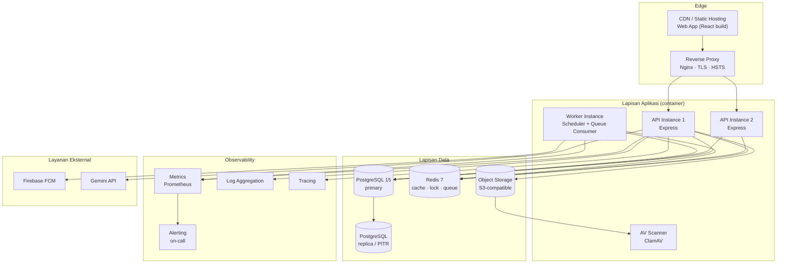

# 27. Deployment, Infrastruktur & Operasional

> Bab ini menjawab pertanyaan yang sebelumnya tidak dijawab PRD: **di mana sistem berjalan, bagaimana ia dirilis, dipantau, dicadangkan, dan dipulihkan.**

## 27.1 Keputusan Infrastruktur

Menggantikan AS-14 dan AS-16 yang sebelumnya berstatus asumsi terbuka.

| Kode | Keputusan |
|---|---|
| INF-01 | **Basis data: PostgreSQL 15+.** Dipilih karena PRD mensyaratkan kolom JSON terindeks, `tstzrange` + *exclusion constraint* (Bab 26.3), *partial unique index* (`nomor_seri` unik bila diisi), dan partisi tabel bervolume tinggi. MySQL tidak mendukung *exclusion constraint*. |
| INF-02 | **Penyimpanan objek: S3-compatible** (AWS S3, atau MinIO bila di-*hosting* mandiri). Tidak diizinkan menyimpan berkas pada *filesystem* server aplikasi. |
| INF-03 | **Cache & antrean: Redis 7+**, dipakai untuk cache agregat dashboard, *distributed lock* (JOB-02), *rate limiting*, dan antrean pekerjaan. |
| INF-04 | **Runtime: Node.js LTS**, dikemas sebagai container OCI. |
| INF-05 | **Model hosting: VPS terkelola dengan container orchestration sederhana** (Docker Compose untuk instalasi tunggal sekolah; Kubernetes hanya bila sekolah sudah memilikinya). |
| INF-06 | **Reverse proxy & TLS**: Nginx/Caddy dengan sertifikat Let's Encrypt yang diperbarui otomatis; HTTP dialihkan permanen ke HTTPS (NFR-S-01). |
| INF-07 | **Zona waktu server dan basis data ditetapkan UTC.** Konversi ke WIB dilakukan di lapisan penyajian (NFR-C-10). |

## 27.2 Topologi Deployment

## 27.3 Sizing Awal (skala terkonfirmasi: 5.000 aset · 1.000 pengguna · 150 concurrent)

| Komponen | Spesifikasi minimum | Catatan |
|---|---|---|
| API (2 instance) | 2 vCPU · 4 GB RAM masing-masing | Stateless, dapat ditambah horizontal |
| Worker (1 instance) | 2 vCPU · 4 GB RAM | Termasuk pembuatan PDF & ekspor |
| PostgreSQL | 4 vCPU · 8 GB RAM · 100 GB SSD | Pertumbuhan ±3 GB/tahun (dominan `activity_logs`) |
| Redis | 1 vCPU · 2 GB RAM | Persistence AOF aktif untuk antrean |
| Object storage | 250 GB awal | Dominan foto kondisi & kerusakan |
| Total bandwidth | ≥ 100 Mbps simetris | Unggah foto dari lapangan |

## 27.4 CI/CD & Manajemen Rilis

| Kode | Requirement |
|---|---|
| CD-01 | Pipeline wajib menjalankan berurutan: *lint* → *unit test* → *integration test* → *build* → *SAST* → *dependency scan (SCA)* → *container image scan* → *deploy* |
| CD-02 | Gerbang kualitas: pipeline gagal bila cakupan logika bisnis inti < 70% (NFR-M-03) atau ditemukan kerentanan *High/Critical* |
| CD-03 | Strategi branching: `main` (production) ← `staging` ← `develop` ← *feature branch*; rilis melalui tag bersemantik `vMAJOR.MINOR.PATCH` |
| CD-04 | *Database migration* dijalankan sebagai langkah terpisah sebelum instance aplikasi baru menerima trafik, dan **wajib** kompatibel mundur satu versi (*expand → migrate → contract*) agar rollback aplikasi tidak merusak skema |
| CD-05 | **Rencana rollback**: image versi sebelumnya dipertahankan minimal 5 rilis; rollback aplikasi ≤ 15 menit; rollback skema hanya melalui migration `down` yang telah diuji di staging |
| CD-06 | Deployment ke production dilakukan di luar jam operasional (NFR-A-03) dan diumumkan H-2 |
| CD-07 | *Smoke test* otomatis pasca-deploy atas alur kritis: login, cari aset, ajukan reservasi, scan QR, buat tiket kerusakan |

## 27.5 Lingkungan

| Lingkungan | Tujuan | Data | Akses |
|---|---|---|---|
| Development | Pengembangan harian | Data sintetis | Tim pengembang |
| Staging | UAT, uji beban, uji migrasi | Salinan produksi **teranonimisasi** (Bab 28.5) | Tim + perwakilan sekolah |
| Production | Operasional | Data nyata | Terbatas, dengan pencatatan akses |

Dilarang keras menyalin data produksi ke staging tanpa anonimisasi (lihat DP-08).

## 27.6 Observability & Alerting

| Kode | Requirement |
|---|---|
| OBS-01 | Metrik wajib diekspos: *rate*, *error*, *duration* per endpoint; kedalaman antrean; durasi pekerjaan terjadwal; pool koneksi DB; *hit ratio* cache |
| OBS-02 | Log aplikasi terstruktur JSON dengan `request_id`, `user_id`, `modul` (NFR-M-06), dikirim ke agregator terpusat, retensi ≥ 30 hari |
| OBS-03 | *Distributed tracing* pada alur transaksional kritis (reservasi, check-out, check-in, approval, chat) |
| OBS-04 | *Uptime monitoring* eksternal atas `/health` setiap 60 detik |
| OBS-05 | **Alert wajib**: 5xx > 1% selama 5 menit · p95 API > 1 detik selama 10 menit · pekerjaan terjadwal gagal · kedalaman antrean > 1.000 · disk > 80% · cadangan gagal · sertifikat TLS < 14 hari · kegagalan tulis activity log (AL-08) · konsumsi kuota atau batas laju Gemini API melewati ambang |
| OBS-06 | Endpoint `/health` membedakan *liveness* dan *readiness*, serta melaporkan status dependensi (DB, Redis, storage, FCM, LLM) untuk kartu "Kesehatan Integrasi" pada Dashboard Administrator (19.2) |
| OBS-07 | Ditetapkan penerima alarm (*on-call*) beserta jalur eskalasinya sebelum go-live |

## 27.7 Backup, Restore & Disaster Recovery

| Kode | Requirement |
|---|---|
| BR-DR-01 | PostgreSQL: *base backup* harian **plus** arsip WAL berkelanjutan sehingga PITR memungkinkan; ini yang memenuhi RPO ≤ 24 jam (NFR-R-01) dengan margin |
| BR-DR-02 | Object storage: *versioning* aktif dan replikasi ke bucket/wilayah terpisah |
| BR-DR-03 | Cadangan disimpan **terenkripsi** dan di lokasi berbeda dari server produksi (NFR-R-03) |
| BR-DR-04 | Restore diuji otomatis ke lingkungan sementara **setiap bulan**, dan diuji penuh (*full DR drill*) setiap 6 bulan (NFR-R-04) |
| BR-DR-05 | **DR runbook tertulis** wajib ada sebelum go-live, memuat: urutan pemulihan, penanggung jawab, titik keputusan, dan cara verifikasi keberhasilan. RTO ≤ 4 jam (NFR-R-02) tidak sah tanpa runbook ini. |
| BR-DR-06 | Cadangan konfigurasi (parameter sistem, approval rules, matriks permission) diekspor terpisah setiap perubahan |

## 27.8 Manajemen Secret & Konfigurasi

| Kode | Requirement |
|---|---|
| SEC-CFG-01 | Seluruh kredensial disimpan pada *secret manager* atau *encrypted environment*, tidak pernah di repositori (NFR-S-13) |
| SEC-CFG-02 | Rotasi wajib: kunci Gemini API (`GEMINI_API_KEY`) dan kredensial FCM setiap 12 bulan; kredensial basis data setiap 6 bulan; JWT signing key setiap 6 bulan dengan masa tumpang tindih |
| SEC-CFG-03 | Akun basis data aplikasi tidak memiliki hak DDL di production; migration dijalankan dengan akun terpisah (NFR-S-12) |
| SEC-CFG-04 | *Pre-commit hook* dan pemindaian repositori untuk mencegah kebocoran secret |

## 27.9 Estimasi Biaya Operasional Bulanan (indikatif)

| Komponen | Estimasi | Catatan |
|---|---|---|
| VPS aplikasi + worker | Menengah | 2 API + 1 worker |
| PostgreSQL terkelola | Menengah | Termasuk PITR |
| Redis | Rendah | |
| Object storage + bandwidth | Rendah–menengah | Tumbuh seiring foto |
| Firebase FCM | Gratis pada volume ini | |
| Gemini API (tier gratis sejak 2 September 2026) | **Nol biaya, terbatas kuota** | Tidak ada tagihan; yang dipantau adalah kuota dan batas laju penyedia. Batas harian (RS-08) dan *prompt caching* (Bab 22.8) tetap berlaku sebagai kendali beban |
| Cadangan & pemantauan | Rendah | |

Angka absolut ditetapkan bersama penyedia infrastruktur pada tahap perencanaan teknis; yang mengikat di sini adalah **kewajiban memantau kuota dan batas laju Gemini API sebagai metrik operasional** (OBS-05). Sejak tier gratis dipakai, tidak ada tagihan yang dipantau.

---
