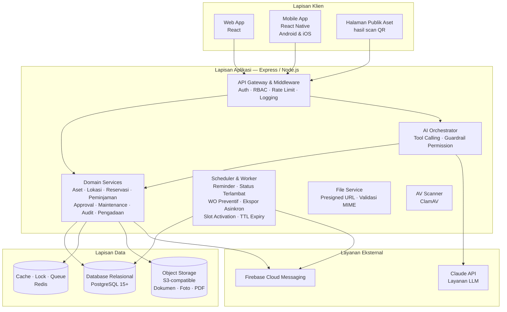
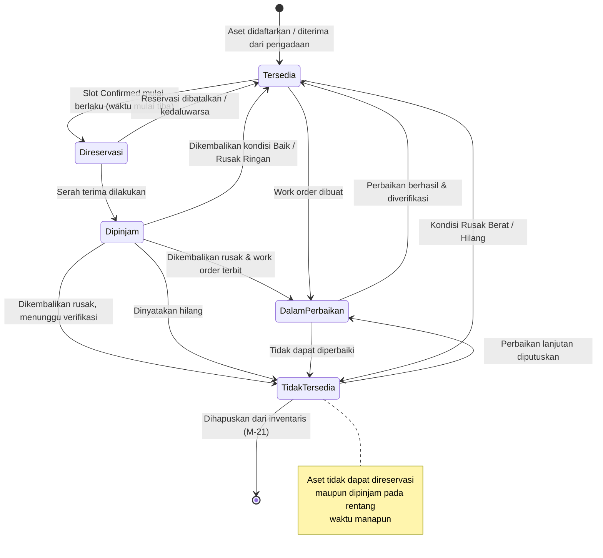
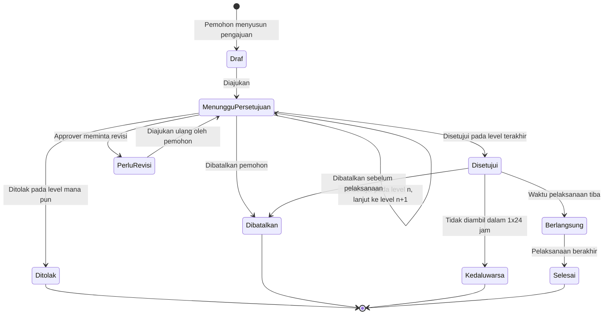
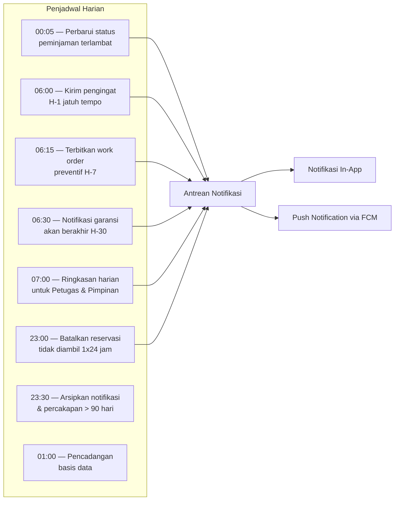

# 12. System Workflow

## 12.1 Arsitektur Sistem Tingkat Tinggi

## 12.2 Alur Status Aset (State Diagram)

> **Penting (BR-005):** diagram ini menggambarkan **status operasional aset pada saat ini (*now*)**, bukan ketersediaannya di masa depan. Ketersediaan pada rentang tanggal dihitung dari `booking_slots` (Bab 26). Aset berstatus `Dipinjam` hari ini tetap dapat dipesan untuk minggu depan.

**Klarifikasi transisi `Dipinjam` → kondisi rusak (menyelesaikan ambiguitas FR-09.2 A1):**

| Situasi saat check-in | Status aset segera setelah check-in | Pemicu transisi berikutnya |
|---|---|---|
| Kondisi `Baik` / `Rusak Ringan` dan masih layak pakai | `Tersedia` | — |
| Kondisi `Rusak Ringan` namun perlu perbaikan, work order langsung dibuat | `Dalam Perbaikan` | Verifikasi work order (FR-12.4) |
| Kondisi `Rusak Berat` / `Tidak Lengkap`, work order belum dibuat | `Tidak Tersedia` | Pembuatan work order → `Dalam Perbaikan` |
| Dinyatakan `Hilang` | `Tidak Tersedia` | Rekonsiliasi opname atau berita acara (BR-012) |

Seluruh slot pemesanan mendatang atas aset yang berpindah ke `Dalam Perbaikan` atau `Tidak Tersedia` dibatalkan otomatis dan pemohonnya dinotifikasi (BR-048, NT-27).

## 12.3 Alur Status Pengajuan (State Diagram)

## 12.4 Alur Kerja Harian Sistem (Scheduled Jobs)

---

---

## 14.1 Use Case Keseluruhan

```mermaid
flowchart LR
    ADM(("Administrator"))
    SAR(("Petugas<br/>Sarpras"))
    PIM(("Pimpinan<br/>Sekolah"))
    TEK(("Teknisi"))
    GUR(("Guru"))
    STF(("Staf / TU"))
    SIS(("Siswa /<br/>OSIS"))

    subgraph SISTEM["Sistem SIGM4"]
        UC01["Kelola User & Role"]
        UC02["Konfigurasi Approval Rules"]
        UC03["Konfigurasi Parameter Sistem"]
        UC04["Lihat Activity Log"]
        UC05["Kelola Lokasi"]
        UC06["Kelola Inventaris Aset"]
        UC07["Cetak & Kelola QR Code"]
        UC08["Kelola Dokumen Aset"]
        UC09["Scan QR Aset"]
        UC10["Ajukan Reservasi Ruangan"]
        UC11["Ajukan Reservasi Barang"]
        UC12["Setujui / Tolak Pengajuan"]
        UC13["Proses Serah Terima"]
        UC14["Proses Pengembalian"]
        UC15["Kelola Denda"]
        UC16["Lapor Kerusakan"]
        UC17["Verifikasi Laporan Kerusakan"]
        UC18["Kelola Work Order"]
        UC19["Eksekusi Work Order"]
        UC20["Jalankan Stock Opname"]
        UC21["Setujui Hasil Opname"]
        UC22["Ajukan Usulan Pengadaan"]
        UC23["Catat Penerimaan Barang"]
        UC24["Lihat Dashboard"]
        UC25["Lihat Statistik & Analitik"]
        UC26["Gunakan Chatbot AI"]
        UC27["Kelola Notifikasi Pribadi"]
    end

    ADM --- UC01
    ADM --- UC02
    ADM --- UC03
    ADM --- UC04
    ADM --- UC24

    SAR --- UC05
    SAR --- UC06
    SAR --- UC07
    SAR --- UC08
    SAR --- UC09
    SAR --- UC12
    SAR --- UC13
    SAR --- UC14
    SAR --- UC15
    SAR --- UC17
    SAR --- UC18
    SAR --- UC20
    SAR --- UC23
    SAR --- UC24
    SAR --- UC25

    PIM --- UC12
    PIM --- UC21
    PIM --- UC24
    PIM --- UC25
    PIM --- UC04

    TEK --- UC09
    TEK --- UC16
    TEK --- UC19
    TEK --- UC24

    GUR --- UC09
    GUR --- UC10
    GUR --- UC11
    GUR --- UC16
    GUR --- UC22
    GUR --- UC24
    GUR --- UC26
    GUR --- UC27

    STF --- UC09
    STF --- UC10
    STF --- UC11
    STF --- UC16
    STF --- UC22
    STF --- UC26
    STF --- UC27

    SIS --- UC09
    SIS --- UC10
    SIS --- UC11
    SIS --- UC16
    SIS --- UC26
    SIS --- UC27
```

---

## Diagram yang Dipindahkan ke Modul

Process flow (Bab 13), sequence diagram (Bab 15), dan use case modul peminjaman (14.2) bersifat spesifik per modul, sehingga dipindahkan ke berkas modulnya (bagian 4 — Business Flow). Tidak ada salinan di sini.

| Diagram | Kini berada di |
|---|---|
| 13.1 Process Flow — Reservasi & Peminjaman Barang | [`m08-reservation-item.md`](../02-modules/m08-reservation-item.md) |
| 13.2 Process Flow — Laporan Kerusakan hingga Work Order Selesai | [`m11-damage-reports.md`](../02-modules/m11-damage-reports.md) |
| 13.3 Process Flow — Stock Opname | [`m13-audit-stocktake.md`](../02-modules/m13-audit-stocktake.md) |
| 13.4 Process Flow — Pengadaan Barang | [`m14-procurement.md`](../02-modules/m14-procurement.md) |
| 14.2 Use Case Modul Peminjaman (Detail Relasi) | [`m09-loans.md`](../02-modules/m09-loans.md) |
| 15.1 Login dengan 2FA | [`m01-auth.md`](../02-modules/m01-auth.md) |
| 15.2 Pengajuan Reservasi dengan Approval Berjenjang | [`m07-reservation-room.md`](../02-modules/m07-reservation-room.md) |
| 15.3 Serah Terima Peminjaman via Scan QR | [`m09-loans.md`](../02-modules/m09-loans.md) |
| 15.4 Pengembalian dengan Perhitungan Denda | [`m09-loans.md`](../02-modules/m09-loans.md) |
| 15.5 Laporan Kerusakan hingga Work Order | [`m11-damage-reports.md`](../02-modules/m11-damage-reports.md) |
| 15.6 Percakapan Chatbot AI dengan Tool Calling | [`m19-chatbot.md`](../02-modules/m19-chatbot.md) |
| 15.7 Stock Opname via Scan QR | [`m13-audit-stocktake.md`](../02-modules/m13-audit-stocktake.md) |
