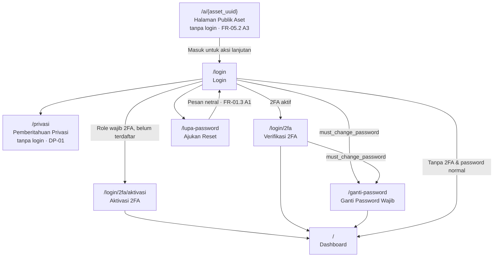
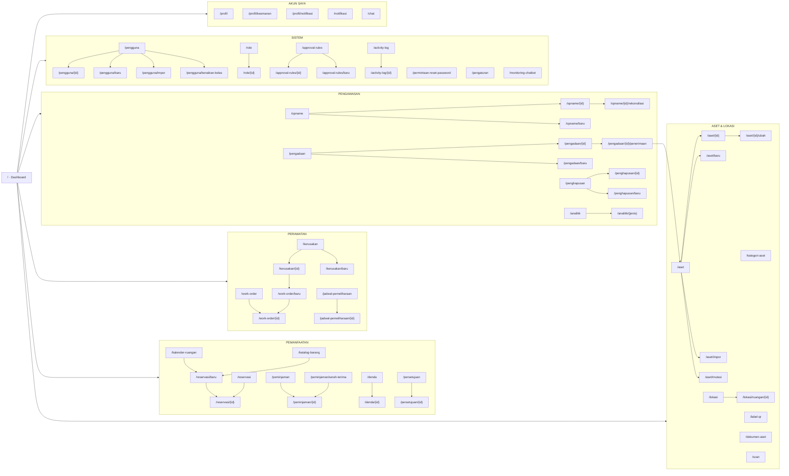
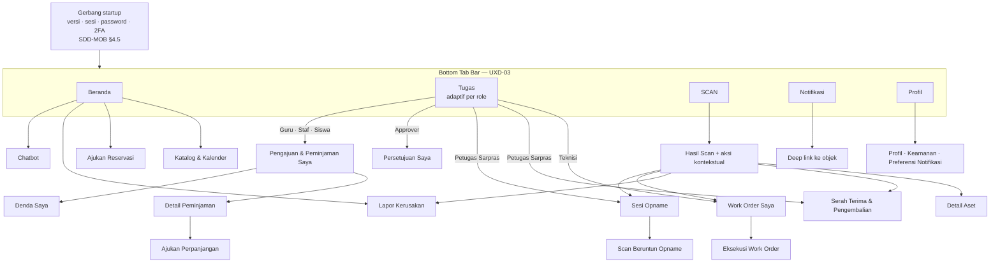

# Information Architecture — SIGM4 UX

> **Dokumentasi UX SIGM4** — [Overview](UX-SPEC.md) · **Information Architecture** · [Navigation](NAVIGATION.md) · [Page Specification](PAGE-SPECIFICATION.md) · [User Flows](USER-FLOWS.md) · [Decisions](DECISIONS.md)

**Berkas ini memuat:** [§3 Information Architecture](#3-information-architecture) · [§4 Sitemap](#4-sitemap)

Penomoran bagian dipertahankan dari UX-SPEC v1.0 agar seluruh rujukan silang tetap sahih — peta lengkap ada di [Peta bagian → berkas](UX-SPEC.md#peta-bagian--berkas). Prinsip desain, role, dan lingkup yang mendasari bagian ini berada di [`UX-SPEC.md`](UX-SPEC.md).

| Berkas tetangga | Kaitan |
|---|---|
| [`NAVIGATION.md`](NAVIGATION.md) | §5 menjabarkan bagaimana struktur IA §3 diwujudkan sebagai sidebar, topbar, dan breadcrumb |
| [`PAGE-SPECIFICATION.md`](PAGE-SPECIFICATION.md) | §6 memuat inventaris lengkap seluruh route yang muncul pada sitemap §4 |
| [`DECISIONS.md`](DECISIONS.md) | **UXD-01** adalah dasar pengelompokan lima grup domain kerja pada §3.1 |

---

# 3. Information Architecture

## 3.1 Prinsip penyusunan

21 modul PRD **tidak** dipetakan satu-ke-satu menjadi 21 entri menu. Ia dikelompokkan menjadi **lima grup domain kerja** (**UXD-01**) karena tiga alasan:

1. Tiga modul tidak pernah menjadi entri menu tersendiri — **M-15 Dashboard** adalah beranda, **M-17 Notifikasi** adalah pusat notifikasi + ikon lonceng, **M-19 Chatbot** adalah panel global.
2. Beberapa modul memiliki lebih dari satu entri menu — **M-04** memunculkan *Inventaris Aset* dan *Kategori Aset*; **M-09** memunculkan *Peminjaman* dan *Denda & Kewajiban*; **M-10** memunculkan *Persetujuan Saya* dan *Approval Rules* yang berada di grup berbeda.
3. Modul yang dipakai bersama dalam satu pekerjaan diletakkan berdekatan, sehingga pengguna jarang-pakai tidak perlu mengingat batas modul (`UX-06`).

## 3.2 Peta Information Architecture

```mermaid
flowchart TD
    ROOT["SIGM4"]

    ROOT --> BER["BERANDA"]
    ROOT --> AST["ASET & LOKASI"]
    ROOT --> PMF["PEMANFAATAN"]
    ROOT --> PRW["PERAWATAN"]
    ROOT --> PGW["PENGAWASAN"]
    ROOT --> SIS["SISTEM"]
    ROOT --> PRB["AKUN SAYA"]

    BER --> B1["Dashboard · M-15"]
    BER --> B2["Pusat Notifikasi · M-17"]

    AST --> A1["Inventaris Aset · M-04"]
    AST --> A2["Kategori Aset · M-04"]
    AST --> A3["Lokasi · M-03"]
    AST --> A4["Label QR · M-05"]
    AST --> A5["Dokumen Aset · M-06"]
    AST --> A6["Scan QR · M-05"]

    PMF --> P1["Kalender Ruangan · M-07"]
    PMF --> P2["Katalog Barang · M-08"]
    PMF --> P3["Reservasi · M-07 · M-08"]
    PMF --> P4["Peminjaman · M-09"]
    PMF --> P5["Denda & Kewajiban · M-09"]
    PMF --> P6["Persetujuan Saya · M-10"]

    PRW --> W1["Laporan Kerusakan · M-11"]
    PRW --> W2["Work Order · M-12"]
    PRW --> W3["Jadwal Pemeliharaan · M-12"]

    PGW --> G1["Stock Opname · M-13"]
    PGW --> G2["Pengadaan · M-14"]
    PGW --> G3["Penghapusan Aset · M-21"]
    PGW --> G4["Statistik & Analitik · M-16"]

    SIS --> S1["Pengguna & Role · M-02"]
    SIS --> S2["Permintaan Reset Password · M-01"]
    SIS --> S3["Approval Rules · M-10"]
    SIS --> S4["Parameter Sistem · M-20"]
    SIS --> S5["Activity Log · M-18"]
    SIS --> S6["Monitoring Chatbot · M-19"]

    PRB --> R1["Profil · M-01"]
    PRB --> R2["Keamanan & 2FA · M-01"]
    PRB --> R3["Preferensi Notifikasi · M-17"]

    GLB(["Panel Chatbot · M-19 — global, bukan entri menu"]) -.-> ROOT
```



## 3.3 Pemetaan 21 modul ke lokasi antarmuka

Tidak ada modul yang tidak terwakili. Kolom terakhir membuktikannya.

| Modul | Nama | Lokasi antarmuka |
|---|---|---|
| M-01 | Autentikasi & Akun | Layar publik (`/login`, `/lupa-password`) + grup **Akun Saya** + `/permintaan-reset-password` (grup Sistem) |
| M-02 | User & Role | Grup **Sistem** → Pengguna & Role |
| M-03 | Lokasi | Grup **Aset & Lokasi** → Lokasi |
| M-04 | Inventaris Aset | Grup **Aset & Lokasi** → Inventaris Aset + Kategori Aset |
| M-05 | QR Code | Grup **Aset & Lokasi** → Label QR + Scan QR; halaman publik `/a/{uuid}`; tab Scan mobile |
| M-06 | Dokumen Aset | Grup **Aset & Lokasi** → Dokumen Aset; tab *Dokumen* pada detail aset |
| M-07 | Reservasi Ruangan | Grup **Pemanfaatan** → Kalender Ruangan + Reservasi; tab *Jadwal Tetap* pada detail ruangan |
| M-08 | Reservasi Barang | Grup **Pemanfaatan** → Katalog Barang + Reservasi |
| M-09 | Peminjaman | Grup **Pemanfaatan** → Peminjaman + Denda & Kewajiban |
| M-10 | Approval Engine | Grup **Pemanfaatan** → Persetujuan Saya; grup **Sistem** → Approval Rules; komponen *Linimasa Approval* pada setiap detail pengajuan |
| M-11 | Laporan Kerusakan | Grup **Perawatan** → Laporan Kerusakan; aksi kontekstual pada scan QR |
| M-12 | Maintenance | Grup **Perawatan** → Work Order + Jadwal Pemeliharaan; tab *Riwayat Pemeliharaan* pada detail aset |
| M-13 | Audit & Opname | Grup **Pengawasan** → Stock Opname |
| M-14 | Pengadaan | Grup **Pengawasan** → Pengadaan |
| M-15 | Dashboard | **Beranda** — halaman `/` |
| M-16 | Analitik | Grup **Pengawasan** → Statistik & Analitik |
| M-17 | Notifikasi | Ikon lonceng pada topbar + halaman `/notifikasi` + **Akun Saya** → Preferensi Notifikasi |
| M-18 | Activity Log | Grup **Sistem** → Activity Log; tombol *Riwayat Perubahan* pada halaman detail entitas (`FR-18.2 A2`) |
| M-19 | Chatbot AI | Panel global (tombol mengambang) + `/chat` untuk riwayat; grup **Sistem** → Monitoring Chatbot |
| M-20 | Konfigurasi | Grup **Sistem** → Parameter Sistem (termasuk Kalender Akademik & Unit Kerja) |
| M-21 | Penghapusan Aset | Grup **Pengawasan** → Penghapusan Aset |

## 3.4 Kedalaman hierarki

Maksimum **tiga tingkat** dari beranda ke layar kerja mana pun.

```
Tingkat 1   Grup sidebar          ASET & LOKASI
Tingkat 2   Halaman daftar        Inventaris Aset            /aset
Tingkat 3   Halaman detail        Detail Aset LAB-KOM-0002   /aset/3021
            Tab dalam detail      Riwayat Pemeliharaan       /aset/3021/servis
```

Formulir panjang (wizard reservasi, editor approval rule, rekonsiliasi opname) berada pada **tingkat 3** sebagai route tersendiri, bukan tingkat 4 — sehingga tetap dapat ditautkan langsung (`UXP-01`).

---

# 4. Sitemap

## 4.1 Sitemap web — area publik & gerbang sesi

Urutan gerbang mencerminkan urutan middleware server (`SDD-AUTH-09`, `SDD-MOB` §4.5) sehingga klien tidak pernah menampilkan layar yang akan ditolak server.



## 4.2 Sitemap web — area terautentikasi



## 4.3 Sitemap mobile

Mobile **tidak** mencerminkan seluruh 21 modul — hanya alur yang PRD nyatakan berjalan di lapangan (`SDD-MOB` §4.1, `UX-01`).



## 4.4 Halaman sistem (tanpa entri menu)

Halaman berikut tidak pernah muncul di navigasi tetapi wajib ada — ia menutup `UX-05`.

| Route | Halaman | Dipicu oleh |
|---|---|---|
| `/tidak-punya-akses` | Tanpa Hak Akses | `403 FORBIDDEN` · `SDD-AUTH-08` · `MOB-DL-03` |
| `/tidak-ditemukan` | Halaman Tidak Ditemukan | Route tidak dikenali |
| `/data-tidak-tersedia` | Data Tidak Lagi Tersedia | Deep link ke objek terhapus/dibatalkan (`FR-17.1 A1`, `MOB-DL-04`) |
| `/gangguan` | Gangguan Sistem | `500` / `503`; menampilkan `request_id` yang dapat disalin (31.5) |
| *(mobile)* | Pembaruan Wajib | `426 UPGRADE_REQUIRED` (`MOB-VER-03`) — tidak dapat dilewati |
