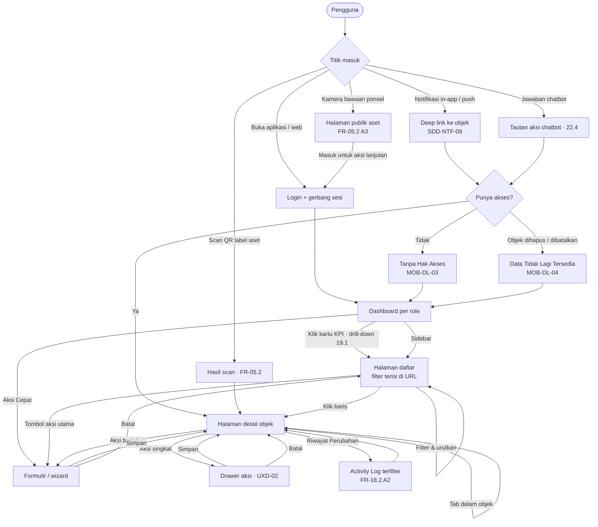

# Navigation — SIGM4 UX

> **Dokumentasi UX SIGM4** — [Overview](UX-SPEC.md) · [Information Architecture](INFORMATION-ARCHITECTURE.md) · **Navigation** · [Page Specification](PAGE-SPECIFICATION.md) · [User Flows](USER-FLOWS.md) · [Decisions](DECISIONS.md)

**Berkas ini memuat:** [§5 Navigation Architecture](#5-navigation-architecture) — kerangka layar, topbar, sidebar, breadcrumb, navigasi mobile, navigasi berbasis role, deep link, dan alur navigasi utama.

Penomoran bagian dipertahankan dari UX-SPEC v1.0 agar seluruh rujukan silang tetap sahih — peta lengkap ada di [Peta bagian → berkas](UX-SPEC.md#peta-bagian--berkas).

| Berkas tetangga | Kaitan |
|---|---|
| [`INFORMATION-ARCHITECTURE.md`](INFORMATION-ARCHITECTURE.md) | §3 menetapkan lima grup domain kerja yang menjadi struktur sidebar §5.3; §4 memuat sitemap yang dinavigasikan |
| [`PAGE-SPECIFICATION.md`](PAGE-SPECIFICATION.md) | §6 mendaftar entry point & exit point tiap halaman; §10.2 mengatur perilaku responsif sidebar |
| [`DECISIONS.md`](DECISIONS.md) | **UXD-01** (struktur sidebar), **UXD-02** (halaman vs drawer), **UXD-03** (navigasi mobile) |

---

# 5. Navigation Architecture

## 5.1 Kerangka layar web

```
+----------------------------------------------------------------------+
|  TOPBAR                                                              |
|  [=]  SIGM4 · SMA Negeri 1     [ Cari aset / kode barang ]           |
|                                          [WIB 14:32]  [(3)]  [Yoga v]|
+------------------+---------------------------------------------------+
|  SIDEBAR         |  BREADCRUMB   Beranda / Inventaris Aset / LAB-...  |
|                  |---------------------------------------------------|
|  BERANDA         |  JUDUL HALAMAN                    [Aksi utama]     |
|   Dashboard      |  Ringkasan / lencana status                       |
|   Notifikasi (3) |---------------------------------------------------|
|                  |                                                   |
|  ASET & LOKASI   |  KONTEN                                           |
|   Inventaris     |                                                   |
|   Kategori       |                                                   |
|   Lokasi         |                                                   |
|   Label QR       |                                                   |
|   Dokumen Aset   |                                                   |
|   Scan QR        |                                                   |
|                  |                                                   |
|  PEMANFAATAN     |                                                   |
|   ...            |                                                   |
+------------------+---------------------------------------------------+
                                                        [ Tanya SIGM4 ]
```

## 5.2 Topbar

| Elemen | Perilaku | Rujukan |
|---|---|---|
| **Tombol ciutkan sidebar** | Menciutkan sidebar menjadi ikon-saja; preferensi tersimpan sebagai preferensi tampilan (`SDD-FE-03`) | **UXD-01** |
| **Identitas sekolah** | Nama sekolah + logo dari parameter sistem, kelompok Identitas Sekolah | `FR-20.1` |
| **Pencarian global** | Satu kotak: kode barang, nomor seri, nama aset, nomor dokumen. Nilai yang cocok regex `SEQ-04` melompat langsung ke detail objeknya | `FR-04.2` · `SEQ-04` |
| **Penanda zona waktu** | Menampilkan **WIB** permanen, tidak mengikuti zona waktu perangkat | `CAL-UI-09` · `NFR-C-10` |
| **Lonceng notifikasi** | Penghitung belum dibaca dari server, disiarkan ulang setiap perubahan — tidak dihitung klien. Klik membuka pratinjau 5 terbaru + tautan ke `/notifikasi` | `NTF-05` · `FR-17.1` |
| **Menu pengguna** | Profil · Keamanan & 2FA · Preferensi Notifikasi · Pemberitahuan Privasi · Keluar · **Keluar dari semua perangkat** | `FR-01.2 A1` · `FR-01.4` · `DP-01` |
| **Banner koneksi putus** | Banner persisten di bawah topbar; aksi yang memerlukan koneksi dinonaktifkan beserta penjelasannya | 31.5 · `NO-07` |
| **Banner sesi akan berakhir** | Muncul pada menit ke-28 idle, menawarkan "Lanjutkan" sebelum auto-logout menit ke-30 | `FR-01.2 A2` |
| **Banner koneksi realtime turun** | Bila SSE gagal tiga kali dan sistem beralih ke polling, atau koneksi diputus karena batas 2 koneksi terlampaui, UI **menjelaskannya** — tidak diam | `NTF-03` · `SDD-FE` §5 |

## 5.3 Sidebar

Struktur tetap sama untuk semua role (**UXD-01**). Yang berbeda hanyalah entri mana yang dirender — dan itu ditentukan permission dari `GET /me`, bukan role (`UXP-02`).

| Aturan | Ketentuan | Rujukan |
|---|---|---|
| **Sumber visibilitas** | Entri dirender bila pengguna memiliki permission `view` domainnya. Entri tanpa permission **tidak dirender**, bukan dinonaktifkan | `PM-04` · `SDD-FE` §4.2 |
| **Grup kosong disembunyikan** | Bila seluruh entri dalam satu grup tersembunyi, judul grup ikut hilang — tidak ada judul menggantung | **UXD-01** |
| **Penanda jumlah** | Hanya pada entri berbasis antrean: Notifikasi (belum dibaca), Persetujuan Saya (menunggu keputusan saya), Work Order (ditugaskan & belum selesai), Laporan Kerusakan (`Dilaporkan`) | 19.2–19.5 |
| **Grup Sistem** | Selalu paling bawah, diberi pemisah visual | **UXD-01** |
| **Akun Saya** | **Tidak** di sidebar; hanya di menu pengguna pada topbar | **UXD-01** |

### Sidebar per role (yang benar-benar terlihat)

Diturunkan dari Lampiran C dan Bab 18. Tanda `—` berarti entri tidak dirender sama sekali.

| Grup / Entri | Admin | Petugas | Pimpinan | Teknisi | Guru | Staf | Siswa |
|---|:---:|:---:|:---:|:---:|:---:|:---:|:---:|
| **Beranda** — Dashboard | ✅ | ✅ | ✅ | 🟡 | 🟡 | 🟡 | 🟡 |
| **Beranda** — Notifikasi | ✅ | ✅ | ✅ | ✅ | ✅ | ✅ | ✅ |
| **Aset** — Inventaris Aset | ✅ | ✅ | 🔍 | 🔍 | 🔍 | 🔍 | 🟡 |
| **Aset** — Kategori Aset | ✅ | ✅ | 🔍 | — | — | — | — |
| **Aset** — Lokasi | ✅ | ✅ | 🔍 | 🔍 | 🔍 | 🔍 | — |
| **Aset** — Label QR | ✅ | ✅ | — | — | — | — | — |
| **Aset** — Dokumen Aset | ✅ | ✅ | 🔍 | 🔍 | 🔍 | 🔍 | — |
| **Aset** — Scan QR | ✅ | ✅ | ✅ | ✅ | ✅ | ✅ | 🟡 |
| **Pemanfaatan** — Kalender Ruangan | ✅ | ✅ | ✅ | 🔍 | ✅ | ✅ | 🟡 |
| **Pemanfaatan** — Katalog Barang | ✅ | ✅ | ✅ | — | ✅ | ✅ | 🟡 |
| **Pemanfaatan** — Reservasi | ✅ | ✅ | ✅ | — | 🟡 | 🟡 | 🟡 |
| **Pemanfaatan** — Peminjaman | ✅ | ✅ | 🔍 | — | 🟡 | 🟡 | 🟡 |
| **Pemanfaatan** — Denda & Kewajiban | ✅ | ✅ | 🔍◆ | — | 🟡 | 🟡 | 🟡 |
| **Pemanfaatan** — Persetujuan Saya | ✅ | ✅ | ✅ | — | ◐ | ◐ | — |
| **Perawatan** — Laporan Kerusakan | ✅ | ✅ | 🔍 | 🟡 | 🟡 | 🟡 | 🟡 |
| **Perawatan** — Work Order | ✅ | ✅ | 🔍 | 🟡 | — | — | — |
| **Perawatan** — Jadwal Pemeliharaan | ✅ | ✅ | 🔍 | 🔍 | — | — | — |
| **Pengawasan** — Stock Opname | ✅ | ✅ | ✅ | — | — | — | — |
| **Pengawasan** — Pengadaan | ✅ | ✅ | ✅ | — | 🟡 | 🟡 | — |
| **Pengawasan** — Penghapusan Aset | ✅ | ✅ | ✅ | — | — | — | — |
| **Pengawasan** — Statistik & Analitik | ✅ | ✅ | ✅ | — | — | — | — |
| **Sistem** — Pengguna & Role | ✅ | 🔍 | 🔍 | — | — | — | — |
| **Sistem** — Permintaan Reset Password | ✅ | — | — | — | — | — | — |
| **Sistem** — Approval Rules | ✅ | — | 🔍 | — | — | — | — |
| **Sistem** — Parameter Sistem | ✅ | — | 🔍 | — | — | — | — |
| **Sistem** — Activity Log | ✅ | — | 🔍 | — | — | — | — |
| **Sistem** — Monitoring Chatbot | ✅ | — | 🔍 | — | — | — | — |
| *(global)* Panel Chatbot | ✅ | ✅ | ✅ | ✅ | ✅ | ✅ | 🟡 |

**Keterangan:** ✅ penuh · 🔍 hanya lihat · 🔍◆ hanya lihat, dengan **satu** aksi tulis tertentu · 🟡 cakupan data terbatas (scope `own` / `assigned` / `restricted`) · ◐ terlihat **hanya bila** approval rules menunjuk pengguna sebagai approver · — tidak dirender.

> **Catatan atas ◐.** Baris Guru/Staf pada *Persetujuan Saya* tidak dapat ditetapkan ✅ maupun — karena Lampiran C mendefinisikan pemilik `approval.decide` sebagai *"Sesuai approval rules"*, dan Contoh 1 pada Lampiran D.6 memang menjadikan role **Guru** approver level 1 bagi pengajuan siswa. Menyembunyikannya berdasarkan nama role akan menyalahi `PM-04`.

> **Catatan atas Teknisi pada Kalender Ruangan.** Bab 18 memberi Teknisi 🔍 untuk "Reservasi Ruangan — lihat kalender", sementara `FR-07.1` tidak menyebut Teknisi pada daftar aktornya. Diselesaikan mengikuti Bab 18 dan Lampiran C (`reservation.view` = "Semua, scope berbeda"): entri dirender, tanpa tombol pengajuan karena Teknisi tidak memiliki `reservation.create`.

> **Catatan atas 🔍◆ Pimpinan pada Denda & Kewajiban.** Bab 18 memberi Pimpinan 🔍 untuk "Denda — lihat seluruh", tetapi juga ✅ untuk "Ganti rugi — bebaskan" lewat permission `fine.waive_compensation` (`BR-028e`). Pimpinan karena itu bukan pengguna baca-saja pada halaman ini: entri dirender, seluruh daftar terlihat, dan **satu-satunya** aksi tulis yang tersedia baginya adalah membebaskan kewajiban berjenis `Ganti Rugi` — penuh maupun sebagian. Tombol "Tandai Lunas" dan "Bebaskan Denda Keterlambatan" tidak dirender bagi Pimpinan.

## 5.4 Breadcrumb

| Aturan | Ketentuan |
|---|---|
| **Kapan tampil** | Setiap halaman tingkat 2 dan 3. Tidak tampil di Dashboard |
| **Bentuk** | `Beranda / <Halaman Daftar> / <Identitas Objek>` — maksimum tiga segmen, sesuai kedalaman IA (§3.4) |
| **Identitas objek** | Memakai nomor dokumen atau kode barang yang dikenali pengguna (`LAB-KOM-0002`, `RSV-RG-2026-0001`), bukan ID basis data |
| **Segmen terakhir** | Tidak dapat diklik; diberi `aria-current="page"` |
| **Formulir & wizard** | Menambah segmen aksi: `Beranda / Inventaris Aset / Tambah Aset` |
| **Tab dalam detail** | **Tidak** menambah segmen; tab berpindah dalam objek yang sama |
| **Halaman dicapai lewat deep link** | Breadcrumb tetap terisi penuh dari struktur route, bukan dari riwayat peramban — sehingga pengguna yang mendarat dari notifikasi tetap tahu posisinya (`UX-05`) |

Breadcrumb **tidak** dipakai di mobile; penggantinya adalah judul layar + tombol kembali pada app bar.

## 5.5 Navigasi mobile

Bottom tab bar lima slot dengan Scan di tengah (**UXD-03**).

| Tab | Isi | Rujukan |
|---|---|---|
| **Beranda** | Dashboard ringkas per role + Aksi Cepat | 19.5–19.7 |
| **Tugas** | **Adaptif per permission** — lihat tabel di bawah | **UXD-03** |
| **Scan** | Pemindai QR kamera native; mode beruntun aktif bila sedang dalam sesi opname atau mutasi massal | `FR-05.2` · `MOB-MED-05` · `MOB-MED-07` |
| **Notifikasi** | Daftar notifikasi + penghitung belum dibaca | `FR-17.1` |
| **Profil** | Profil, Keamanan & 2FA, Preferensi Notifikasi, Keluar | `FR-01.4` · `FR-17.3` |

### Isi tab "Tugas"

Ditentukan permission dari `/me` (`UXP-02`), bukan nama role. Bila pengguna memenuhi lebih dari satu baris, tab menampilkan seluruhnya sebagai seksi bertumpuk.

| Permission dimiliki | Isi seksi | Rujukan |
|---|---|---|
| `workorder.execute` | Work Order Saya, terurut prioritas & target selesai | `FR-12.3` · 19.5 |
| `loan.manage` | Serah Terima Hari Ini · Pengembalian Jatuh Tempo · Peminjaman Terlambat | `FR-09.1` · `FR-09.3` · 19.3 |
| `audit.execute` | Sesi Opname Berjalan + progres per lokasi | `FR-13.2` |
| `approval.decide` | Persetujuan Menunggu Keputusan Saya | `FR-10.2` |
| `damage.verify` | Laporan Kerusakan Belum Diverifikasi | `FR-11.2` |
| *(tanpa permission di atas)* | Pengajuan Saya · Peminjaman Aktif · Denda Saya | 19.6 · 19.7 |

### Aturan navigasi mobile

| Aturan | Ketentuan | Rujukan |
|---|---|---|
| Target sentuh | Minimum 44×44 dp pada seluruh tab dan tombol | `NFR-AC-07` |
| Tombol Scan | Diberi label teks "Scan", bukan ikon telanjang | `NFR-AC-04` · `UX-03` |
| Kedalaman | Maksimum dua tingkat dari tab; tingkat ketiga dibuka sebagai layar penuh dengan tombol kembali | — |
| Deep link | Membuka layar tujuan **beserta** tab induknya aktif, sehingga tombol kembali tidak membuang pengguna keluar aplikasi | `MOB-DL-02` · `UX-05` |
| Deep link belum login | Tujuan disimpan, pengguna diarahkan ke login, lalu dilanjutkan setelah berhasil | `SDD-MOB` §4.4 |
| Luring | Tab tetap dapat dijelajahi; aksi tulis gagal eksplisit dengan penjelasan, tidak pernah diantrekan | `MOB-OFF-05` · `SDD-MOB-07` |
| Foto tertunda | Entitas yang fotonya belum terunggah diberi penanda "Foto belum terunggah" pada daftar maupun detail | `MOB-OFF-04` |
| Gerbang pembaruan | `426` menampilkan layar pembaruan paksa yang menutup seluruh navigasi | `MOB-VER-03` |

## 5.6 Alur navigasi utama



**Yang dijamin diagram ini:** setiap simpul memiliki minimal satu busur keluar. Layar galat (`NOACC`, `GONE`) selalu kembali ke Dashboard, bukan berhenti — bentuk konkret `UX-05`.

## 5.7 Deep link — ringkasan silang

> **Bagian ini tidak menambah ketentuan baru.** Ia mengumpulkan ketentuan deep link yang sudah tersebar pada §4.4, §5.5, §5.6, §6, §7.3, dan §9.9 ke satu tempat, karena deep link adalah titik masuk navigasi yang paling mudah terlewat saat wireframing.

| Aspek | Ketentuan | Ditetapkan di |
|---|---|---|
| **Skema** | Android App Links & iOS Universal Links atas domain sekolah, dengan berkas verifikasi dilayani dari domain yang sama | `MOB-DL-01` · [`SDD-12 §4.4`](../SDD/12-mobile-architecture.md) |
| **Bentuk tautan** | Notifikasi menyimpan `deep_link` sebagai **path relatif aplikasi** (mis. `/reservations/1234`), bukan URL absolut — berlaku sama di web dan mobile | `SDD-NTF-09` |
| **Cakupan** | Seluruh notifikasi memuat deep link ke objek terkait | `MOB-DL-02` · §9.9 F-23 |
| **Sasaran** | Setiap entitas memiliki route halaman penuh sendiri, sehingga notifikasi, hasil scan QR, dan tautan chatbot mendarat di tempat yang sama | `UXP-01` · **UXD-02** · §6 |
| **Tab induk aktif** | Deep link mobile membuka layar tujuan **beserta** tab induknya aktif, agar tombol kembali tidak membuang pengguna keluar aplikasi | §5.5 · `UX-05` |
| **Belum login** | Tujuan disimpan, pengguna diarahkan ke login, lalu dilanjutkan setelah berhasil | §5.5 · §9.1 F-01 · [`SDD-12 §4.4`](../SDD/12-mobile-architecture.md) |
| **Objek di luar hak akses** | Membuka layar "tanpa hak akses" (P-08), bukan galat mentah — dan tidak mengonfirmasi keberadaan data | `MOB-DL-03` · `SDD-AUTH-08` · §4.4 |
| **Objek dihapus/dibatalkan** | Menampilkan "Data tidak lagi tersedia" (P-09) | `MOB-DL-04` · `FR-17.1 A1` · §4.4 |
| **Breadcrumb** | Tetap terisi penuh dari struktur route, bukan dari riwayat peramban, sehingga pengguna yang mendarat dari notifikasi tetap tahu posisinya | §5.4 |
| **QR kamera bawaan** | Membuka halaman publik aset (P-06); bila aplikasi terpasang, App/Universal Link mengalihkannya ke aplikasi | `MOB-DL-05` · `FR-05.2 A3` · §9.9 F-22 |
| **Filter daftar** | Filter, pengurutan, dan halaman tercermin di URL sehingga tautan hasil filter dapat dibagikan — termasuk sasaran drill-down dashboard | `FR-04.2` · `SDD-FE-10` · §8.3 |
| **Drawer aksi** | Ditandai `?aksi=` pada route halaman induknya agar tetap dapat ditautkan dan dapat ditutup dengan tombol kembali | §7.5 · **UXD-02** |
