# User Flows — SIGM4 UX

> **Dokumentasi UX SIGM4** — [Overview](UX-SPEC.md) · [Information Architecture](INFORMATION-ARCHITECTURE.md) · [Navigation](NAVIGATION.md) · [Page Specification](PAGE-SPECIFICATION.md) · **User Flows** · [Decisions](DECISIONS.md)

**Berkas ini memuat:** [§9 User Flows](#9-user-flows) — 25 alur (`F-01`…`F-25`) beserta 23 diagram Mermaid. 15 di antaranya adalah alur kritis wajib diuji ujung-ke-ujung (Bab 30.2).

Penomoran bagian dipertahankan dari UX-SPEC v1.0 agar seluruh rujukan silang tetap sahih — peta lengkap ada di [Peta bagian → berkas](UX-SPEC.md#peta-bagian--berkas).

| Berkas tetangga | Kaitan |
|---|---|
| [`PAGE-SPECIFICATION.md`](PAGE-SPECIFICATION.md) | Setiap `P-xx` / `MS-xx` yang disebut alur di sini dispesifikasikan pada §6 dan §7; keadaan galat pada §7.3 |
| [`NAVIGATION.md`](NAVIGATION.md) | §5.6 memuat alur navigasi lintas-halaman yang menjadi kerangka seluruh alur di sini |
| [`DECISIONS.md`](DECISIONS.md) | Cabang Ganti Rugi pada F-15 mengikuti **UXD-08** |

---

# 9. User Flows

25 alur, seluruhnya berasal dari FR/BR yang ada. Kolom **Sumber** menyebut requirement yang menjadi dasarnya. Alur bertanda ⭐ termasuk 15 alur kritis wajib diuji ujung-ke-ujung (Bab 30.2).

| Kode | Alur | Sumber | Platform |
|---|---|---|---|
| F-01 ⭐ | Login & gerbang sesi | `FR-01.1`, `FR-01.5` | Web + Mobile |
| F-02 ⭐ | Reset password administratif | `FR-01.3` | Web |
| F-03 | Aktivasi & pemulihan 2FA | `FR-01.5`, `FR-01.6` | Web |
| F-04 ⭐ | Pendaftaran aset & pelabelan QR | `FR-04.1`, `FR-05.1` | Web + Mobile |
| F-05 | Impor massal | `FR-02.1 A4`, `FR-04.1 A2`, `E.5` | Web |
| F-06 | Perubahan kondisi & mutasi lokasi aset | `FR-04.3`, `FR-04.4` | Web + Mobile |
| F-07 | Keputusan persetujuan | `FR-10.2` | Web + Mobile |
| F-08 | SLA, eskalasi & delegasi | `FR-10.2 A2`, `A3`, `BR-039a` | Web + Mobile |
| F-09 ⭐ | Reservasi ruangan hingga selesai | `FR-07.1`…`FR-07.4` | Web + Mobile |
| F-10 ⭐ | Reservasi aset hingga disetujui | `FR-08.1`, `FR-08.2` | Web + Mobile |
| F-11 | Blokade jadwal tetap ruangan | `FR-07.5` | Web |
| F-12 ⭐ | Serah terima peminjaman | `FR-09.1` | Mobile + Web |
| F-13 ⭐ | Pengembalian, denda & kerusakan | `FR-09.2` | Mobile + Web |
| F-14 ⭐ | Perpanjangan peminjaman | `FR-09.5` | Mobile |
| F-15 ⭐ | Pengelolaan denda hingga blokir terbuka | `FR-09.4`, `BR-030` | Web |
| F-16 ⭐ | Kerusakan hingga work order tertutup | `FR-11.1`…`FR-12.4` | Mobile + Web |
| F-17 ⭐ | Pemeliharaan preventif otomatis | `FR-12.2` | Web |
| F-18 ⭐ | Stock opname hingga penyesuaian data | `FR-13.1`…`FR-13.3` | Mobile + Web |
| F-26 ⭐ | Permintaan bahan hingga diserahkan | `FR-22.4`, `FR-22.5` | Web |
| F-27 | Stock opname bahan hingga saldo tersesuaikan | `FR-13.4` | Mobile + Web |
| F-19 ⭐ | Pengadaan hingga aset terbentuk | `FR-14.1`…`FR-14.3` | Web |
| F-20 ⭐ | Penghapusan aset hingga berita acara | `FR-21.1`, `FR-21.2` | Web |
| F-21 | Laporan analitik & ekspor asinkron | `FR-16.1` | Web |
| F-22 ⭐ | Scan QR & aksi kontekstual | `FR-05.2` | Mobile + Web |
| F-23 | Notifikasi hingga deep link | `FR-17.1`, `FR-17.2` | Web + Mobile |
| F-24 ⭐ | Percakapan chatbot | `FR-19.1` | Web + Mobile |
| F-25 | Konfigurasi approval rule & pratinjau | `FR-10.1` | Web |

## 9.1 Autentikasi

### F-01 Login & gerbang sesi ⭐

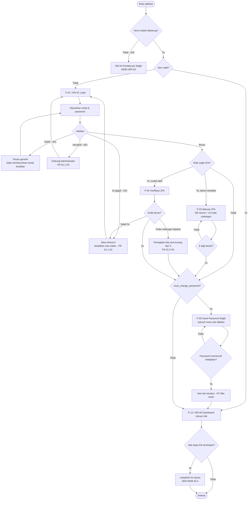

**Ketentuan UX yang mengikat alur ini**

| Aspek | Ketentuan | Rujukan |
|---|---|---|
| Urutan gerbang | Persis mengikuti middleware server sehingga klien tidak pernah menampilkan layar yang akan ditolak | `SDD-AUTH-09` · `SDD-MOB` §4.5 |
| Pesan galat | Tidak pernah membedakan "email tidak terdaftar" dari "password salah" | `FR-01.1 A1` |
| Sesi berakhir | Token kedaluwarsa di tengah sesi ditukar diam-diam; hanya bila penukaran gagal pengguna diarahkan ke Login | `FR-01.1 A5` · `SDD-FE-07` |
| Refresh paralel | Diserialisasi satu promise bersama; tanpa itu pengguna ter-logout tanpa sebab yang jelas | `SDD-FE-07` · `SDD-SESS-04` |
| Auto-logout web | Banner peringatan pada menit ke-28, logout pada menit ke-30 | `FR-01.2 A2` |

### F-02 Reset password administratif ⭐

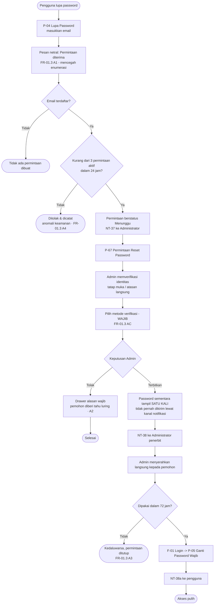

**Titik UX kritis:** password sementara ditampilkan **satu kali** dan tidak dapat dilihat ulang, termasuk oleh Administrator yang menerbitkannya. Antarmuka wajib menyatakan hal itu **sebelum** dialog ditutup, bukan sesudahnya — `FR-01.3 AC`.

### F-03 Aktivasi & pemulihan 2FA

| Skenario | Jalur UX | Rujukan |
|---|---|---|
| Aktivasi pertama | P-01 → P-03: QR secret + 10 kode cadangan, wajib dikonfirmasi dengan 6 digit sebelum dilanjutkan | `FR-01.5` |
| Kode cadangan menipis | Peringatan pada respons login **dan** spanduk pada P-77 saat tersisa 2 atau kurang, dengan tombol buat ulang | `FR-01.5 AC` |
| Perangkat authenticator hilang | Pengguna memakai kode cadangan; bila habis, mengajukan reset 2FA kepada Administrator (P-63 drawer) | `FR-01.5 A2`, `A3` |
| Reset 2FA oleh Admin | Pengguna wajib mendaftar ulang saat login berikutnya — diarahkan otomatis ke P-03 | `FR-01.5 A3` |
| Seluruh Administrator kehilangan akses | **Tidak ada jalur antarmuka.** Pemulihan hanya lewat CLI di server dengan otorisasi tertulis Kepala Sekolah | `FR-01.6` · `BR-070b` · `SDD-SESS-11` |

> `FR-01.6` sengaja tidak memiliki halaman. Mencantumkannya di sini justru penting: perancang tidak boleh membuat layar "Pemulihan Darurat" karena keberadaannya akan melanggar `BR-070b`.

## 9.2 CRUD

### F-04 Pendaftaran aset & pelabelan QR ⭐

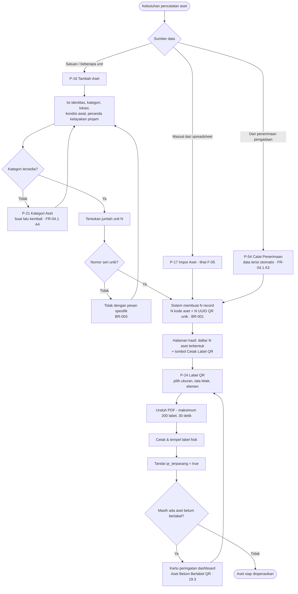

| Titik UX | Ketentuan | Rujukan |
|---|---|---|
| Jumlah unit | Satu formulir menghasilkan N record terpisah, bukan satu record berjumlah N — antarmuka wajib menyatakannya sebelum simpan | `BR-001` · `FR-04.1 AC` |
| Kode aset | Dihasilkan sistem mengikuti format terkonfigurasi; **tidak** dapat diketik manual | `BR-002` |
| Cetak ulang label | UUID tidak berubah, sehingga label lama tetap sah bila ditemukan kembali — dinyatakan pada dialog cetak ulang | `FR-05.1 A1` |
| Regenerasi UUID 🔒 | Hanya Administrator; dialog wajib menyatakan bahwa seluruh label lama menjadi tidak berlaku | `FR-05.1 A2` |

### F-05 Impor massal

Berlaku identik untuk Aset (`E.5.1`), Pengguna (`E.5.2`), dan Jadwal Tetap Ruangan (`E.5.3`).

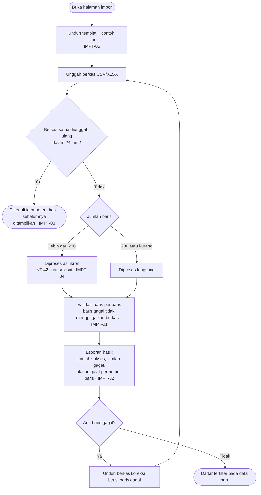

**Keadaan sukses impor bukan toast** — ia halaman ringkasan yang dapat ditinjau ulang (**UXD-06**), karena `IMPT-02` mewajibkan alasan galat per nomor baris.

### F-06 Perubahan kondisi & mutasi lokasi

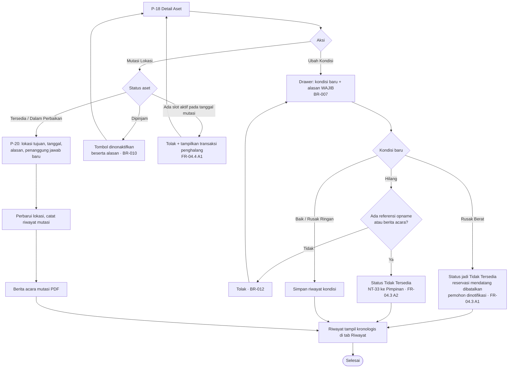

**Mutasi massal via scan QR** (`FR-04.4 A2`): pemindai mobile mode beruntun mengumpulkan hingga 50 unit, lalu satu lokasi tujuan diterapkan secara atomik — bila satu unit gagal, seluruh operasi dibatalkan (`FR-04.4 AC`).

## 9.3 Persetujuan

### F-07 Keputusan persetujuan

Satu alur untuk enam jenis pengajuan: Reservasi Ruangan, Reservasi Aset, Perpanjangan Peminjaman, Pengadaan Barang, Penghapusan Aset, dan Permintaan Bahan (`BR-035`).

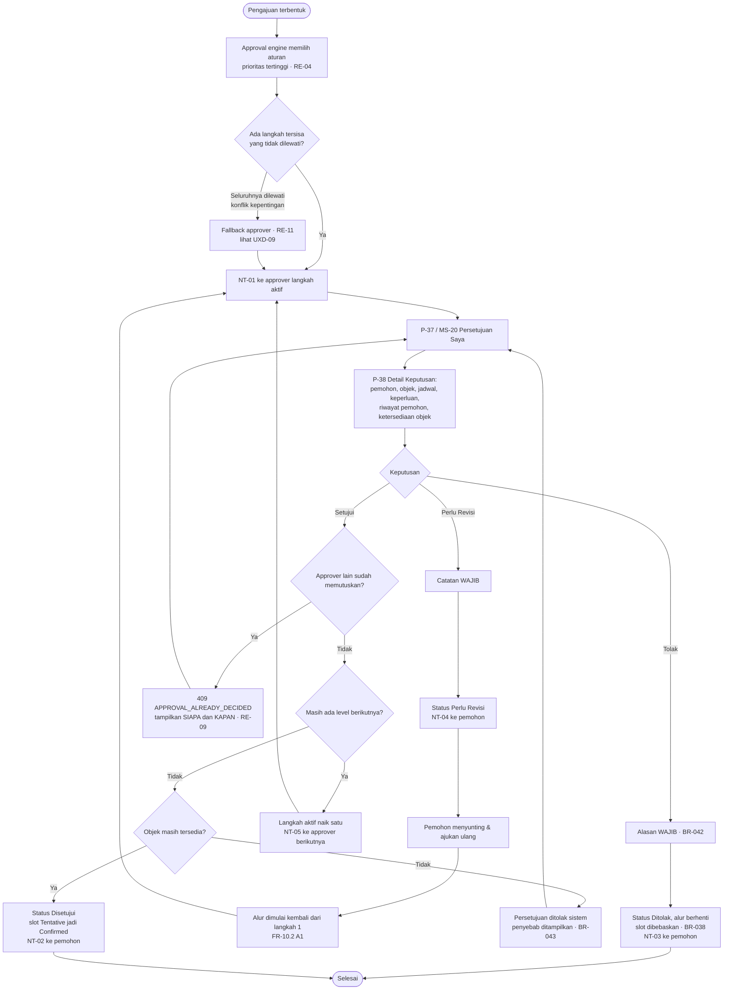

**Setujui Sebagian** hanya ditawarkan pada Pengadaan (`FR-14.2` langkah 5) dan Penghapusan (`FR-21.2 A2`). Pada jenis lain, tombol itu **tidak ada** — bukan dinonaktifkan.

### F-08 SLA, eskalasi & delegasi

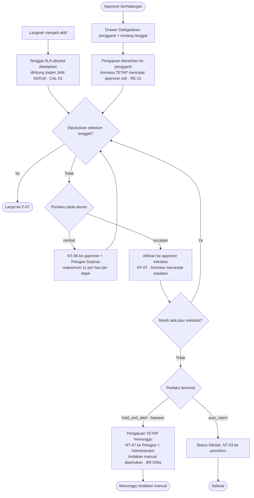

**Yang wajib terlihat di antarmuka:** persetujuan **tidak pernah** terjadi otomatis karena kelalaian approver (`BR-039a`). Karena itu editor aturan (P-69) tidak pernah menawarkan `auto_approve`, dan linimasa (P-38) menampilkan status "Menunggu tindakan manual" secara eksplisit, bukan diam.

## 9.4 Reservasi

### F-09 Reservasi ruangan hingga selesai ⭐

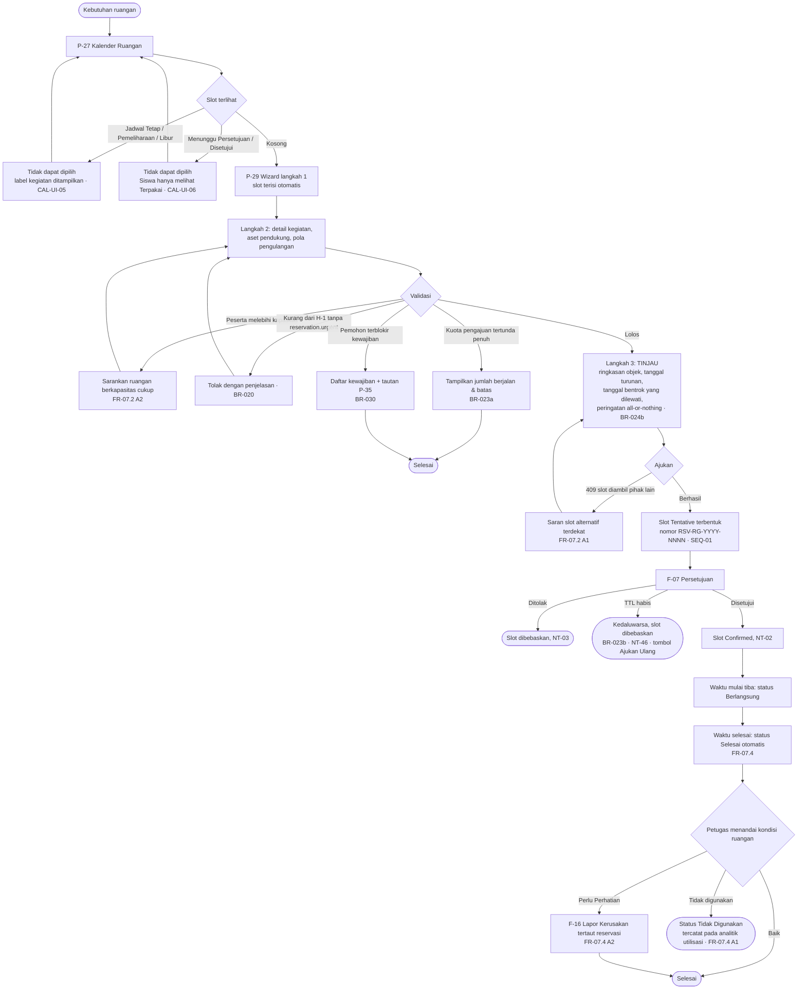

### F-10 Reservasi aset hingga disetujui ⭐

Berbagi wizard yang sama (P-29) dan alur persetujuan yang sama (F-07). Yang berbeda hanya langkah 1 dan alokasi unit.

| Titik | Ketentuan | Rujukan |
|---|---|---|
| Ketersediaan | Dihitung dari `booking_slots`, **bukan** dari `assets.status`. Aset yang sedang `Dipinjam` hari ini tetap tampil tersedia untuk rentang mendatang yang tidak beririsan | `BR-005a` · `FR-08.1 AC` |
| Katalog kosong pada rentang | Menampilkan **tanggal terdekat saat unit kembali tersedia**, bukan sekadar "tidak tersedia" | `FR-08.1 A2` · `UX-05` |
| Alokasi unit | Otomatis; Petugas Sarpras dapat memilih unit tertentu secara manual | `FR-08.2` langkah 3 |
| Unit terambil saat proses | Sistem mengalokasikan unit pengganti setara; bila tidak ada, pengajuan ditolak **dengan penjelasan** | `FR-08.2 A1` |
| Durasi melebihi batas role | Tolak + **tampilkan batas yang berlaku** | `BR-021` · `FR-08.2 A2` |
| Setelah disetujui | Pemohon melihat **kode aset unit yang dialokasikan** | `FR-08.2 AC` |
| Konkurensi | 50 permintaan simultan atas unit terakhir menghasilkan tepat 1 sukses; 49 lainnya menerima `409 ASSET_NOT_AVAILABLE` dengan saran alternatif | `CC-02` · `CI-01` |
| Siswa/OSIS | Katalog terbatas `boleh_dipinjam_siswa` | `BR-022` · `FR-08.1 A1` |

### F-11 Blokade jadwal tetap ruangan

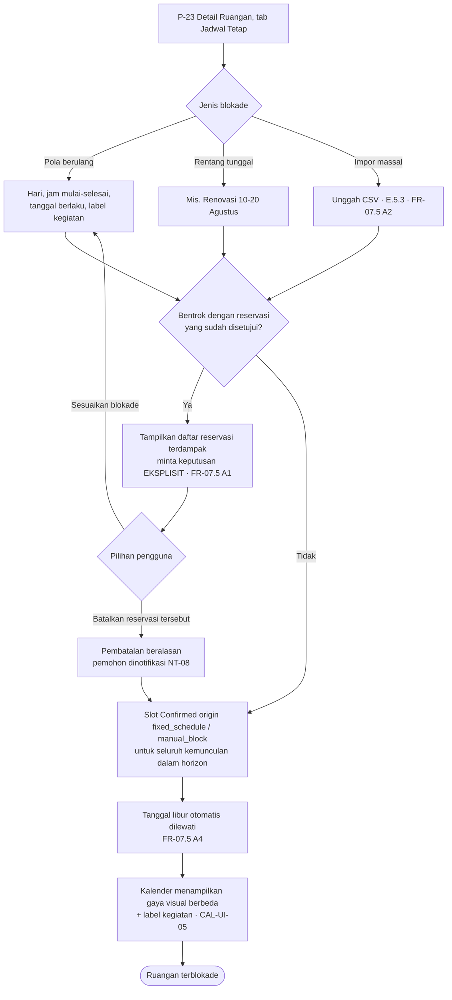

**Regenerasi horizon 90 hari untuk 30 ruangan dijalankan asinkron** (`FR-07.5 AC`) — antarmuka menampilkan progres, bukan membeku.

## 9.5 Peminjaman & Pengembalian

### F-12 Serah terima peminjaman ⭐

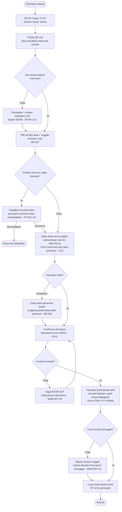

**Peminjaman langsung tanpa reservasi** (`FR-09.1 A4`) hanya tersedia bagi pemegang `loan.direct`. Antarmuka wajib menyatakan bahwa sistem membentuk reservasi retroaktif berpenanda `bypass_approval` beserta alasan wajib, dan bahwa tindakan itu tercatat sebagai anomali pada laporan kepatuhan bulanan (`BR-026a`) — pengguna harus tahu konsekuensinya sebelum menekan tombol.

### F-13 Pengembalian, denda & kerusakan ⭐

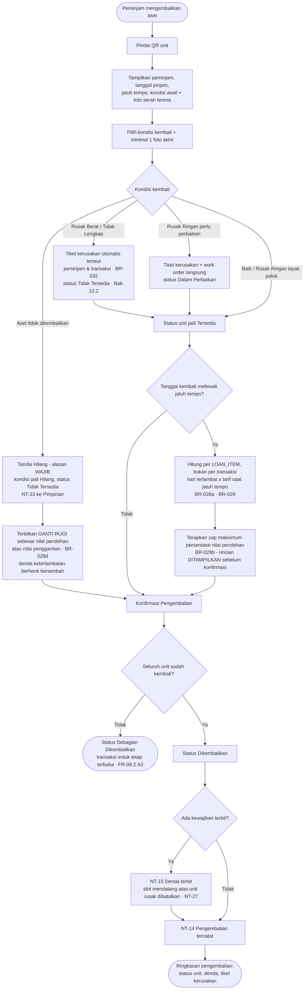

**Yang wajib terlihat sebelum konfirmasi:** rincian perhitungan denda — jumlah hari terlambat, tarif yang dipakai, dan apakah cap `BR-028b` diterapkan. `RS-16` mencatat denda sebagai sumber konflik dengan pengguna; transparansi perhitungan adalah mitigasinya.

### F-14 Perpanjangan peminjaman ⭐

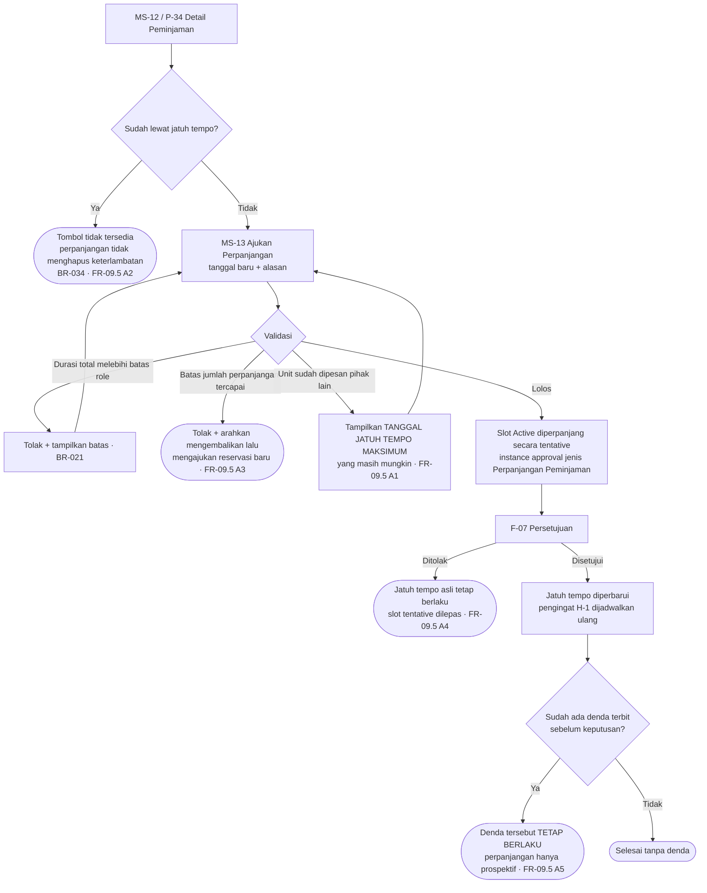

### F-15 Pengelolaan denda hingga blokir terbuka ⭐

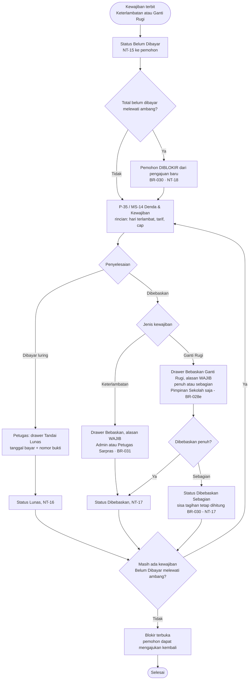

**Denda dicatat per `loan_item`, bukan per transaksi** (`BR-028a`). Konsekuensi UX: P-35 menampilkan satu baris per unit, bukan satu baris per peminjaman — sehingga pengembalian sebagian dengan keterlambatan berbeda per unit terlihat benar.

## 9.6 Perawatan

### F-16 Kerusakan hingga work order tertutup ⭐

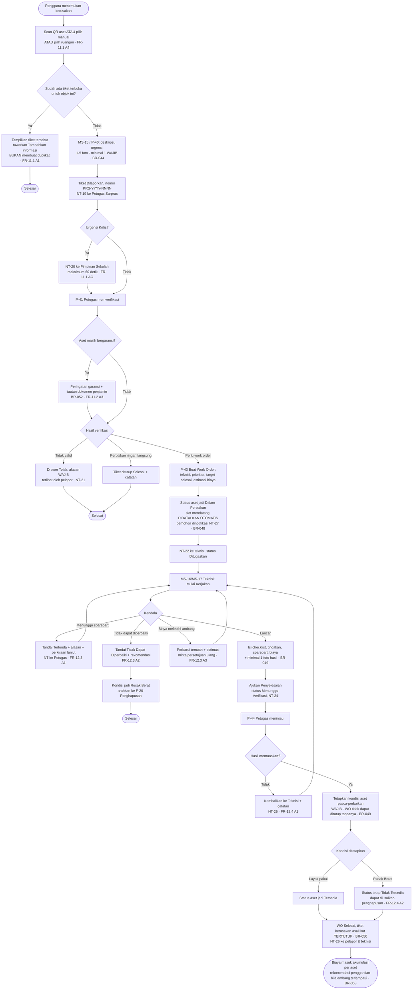

### F-17 Pemeliharaan preventif otomatis ⭐

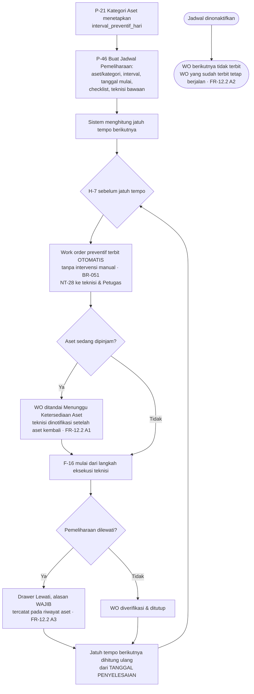

## 9.7 Pengawasan

### F-18 Stock opname hingga penyesuaian data ⭐

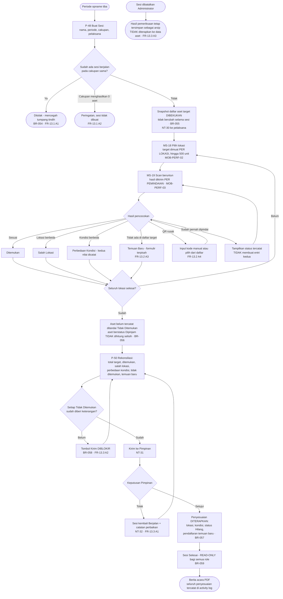

### F-19 Pengadaan hingga aset terbentuk ⭐

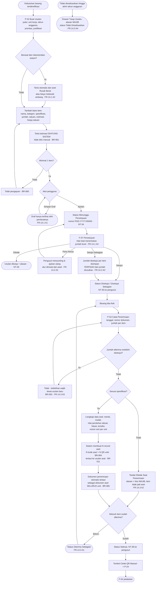

### F-20 Penghapusan aset hingga berita acara ⭐

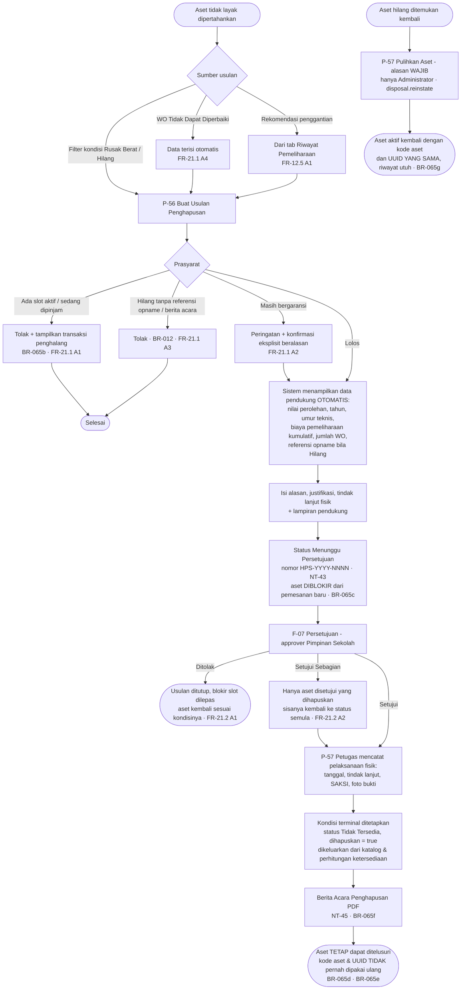

## 9.8 Pelaporan

### F-21 Laporan analitik & ekspor asinkron

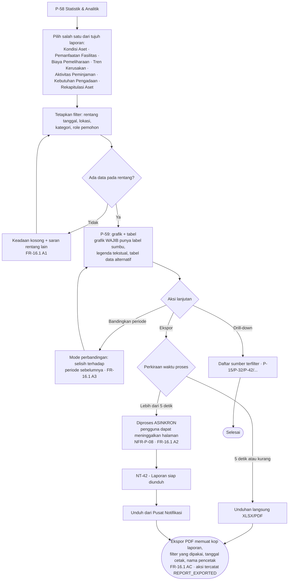

> **Role Siswa/OSIS tidak memiliki akses ke modul ini sama sekali** (`FR-16.1 AC`) — entri sidebar tidak dirender, dan `/analitik` menghasilkan P-08 bila diakses langsung.

## 9.9 Alur lintas modul

### F-22 Scan QR & aksi kontekstual ⭐

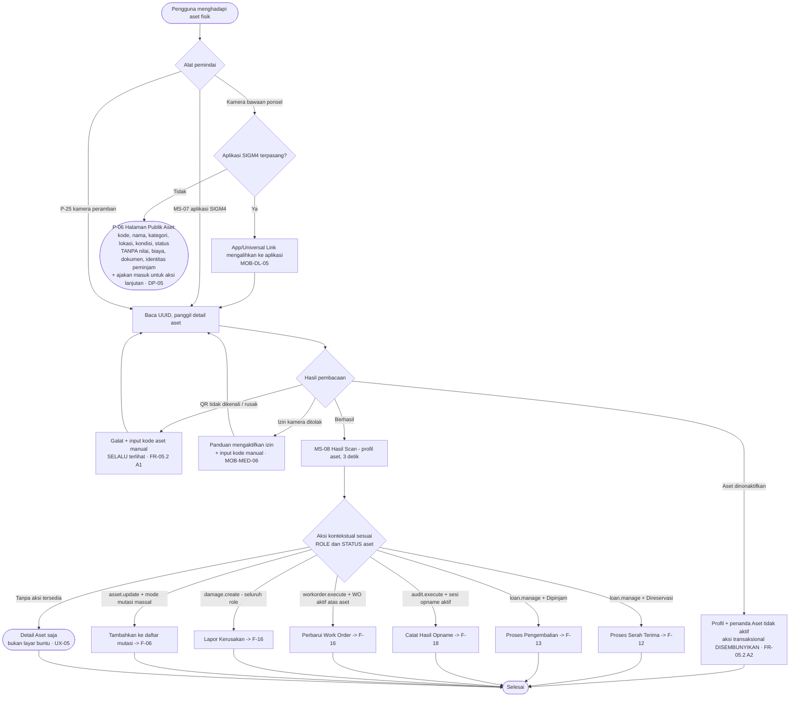

**Aturan yang tidak boleh dilanggar perancang:** aksi kontekstual yang ditampilkan selalu sesuai permission **dan** status aset (`FR-05.2 AC`). Tombol yang tidak berlaku **tidak dirender**; tombol yang berlaku tetapi terhalang keadaan (mis. mutasi saat `Dipinjam`) dirender dinonaktifkan **beserta alasannya**.

### F-23 Notifikasi hingga deep link

```mermaid
flowchart TD
    A([Event bisnis terjadi]) --> B["Notifikasi ditulis di dalam transaksi<br/>pengiriman terjadi setelah commit · NTF-04"]
    B --> C{Kanal}

    C -->|Web| D{"Koneksi SSE aktif?"}
    D -->|Ya| E["Dorong ke klien + penghitung belum dibaca<br/>NTF-02 · NTF-05"]
    D -->|"Gagal 3x / diblokir proxy"| F["Beralih ke polling 60 detik<br/>UI MENJELASKAN penurunan ini · SDD-NTF-01"] --> E
    D -->|"Lebih dari 2 koneksi"| G["Koneksi terlama diputus<br/>UI menjelaskan mengapa · NTF-03"] --> E

    C -->|Mobile| H{"Izin notifikasi diberikan?"}
    H -->|Tidak| I["In-app tetap berjalan<br/>+ ajakan mengaktifkan izin · FR-17.2 A1"] --> J
    H -->|Ya| K["Push FCM ke seluruh perangkat aktif<br/>FR-17.2 A4"] --> J

    E --> J["Lonceng topbar / tab Notifikasi<br/>penghitung belum dibaca dari SERVER"]
    J --> L["P-13 Pusat Notifikasi<br/>filter jenis & status baca"]
    L --> M["Ketuk notifikasi: tandai terbaca<br/>+ ikuti deep link · SDD-NTF-09"]
    M --> N{Objek dapat diakses?}
    N -->|Ya| O(["Halaman detail objek"])
    N -->|"Di luar hak akses"| P(["P-08 Tanpa Hak Akses<br/>MOB-DL-03"])
    N -->|"Dihapus / dibatalkan"| Q(["P-09 Data Tidak Lagi Tersedia<br/>FR-17.1 A1 · MOB-DL-04"])

    R(["Preferensi pengguna"]) -.->|"Diperiksa saat KIRIM,<br/>bukan saat terbit · SDD-NTF-06"| C
    S(["Notifikasi wajib"]) -.->|"Selalu terkirim,<br/>mengabaikan preferensi · FR-17.3 A1"| C
```

### F-24 Percakapan chatbot ⭐

```mermaid
flowchart TD
    A([Pengguna membuka panel chatbot]) --> B["Ketik pertanyaan Bahasa Indonesia<br/>maksimum 500 karakter"]
    B --> C{Layanan LLM tersedia?}
    C -->|Tidak| D(["503 - pesan gangguan sementara<br/>arahkan ke pencarian manual<br/>TIDAK memengaruhi modul lain · NFR-A-05"])
    C -->|"Batas harian tercapai"| E(["Tampilkan waktu ketersediaan berikutnya<br/>FR-19.1 A5"])
    C -->|Ya| F["Server menyusun konteks:<br/>ROLE dan SCOPE saja<br/>nama & pengenal pribadi TIDAK dikirim · DP-AI-01"]

    F --> G["Model memilih tool; data difilter<br/>di LAPISAN QUERY dengan AuthContext<br/>BR-076 · SDD-AUTH-07"]
    G --> H["Jawaban di-STREAM<br/>token pertama 2 detik · AI-CTL-07"]
    H --> I{Jenis jawaban}

    I -->|"Data ditemukan"| J["Jawaban + RUJUKAN KONKRET<br/>kode aset, nama ruangan, nomor transaksi<br/>+ tautan aksi ke halaman terkait · 22.4"]
    I -->|"Data tidak ditemukan"| K(["Menyatakan tidak ditemukan<br/>DILARANG mengarang · BR-077"])
    I -->|"Di luar cakupan"| L(["Menyatakan keterbatasan<br/>+ arahkan ke menu relevan · FR-19.1 A1"])
    I -->|"Di luar hak akses pengguna"| M(["Tool mengembalikan data kosong<br/>chatbot menyatakan tidak dapat diakses<br/>FR-19.1 A6"])
    I -->|"Diminta melakukan aksi tulis"| N(["Menolak dengan sopan<br/>+ tautan ke form pengajuan · BR-075"])

    J --> O["Umpan balik jempol atas / bawah"]
    K --> O
    L --> O
    M --> O
    N --> O
    O --> P{Aksi pengguna}
    P -->|"Ikuti tautan"| Q(["Halaman terkait - panel menutup diri"])
    P -->|"Lanjut bertanya"| B
    P -->|"Lihat riwayat"| R(["P-14 Riwayat Chatbot<br/>hanya percakapan sendiri"])
```

**Batas yang tidak boleh dilewati perancang:** chatbot tidak pernah memiliki tombol yang mengubah data. Setiap saran aksi berbentuk **tautan ke formulir**, bukan aksi langsung (`BR-075`, `NO-11`).

### F-25 Konfigurasi approval rule & pratinjau

```mermaid
flowchart TD
    A["P-68 Approval Rules"] --> B["P-69 Editor: pilih jenis pengajuan"]
    B --> C["Susun kondisi: node grup AND/OR<br/>+ node predikat field/op/value<br/>maksimum 3 tingkat · Lampiran D.1"]
    C --> D{"Field yang ditawarkan"}
    D --> E["HANYA field yang berlaku bagi<br/>jenis pengajuan terpilih · Lampiran D.2"]
    E --> F["Susun langkah berurutan:<br/>approver role/pengguna, SLA jam,<br/>perilaku SLA, tujuan eskalasi"]
    F --> G["Tetapkan perilaku terminal:<br/>hold_and_alert bawaan atau auto_reject<br/>auto_approve TIDAK PERNAH ditawarkan · BR-039a"]
    G --> H["Tetapkan prioritas aturan"]

    H --> I{"Pratinjau"}
    I --> J["Masukkan skenario contoh"]
    J --> K["Panel menampilkan:<br/>aturan yang akan terpilih,<br/>seluruh aturan yang cocok + prioritasnya,<br/>rangkaian langkah yang akan terbentuk · RE-07"]
    K --> L{Hasil sesuai harapan?}
    L -->|Tidak| C
    L -->|Ya| M{Simpan}

    M -->|"422 INVALID_RULE_DEFINITION"| N["Galat ditampilkan PADA NODE bermasalah<br/>bukan satu pesan di atas formulir · RE-08"] --> C
    M -->|Berhasil| O["Aturan aktif, berlaku pada<br/>pengajuan BERIKUTNYA tanpa restart · PM-05"]
    O --> P(["Instance berjalan TETAP memakai<br/>snapshot aturan lama hingga selesai<br/>BR-040 · FR-10.1 A4"])
```

**Mengapa pratinjau adalah bagian dari alur, bukan fitur tambahan:** `RS-06` mencatat konfigurasi approval rules yang salah sebagai risiko berdampak **Tinggi** yang membuat pengajuan macet. Pratinjau adalah mitigasi yang PRD tetapkan (`FR-10.1 AC`), sehingga antarmuka wajib membuatnya sulit dilewati — panel pratinjau selalu terlihat, bukan tersembunyi di balik tombol.


---

### F-26 Permintaan bahan hingga diserahkan ⭐

```mermaid
flowchart TD
    A([Pemohon membutuhkan bahan]) --> B["P-84 Katalog Bahan:<br/>lihat saldo tersedia per lokasi"]
    B --> C["P-85 Ajukan: bahan, jumlah, keperluan"]
    C --> D{"Saldo mencukupi?"}
    D -->|Tidak| E["422 INSUFFICIENT_BALANCE<br/>tampilkan saldo + lokasi lain · BR-083"] --> B
    D -->|Ya| F{"Melampaui ambang<br/>approval? BR-086"}
    F -->|Tidak| G["Status: Disetujui<br/>TANPA instance approval"]
    F -->|Ya| H["Instance approval M-10<br/>Status: Menunggu Persetujuan"]
    H --> I{Keputusan approver}
    I -->|Tolak| J(["Status: Ditolak + alasan<br/>saldo TIDAK tersentuh"])
    I -->|Setuju Sebagian| K["Jumlah disetujui diturunkan"] --> G
    I -->|Setuju| G
    G --> L["NT-50 ke pemohon: siap diambil"]
    L --> M["Petugas buka P-87,<br/>catat jumlah diserahkan + penerima"]
    M --> N{"Melebihi jumlah disetujui?"}
    N -->|Ya| O["422 EXCEEDS_APPROVED_QTY · BR-089"] --> M
    N -->|Tidak| P["Saldo berkurang + transaksi PENGELUARAN<br/>saldo_sesudah tersimpan · BR-081 BR-092"]
    P --> Q{"Saldo menembus<br/>stok minimum?"}
    Q -->|Ya| R["NT-49 ke Petugas + Admin<br/>muncul di kartu Stok Menipis"] --> S
    Q -->|Tidak| S["NT-51 ke pemohon"]
    S --> T(["Selesai — TANPA jadwal pengembalian,<br/>tanpa denda, tanpa ganti rugi · BR-087"])
```

| Titik | Ketentuan | Rujukan |
|---|---|---|
| Permintaan disetujui | **Tidak** mengurangi saldo; saldo hanya berkurang saat penyerahan | `FR-22.4 AC` |
| Saldo berubah sebelum penyerahan | Penyerahan ditolak dan menampilkan saldo terkini; Petugas dapat menyerahkan sebagian | `FR-22.5 A2` |
| Pemisahan peran | Pemohon tidak pernah dapat menyerahkan kepada dirinya sendiri — `material.request` dan `material.issue` terpisah | `SDD-03 §4.3` |

**Mengapa cabang ambang berada di alur, bukan di konfigurasi belaka:** tanpa cabang `BR-086` yang terlihat, pengambilan satu spidol dan pengambilan satu dus tinta tampak identik bagi pengguna, padahal yang satu langsung dilayani dan yang lain menunggu approver. Cabang inilah yang membuat perbedaan waktu tunggu dapat dijelaskan di layar sejak awal.

### F-27 Stock opname bahan hingga saldo tersesuaikan

```mermaid
flowchart TD
    A([Petugas buat sesi opname domain BAHAN]) --> B["Sistem bekukan snapshot saldo<br/>per bahan per lokasi"]
    B --> C["MS-22 Sesi Opname Bahan:<br/>progres per lokasi penyimpanan"]
    C --> D["MS-23 Input Hitungan Fisik<br/>QR bahan melompat ke barisnya · BR-090"]
    D --> E["Sistem hitung selisih<br/>fisik vs saldo sistem"]
    E --> F{"Ada selisih<br/>tanpa keterangan?"}
    F -->|Ya| G["Laporan tidak dapat dikirim · BR-095"] --> D
    F -->|Tidak| H["Kirim laporan ke Pimpinan<br/>NT-31"]
    H --> I{Keputusan Pimpinan}
    I -->|Tolak| J["Sesi kembali Berjalan<br/>saldo TIDAK tersentuh"] --> D
    I -->|Setuju| K["Transaksi OPNAME sebesar selisih<br/>saldo tersesuaikan · BR-094"]
    K --> L(["Berita acara PDF + sesi read-only<br/>BR-059"])
```

Satu sesi hanya mencakup **satu domain** — memilih bahan dan aset sekaligus ditolak (`BR-093`). Alur aset yang sepadan adalah `F-18`.
